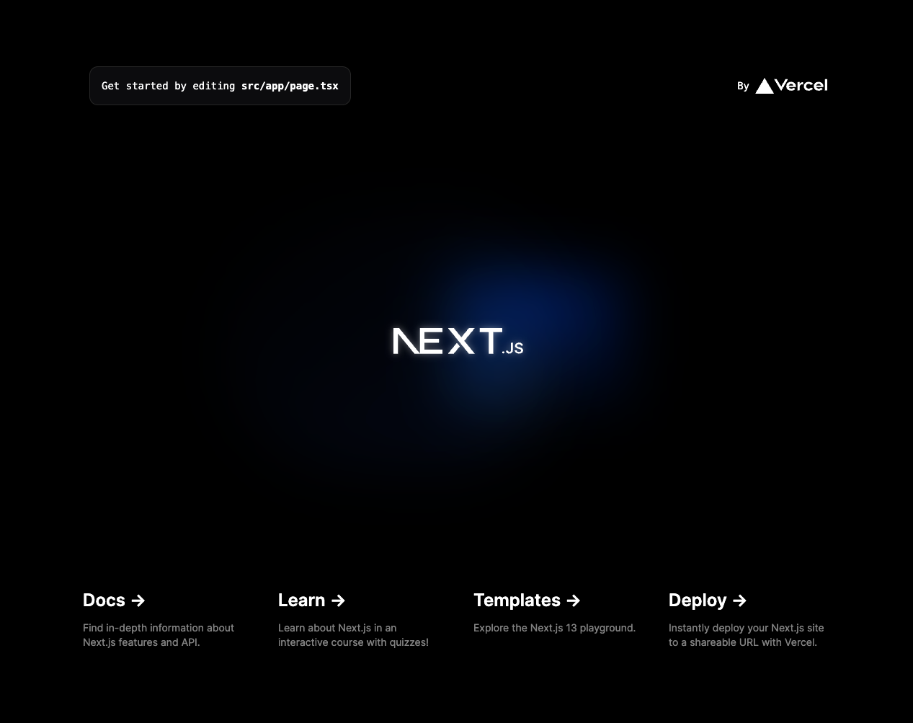

# はじめに

[Cloudflare Developer Week 2023](https://blog.cloudflare.com/tag/developer-week/)にて数々の魅力的な発表がある中、PagesでNext.jsを利用するためのパッケージ`@cloudflare/next-on-pages`が`v1.0.0`となりました。

https://github.com/cloudflare/next-on-pages

執筆時の最新版であるv13.4.2のApp Routerにも対応しているということで早速試してみました。

なお、現時点でサポートされている機能については`@cloudflare/next-on-pages`の[ドキュメント](https://github.com/cloudflare/next-on-pages/blob/main/docs/supported.md)にもまとまめられています。


## 検証環境

- Next.js v13.4.2
- @cloudflare/next-on-pages 1.0.0

# 試してみる

`@cloudflare/next-on-pages`を使ってCloudflare Pagesにデプロイしてみます。

## Next.jsのセットアップ

まずはNext.jsの環境を用意します。

```bash
npx create-next-app@latest my-next-app
cd my-next-app
```

## Edgeランタイムの設定

Cloudflare PagesではビルドはNode.jsが利用されますが、ランタイムははEdge Runtimeとなるので、利用する`page.tsx`や`route.ts`それぞれにruntime設定を追記しておきます。

```ts:src/app/page.tsx など
export const runtime = 'edge';
```

https://nextjs.org/docs/app/building-your-application/rendering/edge-and-nodejs-runtimes

## Cloudflare Pagesへデプロイ

`@cloudflare/next-on-pages`をインストールします。

```bash
npm install -D @cloudflare/next-on-pages
```

### GitHubリポジトリとの連携

今回はPagesへのデプロイにGitHubを利用します。

```bash
git init
git add .
git commit -m 'initial commit'
git remote add origin your-repository // 自分のリポジトリを入力
git push -u origin main
```

そしてCloudflare Dashboardにログイン後、「**Pages > プロジェクトを作成 > Gitに接続**」を選択して先ほど作成したリポジトリと連携します。


続けて、ビルド設定ではフレームワークとしてNext.jsを選択し、環境変数に`NODE_VERSION`として`16`以上のバージョンを指定する必要があります。


これでビルド、デプロイが走りますが一度目は失敗しています:)
Node.jsに依存するAPIが必要となるため、ビルド時に互換性フラグ`nodejs_compat`が必要なためです。

仕切り直して、Pagesのプロジェクトから、「**設定 > Functions > 互換性フラグ**」にて`nodejs_compat`を追加して保存します。


失敗したデプロイを選択して「**デプロイの再試行**」を押下し再デプロイします。


これでNext.jsのスターターページが表示されるようになりました。



# Cloudflareのサービスを利用する

いったん最低限の動作は確認ができたところで、続けてCloudflareのサービスと連携も試してみます。  
Next.js v13ではデータの取得に独自の`cache`、`revalidate`の機能を持っていますがCloudflare Pagesでは動作しません。

https://nextjs.org/docs/app/building-your-application/data-fetching/caching

とはいえCloudflareにはキャッシュ用途にも利用できるKey-Value型のストレージである[Workers KV](https://developers.cloudflare.com/workers/runtime-apis/kv/)があります。ここではKVの動作を試しておきます。

## Workers KVを作成する

「**Workers > KV > 名前空間を作成する**」を選択して新規にKVを作成します。


## PagesとKVを紐付ける

PagesでKVを利用するにはバインディング（紐付け）が必要になります。再度Pagesの設定画面から作成したKVのバインディングを設定します。

Pagesのプロジェクトから、「**設定 > Functions > KV 名前空間のバインディング**」からKVを追加して保存します。（その他のサービスを利用する場合も都度バインディングの必要があります）


## KVにテスト用の値を追加

KVとの連携をテストするためにテスト用の値を追加しておきます。


## KVの値をページで取得

さきほど登録したKVの値をページで取得、表示するために`src/app/page.tsx`を書き換えます。あわせて`@cloudflare/workers-types`もインストールしておきます。

```bash
npm install -D @cloudflare/workers-types
```

```ts:src/app/page.tsx
import { KVNamespace } from "@cloudflare/workers-types";

export const runtime = "edge";

const getPlatform = async () => {
  const { MY_KV_STORE } = process.env as unknown as {
    MY_KV_STORE: KVNamespace;
  };

  const platform = await MY_KV_STORE.get("platform", "text");

  return platform;
};

export default async function Home() {
  const platform = await getPlatform();

  return (
    <main>
      <p className="p-8">{platform}</p>
    </main>
  );
}
```

書き換えたところでデプロイして早速確認してみます。


KVに登録した値が表示されることが確認できました。ダッシュボードから値を変更すると表示も切り替わることも確認できるはずです。

# 補足

ローカル環境での開発では下記2つのコマンドを併用する必要がありますが、現時点では`--watch`モードにビルドがループするバグがあるようです。すでにPRは出ているようなので少し待つ必要がありそう。

```bash
npx @cloudflare/next-on-pages --watch
```

```bash
npx wrangler pages dev .vercel/output/static --compatibility-flag=nodejs_compat
```

https://github.com/cloudflare/next-on-pages/issues/240

# おわりに

駆け足にてCloudflare PagesでのNext.js(App Router)の動作を確認してみました。Next.jsの進化は早いので`@cloudflare/next-on-pages`が都度どの程度までサポートしてくれるかにも依存してしまいますがCloudflare PagesでもNext.jsを利用することができそうです。プロダクションレベルでの利用を想定すると、決して楽な運用とはならないかもしれませんが、みなさんも挑戦してみてはいかがでしょうか:)