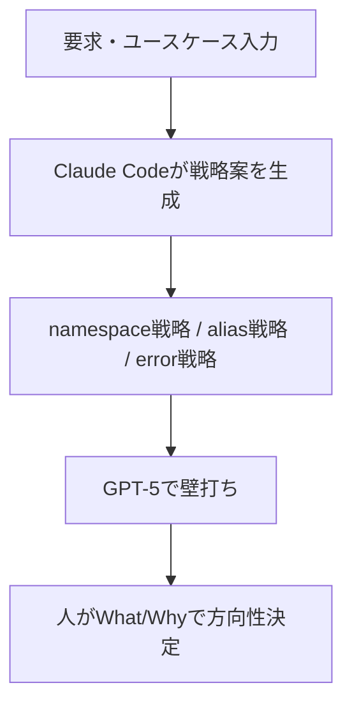
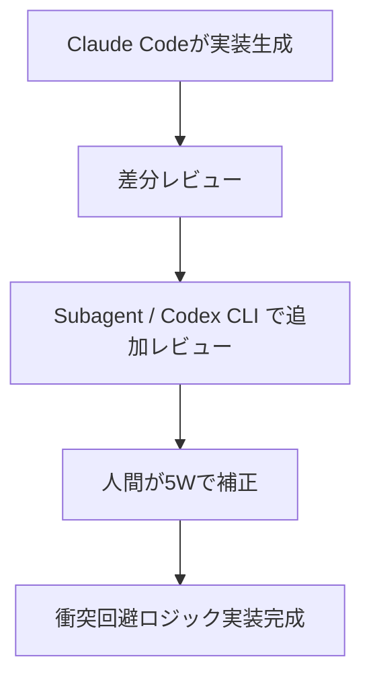
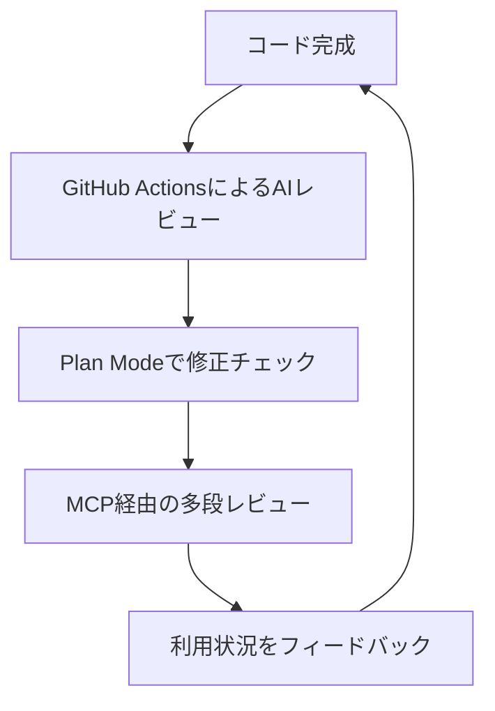

## はじめに

梅雨の終わり頃、開発チーム向けに共用できるリモートMCPサーバーを用意しようとしていて、MCPの仕様や仕組みを調査していたところ、突然思い立って **Hatago MCP Hub** の開発に取り組みました。  
複数の MCP サーバーをまとめて扱えるようにし、Claude Code や Windsurf、Cursor などの AI ツールをひとつの設定でつなげられるようにする ―― そんな目標を掲げたツールです。

https://zenn.dev/himorishige/articles/introduce-hatago-mcp-hub

## AIコーディングエージェントとの協働することの課題

開発に際して、今まで様々なアプローチでAIコーディングエージェントを利用してきましたが、Howまで仕様ファーストでガチガチに決めてスタートすると現時点での生成AIでは仕様を守るために暴走or手抜きが多くなる印象が拭えません。手戻りが多く、70-80%程度まで、あと一歩か二歩、完成まで辿り着けないことも多いと思っています。

そこで、AIがHowを提案した理由をもとに5Wで人がコントロールする（What/Whyが主になるかな）スタイルが、AI-DLC（AI-Driven Development Lifecycle）の考え方とも似ているしうまくいける気がした。

このタイミングで開発をやるのであれば次は **AI-DLC（AI-Driven Development Lifecycle）** に近い開発スタイルを試してみよう。

## AI-DLC（AI-Driven Development Lifecycle）

AI に「How（どうやるか）」を任せ、人間が「What（何をするのか）」「Why（なぜやるのか）」で方向を決める。AI と人の役割を分けながら短いサイクルで繰り返す。この流れは、AI-DLC の **Inception → Construction → Operations** という 3 つのフェーズそのものです。

*出典：[AI 駆動開発ライフサイクル:ソフトウェアエンジニアリングの再構築/Amazon Web Services ブログ](https://aws.amazon.com/jp/blogs/news/ai-driven-development-life-cycle/)*

以下では、Hatago MCP Hub の開発をこのフレームワークに当てはめて振り返ってみたいと思います。

### Inception（意図の分解）

最初の段階では「そもそもどんな MCP Hub を作るのか」を明確にします。

まず Claude Code（Opus 4.1） に「この機能を作りたい」「こういうユースケースで使う」といった背景や目的を渡し、まずは大まかなプランを出してもらいます。Claude は自由に発想を膨らませ、実装戦略を提示してくれますが、そのままでは機能過多で大抵複雑すぎます。

そこで MCP経由で GPT-5 に壁打ちを依頼し、Opusが膨らませすぎた案をGPT-5が落ち着かせて本質に戻してくれる。GPT-5のシステムプロンプトに忠実な特性もあっているのかこの二段構えはとても有効でした。

たとえば **「ツール名が衝突したらどうする？」** という問題。ここで AI が提案してきたのは以下の 3 戦略でした。

1. **namespace 戦略**：`{serverId}_{toolName}` の形式で一意化
2. **alias 戦略**：通常は元の名前を使い、衝突時のみ namespace 方式にフォールバック
3. **error 戦略**：衝突時には明示的にエラーを返す

AI が How（戦略の選択肢）を提示し、人間が What/Why を吟味することで「デフォルトは namespace 戦略を採用し、状況に応じて切り替えられるようにする」という方向性が固まりました。

どうでもいい話ですが、私の環境では、Opusを「フリーレン」、GPT-5を「フェルン」とイメージしていて、師弟のようにやり取りしながらプランを練っていく感じです。

### Construction（構築）

次の段階は実際の実装です。

開発環境はあらかじめ整備しておきました。利用する基本パッケージ、Testingフレームワーク、LinterやFormatterなどを用意し、AIが生成するコードをすぐ検証できる状態にしておきます。

実装の流れは次のようになります。

1. Claude Code にコード生成を任せ、差分をこまめにレビュー
2. Subagent や Codex CLI（MCP経由） を利用して追加レビューを実施
3. 自分自身でも「この関数は誰が使う？」「何をする？」「いつ呼ばれる？」と5Wを問い直す

ツール名衝突解決の戦略を実装する際にもこのスタイルを活かしました。AIはnamespace戦略のコードを一気に生成してくれますが、そのままではパフォーマンス面や可読性に課題が残ります。そこで人間がレビューを重ね、衝突検出やエラーハンドリングの仕組みを整備しました。

### Operations（運用）

実装が進むと、今度は運用と改善の段階に入ります。

- Claude Code GitHub Actions を活用して、自動レビューをAIに任せる
- Plan Mode を使って修正が過剰になっていないか確認する
- MCP経由で多段階レビューを回し、得られたフィードバックを次のInceptionへ戻す

ツール名衝突解決についても、このフェーズで「実際の利用環境ではどの戦略が使いやすいか」を検証しました。利用者が混乱しないようにエラーメッセージを改善したり、ドキュメントに事例を追記したりするのもOperationsでの作業です。

## まとめ

Hatago MCP Hub の開発をAI-DLCの観点で振り返ると、AIと人間の協働がごく自然に組み込まれていたことが分かります。

- Inception：AIがHowを提案し、人間がWhat/Whyで方向性を決める
- Construction：AIがコードを生成し、人間がレビューで磨く
- Operations：AIがレビューや検証を補助し、人間が次の改善につなげる

ツール名衝突解決の3戦略のように、AIが提示した選択肢を人間が吟味して現実的な落とし所を見つける場面は、まさにAI-DLCの実践例だと感じます。

もちろん、丁寧にサイクルを回す分、手間や疲労感は少なくありません。しかし「AIと一緒に開発している感覚」が得られるのはとても魅力的で、OSS開発における新しい可能性を感じました。

読んでくださったみなさんも、ぜひ自分に合ったAI協働スタイルを探ってみてください。きっと開発の景色が大きく変わるはずです。
