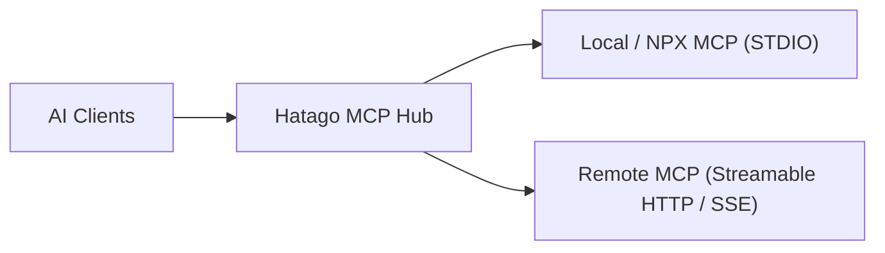
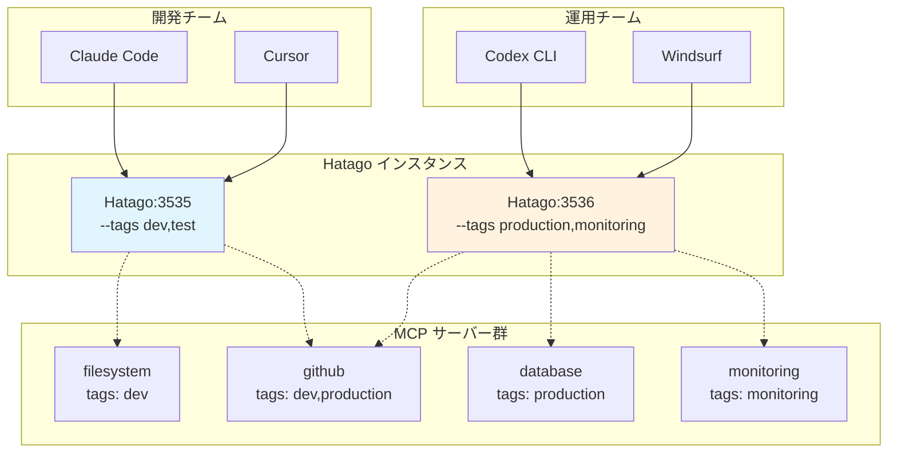
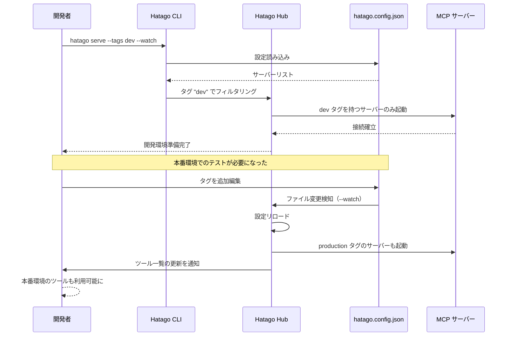

> **Hatago（旅籠） MCP Hub** は、複数の MCP サーバーを 1 つにまとめ、Claude Code / Cursor / Windsurf / Codex CLI など複数の AI クライアントから横断的に扱える **軽量 Hub** です。本記事では、設計の背景からアーキテクチャ、設定方法、運用方法、現状の制約を紹介します。

https://github.com/himorishige/hatago-mcp-hub

## なぜ Hatago MCP Hub を作ったのか

MCP サーバーが増えるほど、クライアントごとの設定ファイル管理が面倒になりませんか。`.mcp.json` を更新したのに、別のツール（TOML 設定の Codex CLI）では更新を忘れていた、ということも珍しくありません。同じような用途を果たすライブラリやツールも存在しています。たとえば、[Docker Hub MCP Server](https://github.com/docker/hub-mcp) でまとめればいい、という声もあるでしょう。ただ、個々の現場の制約で Docker Desktop が使えない、あるいは **自由に MCP サーバーを選びたい** というニーズは根強く、結局それぞれのクライアントに対して個別設定を続けることになります。

こうした「設定の分散」を落ち着かせるために、**1 つの MCP サーバー（Hub）にまとめてしまい、クライアント側は Hatago だけを使う**── この方針が Hatago MCP Hub の出発点です。MCP の学習目的で始めた小さな実装でしたが、ツール名の衝突回避や進捗通知の中継、ホットリロードなど、いろいろと実運用に必要な要素を検証していった結果、今の形に落ち着きました。

## Hatago MCP Hub の全体像

Hatago は **Hub コア**、**MCP レジストリ（Tools/Resources/Prompts）**、**トランスポート層**の 3 層からなります。AI クライアントと複数の MCP サーバーの間に入り、JSON-RPC/MCP のやりとりを中継します。特徴としては、トランスポート非依存の設計にしている点です。STDIO でつなごうが、Streamable HTTP/SSE/WebSocket でつなごうが、上のロジックは同じように動きます。



内部的には、Hub が各 MCP サーバーから提供されるツール群を取りまとめて統合カタログを形成します。ここで重要になるのが **ツール名の衝突回避** です。Hatago は AI ツールへの公開名として `serverId_toolName` の形式を採用し、実行時には元の MCP サーバーに対して **正規のツール名** でリクエストを委譲します。クライアントから見れば、公開名は常に一意で、どのサーバーに属するかも分かりやすい、というわけです。

もうひとつの要点は **進捗通知（notifications/progress）の透過中継** です。時間のかかる処理を走らせると、下位サーバーからプログレスが飛んできます。Hatago はそれをそのままクライアントに中継するので、上流の体験は損なわれません。サンプリング（`sampling/createMessage`）の橋渡しも同様で、下位が LLM 生成を要求してきたら、上位クライアントへ安全にバトンを渡し、結果を折り返します。ただ色々な MCP サーバーで検証してみたところ、まだ `notifications/progress` を利用している MCP サーバーは少なそうです。また `sampling` を利用できる AI ツールもまだ少ないですが、そういうツールが増えることを想定して Hatago はそれらをサポートしています。

## セットアップ：最短ルート

Hatago は CLI を含み、プロジェクト直下でも、専用リポジトリでも、どちらでもすぐに試せます。まずは設定ファイルを生成し、STDIO か Streamable HTTP のどちらかで起動するだけです。

```bash
# 初期化（対話 or 既定値でサクッと）
npx @himorishige/hatago-mcp-hub init

# 明示的にモード指定
npx @himorishige/hatago-mcp-hub init --mode stdio
npx @himorishige/hatago-mcp-hub init --mode http
```

生成される `hatago.config.json` に接続したい MCP サーバーを列挙します。`npx` や `node` で動かすローカル MCP はもちろん、Streamable HTTP/SSE のリモート MCP も同じファイルで管理できます。`{"${VAR}"}` や `{"${VAR:-default}"}` のように **環境変数展開** にも対応しており、開発・本番を通して 1 本の設定を使い回せます。

```json:hatago.config.json
{
  "$schema": "https://raw.githubusercontent.com/himorishige/hatago-mcp-hub/main/schemas/config.schema.json",
  "version": 1,
  "logLevel": "info",
  "mcpServers": {
    "filesystem": {
      "command": "npx",
      "args": ["-y", "@modelcontextprotocol/server-filesystem", "/tmp"],
      "tags": ["dev", "local"]
    },
    "deepwiki": {
      "url": "https://mcp.deepwiki.com/sse",
      "type": "sse",
      "tags": ["dev", "production", "documentation"]
    },
    "api": {
      "url": "${API_BASE_URL:-https://api.example.com}/mcp",
      "headers": { "Authorization": "Bearer ${API_KEY}" },
      "tags": ["production", "api"]
    }
  }
}
```

起動はシンプルです。1 クライアントで使うなら STDIO、複数クライアントから共有したいなら Streamable HTTP を選びます。設定変更を監視しながら動かす `--watch` も用意しています。

```bash
# STDIO モード（Claude Code などに最適）
hatago serve --stdio --config ./hatago.config.json

# HTTP モード（複数クライアントで共有）
hatago serve --http  --config ./hatago.config.json

# 設定のホットリロード
hatago serve --stdio --watch
```

:::message
**内部ツール**が運用に便利です。`_internal_hatago_status` で接続状況を確認でき、`_internal_hatago_reload` で手動リロード、`_internal_hatago_list_servers` で配下サーバー一覧を取得できます。通常の MCP ツールと同じ要領で呼び出せます。
:::

## プロファイル管理：タグで環境を切り替える

Hatago の **タグ機能** を使うと、開発・本番・テストなど、用途に応じて MCP サーバーをグループ化し、起動時に必要なものだけを選択できます。1 つの設定ファイルで複数の環境を管理できるため、チーム開発や個人の環境切り替えが格段に楽になります。

### タグの設定方法

`hatago.config.json` の各サーバーに `tags` フィールドを追加するだけです。日本語タグもサポートしているので、直感的な名前を付けられます。

```json:hatago.config.json
{
  "mcpServers": {
    "filesystem-dev": {
      "command": "npx",
      "args": ["-y", "@modelcontextprotocol/server-filesystem", "./src"],
      "tags": ["dev", "local", "開発"]
    },
    "github-api": {
      "url": "https://api.github.com/mcp",
      "headers": { "Authorization": "Bearer ${GITHUB_TOKEN}" },
      "tags": ["dev", "production", "github"]
    },
    "database-prod": {
      "command": "mcp-server-postgres",
      "env": { "DATABASE_URL": "${PROD_DB_URL}" },
      "tags": ["production", "本番", "database"]
    },
    "test-mock": {
      "command": "node",
      "args": ["./mocks/test-server.js"],
      "tags": ["test", "テスト"]
    }
  }
}
```

### タグによる起動

`--tags` オプションで、起動するサーバーをフィルタリングできます。複数のタグを指定した場合、**いずれかのタグ**を持つサーバーが起動します。

```bash
# 開発環境のサーバーのみ起動
hatago serve --tags dev

# 本番環境のサーバーのみ起動
hatago serve --tags production

# 開発とテスト環境を同時に起動
hatago serve --tags dev,test

# 日本語タグでの指定も可能
hatago serve --tags 開発,テスト
```

### 実運用シナリオ

**シナリオ 1：個人開発での環境切り替え**
朝は軽量な開発環境で作業し、デプロイ前には本番相当の環境でテストする、という使い分けが簡単になります。

```bash
# 開発作業（ローカル開発で必要な MCP サーバーのみ）
hatago serve --tags local --watch

# デプロイ前の検証（本番APIも含めて起動）
hatago serve --tags local,production
```

**シナリオ 2：チーム開発での役割別プロファイル**
フロントエンド開発者とバックエンド開発者で、必要な MCP サーバーが異なる場合も、同じ設定ファイルを共有できます。

```bash
# フロントエンド開発者
hatago serve --tags frontend,mock

# バックエンド開発者
hatago serve --tags backend,database

# フルスタック開発者
hatago serve --tags frontend,backend,database
```

## クライアント別の使い方

### Claude Code

Claude Code からは、`hatago` を **1 件の MCP サーバー** として登録するだけで、Hatago 配下のすべての MCP ツールが統合リストとして見えるようになります。設定例は以下のとおりです。

#### STDIO

```json:.mcp.json
{
  "mcpServers": {
    "hatago": {
      "command": "npx",
      "args": [
        "@himorishige/hatago-mcp-hub", "serve", "--stdio",
        "--config", "/ABS/PATH/hatago.config.json"
      ]
    }
  }
}
```

#### HTTP

```json:.mcp.json
{
  "mcpServers": {
    "hatago": {
      "url": "http://localhost:3535/mcp",
    }
  }
}
```

ツール名の衝突は Hatago 側で公開名に名前空間を付加して吸収し、実行時には正規のツール名で該当サーバーに委譲します。設定を変更したときは `--watch` で自動反映され、クライアントへ `notifications/tools/list_changed` が飛ぶので、リストが自動的に最新化されます。

:::message
残念ながら `notifications/tools/list_changed` はまだ未対応のクライアントが多いので、クライアントによっては手動で更新する必要があります。
:::

### Codex CLI

Codex CLI は設定が TOML なので、Hatago に一元化する効果がより大きく感じられます。STDIO 起動での接続例は次のとおりです。

#### STDIO

```toml:codex.toml
[mcp_servers.hatago]
command = "npx"
args = [
  "-y", "@himorishige/hatago-mcp-hub", "serve",
  "--stdio", "--config", "/ABS/PATH/hatago.config.json"
]
```

*2025/09/01時点ではHTTPには未対応*

### 複数クライアントから同時利用（HTTP 推奨）

チームで共通の Hatago にアクセスする場合は Streamable HTTP モードが便利です。Claude Code、Codex CLI、Cursor、Windsurf など複数クライアントが **同じ URL** に接続し、各自は Hatago だけを設定すれば、配下の MCP サーバーを一括で共有できます。運用上の更新は `hatago.config.json` を 1 か所触れば十分です。

#### タグ機能との組み合わせでさらに便利に

タグ機能を活用すると、**同じ Hatago インスタンスを複数起動**して、用途別のエンドポイントを提供できます。開発チームでは開発用サーバー群、運用チームでは本番監視ツール群、といった使い分けが可能です。



この構成により、各チームは自分たちに必要な MCP サーバーだけを見ることができ、不要なツールでリストが煩雑になることを防げます。

```bash
# 開発用 Hatago（ポート3535）
hatago serve --http --port 3535 --tags dev,test

# 運用用 Hatago（ポート3536）
hatago serve --http --port 3536 --tags production,monitoring
```

#### プロファイル切り替えのフロー

タグによるプロファイル切り替えは、起動時だけでなく、設定ファイルの変更と `--watch` オプションの組み合わせでも実現できます。



### Claude Desktop

Claude Desktop/Code のどちらでも、Hatago を 1 件登録するだけで同様に利用できます。STDIO でも Streamable HTTP でも構いません。

## Node と Workers の住み分け

Hatago は **Node ランタイム** ではローカル MCP（`npx` や `node` で動かすもの）を含め、すべてのタイプを接続できます。一方で **Cloudflare Workers** のようなサーバーレス環境ではプロセス spawn ができないため、**HTTP/SSE で公開されたリモート MCP** をぶら下げる形が基本になります。設置場所は違っても、クライアントから見れば同じ Hatago です。

:::message
**Hono 製**なので、Workers 上でも Node 上でも、周辺のミドルウェアを載せ替えやすいのが利点です。運用で必要なログやヘッダー付与、認可チェックなども、アプリケーションコード側で自然に整理できます。
:::

## 設計の詳細

- **ツール名の衝突回避**では、既定で `namespace` 戦略（`serverId_toolName`）を採用します。公開名は常に一意で、実行時は元サーバーの正規名に戻して委譲します。
- **進捗の中継**は、`notifications/progress` を受けて上流へそのまま転送します。`progressToken` が付く場合は二重配信を避ける最適化を行います。
- **サンプリングの橋渡し**では、下位サーバーの `sampling/createMessage` を上位クライアントへ橋渡しし、レスポンス/プログレスを反射します。
- **ホットリロード**は、設定ファイルの変更を検知して安全に再接続し、反映後に `notifications/tools/list_changed` を送出します。

ここは黒魔術ではなく、MCP の素直な実装で積み上げています。ルーティングやレジストリの整備、イベントの流れを丁寧に保つことが最終的な使い心地に直結します。

## 運用のコツ

設定ファイルでは **意味のあるサーバー ID**（`github-api`, `filesystem-tmp` のような名前）を付けておくと、公開名から所属がすぐ分かります。環境変数の展開を活用すれば、API のエンドポイントやトークン差し替えも一本化できます。

### タグ設計のベストプラクティス

タグ機能を最大限活用するには、以下のような設計がオススメです：

1. **環境タグ**：`dev`, `staging`, `production` など、環境を表すタグ
2. **機能タグ**：`database`, `api`, `filesystem` など、機能を表すタグ
3. **チームタグ**：`frontend`, `backend`, `infra` など、チームや役割を表すタグ
4. **日本語タグ**：`開発`, `本番`, `テスト` など、チーム内で分かりやすい名前

```json
{
  "mcpServers": {
    "main-db": {
      "command": "mcp-postgres",
      "tags": ["production", "database", "backend", "本番"]
    },
    "test-db": {
      "command": "mcp-postgres-mock",
      "tags": ["dev", "test", "database", "backend", "テスト"]
    }
  }
}
```

このように複数の観点でタグを付けることで、柔軟な組み合わせが可能になります：
具体的な起動例は前節「タグによる起動」および「実運用シナリオ」を参照してください。

### トラブルシュート

**MCP サーバーへの処理がタイムアウトする**

`notifications/progress` に対応していても、実装されていない MCP サーバーではタイムアウトしてしまう可能性があります。その場合は、Hatago の設定ファイルを編集して、タイムアウト時間を延ばすことができます。

```json:hatago.config.json
{
  "mcpServers": {
    "api": {
      "url": "${API_BASE_URL:-https://api.example.com}/mcp",
      "headers": { "Authorization": "Bearer ${API_KEY}" },
      "tags": ["production", "api"],
      "timeouts": { "requestMs": 60000 } // デフォルトは 30000ms
    }
  }
}
```

## できないこと（現状の制約）

Hatago は **認証をビルトインしていません**。OAuth にも対応していないため、Bearer Token や Cookie ベースの認可は **Hono のミドルウェア**、あるいは **Cloudflare Zero Trust** などの上位レイヤーで実現する方針です。OAuth 必須のリモート MCP をぶら下げる場合は、相手の仕様に合わせて個別の拡張が必要になります。ここは各環境で要件がまちまちなので、まずはシンプルに通す、という哲学です。

https://hono.dev/

https://developers.cloudflare.com/cloudflare-one/applications/configure-apps/mcp-servers/mcp-portals/

https://developers.cloudflare.com/agents/model-context-protocol/authorization/

## ライブラリとしての利用

Hub ロジックはパッケージ（`@himorishige/hatago-mcp-hub/node`、`@himorishige/hatago-mcp-hub/workers`）としても提供しており、Hono など既存の HTTP アプリケーションに **Hatago のハブ機能を組み込む** こともできます。API ゲートウェイや社内ポータルに軽量に溶け込ませて、チーム共通の MCP 集約ポイントを用意する、といった構成も現実的です。詳しくはリポジトリの [examples ディレクトリ](https://github.com/himorishige/hatago-mcp-hub/tree/main/examples) を参照してください。

## まとめ

MCP の導入が進めば進むほど、設定の分散と運用コストは地味に増えます。Hatago MCP Hub は、その増加分を **「ハブ 1 本に寄せる」** ことで、日々の開発体験を保ちます。ツール名の衝突回避、進捗の透過中継、ホットリロード、内部ツールによる点検 ── どれも地味ですが、「使い心地」を確実に底上げできるのはないでしょうか。

まずは小さく、`hatago.config.json` に 2〜3 本の MCP をぶら下げて試してください。クライアント側の設定は **Hatago を 1 件登録するだけ**。その後は、たとえば「利用する MCP が 5 本を超えて管理が煩雑」「ツール名の重複が発生」「遅延が目立つクライアントを分離したい」といった具体的なタイミングで、サーバーを追加・削除して最適化していくと運用しやすいと思います。

Hatago MCP Hub を気軽に使ってみて、ぜひフィードバックをいただけると嬉しいです。

https://github.com/himorishige/hatago-mcp-hub
