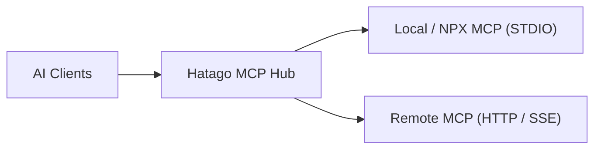
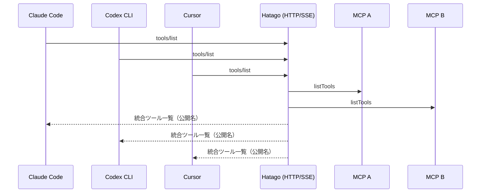

> **Hatago MCP Hub** は、複数の MCP サーバーを 1 つにまとめ、Claude Code / Cursor / Windsurf / Codex CLI など複数の AI クライアントから横断的に扱える **軽量Hub** です。本記事では、設計の背景からアーキテクチャ、設定方法、実運用のコツ、現状の制約までを紹介します。

## なぜ Hatago MCP Hub を作ったのか

MCP サーバーが増えるほど、クライアントごとの設定ファイル管理がじわじわ負担になります。ある日は `.mcp.json` を更新したのに、別のツール（たとえば TOML 設定の Codex CLI）では更新を忘れていた、ということも珍しくありません。[Docker Hub MCP Server](https://github.com/docker/hub-mcp) でまとめればいい、という声もあるでしょう。ただ、個々の現場の制約で Docker Desktop が使えない、あるいは **自由に MCP サーバーを選びたい** というニーズは根強く、結局それぞれのクライアントに対して個別設定を続けることになります。

こうした「設定の分散」を落ち着かせるために、**1 つの MCP サーバー（Hub）にまとめてしまい、クライアント側は Hatago だけを指す**── この方針が Hatago MCP Hub の出発点です。学習目的で始めた小さな実装でしたが、ツール名の衝突回避や進捗通知の中継、ホットリロードなど、実運用に必要な要素を搭載していった結果、今の形に落ち着きました。

## Hatago MCP Hub の全体像

Hatago は **Hub コア**、**レジストリ（Tools/Resources/Prompts）**、**トランスポート層**の 3 層からなります。AI クライアントと複数の MCP サーバーの間に入り、JSON-RPC/MCP のやりとりを丁寧に中継します。特徴としては、**トランスポート非依存**の設計にしている点です。STDIO でつなごうが、HTTP(Streaming)/SSE/WS でつなごうが、上のロジックは同じように動きます。



内部的には、Hub が各 MCP サーバーから提供されるツール群を取りまとめて **統合カタログ** を形成します。ここで重要になるのが **ツール名の衝突回避** です。Hatago は公開名として `serverId_toolName` の形式を既定採用し、実行時には元の MCP サーバーに対して **正規のツール名** でリクエストを委譲します。クライアントから見れば、公開名は常に一意で、どのサーバーに属するかも分かりやすい、というわけです。

もうひとつの要点は **進捗通知（notifications/progress）の透過中継** です。時間のかかる処理を走らせると、下位サーバーからプログレスが飛んできます。Hatago はそれをそのままクライアントに中継するので、上流の体験は損なわれません。サンプリング（`sampling/createMessage`）の橋渡しも同様で、下位が LLM 生成を要求してきたら、上位クライアントへ安全にバトンを渡し、結果を折り返します。

## セットアップ：最短ルート

Hatago は **CLI** を含み、プロジェクト直下でも、専用リポジトリでも、どちらでもすぐに試せます。まずは設定ファイルを生成し、STDIO か HTTP のどちらかで起動するだけです。

```bash
# 初期化（対話 or 既定値でサクッと）
npx @himorishige/hatago-mcp-hub init

# 明示的にモード指定
npx @himorishige/hatago-mcp-hub init --mode stdio
npx @himorishige/hatago-mcp-hub init --mode http
```

生成される `hatago.config.json` に接続したい MCP サーバーを列挙します。`npx` や `node` で動かすローカル MCP はもちろん、HTTP/SSE のリモート MCP も同じファイルで管理できます。`{"${VAR}"}` や `{"${VAR:-default}"}` のように **環境変数展開** にも対応しており、開発・本番を通して 1 本の設定を使い回せます。

```json:hatago.config.json
{
  "$schema": "https://raw.githubusercontent.com/himorishige/hatago-mcp-hub/main/schemas/config.schema.json",
  "version": 1,
  "logLevel": "info",
  "mcpServers": {
    "filesystem": {
      "command": "npx",
      "args": ["-y", "@modelcontextprotocol/server-filesystem", "/tmp"]
    },
    "deepwiki": {
      "url": "https://mcp.deepwiki.com/sse",
      "type": "sse"
    },
    "api": {
      "url": "${API_BASE_URL:-https://api.example.com}/mcp",
      "headers": { "Authorization": "Bearer ${API_KEY}" }
    }
  }
}
```

起動はシンプルです。1 クライアントで使うなら STDIO、複数クライアントから共有したいなら HTTP(Streaming) を選びます。設定変更を監視しながら動かす `--watch` も用意しています。

```bash
# STDIO モード（Claude Code などに最適）
hatago serve --stdio --config ./hatago.config.json

# HTTP(Streaming) モード（複数クライアントで共有）
hatago serve --http  --config ./hatago.config.json

# 設定のホットリロード
hatago serve --stdio --watch
```

:::message
**内部ツール**が運用に便利です。`_internal_hatago_status` で接続状況を確認でき、`_internal_hatago_reload` で手動リロード、`_internal_hatago_list_servers` で配下サーバー一覧を取得できます。通常の MCP ツールと同じ要領で呼び出せます。
:::

## クライアント別の使い方

### Claude Code（STDIO）

Claude Code からは、`hatago` を **1 件の MCP サーバー** として登録するだけで、Hatago 配下のすべての MCP ツールが統合リストとして見えるようになります。設定例は以下のとおりです。

```json:.mcp.json
{
  "mcpServers": {
    "hatago": {
      "command": "npx",
      "args": [
        "@himorishige/hatago-mcp-hub", "serve", "--stdio",
        "--config", "/ABS/PATH/hatago.config.json"
      ]
    }
  }
}
```

ツール名の衝突は Hatago 側で公開名に名前空間を付加して吸収し、実行時には正規のツール名で該当サーバーに委譲します。設定を変更したときは `--watch` で自動反映され、クライアントへ `tools/list_changed` が飛ぶので、リストが自動的に最新化されます。

### Codex CLI（TOML）

Codex CLI は設定が TOML なので、Hatago に一元化する効果がより大きく感じられます。STDIO 起動での接続例は次のとおりです。

```toml:codex.toml
[mcp_servers.hatago]
command = "npx"
args = [
  "-y", "@himorishige/hatago-mcp-hub", "serve",
  "--stdio", "--config", "/ABS/PATH/hatago.config.json"
]
```

### 複数クライアントから同時利用（HTTP 推奨）

チームで共通の Hatago にアクセスする場合は HTTP モードが便利です。Claude Code、Codex CLI、Cursor、Windsurf など複数クライアントが **同じ URL** に接続し、各自は Hatago だけを設定すれば、配下の MCP サーバーを一括で共有できます。運用上の更新は `hatago.config.json` を 1 か所触ればよく、`tools/list_changed` 通知によって各クライアントのツール一覧は自動で追従します。



### Claude Desktop

Claude Desktop/Code のどちらでも、Hatago を 1 件登録するだけで同様に利用できます。STDIO でも HTTP でも構いません。長めの処理では、下位 MCP から上がってくる進捗がそのまま転送されるため、画面上のフィードバックは途切れません。

## Node と Workers の住み分け

Hatago は **Node ランタイム** ではローカル MCP（`npx` や `node` で動かすもの）を含め、すべてのタイプを接続できます。一方で **Cloudflare Workers** のようなサーバーレス環境ではプロセス spawn ができないため、**HTTP/SSE で公開されたリモート MCP** をぶら下げる形が基本になります。設置場所は違っても、クライアントから見れば同じ Hatago です。

:::message
**Hono 製**なので、Workers 上でも Node 上でも、周辺のミドルウェアを載せ替えやすいのが利点です。運用で必要なログやヘッダ付与、認可チェックなども、アプリケーションコード側で自然に整理できます。
:::

## 設計のディテール

- **ツール名の衝突回避**では、既定で `namespace` 戦略（`serverId_toolName`）を採用します。公開名は常に一意で、実行時は元サーバーの正規名に戻して委譲します。
- **進捗の中継**は、`notifications/progress` を受けて上流へそのまま転送します。`progressToken` が付く場合は二重配信を避ける最適化を行います。
- **サンプリングの橋渡し**では、下位サーバーの `sampling/createMessage` を上位クライアントへ橋渡しし、レスポンス/プログレスを反射します。
- **ホットリロード**は、設定ファイルの変更を検知して安全に再接続し、反映後に `notifications/tools/list_changed` を送出します。

ここは黒魔術ではなく、MCP の素直な実装で積み上げています。ルーティングやレジストリの整備、イベントの流れを丁寧に保つことが最終的な使い心地に直結します。

## 運用のコツ

設定ファイルでは **意味のあるサーバー ID**（`github-api`, `filesystem-tmp` のような名前）を付けておくと、公開名から所属がすぐ分かります。環境変数の展開を活用すれば、API のエンドポイントやトークン差し替えも一本化できます。トラブルシュートは次の順で確認してください：まず `_internal_hatago_status` で全体像、次に `_internal_hatago_list_servers` で個別接続、最後に必要に応じて `_internal_hatago_reload` を実行します（例：ツール一覧が更新されない →status、特定サーバーだけ反応がない →list_servers、設定変更を反映したい →reload）。

:::message alert
**ツールが増えない／消えた** と感じたら、設定の変更が反映されていない可能性があります。`--watch` を使うか、内部ツールでリロードしてみてください。それでも解決しない場合は、下位 MCP 側の起動エラーやタイムアウト、権限不足を疑いましょう。
:::

## できないこと（現状の制約）

Hatago は **認証をビルトインしません**。OAuth にも対応していないため、Bearer Token や Cookie ベースの認可は **Hono のミドルウェア**、あるいは **Cloudflare Zero Trust** などの上位レイヤーで実現する方針です。OAuth 必須のリモート MCP をぶら下げる場合は、相手の仕様に合わせて個別の拡張が必要になります。ここは各環境で要件がまちまちなので、まずはシンプルに通す、という哲学です。

## ライブラリとしての利用

Hub ロジックはパッケージとしても提供しており、Hono など既存の HTTP アプリに **Hatago のハブ機能を組み込む** こともできます。API ゲートウェイや社内ポータルに軽量に溶け込ませて、チーム共通の MCP 集約ポイントを用意する、といった構成も現実的です。詳しくはリポジトリの `examples` を参照してください。

## まとめ

MCP の導入が進めば進むほど、設定の分散と運用コストは静かに増えます。Hatago MCP Hub は、その増加分を **「ハブ 1 本に寄せる」** ことで、クライアント横断の開発体験を保ちます。ツール名の衝突回避、進捗の透過中継、ホットリロード、内部ツールによる点検 ── どれも地味ですが、日々触れる「使い心地」を確実に底上げする要素です。

まずは小さく、`hatago.config.json` に 2〜3 本の MCP をぶら下げて試してください。クライアント側の設定は **Hatago を 1 件登録するだけ**。その後は、たとえば「利用する MCP が 5 本を超えて管理が煩雑」「ツール名の重複が発生」「遅延が目立つクライアントを分離したい」といった具体的なタイミングで、サーバーを追加・削除して最適化していくと運用しやすいです。
