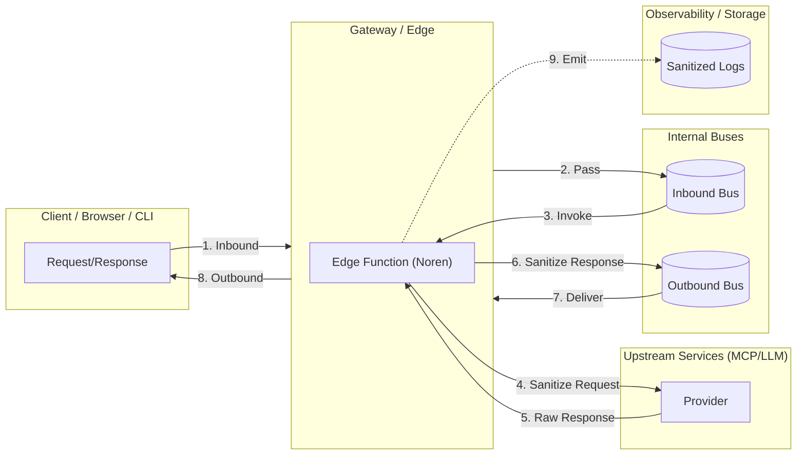
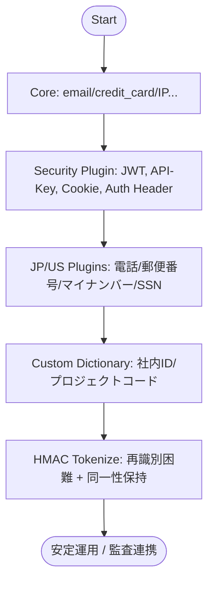

こんにちは、森茂です。

今回は、私が開発しているTypeScript製のPIIサニタイズライブラリ「Noren」について、その設計思想やアーキテクチャを深掘りしてみたいと思います。

:::message
この記事は、Norenのコンセプトや全体像を理解していただくためのもので、シリーズの第一回目という位置づけです。
:::

## 背景：なぜ「入口」で守る必要があるのか

近年、個人開発者から大企業まで、MCP（AI推論基盤）や外部LLMサービスへの接続は、ごく当たり前のことになりました。しかし、特に企業で開発していると、生データを外部サービスへ直接送信することに、コンプライアンスやセキュリティ上の懸念を感じた経験はないでしょうか？

私の周りでも、そうした不安から社内やマネージド環境にプロキシサーバーを立て、そこで認証やアクセス制御を行うケースが増えています。

とはいえ、この構成でも意図しない情報漏洩のリスクが完全になくなるわけではありません。認証ヘッダー、APIキー、Cookieといった技術的機密情報と、メールアドレス、電話番号などの個人情報（PII）が混在したリクエストやログは、ひとたび漏洩すれば重大なインシデントにつながりかねません。

もちろん、クラウドプロバイダーが提供する強力なDLP（Data Loss Prevention）サービスは非常に有効ですが、導入にはコストや時間がかかります。また、最近ではVibeCodingの普及により、誰もが比較的容易にMCPサーバーを立ち上げられるようになった一方で、TypeScriptで使える軽量なPIIマスキングライブラリはあまり選択肢がないのが現状でした。

そこで求められるのが、**「入口（Gateway/Edge）」で高速・軽量に実行できる、”まずはこれだけ”の防衛策**ではないでしょうか。Norenは、まさに「本格的な対策の前に、まずは軽量な一時対応を行いたい」というニーズに応えるために生まれたライブラリなのです。

## Norenの設計思想

Norenを設計するにあたり、私が大切にしたことが3つあります。

- **🚀 高速 (FAST)**: エッジ環境の厳しいパフォーマンス要件を満たすため、事前コンパイルされたパターンと最適化されたアルゴリズムを採用しています。手元のベンチマークでは、約102K ops/secを記録しました。
- **🪶 軽量 (LIGHTWEIGHT)**: バンドルサイズは約124KB。依存関係もなく、Node.js, Deno, Bun, Cloudflare Workersといった、あらゆるJavaScript環境で動くように作られています。
- **✨ シンプル (SIMPLE)**: Web標準API（WHATWG Streams, Web Crypto）のみで構築されており、最小限の設定ですぐに利用を開始できます。

名称の「Noren」は、日本の店舗や家屋の入り口にかけられる「暖簾」に由来します。開発のきっかけは、私自身が社内の開発チーム向けにMCPサーバーを用意しようとしていた際、「こういう軽量な情報フィルタリング機能も必要だよね」という発想から生まれた、という実体験に基づいています。

暖簾は、人が通ることはできても、中の様子は完全には見えません。この**「通れるけど、ほんの少しだけ視界を遮る」**という性質が、Norenが目指す部分的な情報マスキングのコンセプトと重なるため、この名前を採用しました。

## アーキテクチャ：どこに置くのがベストプラクティスか

では、Norenはどこに置くのが一番効果的なのでしょうか。
答えは、アプリケーションやサービスの最前線、つまりGatewayやEdge Functionです。



この構成で目指しているのは、Edge FunctionにNorenを常駐させ、**Inbound（入口）とOutbound（出口）の両方向でデータを逐次サニタイズする**ことです。そして、観測用のストレージやロギングシステムには、サニタイズ済みのデータのみを送信することで、監査証跡の安全性を高める、という思想です。

## “まずはこれだけ”導入（Coreライブラリ）

それでは、一番シンプルな構成を一緒に試してみましょう。
これなら、`@himorishige/noren-core`パッケージだけで、主要なPIIのマスキングが可能です。

```typescript:first-step.ts
import { Registry, redactText } from '@himorishige/noren-core'

// Registry: ルールや設定を管理する中央機関のようなものです
const reg = new Registry({
  // デフォルトのアクションを'mask'（マスキング）に設定
  defaultAction: 'mask',
  // 誤検出を抑制するためのヒントとなるキーワードを渡します
  contextHints: ['TEL','住所','Authorization','Bearer','Cookie'],
})

const input = 'Email: alice@example.com / IP: 192.168.0.1 / Card: 4242-4242-4242-4242'

// テキストのサニタイズを実行します
const result = await redactText(reg, input)

console.log(result)
// => Email: [REDACTED:email] / IP: [REDACTED:ipv4] / Card: **** **** **** 4242
```

ちなみに、この例は半角文字ですが、Norenは日本語環境でよくある全角のメールアドレスや電話番号も問題なく処理できます。

:::message
これは、内部で **NFKC正規化** というUnicodeの標準的な処理を行っているためです。検出前に全角英数字や記号を自動的に半角に変換することで、ユーザーが入力形式を意識することなく、堅牢なマスキングを実現しています。
:::

どうでしょう。`Registry`を作って`redactText`を呼び出すだけで、メールアドレス、IPアドレス、クレジットカード番号といった一般的なPIIを検出・マスクできました。とても簡単ではないでしょうか。


### 応用編：オブジェクトや配列を処理するには？

NorenのCore APIは、パフォーマンスを重視しているため、文字列の処理に特化して設計されています。型定義でも `raw: string` となっているように、オブジェクトや配列を直接渡すと `s.normalize is not a function` のようなエラーが発生してしまいます。

しかし、ご安心ください。ちょっとした工夫で、オブジェクトのような構造化データもサニタイズできます。

#### JSON文字列に変換する
一番シンプルなのは、オブジェクト全体をJSON文字列に変換する方法です。

```typescript:object-to-json.ts
const user = {
  id: 123,
  name: '森茂',
  email: 'json@example.com',
  note: '電話番号は０９０－１２３４－５６７８です。'
}

// オブジェクトをJSON文字列に変換してからサニタイズ
const stringified = JSON.stringify(user)
const redactedJson = await redactText(reg, stringified)

console.log(redactedJson)
// => {"id":123,"name":"森茂","email":"[REDACTED:email]","note":"電話番号は[REDACTED:jp-phone]です。"}

// JSONに戻して使う
const redactedUser = JSON.parse(redactedJson)
```
この方法なら、オブジェクトの構造を保ったまま、値に含まれるPIIを一括で処理できますね。

#### 必要な部分だけを文字列にする
オブジェクトの一部のフィールドだけを処理したい場合は、テンプレート文字列を使うのが便利です。

```typescript:template-literal.ts
const contact = {
  email: 'template@example.com',
  phone: '090-9876-5432',
  memo: 'こちらは秘密のメモです'
}

// 必要な情報だけをテンプレート文字列に埋め込む
const targetText = `メール: ${contact.email}\n電話: ${contact.phone}`
const redactedText = await redactText(reg, targetText)

console.log(redactedText)
// => メール: [REDACTED:email]
//    電話: [REDACTED:jp-phone]
```
この方法なら、サaniタイズしたいフィールドだけを効率的に抜き出して処理できます。

このように、入力データを文字列に変換する前処理を一手間加えるだけで、Norenの活用範囲はぐっと広がります。ぜひ試してみてください。


## 段階的拡張の設計指針


Norenの面白いところは、必要に応じて機能を拡張できるプラグインアーキテクチャを採用している点です。
まずはCoreから始めて、要件に応じてプラグインやカスタム辞書を追加し、だんだんと育てていくのがおすすめのアプローチです。



1.  **Core**: まずは基本的なPIIから保護するところからスタートします。
2.  **Security Plugin**: 次に、JWT、APIキー、認証ヘッダーなど、技術的な機密情報を保護します。
3.  **JP/US Plugins**: 日本のマイナンバーや米国のSSNなど、地域固有の情報を保護する必要があれば、プラグインを追加します。
4.  **Custom Dictionary**: ホットリロード可能な辞書機能で、社内固有のIDやプロジェクトコードなどを動的に保護することも可能です。
5.  **HMAC Tokenize**: データを再識別困難にしつつ、同一性を保持したい、といった高度な要件にも対応できます。

## コラム：ライブラリ利用における責任範囲について

ここで少し、オープンソースのPIIライブラリを開発・利用する際の責任範囲についてお話しさせてください。

- **誤検出・検出漏れ**: 100%の精度を保証するものではありません。誤検出や検出漏れの可能性は常に存在します。
- **法令順守**: 本ライブラリは、GDPRやCCPAといった特定の法規制への準拠を保証するものではありません。法的な助言の代わりとして利用することはできない、という点にご注意ください。
- **鍵管理**: HMACトークン化機能を利用する場合、32文字以上の安全な鍵を環境変数などで管理し、適切なローテーション計画を立てることは、利用者側の責任となります。

Norenはあくまで「入口を固めるための軽量なツール」であり、本格的なDLPシステムの代替ではない、という点はご理解いただけると嬉しいです。

## 付録：実装パターン集

ここからは、具体的な実装イメージを掴んでいただくために、いくつかのサンプルコードを紹介しますね。

### Honoでエッジ最小構成

Honoフレームワークを使えば、Cloudflare Workersなどのエッジ環境で動作するサニタイズAPIを驚くほど簡単に構築できます。

```typescript:hono-server.ts
import { Hono } from 'hono'
import { Registry, redactText } from '@himorishige/noren-core'
import * as security from '@himorishige/noren-plugin-security'

const app = new Hono()

const reg = new Registry({
  defaultAction: 'mask',
  contextHints: ['Authorization','Cookie','Bearer']
})
// Securityプラグインで認証ヘッダやCookie、APIキーなどを即座にマスク
reg.use(security.detectors, security.maskers)

app.post('/redact', async (c) => {
  const text = await c.req.text()
  return c.text(await redactText(reg, text))
})

export default app
```
このコードは、POSTリクエストで受け取ったテキストボディをサニタイズして返す、シンプルなAPIエンドポイントです。

### カスタム辞書で社内IDを検出

`noren-dict-reloader`と組み合わせることで、社内固有のIDなどを定義したカスタム辞書を動的に読み込めます。

**manifest.json（辞書ファイルの場所を定義）**
```json:manifest.json
{
  "dicts": [
    { "id": "company", "url": "https://example.com/dicts/company-dict.json" }
  ]
}
```

**company-dict.json（検出パターンを定義）**
```json:company-dict.json
{
  "entries": [
    {
      "pattern": "EMP\\\\d{5}",
      "type": "employee_id",
      "risk": "high",
      "description": "社員番号 EMP + 5桁"
    }
  ]
}
```
このように、正規表現パターンとメタデータ（型、リスクレベルなど）をJSONで定義するだけで、検出ルールを柔軟に拡張できるのが特徴です。

### `file://` でローカル辞書を読み込む（検証用）

本番環境ではHTTP(S)経由での辞書読み込みが推奨されますが、ローカルでの開発や検証では `file://` プロトコルも利用できます。

```typescript:local-reloader.ts
import { PolicyDictReloader, fileLoader } from '@himorishige/noren-dict-reloader'

const reloader = new PolicyDictReloader({
  policyUrl: 'file:///app/config/policy.json',
  dictManifestUrl: 'file:///app/config/manifest.json',
  compile: (policy, dicts) => {
    // ... ここでRegistryを構築するロジックを実装します ...
  },
  // ローカルファイル用のローダーを指定
  load: fileLoader,
})

await reloader.start()
```
`fileLoader`は、ファイルの更新日時（mtime）やハッシュ（SHA-256）を元にETagを計算し、HTTP経経由と同様の差分更新チェックを行ってくれるので、ローカルでも効率的に開発できます。

## まとめ

今回は、Norenの設計思想と、Gateway/Edge環境における基本的なアーキテクチャ、そして段階的な導入アプローチについてお話ししました。

まずは最小構成のCoreライブラリからでも、システムのセキュリティを一段階引き上げることが可能だと感じていただけたのではないでしょうか。
現代の開発において、セキュリティは「誰か専門家がやること」ではなく、開発者全員が意識すべきものになりつつあると、私は感じています。Norenが、その第一歩を踏み出すための手軽なツールとして、皆さんのお役に立てば嬉しいです。

次回は、Norenの心臓部であるCore APIと、各種プラグイン（Security/JP/US）の具体的な使い方について、さらに深く掘り下げていきます。

Surf's up🏄‍♂️

---

### タイトル案

1. Noren Deep Dive #1: なぜGateway/Edgeで守るのか？PIIサニタイズの設計思想
2. TypeScript製PIIライブラリNoren入門：アーキテクチャと「まずはこれだけ」導入ガイド
3. Edgeで守る情報セキュリティ：Norenの設計思想と段階的導入アプローチ