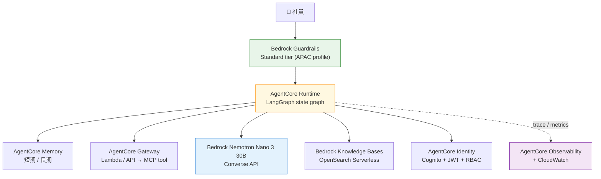

AWS Bedrock でエージェントを動かそうとすると、まず迷うのが**どの足回りで組むか**です。Bedrock Agents のコンソール、Bedrock AgentCore、SageMaker、Lambda + 自作の LangGraph、あるいは Marketplace で NIM コンテナをデプロイして SageMaker Endpoint に載せる選択肢もあります。情報源によって推奨が違い、半年単位でラインナップ自体も入れ替わるので、入り口の段階で半日溶けることも珍しくありません。

本書は AWS Bedrock AgentCore + Bedrock ネイティブ Nemotron + LangGraph という組み合わせで、社内ドキュメント Q&A エージェントを **Production Grade に持っていくまで**を一本道のハンズオンにまとめました。題材は前作 2 冊と同じ社内 Q&A です。あえて同じ題材にすることで、OSS スタックで組んだ前作と AWS マネージドで組み直す本書の差分が立体的に見えるようにしています。

## 前作 2 冊との関係

本書は独立した新作として読み進められるよう設計しています。前作を読んでいないほうも、本書だけで完結します。一方で、前作読者には「OSS でやったあの構成が AWS でこうなる」というコントラスト体験を提供したいので、付録 A で 4 本柱（Orchestration / Guardrails / Observability / Eval Dataset）が AWS マネージドのどこに置き換わるかを差分マップで整理しました。

| 書籍               | 推論基盤                        | エージェント基盤          | ホスト             |
| ------------------ | ------------------------------- | ------------------------- | ------------------ |
| 入門編（既刊）     | DGX Spark + NIM ローカル        | NeMo Agent Toolkit (NAT)  | DGX Spark          |
| 実践運用編（既刊） | build.nvidia.com Cloud NIM      | NAT + LangGraph           | Mac + Colima       |
| **本書（AWS 版）** | **Bedrock ネイティブ Nemotron** | **AgentCore + LangGraph** | **AWS マネージド** |

- 前作 1 冊目： [NIM + Docker ではじめる NeMo Agent Toolkit ハンズオン](https://zenn.dev/himorishige/books/nemo-agent-toolkit-nim-handson)
- 前作 2 冊目： [NeMo Agent Toolkit 実践運用編 — Guardrails × Langfuse](https://zenn.dev/himorishige/books/nemo-agent-toolkit-production-ops)

「DGX Spark を持っている」「Mac + Colima で OSS スタックを動かす」という前提を取り払い、**AWS アカウントだけで本番運用品質のエージェント基盤を組む**のが本書のスタンスです。GPU の空きをやりくりしたり、Colima の RAM 設定を調整したりする手間は、本書では一切登場しません。

## 本書の到達点 — AgentCore 6 サービスを順に積む

本書を読み終えたとき、手元にできているのはおおむね次のような構成です。



AWS Bedrock AgentCore は **Runtime / Memory / Gateway / Identity / Built-in Tools / Observability** の 6 サービスからなるフルマネージドのエージェント基盤です。フレームワーク非依存で、CrewAI / LangGraph / LlamaIndex / Strands Agents のいずれも持ち込めます。本書では LangGraph で workflow を組み、Runtime に serverless でデプロイします。

推論モデルは **Bedrock ネイティブの Nemotron Nano 3 30B** を主軸に据えます。これは AWS 公式の Bedrock Model cards ページにまだ載っていない隠れ玉で、東京リージョンで日本語応答が 1 秒未満、単価は Claude Sonnet 4.5 の 1/40 〜 1/100 という現時点のスイートスポットです。本書の Sprint 0 で見つけた発見の中で、章構成にもっとも影響を与えた1つです。

## 本書で作るもの

題材は前作と同じ「**社内ドキュメント Q&A エージェント**」です。サンプルコーパスには社員名・電話番号・社内システム URL のような PII を意図的に混ぜてあるので、Guardrails で何が止まり何が漏れるかを実機で体感できます。

最終章までに次の 4 つを順に積み上げます。

1. **Bedrock ネイティブ Nemotron を `Converse` API で叩く**最小構成（Ch 3-4）
2. **AgentCore 6 サービスを 1 章ずつ追加**して production grade に近づける（Ch 5-10）
3. **Bedrock Knowledge Bases + Guardrails** で RAG と安全レールを敷く（Ch 11-12）
4. **評価とマルチエージェント、IaC、コスト最適化**で本番運用に耐える形に整える（Ch 13-16）

すべて AWS CDK v2（Python）で IaC 化されており、`cdk deploy --all` で再現できる構成です。GPU は不要です。

## 本書の対象読者

- AWS アカウントを持っていて、Bedrock を多少は触ったことがある
- Production grade の Agentic AI を AWS マネージドで組みたい
- LangGraph の名前は知っているが、AgentCore Runtime に乗せた経験はない
- 前作を読んで「同じ機能を AWS で組み直すならどうなるか」が気になる
- GPU インフラ運用は避けたい

DGX Spark のような専用ハードウェアは要りません。動作確認は macOS（Apple Silicon）と Linux（x86_64）で行いました。Windows は WSL2 で同等の手順が通る想定です。

## 本書で扱わないこと

意図的にスコープから外したテーマがいくつかあります。

- **AWS の基礎**（IAM / VPC / S3 等）には踏み込みません。各章で必要になる権限は CDK サンプルに含めましたが、IAM ポリシーの設計論は別書籍にお任せします
- **Bedrock Agents のコンソール GUI 操作**は中心テーマにしません。AgentCore + CDK のコード駆動が本書の主軸です。比較は Ch 1 と Ch 14 で扱います
- **SageMaker Endpoint 経由の NIM デプロイ**は実機検証で撤退済みです。なぜ撤退したかは付録 B にまとめました
- **マルチモーダル**（VLM / 画像 / 音声）は本書の社内 Q&A 題材から外しています。Nemotron Nano 12B v2 VL は付録で言及するに留めます
- **GPU / CUDA / vLLM のローカルセットアップ**は登場しません。Bedrock 経由で完結します

## 必要な環境

| 項目                 | 内容                                                                                         |
| -------------------- | -------------------------------------------------------------------------------------------- |
| OS                   | macOS（Apple Silicon / Intel）/ Linux x86_64 / Windows WSL2                                  |
| ランタイム           | Python 3.12、Node.js 20+（AWS CDK / AgentCore CLI 用）                                       |
| パッケージマネージャ | uv（Python）、bun または pnpm（JS/TS）                                                       |
| AWS アカウント       | Bedrock model access が承認できる権限                                                        |
| 想定リージョン       | `ap-northeast-1`（東京）主軸                                                                 |
| 必要な model access  | `nvidia.nemotron-nano-3-30b` / `nvidia.nemotron-nano-9b-v2` / `amazon.titan-embed-text-v2:0` |

GPU・大容量メモリは要りません。ローカルの依存はかなり軽量で、Python 仮想環境が動けば十分です。Bedrock model access の有効化は東京リージョンの Bedrock コンソールから 1 クリックで申請でき、私の環境では即時承認されました。

:::message
**Sprint 0 で確認したコスト感**: 月 1,000 conversation 想定で、Knowledge Bases なしの開発環境なら月 $10、本番想定で Knowledge Bases も常時起動して月 $367 程度です。OpenSearch Serverless の OCU 固定費（約 $345/月）が支配要因なので、開発時は Knowledge Bases を停止できる CDK パラメータを Ch 11 で実装します。
:::

## サンプルコード

全章のサンプルコードは GitHub で配布します。

https://github.com/himorishige/aws-bedrock-agentcore-nemotron-handson

リポジトリは AWS CDK v2（Python）+ Lambda + AgentCore のモノレポ構成です。章ごとにブランチを切ってあり、本書を読みながら `git switch chXX-*` で対応する状態に切り替えられます。

```bash
git clone https://github.com/himorishige/aws-bedrock-agentcore-nemotron-handson.git
cd aws-bedrock-agentcore-nemotron-handson
uv sync
cd cdk && uv run cdk bootstrap aws://YOUR_ACCOUNT_ID/ap-northeast-1
```

## 本書のバージョン前提

| コンポーネント                        | バージョン                                         |
| ------------------------------------- | -------------------------------------------------- |
| Python                                | 3.12                                               |
| AWS CLI                               | v2.32+                                             |
| AWS CDK                               | 2.1119+                                            |
| AgentCore CLI（npm `@aws/agentcore`） | 0.11+                                              |
| `bedrock-agentcore`（Python）         | 1.6+                                               |
| `langgraph`                           | 1.0+                                               |
| `langchain-aws`                       | 1.0+                                               |
| Workflow LLM                          | `nvidia.nemotron-nano-3-30b`（Bedrock ネイティブ） |
| Worker / Judge LLM                    | `nvidia.nemotron-nano-9b-v2`（Bedrock ネイティブ） |
| Embedding                             | `amazon.titan-embed-text-v2:0`                     |
| Guardrails                            | Bedrock Guardrails Standard tier（APAC profile）   |
| Vector store                          | OpenSearch Serverless                              |

AgentCore は 2025 年に GA したばかりで API が活発に更新されています。本書執筆中の挙動を基準にするので、後続バージョンで差分が出た場合は章末の差分メモに追記する運用にしました。

## 読み進め方のおすすめ

- **第 0-2 章**は全体像と環境準備です。AWS をすでに普段使いしているほうは斜め読みでも構いません
- **第 3-4 章**で Bedrock ネイティブ Nemotron の触り方と Service Tiers を押さえます。コスト戦略の章は飛ばさずに目を通すのがおすすめです
- **第 5-10 章**で AgentCore 6 サービスを順に積み上げます。本書の核です
- **第 11-12 章**で RAG と Guardrails、**第 13-14 章**で評価とマルチエージェントを扱います
- **第 15-16 章**で CDK と本番運用のチェックリストを整えて締めます
- **付録 A** は前作読者向けの差分マップ、**付録 B** は SageMaker NIM デプロイ撤退記、**付録 C** は東京以外で動かす場合の考慮点です

途中で詰まった章だけを抜き読みするより、最低でも第 5 章までは順に手を動かすのを推奨します。AgentCore Runtime にコードをデプロイした感覚を一度持っておくと、それ以降の章が一気に立体的になります。

## 章依存図

```mermaid
graph TD
    C0["第0章<br/>はじめに"] --> C1["第1章<br/>AWS Agentic AI 全景"]
    C1 --> C2["第2章<br/>環境セットアップ"]
    C2 --> C3["第3章<br/>Bedrock Nemotron"]
    C3 --> C4["第4章<br/>Service Tiers"]
    C4 --> C5["第5章<br/>AgentCore Runtime"]
    C5 --> C6["第6章<br/>Memory"]
    C6 --> C7["第7章<br/>Gateway"]
    C7 --> C8["第8章<br/>Identity"]
    C8 --> C9["第9章<br/>Built-in Tools"]
    C9 --> C10["第10章<br/>Observability"]
    C10 --> C11["第11章<br/>Knowledge Bases"]
    C11 --> C12["第12章<br/>Guardrails"]
    C12 --> C13["第13章<br/>評価"]
    C13 --> C14["第14章<br/>マルチエージェント"]
    C14 --> C15["第15章<br/>IaC + CI/CD"]
    C15 --> C16["第16章<br/>コスト最適化"]
    style C5 fill:#fff8e1,stroke:#ff8f00
    style C6 fill:#fff8e1,stroke:#ff8f00
    style C7 fill:#fff8e1,stroke:#ff8f00
    style C8 fill:#fff8e1,stroke:#ff8f00
    style C9 fill:#fff8e1,stroke:#ff8f00
    style C10 fill:#fff8e1,stroke:#ff8f00
    style C11 fill:#e3f2fd,stroke:#1976d2
    style C12 fill:#e8f5e9,stroke:#388e3c
    style C13 fill:#f3e5f5,stroke:#7b1fa2
    style C14 fill:#f3e5f5,stroke:#7b1fa2
```



オレンジが AgentCore 6 サービス、青が RAG、緑が Guardrails、紫が評価とマルチエージェントです。

## フィードバック

本書を読み進めて動かない箇所や、分かりにくい説明に気づいたら、次のいずれかでお知らせください。

- サンプルコードリポジトリの [Issues](https://github.com/himorishige/aws-bedrock-agentcore-nemotron-handson/issues)
- Zenn の各章下部のコメント欄

特に AgentCore は GA 直後で API の挙動が変化しやすいので、執筆時と異なる動作に出会ったほうからの報告は本書のメンテナンスにとても助かります。

## 次章では

次章では AWS で Agentic AI を組むときの選択肢の全景を整理します。Bedrock Agents（GUI 駆動の旧来パス）、AgentCore（フレームワーク非依存のフルマネージド）、SageMaker、Lambda + 自作 LangGraph、EC2 ベアメタル + 自作の 5 通りを並べ、それぞれが向く要件と避けたい状況を比較します。本書がなぜ AgentCore + LangGraph を主軸に選んだのかも、この章で根拠ベースで言語化します。
