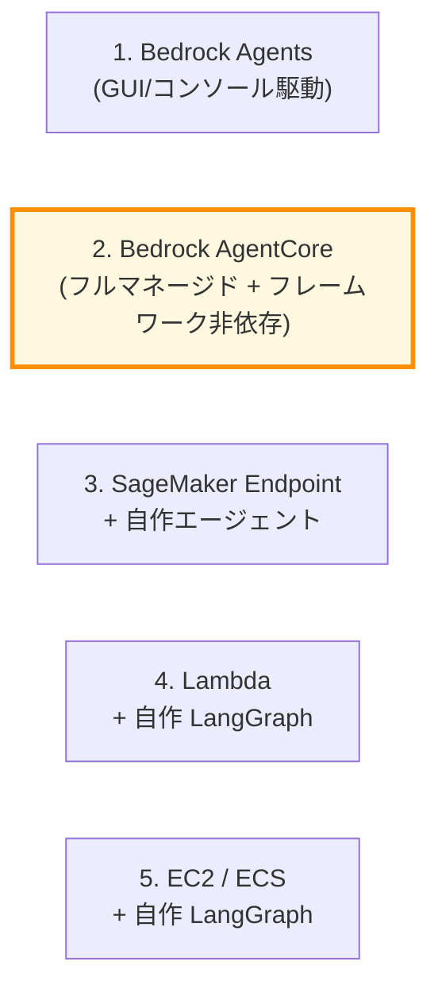
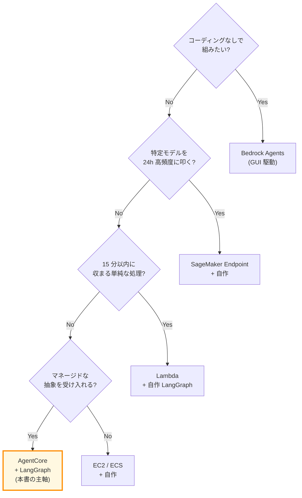
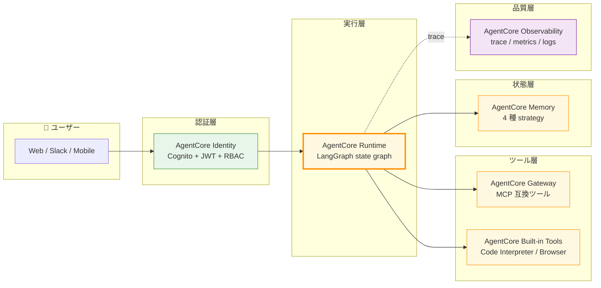

第 1 章では、AWS で Agentic AI を組むときの選択肢を 5 通りに整理し、それぞれの向き不向きを比較します。本章にハンズオンは登場しません。第 2 章から実際に手を動かす前に、「**なぜ本書は Bedrock AgentCore + LangGraph を主軸にしたのか**」を根拠ベースで言語化しておくと、以降の章で登場する CDK スタックや Lambda の設計意図がスッと入ってきます。

## この章のゴール

- AWS で Agentic AI を組むときの 5 通りの選択肢を、それぞれ 30 秒で説明できるようになる
- 5 通りの選択肢を 6 つの軸で比較した結果、自分のプロジェクトがどこに刺さるか判断できる
- 本書が AgentCore + LangGraph を選んだ 4 つの根拠を理解する
- AgentCore 6 サービスがどのレイヤーに位置するのかを 1 枚の図でつかむ

## 5 通りの選択肢を並べる

AWS で Agentic AI を組む足回りは、2026 年時点でおよそ次の 5 つに大別できます。

オレンジで塗ったのが本書の主軸である AgentCore です。これだけ並べると差が見えにくいので、1 つずつ概観します。

### 1. Bedrock Agents — GUI 駆動の旧来パス

Bedrock Agents は AWS が最初期から提供してきたエージェント基盤です。AWS マネジメントコンソールで Agent / Action Group / Knowledge Base / Guardrails を画面操作で構築でき、Multi-Agent Collaboration（supervisor-collaborator hierarchical）にも対応します。Action Group は OpenAPI スキーマか Lambda 関数でツールを定義します。

向いている場面は、**コーディング中心ではないチームで、AWS マネジメント上で完結したい**ケースです。CloudFormation / CDK 化も可能ですが、エージェントの細かい制御フロー（条件分岐、並列実行、ループ）を表現するのは苦手で、低コードで済む範囲を逸脱すると一気にハマります。プロンプトエンジニアリング寄りの設計者には親しみやすい一方、Python 側でのカスタマイズが難しいのが弱点です。

### 2. Bedrock AgentCore — フルマネージド + フレームワーク非依存（本書の主軸）

AgentCore は 2025 年に GA したフルマネージドのエージェント基盤で、6 つのサービスから構成されます。

| サービス       | 役割                                             |
| -------------- | ------------------------------------------------ |
| Runtime        | LangGraph などをデプロイする serverless 実行環境 |
| Memory         | 短期 / 長期メモリ管理（4 種 strategy）           |
| Gateway        | Lambda / API を MCP 互換ツールに変換             |
| Identity       | Cognito + JWT + RBAC                             |
| Built-in Tools | Code Interpreter / Browser                       |
| Observability  | trace / metrics / logs                           |

最大の特徴は、**フレームワーク非依存**である点です。CrewAI / LangGraph / LlamaIndex / Strands Agents のいずれを持ち込んでも Runtime にデプロイできます。さらに `bedrock-agentcore` Python SDK と `@aws/agentcore` CLI が用意されていて、`agentcore create` 一発で LangChain_LangGraph のスケルトンが生成されます。

向いているのは、**フレームワークの自由度を確保しつつ AWS のマネージドな恩恵に乗りたい**ケースです。Bedrock Agents の表現力に物足りなさを感じたが、自前 EC2 で全部組むのは運用負荷が重すぎる、という中間ゾーンを綺麗に埋める設計になっています。

### 3. SageMaker Endpoint + 自作エージェント

3 番目は、SageMaker Endpoint で推論モデルを独立にホストし、エージェント部分を別途 ECS / Lambda などで自作するパターンです。Custom container（vLLM / TensorRT-LLM / NIM）を載せたい、ファインチューニング済みモデルをサーブしたい、といった要件があるときに選びます。

向いているのは、**特定モデルを長時間 / 高頻度で叩く必要があり、Bedrock の単価では割に合わない**ケースです。一方で、Endpoint は 24 時間稼働の固定費（GPU インスタンス料金）が支配的になりがちで、月額数千 USD を即座に超えます。NIM コンテナを SageMaker Endpoint に載せるパスは公式 JumpStart 経由で GA していますが、本書の Sprint 0 で実機検証したところ、CUDA Graph timeout や `serve` スクリプト不在の壁にぶつかって全試行 Failed だったため、本書では選択肢から外しました。

### 4. Lambda + 自作 LangGraph

4 番目は、Lambda 関数の中で LangGraph を起動し、Bedrock の `Converse` API を叩くパターンです。サーバレスで運用負荷が低く、コードも少なめで済みます。

向いているのは、**短時間（15 分以内）で完結する単純なエージェントを、低コストで動かしたい**ケースです。逆に、長時間の対話、メモリ管理、複数ユーザーの並列処理、ストリーミング応答が必要になると、Lambda の制約（タイムアウト、コールドスタート、レスポンスサイズ上限）が次々と顔を出します。本書の規模感だと早々に AgentCore Runtime の方が割に合います。

### 5. EC2 / ECS + 自作 LangGraph

5 番目は、EC2 / ECS / Fargate 上で自前のサーバを動かし、LangGraph + boto3 + 必要なら Phoenix / Langfuse をすべて自作で組むパターンです。前作 2 冊目の Mac + Colima 構成をそのまま AWS に持ち込んだ姿に近いと思ってください。

向いているのは、**徹底的な制御が必要で、マネージドな抽象を一切受け入れたくない**ケースや、既存の OSS スタック（前作読者の Langfuse self-hosted など）を AWS に移したい場合です。柔軟性は最大ですが、Memory / Identity / Observability をすべて自作する負荷は相当なもので、現実的にはチームのリソースと相談になります。

## 6 つの軸で比較する

ここまでの 5 通りを、Production 投入時に効いてくる 6 つの軸で並べます。

| 軸                    | Bedrock Agents |    **AgentCore**     | SageMaker Endpoint | Lambda + 自作 | EC2/ECS + 自作 |
| --------------------- | :------------: | :------------------: | :----------------: | :-----------: | :------------: |
| 学習コスト            |       低       |        **中**        |         高         |      中       |       高       |
| 運用負荷              |       低       |        **低**        |         高         |      中       |       高       |
| フレームワーク自由度  |       低       |    **高（任意）**    |         高         |      高       |      最大      |
| コスト透明性          |       中       |        **中**        |  低（24h 固定費）  |      高       |       中       |
| 観測 / 評価の組み込み |       中       |  **高（built-in）**  |         低         |      低       |    自作次第    |
| マルチエージェント    | 高（公式 GUI） | **高（コード駆動）** |      自作次第      |   自作次第    |    自作次第    |

太字は本書が選んだ AgentCore です。学習コストは「中」で Bedrock Agents より一段重いものの、運用負荷とフレームワーク自由度の両方が「低 / 高」というバランスに収まっています。

特筆すべきは観測と評価の項目です。本書の Sprint 0 で `bedrock-agentcore-control help` を眺めたところ、当初プランに無かった `create-evaluator` / `create-online-evaluation-config` / `create-policy-engine` といったコマンドが見つかりました。AgentCore は Runtime / Memory / Gateway / Identity / Built-in Tools / Observability の 6 サービスとして紹介されますが、実際は **Evaluator と Policy Engine が built-in** で含まれており、評価とガバナンスのレイヤーまでカバーできる作りになっていました。これは本書の Ch 13（評価）と Ch 12（Guardrails）の構成にも影響を与えています。

## 要件別の選定フローチャート

数字や軸だけで決まらない場合のために、簡易的なフローチャートを置きます。プロジェクトの要件に当てはめて辿ってみてください。

社内ドキュメント Q&A のように「会話を継続する」「PII を扱う」「複数ユーザーの並列接続を捌く」要件があるエージェントは、Q3 で No に分岐するので、必然的に AgentCore か EC2/ECS の二択になります。本書はそこから Q4 で Yes を選び、AgentCore を主軸にした、というのが選定の流れです。

## 本書が AgentCore + LangGraph を選んだ 4 つの根拠

選定の流れだけだと味気ないので、根拠をもう少し具体的に書きます。本書の Sprint 0 で実機検証して固まった、4 つの理由があります。

### 根拠 1: フレームワーク非依存で LangGraph をそのまま持ち込める

AgentCore Runtime は CrewAI / LangGraph / LlamaIndex / Strands Agents のいずれにも対応しています。前作 2 冊目で LangGraph を扱った読者は、`graph.ainvoke({"messages": ...})` のような呼び出しコードをほぼそのまま流用できます。Sprint 0 では実際に最小の state graph（retrieve → reason → answer）を組み、`agentcore dev --logs` でローカル起動して `1.55 秒で日本語応答`を確認できました。フレームワーク移行のハードルがほぼゼロという点が、前作読者には大きな利点です。

### 根拠 2: AgentCore CLI の scaffold が体験として軽い

`@aws/agentcore` という npm パッケージで提供される CLI が思いのほか軽量です。`agentcore create --name qaSupervisor --framework LangChain_LangGraph --protocol HTTP --build CodeZip --model-provider Bedrock --memory none` の 1 行で、CDK プロジェクト + Python アプリ + entrypoint + MCP クライアントの雛形が一気に立ち上がります。

scaffold 直後の `agentcore validate` が `Valid` を返すまでが 30 秒、`agentcore dev` でローカル開発サーバが立ち上がるまでが追加 30 秒程度です。Memory を追加するときも `agentcore add memory --strategies SEMANTIC --expiry 7` で `agentcore.json` の `memories[]` に項目が追加されます。コードを書く前の足回りで詰まる時間が極端に短くなります。

### 根拠 3: built-in 機能の充実（Memory / Gateway / Identity / Evaluator / Policy Engine）

繰り返しになりますが、AgentCore は 6 サービスと公式が紹介していても、実際は Evaluator と Policy Engine も含めて 8 つ近くの機能が CLI で叩けます。Memory 1 つ取っても、`SEMANTIC` / `SUMMARIZATION` / `USER_PREFERENCE` / `EPISODIC` の 4 種 strategy を選択でき、namespace に `{actorId}` を埋め込むだけでユーザー単位の長期メモリが自動でスコープされます。

これらを EC2/ECS で自作すれば、Memory の永続化、TTL 管理、ユーザー識別、scope 切り替えで合計数千行のコードと運用負荷を背負うことになります。AgentCore はそこを CLI 1 コマンドで済ませてくれる、という当たり前にも見える価値が、実装が進むほどジワジワ効いてきます。

### 根拠 4: Bedrock ネイティブ Nemotron との相性

本書は推論モデルに Bedrock ネイティブの Nemotron Nano 3 30B を主軸に据えています。AgentCore Runtime から見ると、これは `langchain_aws.ChatBedrockConverse(model_id="nvidia.nemotron-nano-3-30b", region_name="ap-northeast-1")` の数行で繋がります。**Marketplace 経由のデプロイも、SageMaker Endpoint も、自前のホスティングも要りません**。

東京リージョンの単価は入力 $0.07 / 1M tokens、出力推定 $0.35 / 1M tokens で、Claude Sonnet 4.5 の 1/40 〜 1/100 という安さです。1,000 conversation/月のシナリオで Bedrock 推論コストが $0.88 程度に収まり、AgentCore Memory / Gateway / Lambda / CloudWatch などを足しても、Knowledge Bases さえ起動しなければ月 $22 程度。日本語応答も 1 秒未満で、用途とコストのバランスが本書の題材にぴたりとはまります。

:::message
**Sprint 0 で見つけた発見**: AWS 公式の Bedrock Model cards ページには Nemotron Nano 9B v2 / Super 120B / Nano 12B VL の 3 種しか記載がありませんが、`aws bedrock list-foundation-models --by-provider NVIDIA --region ap-northeast-1` を叩くと 4 種目として **Nemotron Nano 3 30B** が ACTIVE / ON_DEMAND で見つかります。本書の発見の中でも特に章構成にインパクトを与えた1つで、第 3 章で詳しく取り上げます。
:::

## AgentCore 6 サービスの位置づけ

最後に、本書の中盤（Ch 5-10）で 1 章ずつ深掘りする AgentCore 6 サービスが、エージェントのライフサイクルのどこに刺さるのかを 1 枚にまとめます。

本書では認証層から順に積み上げる構成にせず、**Runtime（Ch 5）→ Memory（Ch 6）→ Gateway（Ch 7）→ Identity（Ch 8）→ Built-in Tools（Ch 9）→ Observability（Ch 10）**の順で扱います。最初に Runtime で「LangGraph をデプロイする」感覚を掴み、その上に Memory / Gateway を積むほうが、実装の連続性として自然だと判断しました。Identity（認証）が後回しに見える構成ですが、ここまでに作ったエージェントを実際にユーザーに公開する一歩手前で当てる位置に置いています。

## Bedrock の他機能との関係

AgentCore は Bedrock の他機能（Knowledge Bases、Guardrails、Model Evaluation）と組み合わせて使えます。本書での扱いは次の通りです。

- **Bedrock Knowledge Bases**（Ch 11）: OpenSearch Serverless backed の RAG 基盤。AgentCore Runtime からは `Retrieve` API + Nemotron `Converse` の組み合わせで使います。Nemotron は KB の generation モデルとして直接組み込めない制約があるため、Agent 経由の間接 RAG パターンを採用します
- **Bedrock Guardrails**（Ch 12）: 入出力検閲。Sprint 0 で「Classic tier では日本語が動かず、Standard tier + APAC profile + cross-region inference 必須」という重要な発見があり、Ch 12 の冒頭をその落とし穴の解説に充てます
- **Bedrock Model Evaluation / Knowledge Base Evaluation**（Ch 13）: 評価。AgentCore 内蔵の Evaluator と組み合わせて、3 系統の評価アプローチを比較します

## 章末まとめ

本章では AWS で Agentic AI を組む 5 通りの選択肢を整理し、本書が AgentCore + LangGraph を選んだ根拠を 4 つにまとめました。整理すると次の通りです。

- 5 通りの選択肢（Bedrock Agents / AgentCore / SageMaker Endpoint / Lambda + 自作 / EC2/ECS + 自作）には、それぞれ向き不向きがある
- 6 つの軸で比較すると、運用負荷と柔軟性のバランスは AgentCore が抜けている
- フレームワーク非依存・CLI scaffold の軽さ・built-in 機能の充実・Bedrock ネイティブ Nemotron との相性が AgentCore を選ぶ 4 つの根拠
- 本書では Runtime → Memory → Gateway → Identity → Built-in Tools → Observability の順で積み上げる

## 次章では

次章では、AgentCore + LangGraph を実際に動かすための環境セットアップに進みます。AWS CLI v2、AWS CDK、Node.js 20+、Python 3.12、AgentCore CLI（`@aws/agentcore`）、`bedrock-agentcore` Python SDK のインストールと、Bedrock model access の有効化、Cost Budgets による月額アラートの設定までを扱います。第 3 章で Bedrock ネイティブ Nemotron を `Converse` API で叩く前に、足回りを整えるための章です。
