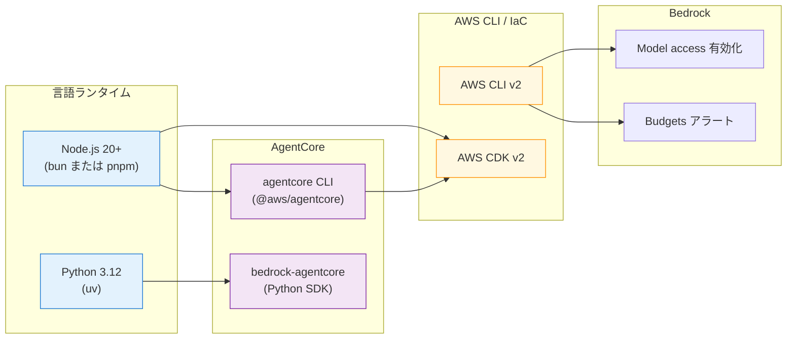

第 2 章では、Ch 3 以降の章を手元で再現するための足回りを整えます。AWS CLI / Python / Node.js / AWS CDK / AgentCore CLI のインストールと、Bedrock model access の有効化、コスト境界（Budgets）の設定までを一通り扱います。手順自体は淡々としていますが、本書の Sprint 0 で実機検証して見つけたつまずきポイントも一緒に書いておくので、ハンズオンに入る前に一度通読しておくと安心です。

## この章のゴール

- Mac / Linux / Windows WSL2 のいずれでも、本書のハンズオンが再現できる開発環境を整える
- Bedrock の Nemotron 系モデル（Nano 3 30B / Nano 9B v2）と Titan Embed v2 への access を東京リージョンで有効化する
- AWS Cost Budgets で月額 100 USD のアラートを仕込み、想定外のコスト跳ね上がりを早期に検知できる状態にする
- `aws sts get-caller-identity` / `agentcore --version` / `cdk --version` まですべて動く環境ヘルスチェックを通過する

## 前章からの引き継ぎ

前章では、AgentCore + LangGraph を選んだ 4 つの根拠を整理しました。本章ではその主軸を実際に動かすために必要なローカルツール群を入れていきます。前作 2 冊と違って、Colima や Docker Compose のような重量級スタックは登場しません。**ローカルでの依存はかなり軽量で、Python 仮想環境と AWS CLI が動けばほぼ十分**です。

## ローカル開発環境の前提

本書では次の OS を動作確認しています。

| OS                             | 動作確認                           |
| ------------------------------ | ---------------------------------- |
| macOS（Apple Silicon / Intel） | ✅ Sprint 0 〜 Sprint 7 まで主環境 |
| Linux x86_64（Ubuntu 22.04+）  | ✅ サンプル CDK のデプロイで確認   |
| Windows                        | WSL2（Ubuntu 22.04）で動作する想定 |

GPU・大容量メモリは要りません。ディスク空きは Python 仮想環境 + Node.js 依存で約 2 GB あれば余裕です。

## ツールチェーンの全体像

本書で使うツール群を最初に俯瞰します。



`agentcore` CLI が CDK を内部で呼び出してインフラをデプロイし、Python 側の `bedrock-agentcore` SDK が Runtime のエントリーポイントとして動く、という関係になります。

## Python 3.12 + uv のインストール

Python は 3.12 系を使います。`bedrock-agentcore` 1.6 系と LangGraph 1.0 系が要求するバージョンに合わせています。パッケージマネージャは `pip` ではなく **uv**（高速な Rust 製パッケージマネージャ）を採用します。

### macOS / Linux

```bash
curl -LsSf https://astral.sh/uv/install.sh | sh
```

インストール後、`uv --version` で 0.5+ 系が出れば OK です。Python 自体も `uv python install 3.12` で uv 経由で揃えます。

```bash
uv python install 3.12
uv python list  # 3.12.x が一覧に出ることを確認
```

### Windows（WSL2）

WSL2 の Ubuntu に上の `curl` インストーラをそのまま流せば動きます。Windows ネイティブの PowerShell でも `uv` は提供されていますが、本書の動作確認は WSL2 ベースで行いました。

## Node.js 20+ + bun のインストール

AgentCore CLI（`@aws/agentcore`）と AWS CDK CLI（`aws-cdk`）は Node.js 製です。本書では Node.js 20+ と **bun**（高速な JS ランタイム + パッケージマネージャ）の組み合わせを推奨します。

```bash
# Node.js は mise / nvm / 公式インストーラのいずれかで
mise install node@22
mise use --global node@22

# bun（unix）
curl -fsSL https://bun.sh/install | bash
```

:::message
**`npm` ではなく `bun` を使う理由**: 本書のサンプルリポやプロジェクトレベルの `package.json` は意図的に `npm` をスコープから外しています。`bun add -g <pkg>` でグローバルインストールしておくと、後続の章で AgentCore CLI / CDK CLI / Zenn CLI / textlint など複数のツールが滑らかに繋がります。
:::

`pnpm` を普段使っているみなさんは、`pnpm add -g <pkg>` で同じ手順が通ります。

## AWS CLI v2 のインストールと認証

AWS CLI v2 を入れます。本書では 2.32 系で動作確認しました。

```bash
# macOS（公式インストーラ）
curl "https://awscli.amazonaws.com/AWSCLIV2.pkg" -o AWSCLIV2.pkg
sudo installer -pkg AWSCLIV2.pkg -target /

# Linux x86_64
curl "https://awscli.amazonaws.com/awscli-exe-linux-x86_64.zip" -o awscliv2.zip
unzip awscliv2.zip
sudo ./aws/install

# 動作確認
aws --version
```

### 認証のセットアップ

認証方式は組織のポリシーに合わせて選んでください。本書で動作確認したのは IAM Identity Center（旧 SSO）、aws-vault、直接 IAM ユーザーの access key の 3 通りです。IAM Identity Center は個人と組織のどちらでも認証セッションを定期的に取り直す運用、aws-vault は短期 credentials を `~/.aws/credentials` に書き出す運用、直接 IAM ユーザーの access key は開発環境限定で長期 credentials を固定する運用と、用途に合わせて使い分けます。

どの方式でも、最低限以下のコマンドが通れば本書は進められます。

```bash
aws sts get-caller-identity
# → {"UserId": "...", "Account": "...", "Arn": "..."}
```

:::message
**Sprint 0 で踏んだハマり**: AWS のセッション期限が切れていると `Your session has expired. Please reauthenticate using 'aws login'.` というメッセージが出ます。AgentCore Runtime のローカル開発サーバ（次章で扱う `agentcore dev`）でも同じ理由で invoke が失敗します。本書のハンズオン中に invoke エラーが出たら、まず `aws sts get-caller-identity` で credentials の生死を確認するクセをつけておくと、原因の切り分けが早くなります。
:::

### 想定リージョン

本書は **`ap-northeast-1`（東京）を主軸**にします。理由は次章で詳しく扱う Bedrock ネイティブ Nemotron が東京で In-Region 提供されているためです。`~/.aws/config` の `[default]` プロファイル、または利用するプロファイルに次を入れておきましょう。

```ini
[default]
region = ap-northeast-1
output = json
```

東京以外を主軸にする場合の考慮は付録 C にまとめてあります。

## AWS CDK v2 のインストール

CDK CLI は本書のサンプルリポをデプロイするのに使います。

```bash
bun add -g aws-cdk
cdk --version
# → 2.1119.0 以上が出れば OK
```

CDK の初回ブートストラップは、サンプルリポを clone した後にまとめて実行するので、ここではバイナリのインストールだけでいったん止めておきます。

## AgentCore CLI のインストール

AgentCore CLI は `@aws/agentcore` という npm パッケージで提供されています。

```bash
bun add -g @aws/agentcore
agentcore --version
# → 0.11.0 以上が出れば OK
```

最初に `agentcore` を叩いたとき、analytics 収集のオプトイン案内が表示されます。匿名集計に同意しない場合は次のコマンドで明示的に無効化できます。

```bash
agentcore telemetry disable
```

## サンプルリポのクローンと uv sync

本書のサンプルコードはモノレポ構成で配布しています。

```bash
git clone https://github.com/himorishige/aws-bedrock-agentcore-nemotron-handson.git
cd aws-bedrock-agentcore-nemotron-handson

# Python 仮想環境作成 + 依存インストール
uv sync

# uv 仮想環境のアクティベート（任意、`uv run` 経由でも実行可能）
source .venv/bin/activate
```

`uv sync` の初回実行で `boto3` / `langgraph` / `langchain-aws` などのコア依存が入ります。CDK / AgentCore 関連を使う章では追加 extras を入れる手順を都度紹介します（例： `uv sync --extra agentcore --extra cdk`）。

### サンプルリポのディレクトリ構成

```
aws-bedrock-agentcore-nemotron-handson/
├── cdk/             # AWS CDK v2 Python (IaC)
│   └── stacks/
│       ├── bedrock_kb_stack.py
│       ├── agentcore_stack.py
│       ├── guardrails_stack.py
│       ├── lambda_tools_stack.py
│       └── monitoring_stack.py
├── agents/          # AgentCore Runtime にデプロイする LangGraph アプリ
│   ├── qaSupervisor/  # Nemotron Nano 3 30B Supervisor
│   └── qaWorker/      # Nemotron Nano 9B v2 Worker
├── lambdas/         # MCP 化対象の Lambda
├── data/            # 社内 Q&A サンプルコーパス（Sprint 1 で投入）
├── scripts/         # cost_estimator.py など
└── docs/            # 章ごとの補足
```

各章で触るディレクトリは章冒頭に明示します。

## Bedrock model access の有効化

Bedrock 経由で Nemotron や Titan Embed を叩くには、AWS アカウント単位で **model access** を有効化する必要があります。本書では次の 4 モデルを使います。

| モデル ID                      | 用途                                |
| ------------------------------ | ----------------------------------- |
| `nvidia.nemotron-nano-3-30b`   | Workflow LLM（Supervisor）          |
| `nvidia.nemotron-nano-9b-v2`   | Worker / LLM-as-Judge               |
| `amazon.titan-embed-text-v2:0` | Embedding（Knowledge Bases 用）     |
| `nvidia.nemotron-super-3-120b` | 比較用（オプション、Ch 3 のコラム） |

### 有効化手順

[Bedrock Model access コンソール（東京）](https://ap-northeast-1.console.aws.amazon.com/bedrock/home?region=ap-northeast-1#/modelaccess)を開き、上記 4 モデルにチェックを入れて申請します。私の環境では即時承認でしたが、組織アカウントによっては数分の待ちが入る場合があります。

### CLI から状態確認

申請後、CLI からアクセス可否を確認できます。

```bash
aws bedrock get-foundation-model-availability \
    --model-id nvidia.nemotron-nano-3-30b \
    --region ap-northeast-1 \
    --query '{access:agreementAvailability.status,authStatus:authorizationStatus,region:regionAvailability}'
```

期待値は次の通りです。

```json
{
  "access": "AVAILABLE",
  "authStatus": "AUTHORIZED",
  "region": "AVAILABLE"
}
```

3 項目すべてが `AVAILABLE` / `AUTHORIZED` になっていれば、Ch 3 で `Converse` API を叩けます。

:::message alert
**Sprint 0 で見つけた制約**: `cohere.embed-multilingual-v3` は東京リージョンで `agreementAvailability: NOT_AVAILABLE` でした（2026-04 時点）。Cohere の多言語 Embed を試したいみなさんは、付録 C の us-east-1 構成を参照してください。本書本編では Titan Embed v2 を主軸にします。
:::

## Cost Budgets でコストアラートを仕込む

AgentCore Runtime や Bedrock Knowledge Bases は、軽い実装でも知らないうちに OCU が立ち上がっていて月額数百 USD が溶ける、という事故が起きやすいです。本書では最初の段階で **AWS Cost Budgets で月額 100 USD のアラート**を入れておくことを強く推奨します。

```bash
aws budgets create-budget \
    --account-id $(aws sts get-caller-identity --query Account --output text) \
    --budget '{
        "BudgetName": "agentcore-handson-monthly",
        "BudgetLimit": {"Amount": "100", "Unit": "USD"},
        "TimeUnit": "MONTHLY",
        "BudgetType": "COST"
    }' \
    --notifications-with-subscribers '[{
        "Notification": {
            "NotificationType": "ACTUAL",
            "ComparisonOperator": "GREATER_THAN",
            "Threshold": 80
        },
        "Subscribers": [{
            "SubscriptionType": "EMAIL",
            "Address": "you@example.com"
        }]
    }]' \
    --region us-east-1
```

`Address` は自分のメールに置き換えてください。Cost Budgets 自体は東京リージョンを跨いでアカウント単位で集計するので、API リクエスト先は `us-east-1` 固定です。

80% 到達（80 USD）でメール通知が飛ぶので、Knowledge Bases の OCU が予期せず立ち上がっていたとしても、月額が膨らむ前に気づけます。Sprint 0 のコスト試算では Knowledge Bases なしの開発環境で月 $10 程度に収まる見込みなので、80 USD 警告まで到達したら何か想定外が起きていると判断して問題ありません。

## 環境ヘルスチェック

最後に、ここまでで入れたツールが揃っているかを 1 つのコマンド列で確認します。

```bash
echo "=== Python ==="
uv --version
uv python list | grep 3.12

echo "=== Node.js ==="
node --version
bun --version

echo "=== AWS ==="
aws --version
aws sts get-caller-identity

echo "=== CDK / AgentCore ==="
cdk --version
agentcore --version

echo "=== Bedrock model access ==="
for m in nvidia.nemotron-nano-3-30b nvidia.nemotron-nano-9b-v2 amazon.titan-embed-text-v2:0; do
  echo "--- $m ---"
  aws bedrock get-foundation-model-availability \
    --model-id $m --region ap-northeast-1 \
    --query '{model:modelId,access:agreementAvailability.status}'
done
```

すべての出力で正常な数値・JSON が返ってくれば、Ch 3 以降の手順がすべて手元で再現できる状態になっています。

| チェック項目                     | 期待値                  |
| -------------------------------- | ----------------------- |
| `uv --version`                   | 0.5+                    |
| `bun --version`                  | 1.3+                    |
| `aws --version`                  | aws-cli/2.32+           |
| `cdk --version`                  | 2.1119+                 |
| `agentcore --version`            | 0.11+                   |
| `aws sts get-caller-identity`    | 自分の AccountId が返る |
| Bedrock model access（4 モデル） | `AVAILABLE`             |

## 想定されるトラブルと対処

ここまでの手順で、Sprint 0 / Sprint 1 中に実際に踏んだトラブルとその対処を共有します。

### `aws sts get-caller-identity` が「session expired」を返す

組織アカウントで IAM Identity Center や aws-vault を使っている場合、ローカルの credentials が期限切れになっています。`aws sso login` または `aws-vault exec <profile>` などで再認証してください。本書のサンプルリポにはこの再認証手順を `.envrc.example` に書いてあります。

### `agentcore create` でディレクトリ衝突

`agentcore create --name <name>` のプロジェクト名は **alphanumeric で先頭が文字**である必要があります。`qa-supervisor` のようにハイフンを含めると拒否されます。本書では `qaSupervisor` のキャメルケースで揃えています。

### Bedrock model access が即時承認されない

私の環境では即時承認でしたが、組織アカウントの管理ポリシーによっては承認に数分から数時間かかります。本章の最後でヘルスチェックが通らない場合、まず `aws bedrock get-foundation-model-availability` で `agreementAvailability` を確認し、`PENDING` などになっていれば管理者に依頼してください。

### Node.js / bun のバージョンミスマッチ

`@aws/agentcore` は Node.js 20+ を要求します。`mise` や `nvm` で古い Node.js が混ざっていると、`agentcore` 起動時に黙ってエラーが出る場合があります。`node --version` で 20+ が出ていることを必ず確認してください。

## 章末まとめ

本章で整えた環境を一覧で振り返ります。

- Python 3.12（uv）/ Node.js 20+（bun）/ AWS CLI v2 / CDK v2 / AgentCore CLI 0.11+
- Bedrock model access（Nemotron Nano 3 30B / Nemotron Nano 9B v2 / Titan Embed v2 / Nemotron Super 120B）が東京で AVAILABLE
- AWS Cost Budgets で月額 100 USD アラート
- サンプルリポを clone し `uv sync` で Python 依存をインストール
- ヘルスチェックスクリプトで全ツールの動作を確認

ここまで揃えば、Ch 3 以降のハンズオンは詰まることなく進められる状態です。

## 次章では

次章では、いよいよ Bedrock ネイティブ Nemotron を `Converse` API で叩きます。Nano 3 30B / Nano 9B v2 / Super 120B / Nano 12B v2 VL の 4 モデルの特性、東京リージョンの実機レイテンシ、`InvokeModel` と `Converse` の使い分け、そして Sprint 0 で見つけた **Super 120B が東京で connection drop してしまう問題**まで、実機ログ付きで扱います。
