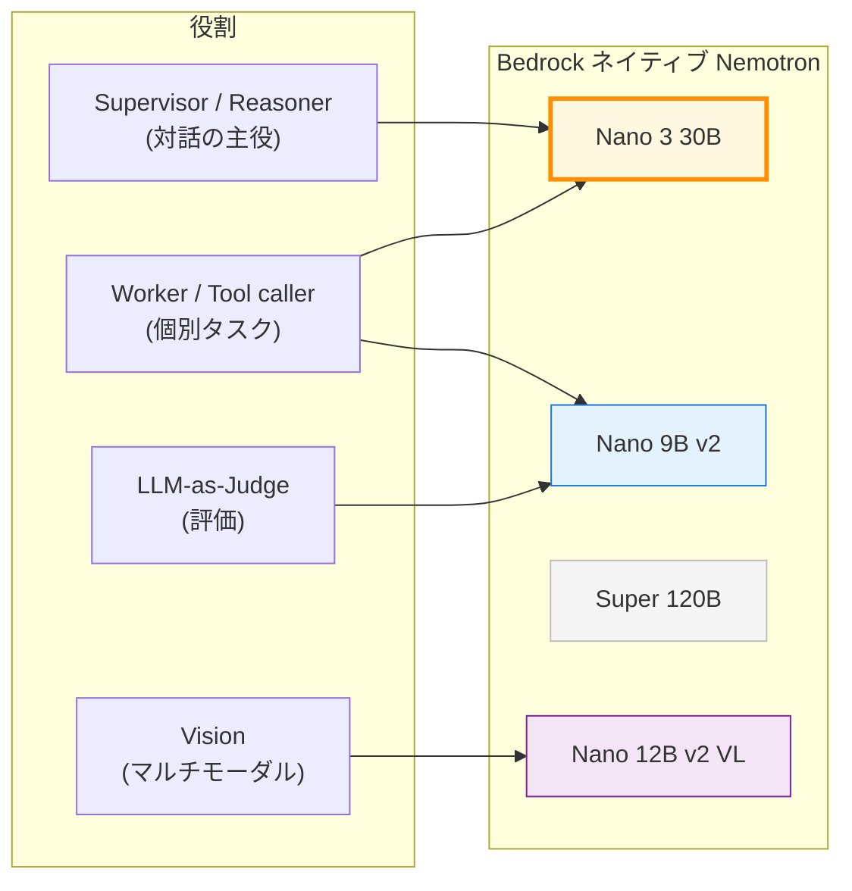

第 3 章では、本書の主役である **Bedrock ネイティブ Nemotron** を実際に叩きます。AWS マネジメントコンソールの「Bedrock Model cards」ページに載っている Nano 9B v2 / Super 120B / Nano 12B v2 VL の 3 モデルに加え、Sprint 0 で偶然見つけた **未掲載モデル Nemotron Nano 3 30B** も含めて、4 モデルの特性とレイテンシを実機で確認します。本書のハンズオンで最初に手を動かす章です。

## この章のゴール

- Bedrock ネイティブ Nemotron 4 モデルの特性とモデル ID を整理する
- `InvokeModel` と `Converse` の使い分けを把握する
- Python boto3 / `langchain-aws` の `ChatBedrockConverse` から Nemotron を叩けるようになる
- Sprint 0 の実機計測値（Nano 3 30B 835ms、Super 120B 40 分 connection drop）の意味を理解する
- 主軸モデルとして **Nemotron Nano 3 30B** を選ぶ理由を、ベンチ結果ベースで腹落ちさせる

## 前章からの引き継ぎ

前章で Bedrock model access を 4 モデル分有効化しました。手元の `aws bedrock get-foundation-model-availability` がすべて `AVAILABLE` を返している状態を前提に、本章を進めます。本章はインフラ構築を伴わないので、ローカルで Python が動けば追加コストはほぼゼロ（Bedrock の従量課金分のみ）で全コードを再現できます。

## Bedrock ネイティブ Nemotron 4 モデルの俯瞰

`aws bedrock list-foundation-models --by-provider NVIDIA --region ap-northeast-1` を東京で叩くと、2026-04 時点では次の 4 モデルが ACTIVE / ON_DEMAND で返ってきます。

| モデル ID                             | モデル名                            | Context | Max output | リリース | 特徴                                               |
| ------------------------------------- | ----------------------------------- | ------- | ---------- | -------- | -------------------------------------------------- |
| `nvidia.nemotron-nano-9b-v2`          | NVIDIA Nemotron Nano 9B v2          | 128K    | 8K         | 2025-08  | 軽量、structured outputs 対応、reasoning モード    |
| **`nvidia.nemotron-nano-3-30b`**      | **Nemotron Nano 3 30B**             | 128K    | 8K         | 2026-03  | **公式モデルカード未掲載**、東京で爆速、本書の主軸 |
| `nvidia.nemotron-super-3-120b`        | NVIDIA Nemotron 3 Super 120B A12B   | 256K    | 32K        | 2026-03  | hybrid MoE 12B activate、agentic 用途想定          |
| `nvidia.nemotron-nano-12b-v2-vl-bf16` | NVIDIA Nemotron Nano 12B v2 VL BF16 | —       | —          | —        | マルチモーダル（Text + Image 入力）                |

3 番目の Nano 3 30B は AWS Bedrock のモデルカードページには載っていないものの、API レベルでは `ACTIVE / ON_DEMAND / AUTHORIZED / AVAILABLE` の 4 拍子が揃った状態で利用可能です。本書はこのモデルを主軸に据えますが、その判断根拠は本章の後半で実測ベースで示します。

### モデル選定の暫定マップ

役割別の使い分けを先に提示しておきます。



オレンジが本書の主軸（Nano 3 30B）、青が Worker / Judge（Nano 9B v2）、灰色は実機検証で東京で実用に耐えなかった Super 120B、紫が付録で軽く触れるマルチモーダル Nano 12B v2 VL です。

## モデル別の詳細

### Nemotron Nano 3 30B（本書の主軸）

`nvidia.nemotron-nano-3-30b` は 30B 規模で、Nano 9B と Super 120B の中間サイズに位置します。AWS の Bedrock Model cards ページには記載がない一方、`list-foundation-models` の結果には ACTIVE で含まれており、東京リージョンの In-Region で問題なく動きます。

Sprint 0 で計測した実機レイテンシは次の通りです。

| プロンプト                                | latency    | 出力 tokens | 出力品質           |
| ----------------------------------------- | ---------- | ----------- | ------------------ |
| 「DGX Spark について 3 行で日本語で説明」 | **835 ms** | 152         | 簡潔・自然な日本語 |
| 「Hi」+ `maxTokens=32`                    | **368 ms** | 13          | 即答               |

30B 規模で 1 秒未満の応答は、Sonnet 4.5（クラウド推論で 1 〜 2 秒程度）と比較しても十分な速さです。Standard tier の単価は入力 $0.07 / 1M tokens、出力推定 $0.35 / 1M tokens で、Sonnet の 1/40 〜 1/100 という安さも Sprint 0 で確認できました（詳細は次章 Ch 4）。

### Nemotron Nano 9B v2

`nvidia.nemotron-nano-9b-v2` は 9B 規模の軽量モデルで、structured outputs に対応します。LLM-as-Judge のように JSON で構造化スコアを返してほしい用途で輝きます。

Sprint 0 の実測では、`<think>` タグで囲まれた reasoning モードの出力が混じることが目立ちました。

```text
<think>
Okay, the user just said "Hi". That's a greeting. I should respond politely.
</think>

Hello! How can I help you today?
```

ReAct エージェントの中でツール呼び出しを精度高くしたい場合は、reasoning モードがプロンプト破綻の原因にもなり得るので、本書の Ch 13（評価）と Ch 14（マルチエージェント）でこのモデルを Worker / Judge として組み込むときに `<think>` の前処理パターンを別途扱います。

### Nemotron 3 Super 120B（東京で実用不可）

`nvidia.nemotron-super-3-120b` は 120B-A12B（hybrid MoE で 12B activate）の重量級モデルで、256K context が魅力的です。AWS のモデルカードでも「agentic タスク向け」と書かれており、本書の当初プランでは Supervisor として主軸に据える予定でした。

ところが Sprint 0 で東京リージョンでの実機呼び出しを試したところ、次のように 2 回連続で失敗しました。

| プロンプト                                       | 結果                                          |
| ------------------------------------------------ | --------------------------------------------- |
| 「DGX Spark について 3 行で日本語で説明」        | **3 分 Read Timeout**（AWS CLI のデフォルト） |
| 「Hi」+ `maxTokens=32`、`--cli-read-timeout 300` | **40 分 57 秒で Connection drop**             |

軽量プロンプト（"Hi" + 32 tokens）でも 40 分以上応答せずに connection が切れる現象が再現したことから、東京リージョンでは現時点で実用不可と判定し、本書では主軸から外しました。同じ呼び出しを Nano 3 30B / Nano 9B v2 で投げると 1 秒未満で返ってくるので、モデル個別の不安定性と推測しています。`us-east-1` への切替で安定する可能性は付録 B（東京以外で動かす考慮）で補足します。

:::message
**章を跨ぐ示唆**:「公式が agentic タスク向けと推している重いモデルが、特定リージョンで動かない」という現実は、本書が Nano 3 30B のような中間サイズ（30B 規模）を主軸にする根拠にもなっています。Production の現場では、最大モデルではなく**目的に対して十分な性能をもつ最小サイズ**を選ぶほうが、安定性とコストの両面で有利になりがちです。
:::

### Nemotron Nano 12B v2 VL

`nvidia.nemotron-nano-12b-v2-vl-bf16` は Text + Image 入力に対応するマルチモーダルモデルです。本書の社内 Q&A 題材は基本的にテキスト主体なので、VL は付録で軽く触れる程度に留めます。スクリーンショットからの情報抽出や、表組み画像の構造化など、別ドメインの題材であらためて取り上げる価値のあるモデルです。

## `InvokeModel` と `Converse` の使い分け

Bedrock の API には大きく分けて 2 系統あります。

| API            | 主な用途                        | リクエスト形式                     |
| -------------- | ------------------------------- | ---------------------------------- |
| `InvokeModel`  | プロバイダ別のネイティブ schema | モデルごとに JSON 形式が違う       |
| **`Converse`** | プロバイダ非依存の統一 schema   | `messages: [{role, content}]` 形式 |

歴史的には `InvokeModel` が先で、各プロバイダごとに JSON schema が違うので、モデルを差し替えるとリクエスト構造の書き直しが発生していました。`Converse` は 2024 年に追加された統一 API で、`messages: [{"role": "user", "content": [{"text": "..."}]}]` という OpenAI 互換に近いスキーマで、Anthropic / Amazon / Meta / NVIDIA / Cohere いずれも同じ呼び方で書けます。

本書では特に理由がない限り `Converse` を使います。LangChain の `langchain-aws` パッケージも `ChatBedrockConverse` クラスが推奨実装になっており、後述の LangGraph 連携でも `Converse` ベースで統一できます。

## 最初のチャット呼び出し（boto3）

最小実装で Nano 3 30B を叩きます。`boto3` だけで完結します。

```python:scripts/converse_hello.py
import boto3
import time

client = boto3.client("bedrock-runtime", region_name="ap-northeast-1")

start = time.time()
response = client.converse(
    modelId="nvidia.nemotron-nano-3-30b",
    messages=[
        {
            "role": "user",
            "content": [
                {"text": "NVIDIA DGX Spark の特徴を 3 行で日本語で説明してください。"}
            ],
        }
    ],
    inferenceConfig={"maxTokens": 512, "temperature": 0.7},
)
elapsed = time.time() - start

print(f"latency: {elapsed:.2f} s")
print(response["output"]["message"]["content"][0]["text"])
print(f"tokens: in={response['usage']['inputTokens']} / out={response['usage']['outputTokens']}")
```

実行例（Sprint 0 の実機ログ）:

```bash
$ uv run python scripts/converse_hello.py
latency: 0.83 s
NVIDIA DGX Spark は、高性能 GPU を複数搭載し、AI モデルの学習・推論を高速化するデスクトップ型スーパーコンピュータです。
コンパクトなデザインながら、DGX A100 の性能を約 1/3 程度に凝縮し、研究開発や個人開発者にも手軽に高度な AI 処理を提供します。
NVIDIA AI Enterprise ソフトウェアスタックと完全互換性を持ち、クラウドやデータセンターとのシームレスな連携も可能です。
tokens: in=39 / out=152
```

`InferenceConfig` で `maxTokens` と `temperature` を指定するパターンは、すべての Bedrock ネイティブモデルで共通です。

:::message
**事実精度の注意**: Nano 3 30B が返す「DGX A100 の 1/3 性能」という記述は、厳密に正確とは言い難いです（実際の DGX Spark は GB10 ベースの単機 128 GB UMA で、DGX A100 とは別ライン）。LLM 単体での回答は事実精度に揺れがあり、社内ドキュメント Q&A としては Knowledge Bases で正確な情報を参照させる必要があります。Ch 11 でその設計に進みます。
:::

## LangChain 連携（`ChatBedrockConverse`）

LangGraph と組み合わせる前提なので、`langchain-aws` 経由の呼び出しも先に押さえておきます。

```python:agents/qaSupervisor/app/qaSupervisor/model/load.py
import os

from langchain_aws import ChatBedrockConverse

# 主軸モデル: Nemotron Nano 3 30B（東京 In-Region）
MODEL_ID = os.environ.get("BEDROCK_MODEL_ID", "nvidia.nemotron-nano-3-30b")
AWS_REGION = os.environ.get("AWS_REGION", "ap-northeast-1")


def load_model() -> ChatBedrockConverse:
    """Bedrock Converse API クライアントを返す。"""
    return ChatBedrockConverse(
        model_id=MODEL_ID,
        region_name=AWS_REGION,
        max_tokens=1024,
        temperature=0.7,
    )
```

このファイルは Ch 5 で AgentCore Runtime にデプロイする LangGraph アプリで `from model.load import load_model` する形でそのまま使われます。本書のサンプルリポでも `agents/qaSupervisor/app/qaSupervisor/model/load.py` に同じコードが入っているので、`uv sync` 済みの環境なら即動きます。

```python:scripts/langchain_hello.py
from langchain_core.messages import HumanMessage

from agents.qaSupervisor.app.qaSupervisor.model.load import load_model

llm = load_model()
response = llm.invoke([HumanMessage(content="NVIDIA DGX Spark の特徴を 3 行で。")])

print(response.content)
print(response.usage_metadata)
```

`response.usage_metadata` からトークン使用量が取得でき、後の Ch 4 のコスト試算でそのまま活用できます。

## 4 モデルのレイテンシ比較

Sprint 0 で取った実測データを並べて、モデル選定の感覚を掴んでもらいます。

| プロンプト       | Nano 3 30B |      Nano 9B v2       |      Super 120B       |
| ---------------- | :--------: | :-------------------: | :-------------------: |
| 日本語 3 行説明  | **835 ms** | 3,623 ms（reasoning） |     3 分 Timeout      |
| "Hi" + 32 tokens | **368 ms** |        461 ms         | 40 分 Connection drop |

注意点が 2 つあります。

1. **Nano 9B v2 の `<think>` reasoning モード**で出力が冗長化する場面があります。テンプレートで「3 行で」と指示しても、`<think>` の中で延々と reasoning して結局時間がかかる傾向です
2. **Super 120B は東京で実用不可**。同じプロンプトを `us-east-1` に向けたらどうなるかは付録 B で補足しますが、本書では東京固定の前提で章構成を組んでいます

## Sprint 0 で見つけた「Nano 3 30B が公式モデルカードに載っていない」話

ここまで何度か触れてきましたが、Bedrock の Nano 3 30B について整理しておきます。

### 公式モデルカードページの状況

[AWS Bedrock の NVIDIA モデル一覧ページ](https://docs.aws.amazon.com/bedrock/latest/userguide/model-cards-nvidia.html)を 2026-04 時点で見ると、掲載されているのは Nano 9B v2 / Super 120B / Nano 12B v2 VL の 3 モデルだけです。Nano 3 30B のページは存在しません。

### `list-foundation-models` の結果

一方、CLI で東京リージョンの NVIDIA モデルを列挙すると、Nano 3 30B は ACTIVE で返ってきます。

```bash
aws bedrock list-foundation-models \
    --by-provider NVIDIA \
    --region ap-northeast-1 \
    --query 'modelSummaries[].[modelId,modelName,modelLifecycle.status]' \
    --output table
```

```
+---------------------------------------+
|         ListFoundationModels          |
+---------------------------------------+
|  nvidia.nemotron-nano-12b-v2          |
|  NVIDIA Nemotron Nano 12B v2 VL BF16  |
|  ACTIVE                               |
|  nvidia.nemotron-nano-3-30b           |
|  Nemotron Nano 3 30B                  |
|  ACTIVE                               |
|  nvidia.nemotron-super-3-120b         |
|  NVIDIA Nemotron 3 Super 120B A12B    |
|  ACTIVE                               |
|  nvidia.nemotron-nano-9b-v2           |
|  NVIDIA Nemotron Nano 9B v2           |
|  ACTIVE                               |
+---------------------------------------+
```

### Pricing にも掲載あり

`aws pricing get-products` で東京リージョンの Bedrock 製品を引くと、Nano 3 30B の単価情報も Standard / Flex / Batch / Priority の 4 tier 分すべて返ってきます。Pricing API レベルでは存在を認識されているということです。

```text
APN1-Nemotron-Nano-3-30B-input-tokens-flex: $0.00003 per 1K tokens
APN1-nvidia.nemotron-nano-3-30b-mantle-input-tokens-standard: $0.00007 per 1K tokens
```

### 何が起きているのか

これらを総合すると、Nano 3 30B は **API / Pricing としては正規のモデルとして提供されているが、ドキュメンテーションのモデルカード追加が間に合っていない**状態だと推測できます。本書の執筆時点では公式アナウンスを見つけられなかったので、AWS 側で扱いが変わる可能性は留意が必要です。

本書では「東京で爆速・低コストで動く中間サイズ」というスイートスポットを最大限活用する立場で、Nano 3 30B を主軸に据えます。仮に将来的に EOL や挙動変更があった場合は、`nvidia.nemotron-nano-9b-v2` の数を増やすか `Converse` API の互換性を活かして他のモデル ID に切り替える、という保険を Ch 14（マルチエージェント）と Ch 16（コスト最適化）で扱います。

## Streaming と Tool use（軽く触れる）

`Converse` には streaming 版（`converse-stream`）と tool use（`toolConfig`）があります。社内 Q&A エージェントのレスポンス体感を上げるには streaming が有効ですし、AgentCore Runtime からツールを呼ばせるには tool use が必須です。

両方とも本書の Ch 5 以降で AgentCore Runtime と組み合わせて扱うので、ここでは `Converse` の同期呼び出しが動くところまででいったん切り上げます。Streaming のサンプルコードはサンプルリポの `scripts/converse_stream.py` に置いてあります。

```python:scripts/converse_stream.py
import boto3

client = boto3.client("bedrock-runtime", region_name="ap-northeast-1")
stream = client.converse_stream(
    modelId="nvidia.nemotron-nano-3-30b",
    messages=[{"role": "user", "content": [{"text": "DGX Spark を 3 行で説明"}]}],
    inferenceConfig={"maxTokens": 512},
)

for event in stream["stream"]:
    if "contentBlockDelta" in event:
        print(event["contentBlockDelta"]["delta"].get("text", ""), end="", flush=True)
print()
```

Streaming で文字単位の表示が手元のターミナルに流れる動作確認は、ハンズオンの体感として気持ちが良いものです。

## 章末まとめ

本章では Bedrock ネイティブ Nemotron 4 モデルの特性とレイテンシ、そして本書の主軸を Nano 3 30B にする根拠を実機ベースで示しました。

- Bedrock の NVIDIA モデルは 4 種が東京で `ACTIVE / ON_DEMAND` で利用可能
- 公式モデルカードには 3 種しか載っていないが、4 種目の **Nemotron Nano 3 30B** が東京で爆速（1 秒未満）かつ低コスト
- Super 120B は東京で実用不可、付録 B（東京以外で動かす考慮）で代替策を扱う
- `Converse` API でプロバイダ非依存の統一 schema を使うと、後の LangGraph 連携が簡単
- `langchain-aws` の `ChatBedrockConverse` で LangChain / LangGraph に直結

## 次章では

次章では、本章で取った実機レイテンシ・トークン数を踏まえて、**Service Tiers と コスト戦略**を扱います。Standard / Priority / Flex / Batch の 4 tier の比較、月 1,000 conversation シナリオでの試算、Knowledge Bases の OpenSearch Serverless OCU が支配的になる現実、Cross-Region Inference の挙動と注意点までを実数値ベースで整理します。コスト感を掴んだうえで、Ch 5 から AgentCore Runtime に進む構成です。
