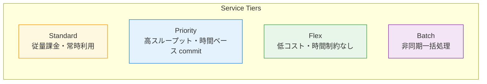
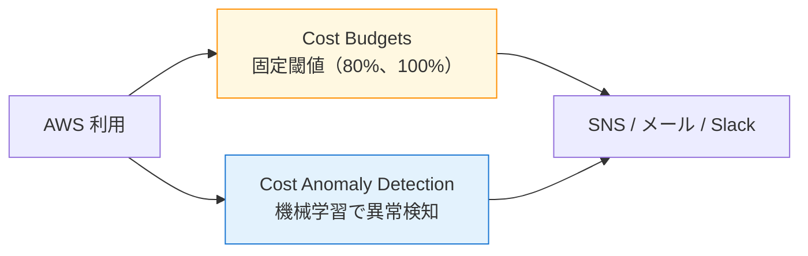

第 4 章では、Bedrock の **Service Tiers**（Standard / Priority / Flex / Batch）の挙動と、本書の社内 Q&A エージェントを月いくらで動かせるかの試算を、Sprint 0 で取った実数値ベースで整理します。コストの章は飛ばされがちですが、AgentCore Runtime や Knowledge Bases は気を抜くと月額が想定の 2 〜 3 倍になりやすいので、ハンズオンに入る前にコスト感を一度押さえておくことを強くおすすめします。

## この章のゴール

- Bedrock の 4 つの Service Tiers の特性と使い分けを把握する
- Nemotron Nano 3 30B の Standard / Flex / Batch / Priority 単価を理解する
- 月 1,000 conversation シナリオで dev / staging / prod それぞれの月額を試算できる
- **OpenSearch Serverless OCU が KB コストの 94% を支配する**現実を踏まえ、Ch 11 で停止運用 CDK パラメータが必要な理由を腹落ちさせる
- AWS Cost Budgets / Cost Anomaly Detection を組み合わせた早期検知の設計を理解する

## 前章からの引き継ぎ

前章で Bedrock ネイティブ Nemotron を実機で叩き、Nano 3 30B が東京で 835ms で日本語応答を返すことを確認しました。本章ではその実測値をもとに、月額のコスト試算に踏み込みます。コストの数値はすべて Sprint 0（2026-04 時点）の AWS Pricing API から取得したものです。

## Bedrock Service Tiers の全体像

Bedrock は同じモデル ID に対して、目的の異なる 4 つの service tier を提供しています。



各 tier の挙動は次の通りです。

| Tier     | 特徴                                 | 向いているシーン                  |
| -------- | ------------------------------------ | --------------------------------- |
| Standard | pay-per-token、コミットなし、常時    | 本番のリアルタイム対話            |
| Priority | 高スループット、時間ベース commit    | レスポンス速度が SLA に効くケース |
| Flex     | 低コスト、時間制約なしのワークロード | 非リアルタイム / 開発・検証       |
| Batch    | 非同期一括処理                       | 大量データの一括処理              |

Standard と Flex の単価差は東京リージョンの Nemotron Nano 3 30B で約 2.3 倍。Flex は「数分〜数十分待っても良い」用途で開発時のコストを 50 〜 60% ほど下げられます。

## Nemotron Nano 3 30B の単価（東京、2026-04 時点）

`aws pricing get-products --service-code AmazonBedrock --region ap-northeast-1` で実取得した単価を整理します。

| Tier         |  Input ($/1M tokens)  | Output ($/1M tokens、推定) |
| ------------ | :-------------------: | :------------------------: |
| **Standard** |       **$0.07**       |           ~$0.35           |
| Flex         |         $0.03         |           $0.15            |
| Batch        |         $0.03         |           $0.15            |
| Priority     | $0.000315/1K = $0.315 |          ~$1.365           |

参考までに Super 120B の単価も並べます。

| Tier     | Input ($/1M tokens) | Output ($/1M tokens) |
| -------- | :-----------------: | :------------------: |
| Standard |        $0.18        |   推定 $0.75-0.90    |
| Priority |       $0.315        |        $1.365        |
| Batch    |        $0.03        |        $0.39         |

Super 120B は Standard でも Nano 3 30B の **2.6 倍**の単価です。前章で見たとおり東京で実用的に動かないので、`us-east-1` での代替構成は付録 B（東京以外で動かす考慮）にまとめましたが、本書の主軸を Nano 3 30B にすることでコストでも有利という事実は押さえておきます。

### Claude Sonnet 4.5 との比較

Bedrock の主要モデルとの単価比較を見ると、Nemotron の安さがより立体的になります。

| モデル                       | Input ($/1M) | Output ($/1M) | Nano 3 30B との比 |
| ---------------------------- | :----------: | :-----------: | :---------------: |
| Nemotron Nano 3 30B Standard |    $0.07     |     $0.35     |        1x         |
| Anthropic Claude Sonnet 4.5  |    $3.00     |    $15.00     |    **約 43x**     |
| Anthropic Claude Opus 4.5    |    $15.00    |    $75.00     |      約 215x      |

社内 Q&A のような「精度十分・大量に捌きたい」用途では、Nano 3 30B が圧倒的にコスト面で有利です。Claude を使う場面は「複雑な reasoning が必要」「フロントエンド向けの最終回答品質を最大化したい」といった限定的な用途に絞り、本書では基本的に Nemotron で組みます。

## AgentCore のコスト構造

AgentCore は Runtime / Memory / Gateway / Identity / Built-in Tools / Observability / Evaluator / Policy Engine の 8 領域で個別課金されます。Sprint 0 で AWS Pricing API から取得した東京の単価は次の通りです。

| サービス                     |             単価              |
| ---------------------------- | :---------------------------: |
| Memory Short-Term            |     **$0.00025 / Event**      |
| Memory Long-Term Storage     | $0.00075 / MemoryStored-Month |
| Gateway API Invocations      |  **$0.000005 / Invocation**   |
| Gateway Search API           |    $0.000025 / Invocation     |
| Code Interpreter Memory      |      $0.00945 / GB-Hour       |
| Code Interpreter vCPU        |      $0.0895 / vCPU-Hour      |
| Browser Tool Memory          |      $0.00945 / GB-Hour       |
| **Evaluations Tier1 Output** | **$12.00 / 1M Output Token**  |

Memory Short-Term は 1 イベント（1 ターンの会話履歴記録など）あたり $0.00025 で、月 5,000 イベントでも $1.25 と非常に安価です。Gateway API Invocations はほぼ無視できるレベル（月 2,000 invocations で $0.01）です。

一方、**Evaluations の Tier1 Output が $12 / 1M tokens** で、Bedrock の Nano 3 30B 出力単価（$0.35 / 1M tokens）の **34 倍**もします。Ch 13（評価）の章で AgentCore Evaluator を使うときは、サンプルサイズと評価回数を Sprint 0 の発見ベースで設計する必要があります。

## OpenSearch Serverless OCU が KB コストの支配要因

ここまでで AgentCore と Bedrock 推論のコスト感は掴めました。次に、本書の最大のコスト要素である Bedrock Knowledge Bases の Vector Store について整理します。

### OpenSearch Serverless の OCU 課金

Bedrock Knowledge Bases で OpenSearch Serverless を vector store に選ぶと、**最低 2 OCU（Indexing 1 OCU + Search 1 OCU）が常時起動**します。OCU 単価は東京で約 $0.24 / OCU-hour なので、月額は次のようになります。

```text
$0.24 × 2 OCU × 24 h × 30 days = 約 $345 / 月
```

これは「リクエストの有無に関わらず固定で発生する」コストです。月 1 conversation でも 10,000 conversation でも、OCU の起動費は変わりません。

### Vector store 別の比較

OpenSearch Serverless 以外の選択肢も Sprint 0 で確認しました。各 vector store のコスト感を整理しておきます。

| Vector store              |      月額（最小構成）       | 用途                             |
| ------------------------- | :-------------------------: | -------------------------------- |
| **OpenSearch Serverless** |  **約 $345**（2 OCU 常時）  | 本書のデフォルト、本番想定       |
| Aurora pgvector           | Aurora 起動費（数十 USD〜） | すでに Aurora を使っているケース |
| S3 Vectors                |    数 USD（プレビュー）     | 検証段階、コスト最小化したい     |
| Neptune Analytics         |    高（時間課金 + 容量）    | Graph + Vector 両方必要          |

S3 Vectors は 2025 年プレビューでスタートした安価なオプションで、本書の Ch 11 でコラム的に取り上げます。

### dev 環境では KB を停止する設計

Sprint 0 のコスト試算が物語るとおり、Knowledge Bases を本番並みに常時起動すると、月額の **94%** が OpenSearch Serverless OCU で消えます。本書の Ch 11 では、CDK スタックに「KB を停止できるパラメータ」を実装し、dev 環境では明示的に停止できる構成にします。`cdk deploy --context kb-enabled=false` のように切り替える設計です。

## 月額試算シナリオ

ここまでの単価を組み合わせて、3 つのシナリオで試算します。Sprint 0 で実際に手を動かして検証した数値です。

### シナリオ前提

- 1 conversation = 入力 5,000 tokens + 出力 1,500 tokens
- 月 1,000 conversation
- ツール呼び出し 2 回 / conversation（Gateway API Invocations 換算）

### dev 環境（Flex tier、KB 停止）

| 項目                               |     月使用量      |            月額            |
| ---------------------------------- | :---------------: | :------------------------: |
| Bedrock Nano 3 30B Flex (in / out) | 5M / 1.5M tokens  | $0.15 + $0.225 = **$0.38** |
| AgentCore Runtime / Memory         |     軽量利用      |            < $2            |
| AgentCore Gateway                  | 2,000 invocations |           $0.01            |
| Bedrock Guardrails                 | 1,000 evaluations |            < $1            |
| Lambda / CloudWatch / S3           |       軽量        |            < $5            |
| OpenSearch Serverless              |     **停止**      |             $0             |
| **合計**                           |                   |      **約 $10 / 月**       |

### staging 環境（Standard tier、KB は開発時のみ起動）

| 項目                                   |      月使用量      |          月額          |
| -------------------------------------- | :----------------: | :--------------------: |
| Bedrock Nano 3 30B Standard (in / out) |  5M / 1.5M tokens  | $0.35 + $0.525 = $0.88 |
| AgentCore Memory Short-Term            |    5,000 events    |         $1.25          |
| AgentCore その他                       |        軽量        |          < $5          |
| Bedrock Guardrails / Lambda / S3       |        軽量        |         < $10          |
| OpenSearch Serverless                  | 平均 12 h/day 起動 |        約 $172         |
| **合計**                               |                    |    **約 $190 / 月**    |

### prod 環境（Standard tier、KB 常時起動、月 1,000 conv）

| 項目                                  |     月使用量      |       月額       |
| ------------------------------------- | :---------------: | :--------------: |
| Bedrock Nano 3 30B Standard           | 5M in / 1.5M out  |      $0.88       |
| Bedrock Nano 9B v2 Standard（Worker） | 1M in / 0.5M out  |      $0.25       |
| AgentCore Memory Short-Term           |   5,000 events    |      $1.25       |
| AgentCore Memory Long-Term            |    100 stored     |      $0.08       |
| AgentCore Gateway                     | 2,000 invocations |      $0.01       |
| Bedrock Guardrails                    | 1,000 evaluations |       < $5       |
| Lambda / CloudWatch / S3 / Cognito    |       軽量        |      < $10       |
| Bedrock KB Retrieve                   |  1,000 retrieve   |       < $5       |
| Titan Embed v2（ingest 時のみ）       |    数万 tokens    |       < $1       |
| **OpenSearch Serverless 2 OCU 常時**  |    1,440 OCU-h    |     **$345**     |
| **合計**                              |                   | **約 $367 / 月** |

prod の月額 $367 のうち、OpenSearch Serverless OCU が **94%** を占めます。Bedrock Nemotron 推論コストの安さが、この支配構造を浮き彫りにします。

## サンプルリポの `cost_estimator.py`

本書のサンプルリポには、これらの計算を再現する `scripts/cost_estimator.py` を同梱しました。

```bash
$ uv run python scripts/cost_estimator.py \
    --conversations-per-month 1000 \
    --avg-input-tokens 5000 \
    --avg-output-tokens 1500 \
    --workflow-model nvidia.nemotron-nano-3-30b \
    --judge-model nvidia.nemotron-nano-9b-v2 \
    --service-tier standard \
    --kb-ocu 2 \
    --output report.md
```

`--kb-ocu 0` を指定すれば KB なしの試算が出ます。dev / staging / prod の 3 シナリオを切り替えながら、自分のプロジェクトに当てはまる月額を即座に把握できる作りにしてあります。

## Cross-Region Inference の影響

Bedrock のモデルによっては、Cross-Region Inference profile を使って APAC 内の複数リージョンに推論をルーティングできます。本書で扱う Nemotron 4 種は In-Region 提供のみで、Geo / Global Cross-Region には未対応です。

一方、Bedrock Guardrails の **Standard tier は Cross-Region Inference 必須**です（Sprint 0 PoC 5 の発見）。`apac.guardrail.v1:0` profile を指定すると、東京から起動した Guardrail のリクエストが APAC 内の他リージョン（Mumbai / Seoul / Sydney など）にもルーティングされます。

```yaml
# CDK example (Ch 12 で扱う形)
crossRegionConfig:
  guardrailProfileIdentifier: apac.guardrail.v1:0
```

データ主権で東京固定が要件の場合、Cross-Region Inference の destination Region のいずれかで処理される可能性を念頭に置く必要があります。Ch 12 で Guardrails を本格的に組むときに、データ越境の論点として再度扱います。

## Cost Budgets と Cost Anomaly Detection

Ch 2 で Cost Budgets で月額 100 USD のアラートを仕込みました。本番運用では、それに加えて **Cost Anomaly Detection** を組み合わせるのが定番です。



Budgets が「**閾値ベースの確実な検知**」、Anomaly Detection が「**過去傾向と比べた異常スパイクの検知**」を担当します。OpenSearch Serverless の OCU が誤って 4 つに増えていた、Lambda が無限ループしていた、といった事故をどちらかで拾える二重化が現場では効いてきます。

設定 CDK スタックは Ch 16 で扱うので、ここでは概念だけ押さえてください。

## Sprint 0 で見えたコストの示唆

ここまでの数字をベースに、Sprint 0 の段階で得た示唆を 3 つ整理しておきます。

1. **Bedrock 推論コストはほぼ無視できる**: Nano 3 30B Standard で月 1,000 conv の推論が **$0.88**。Bedrock 単独でコストが膨らむことは、社内 Q&A 規模ではまずない
2. **OCU 固定費が支配的**: prod 月額の 94% が OpenSearch Serverless OCU。**KB を停止できる仕組み**が dev コストを 1/30 以下に下げる
3. **AgentCore Evaluations は小サンプル運用**: $12 / 1M output tokens は Bedrock 推論の 34 倍。評価データセットの運用設計（Ch 13）でサンプル数を絞る

## 章末まとめ

本章では Bedrock Service Tiers のコスト構造と、社内 Q&A エージェントの月額試算を整理しました。

- Bedrock Service Tiers は Standard / Priority / Flex / Batch の 4 種、開発は Flex、本番は Standard が定番
- Nemotron Nano 3 30B Standard 単価は入力 $0.07 / 1M、出力 $0.35 / 1M で、Claude Sonnet 4.5 の **約 43 分の 1**
- 月 1,000 conversation シナリオの月額試算： dev **$10** / staging **$190** / prod **$367**
- prod 月額の 94% は OpenSearch Serverless OCU。Ch 11 で停止 CDK パラメータを実装する
- AgentCore Evaluations の Tier1 Output は $12 / 1M で高価、サンプルサイズ設計が必須

## Sprint 1 完走

ここまでで Part 1（Ch 0-2）と Part 2（Ch 3-4）が一通り揃いました。**手元に Bedrock model access 有効化済みの環境があり、Nano 3 30B / Nano 9B v2 を Converse API で叩け、月額の見通しも立っている**状態です。Ch 5 から Part 3「AgentCore 6 サービスを順に積む」に入ります。

## 次章では

次章は、本書の核である **AgentCore Runtime に LangGraph をデプロイする**ハンズオンです。`agentcore create` で scaffold したプロジェクトに Nemotron Nano 3 30B を組み込み、ローカル `agentcore dev` で動作確認した後、`agentcore deploy` で AWS にデプロイします。CDK が裏で何を作っているのか、`bedrock-agentcore` Python SDK の `BedrockAgentCoreApp` がどんな HTTP プロトコルを期待しているのか、順を追って見ていきます。Sprint 0 のローカル動作確認（**1.55 秒で日本語応答**）を、本章では実際の AWS 上でも再現します。
