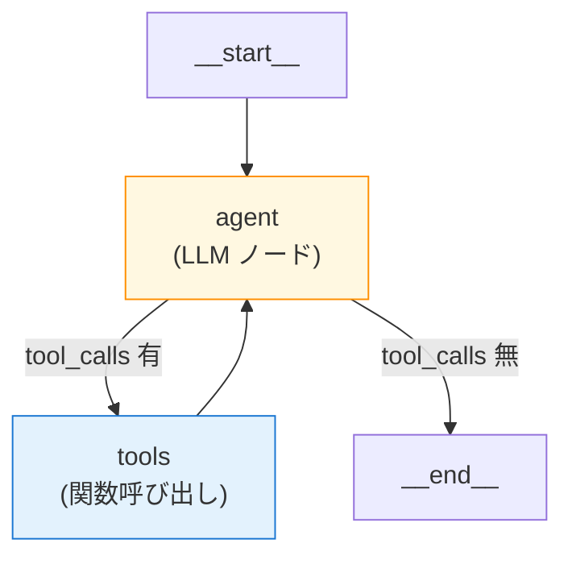

第 5 章は本書の核です。Bedrock AgentCore Runtime に LangGraph で組んだエージェントをデプロイし、社内ドキュメント Q&A の最小実装を AWS 上で稼働させます。`agentcore create` で scaffold した Python プロジェクトに Nemotron Nano 3 30B を組み込み、ローカル `agentcore dev` で動作確認した後、`agentcore deploy` で AWS Runtime に上げる、というのが本章の流れです。

## この章のゴール

- AgentCore Runtime の HTTP プロトコル契約と `BedrockAgentCoreApp` の役割を理解する
- `agentcore create` で生成される LangGraph + Bedrock のスケルトン構造を把握する
- `model/load.py` を Nemotron Nano 3 30B に切り替え、`main.py` を社内 Q&A 用に編集する
- ローカル `agentcore dev` でホットリロード開発できる
- `agentcore deploy` で CDK 経由の AWS デプロイを完走する
- boto3 の `InvokeAgentRuntime` で Runtime を直接叩く

## 前章からの引き継ぎ

前章までで、Bedrock 推論コストの感覚と Service Tiers の使い分けを押さえました。本章からは実コストが動き始めます。`agentcore deploy` 時には CloudFormation で IAM / ECR / Lambda / Runtime が作成され、Runtime 自体の起動費は発生しないものの、各サービスの最小固定費が累積していきます。Ch 2 で仕込んだ Cost Budgets の月額 100 USD アラートが効く局面なので、不要なリソースは章末で `agentcore remove all` + `agentcore deploy` で破棄する運用をおすすめします。

## AgentCore Runtime の概念

### Runtime は「エージェントを serverless でホストする実行環境」

AgentCore Runtime は、エージェントのコード（Python）と CDK で定義したインフラを、Bedrock 側で fully managed に動かしてくれる実行環境です。Lambda に近い感覚ですが、次のような違いがあります。

| 観点                        | Lambda          | AgentCore Runtime                                 |
| --------------------------- | --------------- | ------------------------------------------------- |
| タイムアウト上限            | 15 分           | 長時間対話に耐える設計                            |
| ホットリロード              | なし            | ローカル `agentcore dev` で対応                   |
| フレームワーク              | 任意（軽量）    | LangGraph / CrewAI / LlamaIndex / Strands Agents  |
| 観測                        | CloudWatch Logs | trace / metrics / logs（AgentCore Observability） |
| デプロイ                    | ZIP / Container | CodeZip / Container（CDK 経由）                   |
| Memory / Identity / Gateway | 自作            | built-in                                          |

要は「Lambda にエージェント特化機能を載せて、長時間対話と観測のレイヤーを built-in にしたもの」がイメージとして近いです。

### HTTP プロトコル契約

AgentCore Runtime には **HTTP プロトコル契約**（HTTP protocol contract）があり、Runtime 上の Python アプリは指定された 2 つのエンドポイントを実装する必要があります。

| エンドポイント | メソッド | 役割                       |
| -------------- | -------- | -------------------------- |
| `/invocations` | POST     | エージェントの本体呼び出し |
| `/ping`        | GET      | ヘルスチェック（必須）     |

幸いにも、`bedrock-agentcore` Python SDK の **`BedrockAgentCoreApp`** クラスがこの 2 つを自動で実装してくれます。アプリ開発者は `@app.entrypoint` デコレータで invoke 関数を 1 つ書くだけです。

```python
from bedrock_agentcore.runtime import BedrockAgentCoreApp

app = BedrockAgentCoreApp()

@app.entrypoint
async def invoke(payload, context):
    return {"result": "Hello"}

if __name__ == "__main__":
    app.run()
```

`payload` がリクエストボディの dict、`context` が Runtime のメタ情報（session ID / user ID / trace ID 等）です。返り値の dict はそのまま JSON にシリアライズされてクライアントに返ります。

## `agentcore create` で scaffold する

すでに Ch 2 で AgentCore CLI と AWS CDK のインストールは済んでいるので、ここからは scaffold → 編集 → ローカル → デプロイの 1 サイクルを通します。

### プロジェクト生成

サンプルリポの `agents/` ディレクトリに移動して、`qaSupervisor` プロジェクトを生成します。

```bash
cd agents
agentcore create \
    --name qaSupervisor \
    --framework LangChain_LangGraph \
    --protocol HTTP \
    --build CodeZip \
    --model-provider Bedrock \
    --memory none
```

flag の指定：

- `--name qaSupervisor`: alphanumeric で先頭が文字。ハイフンは不可（よく踏むハマりポイント）
- `--framework LangChain_LangGraph`: 本書の選定
- `--protocol HTTP`: 標準。`MCP` / `A2A` も選べるが本書では HTTP
- `--build CodeZip`: ZIP デプロイ。コンテナを使いたい場合は `Container`
- `--model-provider Bedrock`: 本書はすべて Bedrock 経由
- `--memory none`: PoC 段階。Memory は次章で追加

scaffold 完了後の構造です。

```text
qaSupervisor/
├── README.md
├── AGENTS.md
├── agentcore/
│   ├── agentcore.json     # Project / Runtime / Memory / Gateway 等の設定
│   ├── aws-targets.json   # account / region 設定
│   ├── .env.local         # ローカル環境変数（gitignored）
│   ├── cdk/               # CDK プロジェクト（TypeScript）
│   └── .cli/              # CLI 内部状態
└── app/qaSupervisor/      # Python アプリ
    ├── main.py
    ├── pyproject.toml
    ├── mcp_client/
    │   └── client.py
    └── model/
        └── load.py
```

`agentcore/cdk/` 配下が CDK の TypeScript プロジェクトです。CDK 自体は本書全体の Ch 15 でまとめて扱うので、ここでは「裏で CDK が動いている」程度に意識しておきます。

### 設定ファイル

`agentcore.json` は Project ファイルです。

```json:agentcore/agentcore.json
{
    "$schema": "https://schema.agentcore.aws.dev/v1/agentcore.json",
    "name": "qaSupervisor",
    "version": 1,
    "managedBy": "CDK",
    "runtimes": [
        {
            "name": "qaSupervisor",
            "build": "CodeZip",
            "entrypoint": "main.py",
            "codeLocation": "app/qaSupervisor/",
            "runtimeVersion": "PYTHON_3_14",
            "networkMode": "PUBLIC",
            "protocol": "HTTP"
        }
    ],
    "memories": [],
    "credentials": [],
    "evaluators": [],
    "agentCoreGateways": [],
    "policyEngines": []
}
```

`runtimes[]` 配下に Runtime 定義が入り、`memories[]` / `evaluators[]` / `agentCoreGateways[]` / `policyEngines[]` などが空配列で並んでいます。次章以降で `agentcore add memory` / `agentcore add target` 等のコマンドで、これらの配列に項目を増やしていきます。

## モデルを Nemotron Nano 3 30B に切り替える

scaffold のデフォルトでは `model/load.py` が Claude Sonnet 4.5（global inference profile）を使う設定になっています。これを Nemotron Nano 3 30B に書き換えます。

```python:agents/qaSupervisor/app/qaSupervisor/model/load.py
import os

from langchain_aws import ChatBedrockConverse

# 主軸モデル: Nemotron Nano 3 30B（東京 In-Region、実測 835ms）
MODEL_ID = os.environ.get("BEDROCK_MODEL_ID", "nvidia.nemotron-nano-3-30b")
AWS_REGION = os.environ.get("AWS_REGION", "ap-northeast-1")


def load_model() -> ChatBedrockConverse:
    """Bedrock Converse API クライアントを返す。"""
    return ChatBedrockConverse(
        model_id=MODEL_ID,
        region_name=AWS_REGION,
        max_tokens=1024,
        temperature=0.7,
    )
```

環境変数 `BEDROCK_MODEL_ID` で上書きできるようにしておくと、後の章で Nano 9B v2 / Super 120B との切り替えテストが簡単になります。

## `main.py` を編集する

scaffold 直後の `main.py` には MCP クライアント連携と `add_numbers` ツールのサンプルが入っています。本章の PoC では MCP を一度切り、Nano 3 30B + LangGraph の最小構成で動作確認に集中します。

```python:agents/qaSupervisor/app/qaSupervisor/main.py
from bedrock_agentcore.runtime import BedrockAgentCoreApp
from langchain_core.messages import HumanMessage
from langchain.tools import tool
from langgraph.prebuilt import create_react_agent
from opentelemetry.instrumentation.langchain import LangchainInstrumentor

from model.load import load_model

LangchainInstrumentor().instrument()

app = BedrockAgentCoreApp()
log = app.logger

_llm = None


def get_or_create_model():
    global _llm
    if _llm is None:
        _llm = load_model()
    return _llm


@tool
def add_numbers(a: int, b: int) -> int:
    """2 つの整数の和を返す。"""
    return a + b


tools = [add_numbers]

SYSTEM_PROMPT = """あなたは社内ドキュメント Q&A エージェントです。
ユーザーの質問に対して簡潔かつ正確に日本語で回答してください。必要に応じてツールを利用してください。
"""


@app.entrypoint
async def invoke(payload, context):
    log.info("Invoking Agent.....")

    graph = create_react_agent(
        get_or_create_model(),
        tools=tools,
        prompt=SYSTEM_PROMPT,
    )

    prompt = payload.get("prompt", "What can you help me with?")
    log.info(f"Agent input: {prompt}")

    result = await graph.ainvoke({"messages": [HumanMessage(content=prompt)]})

    output = result["messages"][-1].content
    log.info(f"Agent output: {output}")
    return {"result": output}


if __name__ == "__main__":
    app.run()
```

ポイントは 4 つです。

1. `BedrockAgentCoreApp` のインスタンスを 1 つ作り、`@app.entrypoint` を 1 つ書くだけで HTTP プロトコル契約を満たす
2. `LangchainInstrumentor().instrument()` で OpenTelemetry が裏で有効化される（Ch 10 で活きる）
3. LangGraph の `create_react_agent` で Supervisor を組み、ツールを後から差し替えられる構成にしておく
4. Nemotron Nano 3 30B には日本語の system prompt をそのまま投げて問題ない

### LangGraph state graph の見立て

`create_react_agent` は内部で次の state graph を組みます。



ReAct パターン（Reasoning + Acting）の最小実装です。本書の Ch 11 で Knowledge Bases を組み込むときも、この graph に `retrieve` ノードを追加する形で拡張します。

## ローカル開発（`agentcore dev`）

ここからローカルで動作確認します。`qaSupervisor` ディレクトリで次のコマンドを叩きます。

### 設定検証

```bash
agentcore validate
# → Valid
```

`agentcore.json` / `aws-targets.json` の整合性確認です。`Valid` が返れば次に進みます。

### 開発サーバの起動

```bash
agentcore dev --logs
```

このコマンドは Python venv を自動生成して依存をインストールした後、`http://127.0.0.1:8080` で Uvicorn サーバを起動します。`--logs` フラグで標準出力にログを流します（非対話モード）。

```text
Starting dev server...
Agent: qaSupervisor
Provider: (see agent code)
Server: http://localhost:8080/invocations
Log: agentcore/.cli/logs/dev/dev-20260426-210221.log
Press Ctrl+C to stop

→ INFO:     Will watch for changes in these directories:
→            ['/path/to/qaSupervisor/app/qaSupervisor']
→ INFO:     Uvicorn running on http://127.0.0.1:8080 (Press CTRL+C to quit)
→ INFO:     Application startup complete.
```

`Will watch for changes...` の通り、`app/qaSupervisor/` 配下のファイル変更を検知して自動リロードしてくれます。`main.py` の system prompt を変えながら手元で挙動を確認できる、地味にありがたい機能です。

### ローカル invoke

別ターミナルでもう 1 つ `qaSupervisor` ディレクトリを開き、prompt を渡して invoke します。

```bash
agentcore dev "DGX Spark について 2 行で日本語で説明してください。"
```

実機ログは次の通りです。

```text
DGX Spark は、NVIDIA が提供する GPU アクセラレート型 AI スーパーコンピュータプラットフォームで、大規模なデータ分析や機械学習のワークロードを高速に処理できます。また、複数のノードを連携させてスケーラビリティを向上させた高性能インフラを提供します。

agentcore dev  2>&1  0.63s user 0.11s system 47% cpu 1.554 total
```

**1.55 秒で日本語応答**。LangGraph + Nano 3 30B の組み合わせがローカルで動いていることが確認できました。事実精度は中程度（Knowledge Bases で補完するのが Ch 11）ですが、Runtime レベルの動作確認としては十分です。

### `agentcore dev` のよくあるエラー

よく踏む典型的なエラーを共有します。

| エラー                                  | 原因                                                   | 対処                                              |
| --------------------------------------- | ------------------------------------------------------ | ------------------------------------------------- |
| `Dev server not running on port 8080`   | 別ターミナルで `agentcore dev --logs` を起動していない | サーバ側を先に起動                                |
| `Your session has expired`              | AWS credentials が切れている                           | `aws sts get-caller-identity` で確認 → 再ログイン |
| `Project name must start with a letter` | `--name` にハイフン                                    | キャメルケースに変える                            |
| `Connection refused`                    | venv の依存インストール途中                            | 数秒待つ                                          |

## AWS にデプロイする（`agentcore deploy`）

ローカルで動作確認できたら、AWS にデプロイします。

```bash
agentcore deploy
```

このコマンドは内部で次を行います。

1. Python アプリを ZIP（または Container）にパッケージング
2. CDK で IAM / ECR / Lambda / AgentCore Runtime を CloudFormation 経由で作成
3. デプロイ進捗を CLI に流す
4. `agentcore.json` / `aws-targets.json` を最新の deployed-state に更新

### 初回デプロイの目安時間

初回デプロイは **CloudFormation 作成で 8〜10 分**程度です。CodeZip ベースなので、コードのみの再デプロイは 2〜3 分で済みます。

### `--plan` で事前確認

破壊的な変更を含めたい場合や、初回で何が作成されるかを見たい場合は `--plan` フラグが便利です。

```bash
agentcore deploy --plan
```

`--plan` は CDK の `cdk diff` 相当の出力を返します。CloudFormation の差分が見えるので、破壊的変更（IAM 変更、Resource 削除）を事前にチェックできます。

### デプロイ後の確認

```bash
agentcore status
```

このコマンドで Runtime ARN や Memory / Gateway の作成状況を確認できます。`agentcore.json` の deployed-state も更新されています。

```bash
agentcore status

# 出力例
Project: qaSupervisor
Stack: AgentCoreCdkStack-qaSupervisor
Status: CREATE_COMPLETE

Runtime: qaSupervisor
ARN: arn:aws:bedrock-agentcore:ap-northeast-1:...:agent-runtime/abcdef
Endpoint: arn:aws:bedrock-agentcore:ap-northeast-1:...:agent-runtime-endpoint/qa
```

## Runtime を直接叩く（boto3）

CLI 経由の `agentcore invoke` だけでなく、boto3 で `InvokeAgentRuntime` を直接叩く API も用意されています。これが Web フロント / Slack / Mobile からの呼び出しの基本パターンになります。

```python:scripts/invoke_qa_agent.py
import json
import uuid

import boto3

AGENT_ARN = "arn:aws:bedrock-agentcore:ap-northeast-1:...:agent-runtime/abcdef"

client = boto3.client("bedrock-agentcore", region_name="ap-northeast-1")

response = client.invoke_agent_runtime(
    agentRuntimeArn=AGENT_ARN,
    runtimeSessionId=str(uuid.uuid4()),
    payload=json.dumps({"prompt": "DGX Spark について 2 行で日本語で。"}).encode(),
    qualifier="DEFAULT",
)

content = []
for chunk in response.get("response", []):
    content.append(chunk.decode("utf-8"))

print(json.loads("".join(content)))
```

`runtimeSessionId` を同じ値で 2 回投げると、後の章で扱う Memory（短期メモリ）が会話継続を維持します。`uuid.uuid4()` で都度ユニークな ID を発行する形だと毎回新しい session 扱いになります。

## ログとトレース

デプロイした Runtime のログは CLI から直接見られます。

```bash
# ログのストリーム表示（CloudWatch Logs から）
agentcore logs

# トレースの一覧
agentcore traces

# 特定 trace の詳細
agentcore traces view <trace-id>
```

LangchainInstrumentor で計装された OpenTelemetry トレースは AgentCore Observability に流れ、CloudWatch のトランザクション検索で詳細を追えます。Ch 10 でこの観測スタックを深く扱います。

## `agentcore remove all` で片付け

dev 環境の節約のために、章の最後にリソースを破棄しておきます。

```bash
# Project config からすべてのリソースを除去
agentcore remove all

# 除去内容を AWS に反映（CloudFormation 削除）
agentcore deploy
```

この組み合わせで Lambda / IAM / Runtime / ECR が削除されます。Cost Budgets のアラートに反映されるまで数時間かかるので、月初や金曜の終業時に走らせると安心です。

## トラブルシューティング集

本書執筆中に踏んだトラブルとその対処をまとめます。

### `Your session has expired` で invoke が失敗する

ローカル `agentcore dev` のサーバプロセスが起動した時点での AWS credentials を boto3 が使い続けます。マスターのセッションが期限切れになると invoke が落ちますが、サーバ自体を再起動する必要はなく、**`aws sso login` または `aws-vault exec ...` で credentials を更新するだけで復活**します。

### `agentcore deploy` が CloudFormation で止まる

初回デプロイ時に CloudFormation の `CREATE_IN_PROGRESS` が長く続くことがあります。AWS CloudFormation コンソールで該当スタックを開き、`Events` タブを見ると進捗の詳細が確認できます。多くの場合 IAM ロール作成や ECR リポジトリ作成で数分かかっているだけで、エラーではありません。

### `agentcore deploy --plan` でリソース削除が出る

`agentcore remove memory <name>` などで project config から要素を削除した後に `deploy --plan` すると、対応する CloudFormation リソースの削除プランが出ます。意図しない削除でない限り、これで進めて問題ありません。

## 章末まとめ

本章で次の状態が手元に揃いました。

- `agentcore create` で LangGraph + Bedrock の scaffold を生成
- Nemotron Nano 3 30B にモデルを切り替え、`main.py` を社内 Q&A 用に簡素化
- ローカル `agentcore dev` で 1.55 秒応答を確認
- `agentcore deploy` で CDK 経由の AWS デプロイを完走
- `agentcore status` / `agentcore logs` / `agentcore traces` で運用が見える
- boto3 の `InvokeAgentRuntime` で Web / モバイルからも呼べる

Runtime にエージェントを乗せる感覚は、ここまでで掴めたはずです。次章では、このエージェントに **Memory** を追加して、ユーザーごとの会話継続と長期記憶を実装します。

## 次章では

次章は **AgentCore Memory** です。`agentcore add memory` コマンドで Memory を追加し、4 種 strategy（SEMANTIC / SUMMARIZATION / USER_PREFERENCE / EPISODIC）の使い分けと、`{actorId}` placeholder でユーザー単位の namespace が自動生成される仕組みを扱います。
