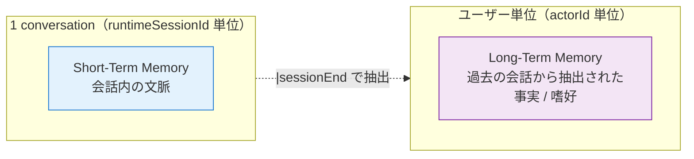
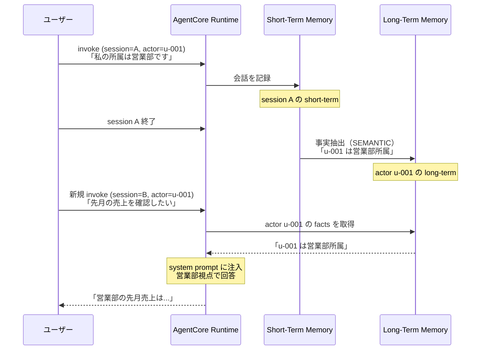

第 6 章では、前章で組んだ qaSupervisor に **AgentCore Memory** を追加し、ユーザーごとの会話継続と長期記憶を扱います。Memory は Runtime と並んで AgentCore の中核を成すサービスで、`{actorId}` placeholder で自動的にユーザー単位の namespace を作る設計や、4 種類の strategy を選べる柔軟性が、自前で組むときの数千行を 1 つの CLI コマンドに圧縮してくれます。

## この章のゴール

- AgentCore Memory の Short-Term / Long-Term の役割と料金体系を理解する
- 4 種類の memory strategy（SEMANTIC / SUMMARIZATION / USER_PREFERENCE / EPISODIC）の使い分けがわかる
- `agentcore add memory` で project config に memory を追加できる
- `{actorId}` placeholder でユーザー単位の namespace が自動生成される仕組みを理解する
- LangGraph state graph に Memory を組み込み、session を跨いだ会話継続が動く

## 前章からの引き継ぎ

前章で `qaSupervisor` プロジェクトを `agentcore deploy` で AWS に上げ、Runtime での invoke を確認しました。本章ではその `qaSupervisor` に Memory を後から追加します。前章までで scaffold 済みの `agentcore.json` に Memory 設定を足し、`agentcore deploy` で実 AWS リソース化する流れです。

## AgentCore Memory の役割

### Short-Term と Long-Term の区別

AgentCore Memory には 2 つのスコープがあります。



| スコープ   | 単位                  | 保持期間                     | 単価                          |
| ---------- | --------------------- | ---------------------------- | ----------------------------- |
| Short-Term | `runtimeSessionId`    | 会話セッション内             | $0.00025 / Event              |
| Long-Term  | `actorId`（ユーザー） | `eventExpiryDuration` で指定 | $0.00075 / MemoryStored-Month |

Short-Term は LangGraph の state を Memory にも書き写す感覚で、Long-Term は会話終了時にバックグラウンドでメモリ抽出が走り、ユーザー固有の事実・嗜好を蓄積していくイメージです。

### 4 種類の memory strategy

Long-Term Memory の抽出ロジックは、4 種類の strategy から選んで定義します。

| Strategy            | 抽出内容                     | 例                                                  |
| ------------------- | ---------------------------- | --------------------------------------------------- |
| **SEMANTIC**        | 事実や知識として保持できる文 | 「ユーザーは A 部署所属」「DGX Spark を使っている」 |
| **SUMMARIZATION**   | 会話全体の要約               | 「今回の会話では X について 3 ターン議論」          |
| **USER_PREFERENCE** | ユーザーの好み               | 「コードは Python 派」「敬語より tu/tu 風が好み」   |
| **EPISODIC**        | 出来事 / 時系列              | 「2026-04-26 に DGX Spark の質問をした」            |

複数の strategy を 1 つの Memory に同時に持たせることもできます。本書の社内 Q&A では SEMANTIC + USER_PREFERENCE の 2 つを併用するのが現実解ですが、章を進めながら段階的に追加していきます。

## Memory を project config に追加する

`agentcore add memory` コマンドで Memory を project config に追加します。

```bash
cd agents/qaSupervisor
agentcore add memory \
    --name qaShortTermMem \
    --strategies SEMANTIC \
    --expiry 7 \
    --json
```

成功すると `agentcore.json` の `memories[]` に項目が追加されます。

```json:agentcore/agentcore.json
{
    "name": "qaSupervisor",
    "runtimes": [...],
    "memories": [
        {
            "name": "qaShortTermMem",
            "eventExpiryDuration": 7,
            "strategies": [
                {
                    "type": "SEMANTIC",
                    "namespaces": ["/users/{actorId}/facts"]
                }
            ]
        }
    ],
    ...
}
```

注目したいのは `namespaces: ["/users/{actorId}/facts"]` の **`{actorId}` placeholder** です。これが「ユーザー単位の namespace を自動で作る」仕組みの中核です。

### `{actorId}` の意味

`actorId` は AgentCore Runtime が `InvokeAgentRuntime` のメタデータから抽出するユーザー識別子です。Cognito 経由で渡された JWT の `sub` クレームが入ったり、明示的に payload で指定したりできます（Identity 章 Ch 8 で深掘り）。

`{actorId}` placeholder を含む namespace が定義されていると、AgentCore Memory は **ユーザーごとに独立した格納領域**を自動的に作ります。具体的には次のような構造です。

```text
/users/u-001/facts/...   # ユーザー u-001 の事実記憶
/users/u-002/facts/...   # ユーザー u-002 の事実記憶（独立）
/users/u-003/facts/...   # ユーザー u-003 の事実記憶（独立）
```

これを自前で組むには、user table 設計、namespace 切り替え、scope 制御、TTL 管理、削除リクエスト処理（GDPR 等のデータ主権要件）を実装する必要があります。AgentCore Memory はそれをサービス側で巻き取ってくれるのが大きな価値です。

## デプロイ

`agentcore.json` に Memory が増えたので、`agentcore deploy` で AWS に反映します。

```bash
agentcore deploy
```

CDK が CloudFormation 経由で AgentCore Memory リソースを作成し、`memoryExecutionRoleArn` などの IAM ロールも自動で設定されます。デプロイ完了後、`agentcore status` で確認できます。

```bash
agentcore status

# 出力例（抜粋）
Memory: qaShortTermMem
  Strategies: SEMANTIC
  Namespace: /users/{actorId}/facts
  EventExpiryDuration: 7 days
  Status: ACTIVE
```

## LangGraph に Memory を組み込む

Runtime コードから Memory にアクセスするには、`bedrock-agentcore` SDK の `MemoryClient` を使います。

```python:agents/qaSupervisor/app/qaSupervisor/memory_client.py
import os

import boto3

MEMORY_NAME = os.environ.get("MEMORY_NAME", "qaShortTermMem")
AWS_REGION = os.environ.get("AWS_REGION", "ap-northeast-1")


def get_memory_client():
    return boto3.client("bedrock-agentcore", region_name=AWS_REGION)


def list_memory_records(actor_id: str, namespace: str = "/users/{actorId}/facts"):
    """ユーザー単位の memory record を取得する。"""
    client = get_memory_client()
    resolved_namespace = namespace.replace("{actorId}", actor_id)
    response = client.list_memory_records(
        memoryName=MEMORY_NAME,
        namespace=resolved_namespace,
    )
    return response.get("records", [])
```

LangGraph の state graph では、エージェントの開始ノードで memory_records を取得し、system prompt に挿入する形で活用します。

```python
@app.entrypoint
async def invoke(payload, context):
    actor_id = payload.get("actor_id", "anonymous")

    # Long-Term Memory から事実を取得
    facts = list_memory_records(actor_id)
    facts_text = "\n".join([f"- {r['content']}" for r in facts])

    system = f"""あなたは社内ドキュメント Q&A エージェントです。
過去にこのユーザー（{actor_id}）について次の事実を把握しています:
{facts_text}

ユーザーの質問に対して簡潔かつ正確に日本語で回答してください。
"""

    graph = create_react_agent(
        get_or_create_model(),
        tools=tools,
        prompt=system,
    )
    ...
```

過去の事実（Long-Term Memory）を system prompt に注入することで、ユーザー固有のコンテキストを引き継いだ応答ができます。コード断片はサンプルリポで実機検証できる形で配布しています。

## Short-Term Memory の動作確認

Short-Term Memory は **同じ `runtimeSessionId` を渡し続ける**ことで自動的に維持されます。boto3 から呼ぶ場合は次のようになります。

```python:scripts/multi_turn_chat.py
import json
import uuid

import boto3

AGENT_ARN = "arn:aws:bedrock-agentcore:ap-northeast-1:...:agent-runtime/abcdef"
SESSION_ID = str(uuid.uuid4())  # 1 conversation 内で固定

client = boto3.client("bedrock-agentcore", region_name="ap-northeast-1")


def invoke(prompt: str):
    response = client.invoke_agent_runtime(
        agentRuntimeArn=AGENT_ARN,
        runtimeSessionId=SESSION_ID,  # 同じ session で 2 ターン目を送る
        payload=json.dumps({"prompt": prompt, "actor_id": "u-001"}).encode(),
    )
    content = []
    for chunk in response.get("response", []):
        content.append(chunk.decode("utf-8"))
    return json.loads("".join(content))


# 1 ターン目
print(invoke("私の名前は森茂です。"))

# 2 ターン目（同じ session）
print(invoke("私の名前を覚えていますか？"))
```

2 ターン目で「私の名前を覚えていますか？」と聞くと、Short-Term Memory に保存された 1 ターン目の発言を参照して「森茂さんですね」と返します（Nano 3 30B が Memory の context を取り込めれば）。

## Long-Term Memory（事実抽出）の動作確認

Long-Term Memory は `runtimeSessionId` を変えても、`actorId` が同じなら過去の事実を引き継げます。次のような流れです。



actorId をユーザーアカウントに紐付けて運用すれば、ユーザーが何回ログアウト / ログインしても、過去の事実が引き継がれた回答が得られます。社内 Q&A での「自分のチームの情報を聞き返さなくて済む」体験は、ここで実現されます。

## strategy の使い分け

4 種類の strategy をいつ使うか、社内 Q&A シナリオで整理します。

### SEMANTIC（推奨デフォルト）

事実・知識として残せる情報を抽出します。社内 Q&A では「ユーザーの所属部署」「使っているシステム」「過去に質問した話題」などを保持します。

向いているのは「**コンテキストを次回の応答に流用したい**」場面です。デフォルトとして 1 つは入れておくのが推奨です。

### SUMMARIZATION

会話全体を要約します。社内 Q&A では「今回の会話では契約書 v3 について 5 ターン議論し、最終的に問題箇所が 3 件特定された」のような要約を残せます。

向いているのは「**会話履歴の量が多くなりすぎて context window を圧迫する**」場面です。長時間対話でアシスタントとして使うときに効きます。

### USER_PREFERENCE

ユーザー固有の好みを保持します。「敬語よりカジュアルな口調が好み」「コードレビューでは型に厳しめ」などの嗜好を蓄積します。

向いているのは「**ユーザーごとに応答スタイルを変えたい**」場面です。社内 Q&A では強い差別化要因にはなりにくいですが、コンシューマ寄りのエージェントでは効きます。

### EPISODIC

時系列の出来事を保持します。「2026-04-26 に DGX Spark について質問した」「2026-04-27 に契約書レビューを依頼した」のように、時刻情報を伴う事実を残せます。

向いているのは「**いつ何を話したかを後追いしたい**」場面です。コンプライアンス記録や、ユーザーサポートのコンテキストとして使えます。

## コスト構造

前章 Ch 4 で取り上げた単価を Memory に当てはめると次の通りです。

| 項目              | 単価                          | 月使用量（1,000 conv）            | 月額  |
| ----------------- | ----------------------------- | --------------------------------- | :---: |
| Short-Term Event  | $0.00025 / Event              | 5,000 events（1 conv = 5 ターン） | $1.25 |
| Long-Term Storage | $0.00075 / MemoryStored-Month | 100 stored                        | $0.08 |

Memory はコスト面では非常に軽量です。**気にせず増やせる**範囲のコスト（月数 USD）で、ユーザー体験を底上げできるのが AgentCore Memory の良いところです。

## トラブルシューティング

### Memory が取得できない（空配列が返る）

`list_memory_records` が空を返す場合、次のいずれかが原因です。

1. **actorId が間違っている**: namespace の placeholder と `actor_id` 引数が一致しているか確認
2. **session 終了処理が未完**: Long-Term への抽出は session 終了後に走る。`runtimeSessionId` を使い回さず、新しい session ID を発行する必要がある
3. **Memory リソースが ACTIVE でない**: `agentcore status` で `Status: CREATING` のままなら数分待つ

### Memory のクリーンアップ

dev / staging で Memory に溜まったテストデータを消したい場合、`delete_memory_records` API か、`agentcore.json` から該当 Memory を削除して `agentcore deploy` で全削除する 2 通りがあります。後者は Memory リソース自体を破棄するので確実です。

## 次のステップ — Memory + Knowledge Bases の関係

Memory が事実を保持する一方で、Knowledge Bases（Ch 11）はドキュメントを保持します。両者の役割を整理しておきます。

| 観点     | AgentCore Memory                 | Bedrock Knowledge Bases              |
| -------- | -------------------------------- | ------------------------------------ |
| 保持対象 | ユーザー固有の事実 / 嗜好 / 履歴 | 社内ドキュメント / マニュアル / 規程 |
| スコープ | actorId 単位                     | アプリ全体で共有                     |
| 更新頻度 | 会話のたびに自動更新             | 手動 / バッチで ingest               |
| 検索方法 | namespace + actorId              | ベクトル類似度                       |
| 主な用途 | パーソナライズ                   | RAG（事実検索）                      |

両者は競合しません。Memory が「あなたについて覚えていること」、Knowledge Bases が「会社の文書として記録されていること」を扱う関係です。Ch 11 で Knowledge Bases を組んだ後、Ch 14 のマルチエージェントでこの 2 つを 1 つの応答に統合します。

## 章末まとめ

本章で次の状態が手元に揃いました。

- AgentCore Memory の Short-Term / Long-Term の区別を理解
- `agentcore add memory` で project config に Memory を追加し、`agentcore deploy` で AWS に反映
- `{actorId}` placeholder でユーザー単位の namespace が自動で作られる
- LangGraph state graph に `MemoryClient` を統合し、過去の事実を system prompt に注入
- 4 種 strategy（SEMANTIC / SUMMARIZATION / USER_PREFERENCE / EPISODIC）を使い分けられる
- 月コストは数 USD 以内で運用可能

次章では、エージェントから外部のツール / API を呼び出す経路を **AgentCore Gateway** で整えます。

## 次章では

次章は **AgentCore Gateway** です。Lambda を Gateway 経由で MCP 互換ツールに変換し、LangGraph から呼び出せるようにします。
