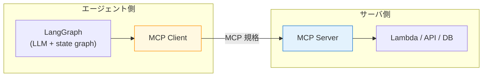
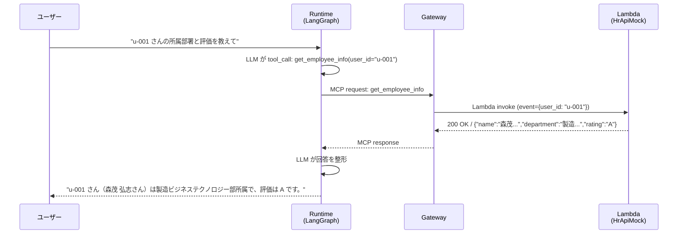
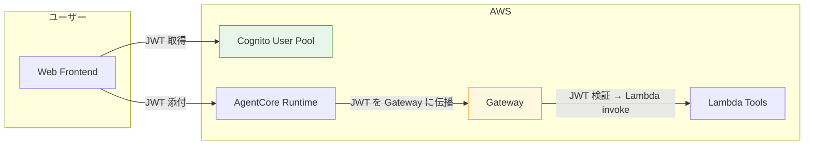

第 7 章では、エージェントから外部のツール / API を呼び出す経路を **AgentCore Gateway** で整えます。Lambda 関数として実装した社内 HR API モックを Gateway 経由で MCP 互換ツールに変換し、LangGraph から自然言語で呼び出せるようにします。MCP（Model Context Protocol）の世界観と LangChain tool の境界を押さえながら、既存の REST API を MCP 化する一般化パターンも扱います。

## この章のゴール

- AgentCore Gateway の役割と「MCP ツール化」の意味を理解する
- Lambda で社内 HR API モックを実装する
- `agentcore add gateway` / `agentcore add target` で Gateway を構築する
- OpenAPI スキーマからの自動生成と、Lambda 直接統合の使い分けを把握する
- LangGraph に MCP tool として bind し、エージェントから自然言語で呼び出せる
- 認証連携（IAM signature / Cognito JWT）の選択肢を整理する

## 前章からの引き継ぎ

前章まででエージェントの脳（Runtime）と記憶（Memory）が揃いました。本章ではここに「外部システムを叩く手」を追加します。Gateway は AgentCore CLI の `agentcore add gateway` 1 行で雛形ができ、Lambda を target として登録すると勝手に MCP ツール化されるので、自前で MCP server を実装する負荷から解放されるのが大きな魅力です。

## AgentCore Gateway とは何か

### MCP（Model Context Protocol）の概観

MCP はエージェントが外部リソースを使うための標準プロトコルで、もともと Anthropic が提唱したオープン仕様です。「エージェント側からは MCP server を叩くだけで、サーバ側は自分の API / 関数 / データソースを公開する」という分担になっており、ツールとエージェントの粗結合を実現します。



MCP のクライアント / サーバ間は HTTP / SSE / Stdio などで実装でき、AgentCore Gateway は **streamable HTTP** ベースの MCP server をマネージドで提供します。

### Gateway の責務

AgentCore Gateway がやってくれるのは次の 4 つです。

1. **MCP server のホスティング**: エンドポイントの提供と TLS / 認証
2. **Lambda / API への変換**: 既存リソースを MCP tool として公開
3. **OpenAPI 自動取り込み**: API 仕様から MCP schema を生成
4. **認証連携**: IAM signature / Cognito JWT / 外部 OAuth との橋渡し

これによって、Lambda で API を 1 つ書くだけでエージェントから自然言語で呼べるようになります。

## 社内 HR API モックを Lambda で実装

本書では「社員番号から所属部署と直近の評価を返す HR API」をモックとして実装します。サンプルリポの `lambdas/hr_api_mock/` 配下にコードがあります。

```python:lambdas/hr_api_mock/handler.py
import json

# ダミーデータ（実運用では DynamoDB / RDS から取得）
EMPLOYEES = {
    "u-001": {"name": "森茂 弘志", "department": "製造ビジネステクノロジー部", "rating": "A"},
    "u-002": {"name": "山田 太郎", "department": "営業部", "rating": "B"},
    "u-003": {"name": "鈴木 花子", "department": "人事部", "rating": "A"},
}


def lambda_handler(event, context):
    """社員番号を受け取り、所属と評価を返す。"""
    user_id = event.get("user_id", "")
    employee = EMPLOYEES.get(user_id)

    if employee is None:
        return {
            "statusCode": 404,
            "body": json.dumps({"error": f"Employee {user_id} not found"}),
        }

    return {
        "statusCode": 200,
        "body": json.dumps(employee, ensure_ascii=False),
    }
```

CDK スタックで Lambda として登録します。

```python:cdk/stacks/lambda_tools_stack.py
from aws_cdk import Stack
from aws_cdk import aws_lambda as _lambda
from constructs import Construct


class LambdaToolsStack(Stack):
    def __init__(self, scope: Construct, construct_id: str, **kwargs):
        super().__init__(scope, construct_id, **kwargs)

        self.hr_api_mock = _lambda.Function(
            self, "HrApiMock",
            runtime=_lambda.Runtime.PYTHON_3_12,
            handler="handler.lambda_handler",
            code=_lambda.Code.from_asset("../lambdas/hr_api_mock"),
            timeout=Duration.seconds(10),
            memory_size=256,
        )
```

`cdk deploy LambdaToolsStack` で Lambda がデプロイされ、ARN が出力されます。

## Gateway を作成する

### `agentcore add gateway`

Gateway 自体を project config に追加します。

```bash
cd agents/qaSupervisor
agentcore add gateway \
    --name qaToolGateway \
    --auth IAM \
    --json
```

`--auth` フラグでは認証方式を指定します。本書の dev / staging では IAM signature ベース、prod では Cognito JWT に切り替える設計を Ch 8 で扱います。

### `agentcore add target` で Lambda を MCP 化

Gateway に Lambda を target として登録すると、自動で MCP tool として公開されます。

```bash
agentcore add target \
    --gateway qaToolGateway \
    --type lambda \
    --lambda-arn arn:aws:lambda:ap-northeast-1:...:function:HrApiMock \
    --tool-name get_employee_info \
    --tool-description "社員番号から所属と評価を取得する"
```

`agentcore.json` の `agentCoreGateways[]` 配下に target が追加されます。

```json:agentcore/agentcore.json
{
    "agentCoreGateways": [
        {
            "name": "qaToolGateway",
            "auth": "IAM",
            "targets": [
                {
                    "type": "lambda",
                    "lambdaArn": "arn:aws:lambda:ap-northeast-1:...:function:HrApiMock",
                    "toolName": "get_employee_info",
                    "toolDescription": "社員番号から所属と評価を取得する"
                }
            ]
        }
    ]
}
```

### MCP schema は自動生成される

Lambda の入出力 schema は、Lambda のコードや設定から自動的に MCP の tool schema に変換されます。具体的には次のようなマッピングです。

| Lambda 側            | MCP tool schema 側       |
| -------------------- | ------------------------ |
| `event` の dict キー | tool の input parameters |
| `body` の JSON 構造  | tool の output schema    |
| `--tool-description` | tool の description      |
| `--tool-name`        | tool の name             |

OpenAPI スキーマを別途用意する必要はありません。型情報を強く付けたい場合は、Lambda の handler に Pydantic / TypedDict などで型ヒントを書いておくと、MCP schema 側にも反映されます。

### 既存 OpenAPI からの取り込み

REST API + OpenAPI 定義をすでに持っている場合は、`--type openapi --openapi-spec ./api.yaml` で直接読み込ませる方法もあります。社内に API Gateway + OpenAPI 運用が整っているチームでは、こちらの方が手数が少ない場合が多いです。

```bash
agentcore add target \
    --gateway qaToolGateway \
    --type openapi \
    --openapi-spec ./hr-api.yaml \
    --auth-type iam_role
```

OpenAPI に書かれた各 operation が、それぞれ独立した MCP tool として公開されます。

## デプロイ

`agentcore deploy` で Gateway が AWS に作成されます。CloudFormation で Gateway リソース、ターゲットの権限、Lambda invoke ロールなどが自動で作られます。

```bash
agentcore deploy
```

完了後、`agentcore status` で Gateway の MCP エンドポイントが確認できます。

```text
Gateway: qaToolGateway
  Auth: IAM
  Endpoint: https://gateway.bedrock-agentcore.ap-northeast-1.amazonaws.com/...
  Targets: 1 (HrApiMock → get_employee_info)
  Status: ACTIVE
```

## LangGraph に MCP tool として bind する

scaffold 時に同梱された `mcp_client/client.py` をベースに、Gateway のエンドポイントに繋ぎます。

```python:agents/qaSupervisor/app/qaSupervisor/mcp_client/client.py
import os

from langchain_mcp_adapters.client import MultiServerMCPClient

GATEWAY_ENDPOINT = os.environ.get(
    "AGENTCORE_GATEWAY_ENDPOINT",
    "https://gateway.bedrock-agentcore.ap-northeast-1.amazonaws.com/...",
)


def get_streamable_http_mcp_client() -> MultiServerMCPClient:
    """AgentCore Gateway に接続する MCP Client を返す。"""
    return MultiServerMCPClient(
        {
            "agentcore_gateway": {
                "transport": "streamable_http",
                "url": GATEWAY_ENDPOINT,
                # IAM SigV4 自動署名は AgentCore Runtime 内で有効
            }
        }
    )
```

`main.py` 側で MCP client を有効化します（前章でいったん無効化していた部分を戻します）。

```python:agents/qaSupervisor/app/qaSupervisor/main.py
from mcp_client.client import get_streamable_http_mcp_client

@app.entrypoint
async def invoke(payload, context):
    mcp_client = get_streamable_http_mcp_client()
    mcp_tools = await mcp_client.get_tools()  # Gateway から tool 一覧を取得

    graph = create_react_agent(
        get_or_create_model(),
        tools=mcp_tools + tools,  # 自前 tool と MCP tool を合流
        prompt=SYSTEM_PROMPT,
    )
    ...
```

`mcp_client.get_tools()` は Gateway に登録された全 target を LangChain `Tool` 形式に変換して返します。あとは `create_react_agent` に渡すだけで、エージェントが自然言語で `get_employee_info` を呼び出せるようになります。

## 動作確認

`agentcore deploy` で Runtime + Gateway が両方更新された状態で、CLI から invoke してみます。

```bash
agentcore invoke \
    --runtime qaSupervisor \
    "u-001 さんの所属部署と評価を教えてください。"
```

期待される動きは次の通りです。



LLM が自然言語の質問を tool_call に変換し、Gateway 経由で Lambda を叩き、結果を整形して返す流れです。Nano 3 30B は tool calling に対応しているので、この変換が安定して動きます。

## 認証連携の選択肢

`--auth IAM` で作った Gateway は、AgentCore Runtime からの呼び出しに自動で IAM SigV4 署名が付与されます。本書の dev / staging はこれで十分です。一方、本番想定では Cognito JWT で認可を載せたいケースが多く、その場合は次のような構成になります。



JWT の `sub` クレームを Lambda 側で参照すれば、「自分の社員データだけ取れる、他人のは取れない」という RBAC が実現できます。Ch 8 でこの認証フローを詳しく組みます。

## 既存 REST API を MCP 化する一般化パターン

社内に既存の REST API があるチームへの実装方針を整理します。

| 既存リソース                       | 推奨アプローチ                                       |
| ---------------------------------- | ---------------------------------------------------- |
| Lambda 関数                        | `--type lambda --lambda-arn ...` で直接統合          |
| API Gateway + OpenAPI              | `--type openapi --openapi-spec ...` で取り込み       |
| ECS / EKS の REST API              | OpenAPI に export して同上                           |
| 内製の gRPC                        | OpenAPI に変換、または Lambda proxy を 1 段挟む      |
| 外部 SaaS API（Slack / GitHub 等） | OpenAPI 取り込み + 認証情報を Secrets Manager に格納 |

「自前で MCP server を実装するか」「Gateway に流し込むか」で迷うシーンでは、**MCP server の挙動をフルカスタムしたい場合だけ自作**、それ以外は Gateway に流すほうが運用負荷が圧倒的に少なくなります。

## トラブルシューティング

### MCP tool が `get_tools()` で空配列が返る

`agentcore status` で Gateway が `ACTIVE` か確認します。`CREATING` のままなら数分待ちます。target が登録されていない場合、`agentcore.json` の `agentCoreGateways[].targets` が空のままになっていないか確認してください。

### Lambda invoke で permission denied

Gateway の IAM ロールが Lambda invoke 権限を持っているか確認します。CDK 経由で `agentcore deploy` した場合は自動付与されますが、手動で Lambda を作成した場合は別途 `lambda:InvokeFunction` を Gateway role に付与する必要があります。

### MCP schema が期待通りに生成されない

Lambda handler の入出力に型情報がないと、MCP schema が自動生成できないことがあります。Pydantic モデルで input / output を明示するのが安全です。

```python
from pydantic import BaseModel


class GetEmployeeInput(BaseModel):
    user_id: str


class GetEmployeeOutput(BaseModel):
    name: str
    department: str
    rating: str
```

## コスト

前章 Ch 4 のコスト構造を再掲すると、Gateway は次の通りです。

| 項目                    | 単価                   | 月使用量（1,000 conv × 2 tool call） |  月額   |
| ----------------------- | ---------------------- | ------------------------------------ | :-----: |
| Gateway API Invocations | $0.000005 / Invocation | 2,000                                |  $0.01  |
| Lambda invocation       | $0.20 / 1M requests    | 2,000                                | $0.0004 |

無視できるレベルのコストです。Gateway を作るかどうかで悩む必要はほとんどなく、**ツール連携をするなら Gateway を入れる**が定番になります。

## 章末まとめ

本章で次の状態が手元に揃いました。

- AgentCore Gateway が MCP server をマネージドでホストしてくれる仕組みを理解
- Lambda（HR API モック）を `agentcore add target` で MCP 化し、エージェントから自然言語で呼べる
- LangGraph の `mcp_client` から Gateway 経由でツールを取得
- IAM SigV4 / Cognito JWT の 2 つの認証方式
- 既存 REST API を MCP 化する 5 通りのパターン

エージェントが「外部の世界に手を伸ばせる」状態になりました。次章では、その手の届く範囲をユーザー単位で制限する **AgentCore Identity** を扱います。

## 次章では

次章は **AgentCore Identity** です。Cognito user pool を作成し、JWT を Runtime に渡す仕組みと、`{actorId}` placeholder（前章 Memory で活用）の正体である JWT クレームの伝播を扱います。「自分の評価情報は見られるが、他人のは見られない」という RBAC を社内 Q&A エージェントに組み込み、本番投入の一歩手前まで持っていきます。
