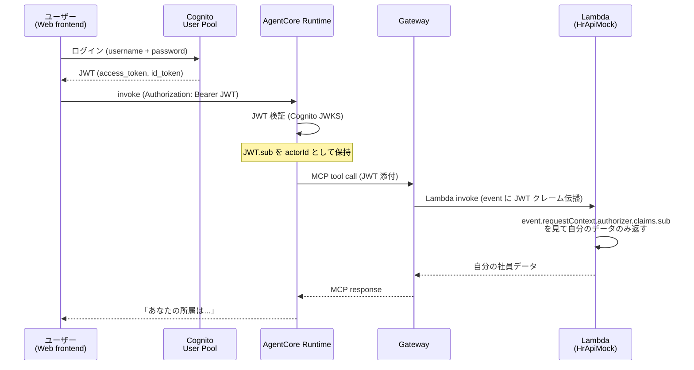

第 8 章では、AgentCore Identity を使って **「自分の情報は見られるが、他人の情報は見られない」** という認可制御をエージェントに組み込みます。Cognito User Pool で発行した JWT を AgentCore Runtime に伝播させ、Memory（前章の `{actorId}`）と Lambda Tools（前章の `get_employee_info`）の両方でユーザー単位のスコープが効く状態に持っていきます。

## この章のゴール

- AgentCore Identity の Workload Identity / OAuth2 credential provider の関係を理解する
- Cognito User Pool でテストユーザーを 2 名作成し、JWT を取得できる
- AgentCore Runtime に JWT を渡す呼び出しパターンを把握する
- JWT の `sub` クレームが `{actorId}` placeholder としてどう使われるかを追える
- Lambda Tools 側で JWT クレームを読み、自分の情報のみ返す RBAC を実装する
- ABAC（Attribute-Based Access Control）の入り口を体験する

## 前章からの引き継ぎ

前章で Lambda Tools を MCP 化し、エージェントから `get_employee_info` を呼べる状態になりました。ただし、現状では誰が呼んでも全社員データにアクセスできてしまいます。本章でユーザー認証 / 認可を被せ、本番投入の一歩手前まで持っていきます。Cognito の作成自体は CDK スタック 1 つで済むので、章の後半で実際に試します。

## AgentCore Identity の構成要素

AgentCore Identity は、**エージェントを呼び出す側（ユーザー / ワークロード）を識別 / 認可するための層**です。次の 3 つの主要機能で構成されています。

| 機能                            | 役割                                               | 本書での扱い      |
| ------------------------------- | -------------------------------------------------- | ----------------- |
| **Workload Identity**           | エージェント自身の identity（ABAC タグ等）         | Ch 8 で軽く触れる |
| **API Key Credential Provider** | エージェントから外部 API を叩くときの API キー保管 | Ch 8 後半         |
| **OAuth2 Credential Provider**  | 外部 OAuth プロバイダ（Google / Microsoft 等）連携 | 軽く言及          |
| **Cognito 連携（JWT）**         | エンドユーザー認証                                 | Ch 8 の主役       |

本章では「Cognito で発行した JWT で AgentCore Runtime を叩き、JWT クレームを Lambda まで伝播させる」フローを主軸にします。

## 認証 / 認可の全体像



JWT の `sub` クレームが「ユーザーを識別する文字列」で、これが Memory の `{actorId}` placeholder と Lambda 側の RBAC 判定の両方に使われます。

## Cognito User Pool の作成

CDK で Cognito User Pool を作ります。サンプルリポの `cdk/stacks/identity_stack.py` です。

```python:cdk/stacks/identity_stack.py
from aws_cdk import Stack, RemovalPolicy
from aws_cdk import aws_cognito as cognito
from constructs import Construct


class IdentityStack(Stack):
    def __init__(self, scope: Construct, construct_id: str, **kwargs):
        super().__init__(scope, construct_id, **kwargs)

        self.user_pool = cognito.UserPool(
            self, "QaUserPool",
            user_pool_name="qa-user-pool",
            self_sign_up_enabled=False,
            sign_in_aliases=cognito.SignInAliases(email=True),
            standard_attributes=cognito.StandardAttributes(
                email=cognito.StandardAttribute(required=True, mutable=False),
            ),
            custom_attributes={
                "department": cognito.StringAttribute(mutable=True),
                "role": cognito.StringAttribute(mutable=True),  # admin / user
            },
            removal_policy=RemovalPolicy.DESTROY,  # dev 用
        )

        self.user_pool_client = self.user_pool.add_client(
            "QaApp",
            generate_secret=False,
            auth_flows=cognito.AuthFlow(user_password=True, user_srp=True),
        )
```

ポイントは custom attributes として `department` と `role` を定義したことです。RBAC で「manager だけが他人の情報を見られる」のような制御を実装する際、この `role` 属性を JWT クレームに載せて Lambda 側で参照します。

`cdk deploy IdentityStack` でデプロイすると、User Pool ID と App Client ID が出力されます。

## テストユーザーの作成

dev 用に 2 名のテストユーザーを作ります。`scripts/create_test_users.sh` で AWS CLI から一発で作れます。

```bash:scripts/create_test_users.sh
#!/bin/bash
USER_POOL_ID="ap-northeast-1_XXXX"  # CDK output から取得

# 一般社員
aws cognito-idp admin-create-user \
    --user-pool-id "$USER_POOL_ID" \
    --username "tanaka@example.com" \
    --user-attributes \
        Name=email,Value=tanaka@example.com \
        Name=email_verified,Value=true \
        Name=custom:department,Value=sales \
        Name=custom:role,Value=user \
    --message-action SUPPRESS

aws cognito-idp admin-set-user-password \
    --user-pool-id "$USER_POOL_ID" \
    --username "tanaka@example.com" \
    --password "TestPassword123!" \
    --permanent

# 管理者
aws cognito-idp admin-create-user \
    --user-pool-id "$USER_POOL_ID" \
    --username "manager@example.com" \
    --user-attributes \
        Name=email,Value=manager@example.com \
        Name=email_verified,Value=true \
        Name=custom:department,Value=hr \
        Name=custom:role,Value=admin \
    --message-action SUPPRESS

aws cognito-idp admin-set-user-password \
    --user-pool-id "$USER_POOL_ID" \
    --username "manager@example.com" \
    --password "TestPassword123!" \
    --permanent
```

実運用では Cognito の自己サインアップフローを使うのが一般的ですが、本書のハンズオンではコマンド一発でテストアカウントが揃う構成にしました。

## JWT を取得する

クライアントから Cognito にログインして JWT を取得します。

```python:scripts/login.py
import boto3

USER_POOL_ID = "ap-northeast-1_XXXX"
CLIENT_ID = "your-app-client-id"

client = boto3.client("cognito-idp", region_name="ap-northeast-1")

response = client.initiate_auth(
    ClientId=CLIENT_ID,
    AuthFlow="USER_PASSWORD_AUTH",
    AuthParameters={
        "USERNAME": "tanaka@example.com",
        "PASSWORD": "TestPassword123!",
    },
)

id_token = response["AuthenticationResult"]["IdToken"]
print(id_token)
```

`id_token` は次のような構造の JWT です（base64 デコードして見ると）。

```json
{
  "sub": "abcd1234-5678-...",
  "email": "tanaka@example.com",
  "custom:department": "sales",
  "custom:role": "user",
  "iss": "https://cognito-idp.ap-northeast-1.amazonaws.com/ap-northeast-1_XXXX",
  "exp": 1735689600
}
```

`sub` の値がユーザー固有 ID で、これが AgentCore の `actorId` として使われます。

## AgentCore Runtime に JWT を渡して invoke

`InvokeAgentRuntime` API には JWT を渡すオプションがあります。HTTP プロトコル契約上、`Authorization: Bearer <JWT>` ヘッダで添付するのが基本です。boto3 から呼ぶ場合は次のようにします。

```python:scripts/invoke_with_jwt.py
import json
import uuid

import boto3

AGENT_ARN = "arn:aws:bedrock-agentcore:ap-northeast-1:...:agent-runtime/abcdef"

client = boto3.client("bedrock-agentcore", region_name="ap-northeast-1")

# 前段で取得した JWT
id_token = "eyJraWQ..."

response = client.invoke_agent_runtime(
    agentRuntimeArn=AGENT_ARN,
    runtimeSessionId=str(uuid.uuid4()),
    payload=json.dumps({"prompt": "私の所属部署を教えてください。"}).encode(),
    qualifier="DEFAULT",
    bearerToken=id_token,  # JWT を添付
)
```

`bearerToken` で渡された JWT は、AgentCore Runtime 側で Cognito JWKS を使って自動検証されます。検証に成功すると、`actor_id` が JWT の `sub` クレームから自動で抽出され、Memory / Gateway / Lambda Tools に伝播します。

## Lambda 側で JWT クレームを参照する

前章の Lambda（`HrApiMock`）を、JWT クレームを見て自分のデータだけ返すように修正します。

```python:lambdas/hr_api_mock/handler.py
import json


EMPLOYEES = {
    "abcd1234-5678-...": {  # tanaka の sub
        "name": "田中 太郎",
        "department": "sales",
        "rating": "B",
    },
    "efgh5678-1234-...": {  # manager の sub
        "name": "山本 花子",
        "department": "hr",
        "rating": "A",
    },
}


def lambda_handler(event, context):
    """JWT の sub を見て、自分の情報のみ返す。manager ロールは他人も見られる。"""
    # AgentCore Gateway 経由で渡される JWT クレーム
    claims = event.get("requestContext", {}).get("authorizer", {}).get("claims", {})
    caller_sub = claims.get("sub", "")
    caller_role = claims.get("custom:role", "user")

    # 引数で社員番号を取った場合
    target_sub = event.get("user_id", caller_sub)

    # admin 以外は他人の情報を見られない
    if caller_sub != target_sub and caller_role != "admin":
        return {
            "statusCode": 403,
            "body": json.dumps(
                {"error": "他のユーザーの情報を取得する権限がありません"},
                ensure_ascii=False,
            ),
        }

    employee = EMPLOYEES.get(target_sub)
    if employee is None:
        return {
            "statusCode": 404,
            "body": json.dumps({"error": "Not found"}),
        }

    return {
        "statusCode": 200,
        "body": json.dumps(employee, ensure_ascii=False),
    }
```

3 段階のチェックを実装しています。

1. **caller_sub の取得**: Gateway 経由で渡された JWT から自分の sub を取り出す
2. **target_sub の決定**: 引数で社員 ID を指定した場合はその ID、しない場合は自分
3. **権限チェック**: 自分以外の ID を見ようとした場合、`role: admin` のみ許可

これで「一般社員（user）は自分のデータだけ、管理者（admin）は誰のデータでも見られる」RBAC が完成します。

## 動作確認

`tanaka@example.com`（user ロール）と `manager@example.com`（admin ロール）でそれぞれ JWT を取得し、エージェントに同じ質問を投げてみます。

```bash
# tanaka でログインして自分の情報を聞く（成功）
python scripts/invoke_with_jwt.py --user tanaka --prompt "私の所属を教えて"
# → 「あなたは sales 部門で、評価は B です」

# tanaka で manager の情報を聞く（拒否）
python scripts/invoke_with_jwt.py --user tanaka --prompt "manager の山本さんの所属を教えて"
# → 「申し訳ありませんが、他のユーザーの情報を取得する権限がありません」

# manager でログインして tanaka の情報を聞く（成功、admin ロール）
python scripts/invoke_with_jwt.py --user manager --prompt "tanaka さんの所属を教えて"
# → 「田中 太郎さんは sales 部門で、評価は B です」
```

LLM 側に「権限チェックを忘れずに」とプロンプトで書かなくても、Lambda Tool 側で 403 を返すことで、エージェントが自然に「権限がない」旨を回答してくれます。**認可ロジックを LLM に任せず、決定論的な Lambda レイヤーで強制する**のが production grade なエージェント設計の肝です。

## ABAC（Attribute-Based Access Control）の入り口

JWT クレームの `custom:department` を Lambda 側で参照すると、「同じ部署内の社員情報だけ見られる」のような ABAC も実現できます。

```python
caller_dept = claims.get("custom:department", "")

# 同じ部署 OR admin ならアクセス許可
if employee["department"] != caller_dept and caller_role != "admin":
    return {"statusCode": 403, ...}
```

部署単位、地域単位、プロジェクト単位など、属性ベースで細かい認可を組めるのが ABAC の強みです。Cognito の custom attributes に正規化された属性を載せておけば、JWT が「ユーザーのプロファイルを運ぶ容器」として機能します。

## Workload Identity（軽く触れる）

エンドユーザーではなく、エージェント間の通信で identity を確立したい場合は、AgentCore の **Workload Identity** を使います。`agentcore add workload-identity` で project config に追加でき、エージェント A がエージェント B を呼び出す際に IAM タグや属性が伝播されます。

本書ではマルチエージェント章（Ch 14）で軽く触れますが、社内 Q&A の規模では JWT 中心の設計で十分なので、深掘りは別書籍にお任せします。

## 認証フローの実装パターン比較

実運用で採用される認証フローには、いくつかの典型パターンがあります。

| パターン                             | 用途                                  | 本書の扱い     |
| ------------------------------------ | ------------------------------------- | -------------- |
| Cognito User Pool + JWT              | 自社で完結する Web/モバイル           | **本章の主軸** |
| Cognito Identity Pool + IAM Role     | フェデレーション（Google / Apple 等） | 軽く言及       |
| 外部 SSO（Okta / Azure AD）+ Cognito | エンタープライズ                      | コラム         |
| API Key Credential Provider          | エージェントから外部 API を叩く       | Ch 14 で扱う   |

社内ドキュメント Q&A のような社内ツールでは、Cognito + 外部 SSO（SAML 2.0）連携で組むのが現実解です。Cognito 側で SAML federation を有効化すれば、本章の構成のまま外部 IdP を後付けできます。

## トラブルシューティング

### `Invalid token` で invoke が失敗する

JWT の有効期限切れ、または App Client ID / User Pool ID の不一致が主な原因です。AgentCore Runtime には Cognito User Pool との関連付けを `agentcore.json` で記述する必要があり、これが間違っていると JWKS を取得できず検証に失敗します。

### Lambda 側で claims が空

Gateway → Lambda 間で JWT クレームが伝播されていない場合、Gateway の auth 設定が `IAM` のままになっていることが多いです。`agentcore add gateway --auth COGNITO_JWT --user-pool-id ...` で再設定してください。

### `custom:` プレフィックスが付かない

Cognito の custom attributes は JWT のクレーム名で `custom:department` のように `custom:` プレフィックスが付きます。Lambda 側で `claims.get("department")` ではなく `claims.get("custom:department")` を参照する必要があります。

## コスト

Identity 周りで発生するコストは次の通りです。

| 項目                         | 単価                                    | 月使用量 | 月額  |
| ---------------------------- | --------------------------------------- | -------- | :---: |
| Cognito MAU                  | $0.0055 / MAU（最初の 50,000 MAU まで） | 50 MAU   | $0.28 |
| Cognito 高度セキュリティ機能 | $0.05 / MAU                             | 任意     | 任意  |

無視できるレベルのコストです。Cognito を使うかどうかで悩む必要はほとんどありません。

## 章末まとめ

本章で次の状態が手元に揃いました。

- AgentCore Identity の Workload Identity / Credential Provider / Cognito 連携の役割を整理
- CDK で Cognito User Pool を作成し、テストユーザーを 2 名作成
- JWT を取得して `bearerToken` で AgentCore Runtime に添付
- JWT の `sub` が `actorId` として Memory / Gateway / Lambda に伝播
- Lambda 側で `claims.sub` と `custom:role` を参照した RBAC 実装
- ABAC（custom:department で部署単位の認可）の入り口

これで「ユーザー単位のスコープが効くエージェント」が一通り組めました。次章では、エージェントから外の世界に手を伸ばすツールセット（**Built-in Tools**）の Code Interpreter と Browser を扱います。

## 次章では

次章は **AgentCore Built-in Tools** です。Code Interpreter で表データの計算や CSV 処理、Browser で社外 Web サイトの情報取得を、AgentCore のサンドボックス環境内で安全に実行する方法を扱います。
