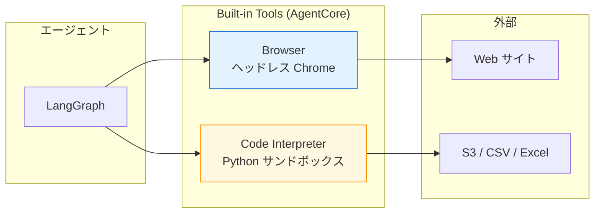
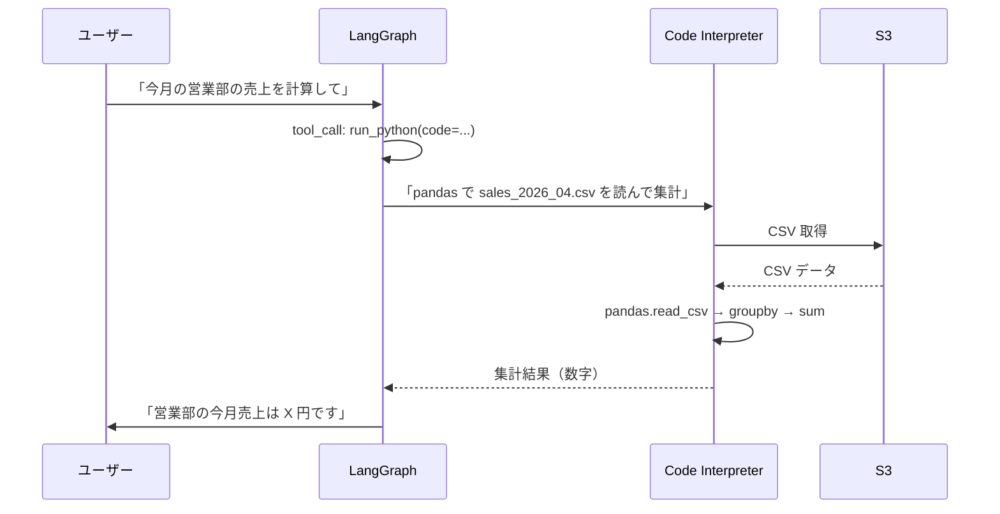
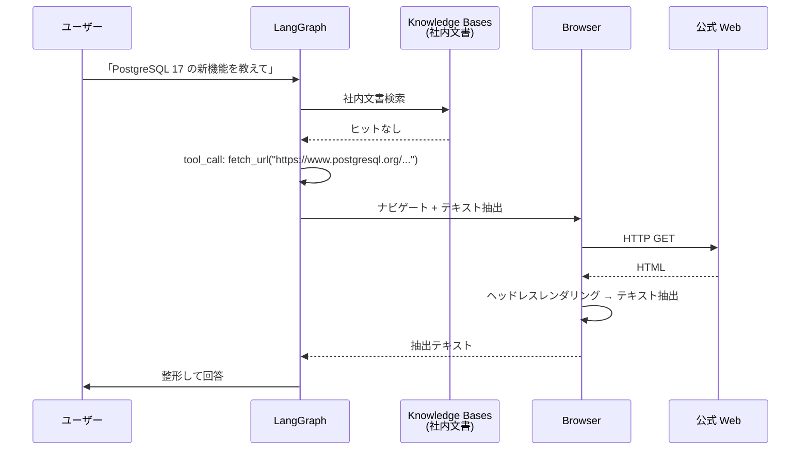
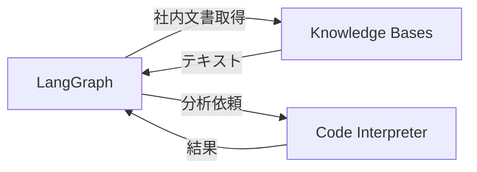

第 9 章では、AgentCore が built-in で提供する 2 つの強力なツール、**Code Interpreter** と **Browser** を扱います。Code Interpreter はサンドボックス内で Python コードを実行できる環境、Browser はヘッドレスブラウザを通じて Web サイトと対話できる環境です。社内 Q&A エージェントに「数値計算」「外部ドキュメント取得」の能力を加えるのが本章のテーマです。

## この章のゴール

- AgentCore Built-in Tools が提供する Code Interpreter / Browser の役割を理解する
- Code Interpreter で社内 KPI の計算をサンドボックス内で実行できる
- Browser で社外 Web サイトの情報を取得し、エージェントに統合できる
- LangGraph に Built-in Tools を組み込んで自然言語で呼び出せる
- コスト感とセキュリティ境界を押さえ、本書の社内 Q&A での使い分けを把握する

## 前章からの引き継ぎ

前章で Cognito + JWT による認証 / 認可が組まれ、エージェントが「ユーザー単位のスコープ」で動く状態になりました。本章ではエージェントの能力をさらに広げます。Code Interpreter で表データの集計、Browser で外部ドキュメントの取得という、LLM 単体ではできないタスクを Built-in Tools 経由でこなせるようにします。

## AgentCore Built-in Tools とは

AgentCore Built-in Tools は、エージェントから安全に呼び出せる「実行環境付きのツール」です。Lambda のように毎回コードを書く必要はなく、AgentCore 側がサンドボックスを用意してくれるので、`agentcore add code-interpreter` 1 行で使えるようになります。



## Code Interpreter — Python サンドボックス

### Code Interpreter の概要

Code Interpreter は、AgentCore Runtime と同じ AWS 内のサンドボックス環境で、Python コードを実行できるツールです。pandas / numpy / matplotlib などの主要ライブラリがプリインストールされていて、エージェントが「データ計算 / グラフ生成 / ファイル変換」のような決定論的なタスクを LLM の生成ではなく実コード実行でこなせます。

### project config への追加

```bash
cd agents/qaSupervisor
agentcore add code-interpreter \
    --name qaCodeInterpreter \
    --json
```

`agentcore.json` に code interpreter リソースが追加され、`agentcore deploy` で AWS に作成されます。サンドボックスは vCPU と memory で課金されるので、`agentcore.json` に最大利用時間や同時起動数の制限を入れておくのが推奨です（デフォルトでも常識的な値が入ります）。

### LangGraph から呼ぶ

LangGraph では `langchain_aws.AgentcoreCodeInterpreterTool` のような薄いラッパー（本書執筆時点ではまだ contrib レベル）を使うか、boto3 経由で直接 `start_code_interpreter_session` / `invoke_code_interpreter` を叩きます。

```python:agents/qaSupervisor/app/qaSupervisor/tools/code_interpreter.py
import boto3
from langchain.tools import tool

bedrock_agentcore = boto3.client("bedrock-agentcore", region_name="ap-northeast-1")


@tool
def run_python(code: str) -> str:
    """Python コードを安全なサンドボックスで実行し、stdout を返す。
    pandas, numpy, matplotlib などが利用可能。"""
    session = bedrock_agentcore.start_code_interpreter_session(
        codeInterpreterIdentifier="qaCodeInterpreter",
    )
    response = bedrock_agentcore.invoke_code_interpreter(
        codeInterpreterSessionId=session["sessionId"],
        code=code,
    )
    bedrock_agentcore.stop_code_interpreter_session(
        codeInterpreterSessionId=session["sessionId"],
    )
    return response.get("stdout", "")
```

`@tool` デコレータ経由で LangChain ツールにすれば、`create_react_agent` の `tools=[..., run_python]` に追加するだけで使えます。

### 社内 Q&A での使い方

社内 KPI の集計に Code Interpreter が効きます。たとえば「今月の営業部の売上を CSV から計算して」のような質問に対して、エージェントは次のように動きます。



ポイントは、**LLM 自身が数字を生成するのではなく、Python コードで決定論的に計算する**ことです。LLM の数値計算は不正確になりがちなので、KPI のような「正確性が重要」な領域では Code Interpreter に投げるのが定石になります。

### コスト

Code Interpreter は使った時間だけ課金される pay-per-use です。

| 項目   | 単価                |
| ------ | ------------------- |
| Memory | $0.00945 / GB-Hour  |
| vCPU   | $0.0895 / vCPU-Hour |

たとえば 1 セッション 30 秒 × 月 1,000 回 × 2 GB / 1 vCPU で計算すると、月額 $1 未満です。Lambda よりは少し高めですが、エージェントから呼ぶ用途では十分安価です。

## Browser — ヘッドレスブラウザ

### Browser の概要

Browser はヘッドレス Chrome をサンドボックス内で動かすツールです。Web サイトの構造化情報の取得や、JavaScript 実行が必要なページのスクレイピング、ログインフローの自動化が、エージェントから自然言語で指示できます。

### project config への追加

```bash
agentcore add browser \
    --name qaBrowser \
    --json
```

これも `agentcore.json` に追加され、`agentcore deploy` で AWS に作成されます。

### LangGraph から呼ぶ

```python:agents/qaSupervisor/app/qaSupervisor/tools/browser.py
import boto3
from langchain.tools import tool

bedrock_agentcore = boto3.client("bedrock-agentcore", region_name="ap-northeast-1")


@tool
def fetch_url(url: str) -> str:
    """指定 URL のページをヘッドレスブラウザで取得し、テキストを返す。
    JavaScript 実行が必要な SPA にも対応。"""
    session = bedrock_agentcore.start_browser_session(
        browserIdentifier="qaBrowser",
    )
    response = bedrock_agentcore.browser_navigate(
        browserSessionId=session["sessionId"],
        url=url,
    )
    text = bedrock_agentcore.browser_extract_text(
        browserSessionId=session["sessionId"],
    )
    bedrock_agentcore.stop_browser_session(
        browserSessionId=session["sessionId"],
    )
    return text["content"]
```

`fetch_url("https://example.com")` のように呼べば、ページの構造化テキストが返ります。

### 社内 Q&A での使い方

社外ドキュメント（公式マニュアル / リリースノート / Wikipedia）の取得に Browser を使います。



社内文書（Knowledge Bases）に情報がない場合のフォールバックとして外部 Web を見に行く、という設計が組めます。

### コスト

Browser も Code Interpreter と同じ単価体系で、使った時間だけ課金されます。

| 項目   | 単価                        |
| ------ | --------------------------- |
| Memory | $0.00945 / GB-Hour          |
| vCPU   | $0.0895 / vCPU-Hour（同上） |

ただし Browser はヘッドレス Chrome の起動コストが Code Interpreter より重いので、起動時間が長くなりがちです。月の利用回数が増えると数 USD になることもあるので、利用ログを Cost Anomaly Detection で監視しておくと安心です。

## 社内 Q&A での使い分け

本書の社内 Q&A 題材では、Code Interpreter と Browser を次のように使い分けます。

| ユーザー質問                           | 推奨ツール       | 理由                 |
| -------------------------------------- | ---------------- | -------------------- |
| 「営業部の今月売上を計算して」         | Code Interpreter | CSV 集計・数値計算   |
| 「契約書の単語頻度を分析して」         | Code Interpreter | テキスト処理         |
| 「公式ドキュメントの最新版を確認して」 | Browser          | 外部 Web 取得        |
| 「Wikipedia で X を調べて」            | Browser          | JavaScript 含む Web  |
| 「社内 wiki の Y を確認して」          | Knowledge Bases  | 社内文書なので Ch 11 |

エージェントの system prompt に「社内文書は Knowledge Bases を、外部 Web は Browser を、計算は Code Interpreter を使ってください」という方針を書いておくと、LLM がツール選択を誤りにくくなります。

## セキュリティと境界

Built-in Tools は AWS 内のサンドボックスで動きますが、いくつか押さえておくべき境界があります。

### Code Interpreter の境界

ネットワークはデフォルトで外部接続不可なので、Code Interpreter から外部 API を叩きたい場合は VPC 設定で明示します。ファイルシステムは `/tmp` にだけ書き込み可能で、セッション終了で破棄されます。実行時間は 1 セッションあたり最大 15 分（CDK で延長可）、メモリはデフォルト 2 GB（CDK で増減可）です。

### Browser の境界

ナビゲート可能 URL は `agentcore.json` で allow-list / deny-list を指定できます。認証については、Browser から社内 SSO に乗ることはできないので、外部公開ページ前提で使います。保存周りは、スクリーンショットや HAR を S3 に保存できる（オプション）構成です。

### 社外アクセスの境界設計

社内 Q&A エージェントは原則として「社内文書 → 公式マニュアル → 一般 Web」の優先順で情報源を辿ります。Browser で取得できる範囲を allow-list で絞ると、ユーザーが意図せず外部に情報を漏らすリスクを減らせます。

```json:agentcore/agentcore.json
{
    "browsers": [
        {
            "name": "qaBrowser",
            "allowedUrls": [
                "https://docs.aws.amazon.com/*",
                "https://www.postgresql.org/*",
                "https://ja.wikipedia.org/*"
            ]
        }
    ]
}
```

allow-list を入れると、エージェントが指定外の URL にナビゲートしようとした時点でエラーになります。

## トラブルシューティング

### Code Interpreter で外部ライブラリが足りない

サンドボックスにプリインストールされているライブラリには限りがあります。`pip install` を Code Interpreter 内で実行できますが、起動時間が伸びるので頻繁に使うなら CDK で custom image を指定するのが良い選択です。

### Browser がタイムアウトする

JavaScript の重い SPA だと、`browser_navigate` の後に `browser_wait_for("networkidle")` のような待ち合わせが必要です。Browser のセッション API には待機系メソッドが揃っているので、リファレンスを確認しながら状況に合わせて挟みます。

### コストが想定外に膨らむ

Code Interpreter / Browser は使われ放題だと月額数十 USD まで膨らむことがあります。Cost Budgets と Cost Anomaly Detection は必ず仕掛けておきましょう。

## ツールの組み合わせパターン

社内 Q&A での「ツール協調」の典型を示します。

### パターン 1: Knowledge Bases + Code Interpreter

社内文書から契約書を取得 → Code Interpreter で単語頻度を分析 → 結果をユーザーに返す



### パターン 2: Browser + Knowledge Bases

公式ドキュメントを Browser で取得 → 社内文書（Knowledge Bases）と突合 → 差分を回答

### パターン 3: Lambda Tools + Code Interpreter

HR API（Lambda）から社員データを取得 → Code Interpreter で部署別集計 → 結果を可視化

LangGraph の state graph に複数のツールを並列に登録しておくだけで、LLM が必要に応じて選択する形が組めます。

## 章末まとめ

本章で次の状態が手元に揃いました。

- Code Interpreter で Python サンドボックス内の数値計算 / データ処理が可能
- Browser でヘッドレス Chrome 経由の外部 Web 取得が可能
- 両者を `agentcore add ...` 1 行で project config に追加し、`agentcore deploy` で AWS に作成
- LangGraph から自然言語ベースで呼べる
- 社内 Q&A では Knowledge Bases / Lambda Tools と協調させる設計が定石
- セキュリティ境界（allow-list / 実行時間 / メモリ）を CDK で制御

エージェントの「手」が 3 種類（Lambda Tools / Code Interpreter / Browser）に増えました。次章では、これまで積み上げた Runtime / Memory / Gateway / Identity / Built-in Tools の挙動を、観測する仕組みを整えます。

## 次章では

次章は **AgentCore Observability** です。trace / metrics / logs を統合的に見るためのダッシュボード、CloudWatch との関係、Langfuse on ECS との比較、本番監視で何を計測すべきかを扱います。Sprint 1 の Ch 5 で `LangchainInstrumentor()` を有効化したことで、すでに OpenTelemetry トレースは流れているので、Ch 10 ではそのトレースを「読みやすく可視化する」フェーズに入ります。
