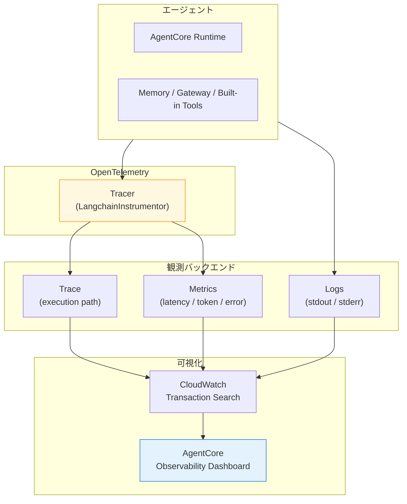
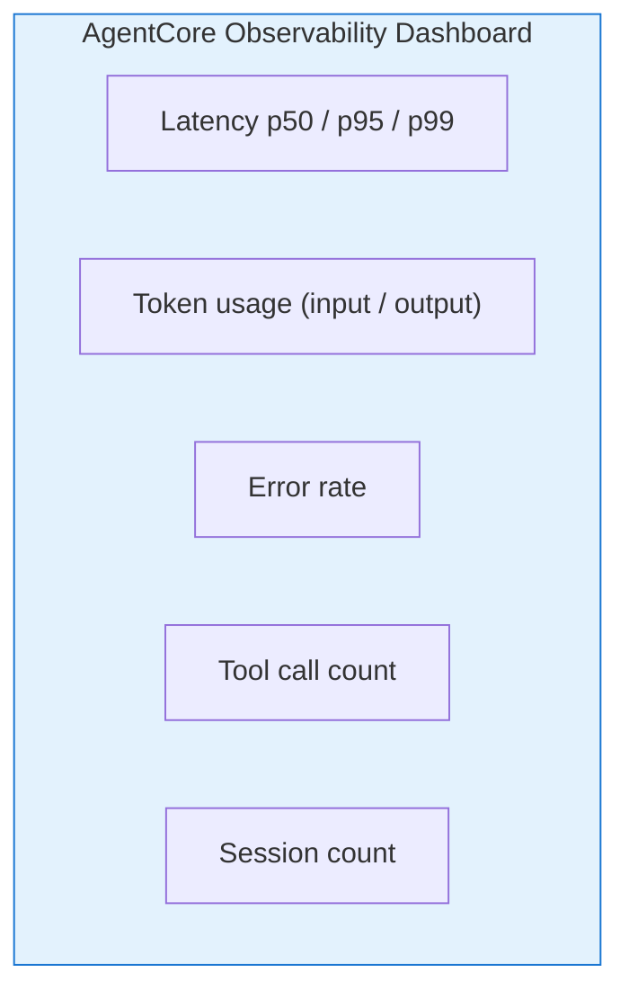
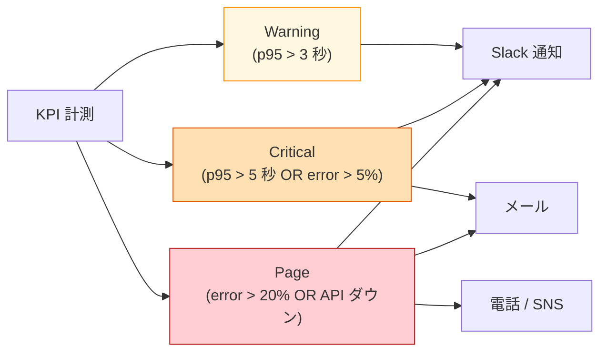
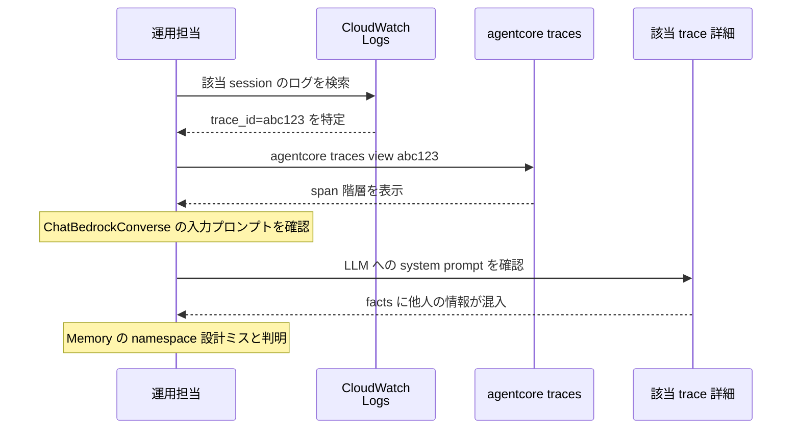

第 10 章では、AgentCore Observability で trace / metrics / logs を統合的に観測する仕組みを整えます。第 5 章で `LangchainInstrumentor()` を呼んでから OpenTelemetry トレースは裏で流れていましたが、本章ではそれを実際に読み解き、ダッシュボードと組み合わせて本番監視に耐える形に持っていきます。Langfuse on ECS との比較も交えながら、AWS マネージドの観測スタックの強みと弱みを整理します。

## この章のゴール

- AgentCore Observability が trace / metrics / logs をどう統合しているかを把握する
- `agentcore logs` / `agentcore traces` で本番エージェントの挙動を追える
- LangGraph の OpenTelemetry instrumentation がどこまでカバーしているかを理解する
- Langfuse on ECS と AgentCore Observability の使い分けを判断できる
- 本番監視で計測すべき 5 つの KPI を押さえる

## 前章からの引き継ぎ

前章までで Runtime / Memory / Gateway / Identity / Built-in Tools が揃いました。動くエージェントは目の前にありますが、「**実際に何が起きているか**」を観察する手段がまだ整っていません。本章で観測スタックを敷くことで、本書のスコープが「動くエージェント」から「運用に乗るエージェント」に広がります。

## AgentCore Observability の構成

AgentCore Observability は、3 つの観測軸を 1 つのバックエンドに集約します。



エージェントから出る OpenTelemetry trace はそのまま CloudWatch に流れ、AgentCore Observability ダッシュボードがその情報を読みやすく整形して表示する、という関係です。

### 3 つの観測軸

| 軸          | 何を見るか                                                       | 主な使い方                    |
| ----------- | ---------------------------------------------------------------- | ----------------------------- |
| **trace**   | 実行パス（LLM 呼び出し / tool 呼び出し / Memory アクセスの順序） | デバッグ / パフォーマンス分析 |
| **metrics** | 数値指標（latency、token 数、エラー率）                          | 本番監視 / アラート           |
| **logs**    | アプリの stdout / stderr / log メッセージ                        | エラー調査 / 監査             |

3 つは互いに紐付いていて、「特定の trace ID から該当 log 行に飛ぶ」「特定の metric スパイクから関連 trace を辿る」操作ができます。

## CloudWatch Transaction Search を有効化する

AgentCore Observability を活かすには、AWS アカウントで **CloudWatch Transaction Search** を有効化する必要があります。これは AWS 側でトレース検索インフラを起動するための1回限りのセットアップです。

```bash
# AWS マネジメントコンソール
# CloudWatch → Application Signals → Transaction Search → Enable
```

CDK でも `aws_logs.CfnTransactionSearchConfig` などで自動化できますが、本書では一度コンソールから enable する手順を取ります。アカウント単位の設定なので、初回のみで OK です。

## `LangchainInstrumentor()` の実体

第 5 章で何気なく書いていた `LangchainInstrumentor().instrument()` の中身を覗いてみます。

```python
from opentelemetry.instrumentation.langchain import LangchainInstrumentor

LangchainInstrumentor().instrument()
```

このコマンドで、LangChain / LangGraph のすべての主要メソッドが OpenTelemetry の `tracer` でラップされます。具体的には次のメソッドが自動計装されます。

| メソッド                           | 取得される span 属性                                                   |
| ---------------------------------- | ---------------------------------------------------------------------- |
| `ChatBedrockConverse.invoke()`     | `llm.model_id`, `llm.input_tokens`, `llm.output_tokens`, `llm.latency` |
| `Tool.invoke()`                    | `tool.name`, `tool.input`, `tool.output`, `tool.latency`               |
| `LangGraph.ainvoke()`              | `graph.name`, `graph.state`, `graph.latency`                           |
| `MultiServerMCPClient.get_tools()` | `mcp.server`, `mcp.tools_count`                                        |

これらが自動的に OpenTelemetry の trace exporter から AgentCore Observability に流れ、ダッシュボードで可視化されます。アプリ開発者は計装コードを書く必要がほとんどなく、`LangchainInstrumentor().instrument()` の 1 行だけで観測の地ならしが終わります。

## トレースを読む

`agentcore traces` コマンドで、エージェントの実行履歴を CLI から確認できます。

```bash
agentcore traces

# 出力例
TraceId: abc123...
Started: 2026-04-26T12:34:56Z
Duration: 1.55 s
SessionId: session-xyz
ActorId: u-001

Spans:
  ├─ HTTP POST /invocations (1.55 s)
  │  ├─ LangGraph.ainvoke (1.50 s)
  │  │  ├─ ChatBedrockConverse.invoke #1 (0.50 s)
  │  │  ├─ Tool.get_employee_info (0.30 s)
  │  │  │  └─ Lambda.HrApiMock (0.25 s)
  │  │  └─ ChatBedrockConverse.invoke #2 (0.65 s)
```

階層構造で「どの順序で何が呼ばれて、どこにレイテンシが溜まっているか」が一目でわかります。`agentcore traces view <trace-id>` で詳細を見ると、各 span の入出力（プロンプト / 応答 / tool 引数 / tool 出力）まで深掘りできます。

### よくあるトレース読み解きパターン

トレースを見ながら、本書で実際に直面する典型的な問題と対処を整理します。

| 観察                           | 推測される問題                        | 対処                                     |
| ------------------------------ | ------------------------------------- | ---------------------------------------- |
| LLM 呼び出しが 2 回以上ある    | ReAct で reasoning loop が発生        | system prompt の改善                     |
| Lambda の latency が極端に長い | コールドスタートまたは外部 API の遅延 | Lambda の memory_size 増 / 外部 API 監視 |
| Memory アクセスで時間を取る    | namespace 設計の問題                  | actorId 解決の見直し                     |
| 全体が 5 秒以上                | 複合要因                              | 各 span を順に見る                       |

## メトリクスを見る

AgentCore Observability ダッシュボードの「Metrics」タブで、エージェント全体の数値指標を時系列で確認できます。



これらは CloudWatch Metrics として保管されているので、CloudWatch Alarms と組み合わせて閾値超過の通知が飛ばせます。

```python:cdk/stacks/monitoring_stack.py
from aws_cdk import aws_cloudwatch as cw

# Latency p95 が 5 秒を超えたらアラート
self.latency_alarm = cw.Alarm(
    self, "AgentLatencyP95",
    metric=cw.Metric(
        namespace="AWS/BedrockAgentCore",
        metric_name="invocation_duration",
        dimensions_map={"AgentRuntime": "qaSupervisor"},
        statistic="p95",
    ),
    threshold=5000,  # 5 秒
    evaluation_periods=3,
    alarm_description="エージェント応答 p95 が 5 秒超え",
)
```

## ログを追う

`agentcore logs` で CloudWatch Logs に流れている stdout / stderr を直接見られます。

```bash
# リアルタイムストリーム
agentcore logs --follow

# 特定 session のログ
agentcore logs --session-id session-xyz

# エラーレベルのみ
agentcore logs --level ERROR
```

LangGraph の中で `app.logger.info(...)` で書いたログも、自動的に CloudWatch に流れます。`@app.entrypoint` の関数内で `log.info(f"Agent input: {prompt}")` のように埋めておくと、後から「どんなプロンプトに対して何を返したか」を追えます。

## Langfuse on ECS との比較

前作 2 冊目（実践運用編）で Langfuse self-hosted を扱った読者向けに、AgentCore Observability との比較を整理しておきます。

| 観点               | AgentCore Observability                 | Langfuse on ECS                                                               |
| ------------------ | --------------------------------------- | ----------------------------------------------------------------------------- |
| 起動方法           | フルマネージド（追加リソース不要）      | ECS / EKS 上で 6 サービス（Postgres / ClickHouse / Redis / MinIO / Langfuse） |
| 月額（最小構成）   | CloudWatch 課金のみ（数 USD）           | ECS Fargate + RDS で 30 〜 50 USD                                             |
| trace 形式         | OpenTelemetry                           | OpenTelemetry / Langfuse SDK                                                  |
| プロンプト管理     | Bedrock Prompt management（別サービス） | 内蔵                                                                          |
| データセット       | S3 + Bedrock Evaluations（別サービス）  | 内蔵                                                                          |
| コスト追跡         | CloudWatch Metrics + Cost Explorer      | 内蔵                                                                          |
| デプロイの手数     | `agentcore deploy` で完結               | docker compose / ECS task definition                                          |
| ベンダーロックイン | AWS                                     | OSS（移植可能）                                                               |

### Langfuse on ECS を選ぶ場面

- すでに前作 2 冊目で Langfuse 運用が整っている
- マルチクラウド前提でトレースを 1 か所に集約したい
- プロンプト管理 / データセット管理を 1 つのバックエンドで完結させたい

### AgentCore Observability を選ぶ場面（本書のデフォルト）

- AWS のマネージドな抽象を最大限受け入れる
- 起動費を最小化したい（月数 USD）
- CloudWatch とのシームレス連携が活きるシナリオ

本書では AgentCore Observability を主軸にしつつ、Langfuse on ECS への移行手順は付録 A の差分マップで触れます。

## 本番監視で計測すべき 5 つの KPI

社内 Q&A エージェントを運用に乗せるとき、最低限見ておく 5 つの KPI をリストにまとめます。

| KPI                             | 目標値の例              | 役割               |
| ------------------------------- | ----------------------- | ------------------ |
| 1. invocation_duration p95      | < 5 秒                  | 応答速度の SLA     |
| 2. token usage (input + output) | 月予算内                | コスト管理         |
| 3. error_rate                   | < 1%                    | 安定性             |
| 4. tool_call_failure_rate       | < 5%                    | ツール連携の健全性 |
| 5. session_concurrent_count     | リソース上限の 70% 以下 | スケーラビリティ   |

これらを CloudWatch Dashboard に並べて、毎朝 1 回確認する運用を回せば、本書の社内 Q&A 規模では本番監視として十分機能します。

## アラート設計

CloudWatch Alarms で 3 段階のアラートを仕込みます。



警告（Warning）はゆるく Slack に流し、深刻なら（Critical）メールも飛ばし、致命的なら（Page）オンコール担当者に電話、という三段論法は SaaS 運用の定石です。社内 Q&A は SaaS ほど厳しい SLA を要求されない場面が多いものの、Critical までは仕込んでおくと安心です。

## デバッグ実例 — エージェントが期待外の応答を返したとき

社内 Q&A エージェントを運用していて「ユーザーが田中さんの所属を聞いたのに、別の人の情報が混ざった」という事象が起きたとします。AgentCore Observability で原因を追う流れは次の通りです。



trace に LLM の入出力が記録されているので、「LLM がどんなコンテキストを受け取って、どう応答したか」を後から再現できます。これは前作 2 冊目で Langfuse がやっていたことと同等の機能です。

## OpenTelemetry のカスタム span を追加する

`LangchainInstrumentor()` がカバーしない処理に独自の span を追加したい場合、OpenTelemetry の通常 API で span を切れます。

```python
from opentelemetry import trace

tracer = trace.get_tracer(__name__)


@app.entrypoint
async def invoke(payload, context):
    with tracer.start_as_current_span("custom.preprocess") as span:
        span.set_attribute("payload.size", len(str(payload)))
        # 前処理
        cleaned_prompt = preprocess(payload["prompt"])
        span.set_attribute("preprocess.elapsed_ms", 50)

    # 既存の LangGraph 呼び出し
    ...
```

カスタム span は trace の階層に自動的に組み込まれ、AgentCore Observability ダッシュボードでも普通に表示されます。

## トラブルシューティング

### trace が空 / 表示されない

CloudWatch Transaction Search が enable されていない可能性があります。マネジメントコンソールで確認してください。

### LangChain の trace が抜けている

`LangchainInstrumentor().instrument()` を呼ぶタイミングが、LangChain の import より後だと計装が効きません。`main.py` の冒頭、`from langgraph.prebuilt import ...` よりも前に呼ぶのが安全です。

### Logs に PII が混入している

ユーザーのプロンプトをそのまま log するため、PII が CloudWatch Logs に流れる懸念があります。Bedrock Guardrails（Ch 12）の PII filter で input をマスクするか、log 出力前に明示的に sanitize するのが推奨です。

## コスト

AgentCore Observability 自体は CloudWatch の課金に乗ります。

| 項目                         | 単価                | 月使用量   |      月額      |
| ---------------------------- | ------------------- | ---------- | :------------: |
| CloudWatch Logs ingestion    | $0.76 / GB          | 0.5 GB     |     $0.38      |
| CloudWatch Logs storage      | $0.033 / GB         | 1 GB       |     $0.03      |
| CloudWatch Metrics（custom） | $0.30 / metric / 月 | 10 metrics |     $3.00      |
| Transaction Search           | $0.50 / GB scanned  | 1 GB       |     $0.50      |
| **合計**                     |                     |            | **約 $4 / 月** |

無視できるレベルのコストです。Langfuse on ECS の月 30 〜 50 USD と比べると、AgentCore Observability の方が桁違いに安く済みます。

## 章末まとめ

本章で次の状態が手元に揃いました。

- AgentCore Observability が trace / metrics / logs を CloudWatch 経由で統合
- `LangchainInstrumentor()` で LangChain / LangGraph が自動計装
- `agentcore traces` / `agentcore logs` でエージェントの挙動を追える
- 本番監視で計測すべき 5 KPI（latency / token / error / tool failure / session count）
- CloudWatch Alarms で 3 段階のアラート設計
- Langfuse on ECS との使い分け（マネージド vs OSS）

エージェントの「観察できる箱」が完成しました。次章では、本書の最大コスト要素である **Bedrock Knowledge Bases** を組み立てます。

## 次章では

次章は **Bedrock Knowledge Bases** です。OpenSearch Serverless を vector store にして社内 Q&A コーパスを ingest し、`Retrieve` API で citation 付き検索を実装します。Nemotron は KB の generation モデルとして直接組み込めない制約があるため、Agent 経由で間接 RAG する設計パターンを LangGraph state graph で組みます。
