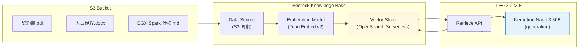
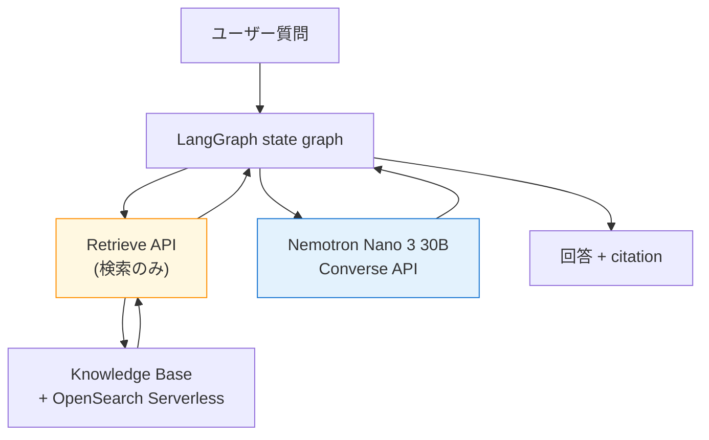
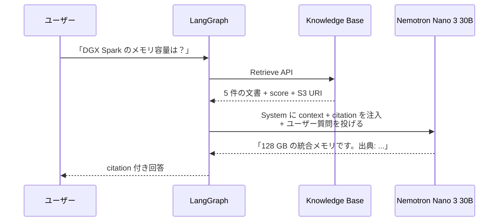

第 11 章では、本書の最大コスト要素である **Bedrock Knowledge Bases** を組み立てます。OpenSearch Serverless を vector store にして社内 Q&A コーパスを ingest し、`Retrieve` API で citation 付き検索を実装します。「**Nemotron は Knowledge Base の generation モデルとして直接組み込み不可**」という制約を踏まえ、Agent 経由で間接 RAG する設計パターンを LangGraph state graph に組み込みます。

## この章のゴール

- Bedrock Knowledge Bases の構成要素（vector store / data source / embedding model）を把握する
- OpenSearch Serverless を CDK で立て、社内コーパスを S3 から ingest できる
- `Retrieve` API で citation 付き検索を Python から呼ぶ
- Nemotron が KB の generation モデルとして使えない制約と、Agent 経由間接 RAG の設計を理解する
- KB を停止できる CDK パラメータで dev コストを月数 USD に抑える

## 前章からの引き継ぎ

前章まででエージェントの観測スタックが整い、本番監視の準備ができました。本章では「事実精度の高い回答」を実現するためのナレッジ基盤を作ります。第 3 章の Nano 3 30B が「DGX A100 の 1/3 性能」のような不正確な記述を含めてしまった問題は、ここで解決します。

## Bedrock Knowledge Bases の構成



3 つの主要コンポーネントで構成されます。

| コンポーネント      | 役割                                        | 本書の選択                     |
| ------------------- | ------------------------------------------- | ------------------------------ |
| **Data Source**     | S3 / Confluence / SharePoint 等から取り込み | S3                             |
| **Embedding Model** | 文書をベクトル化                            | `amazon.titan-embed-text-v2:0` |
| **Vector Store**    | ベクトル検索インフラ                        | OpenSearch Serverless          |

## 重要制約 — Nemotron は KB に直接組み込めない

本章を進める前に、ハンズオンで読者が遭遇する重要な制約を共有します。

### 公式モデルカードの記載

[Bedrock Nemotron Nano 9B v2 のモデルカード](https://docs.aws.amazon.com/bedrock/latest/userguide/model-card-nvidia-nvidia-nemotron-nano-9b-v2.html) を確認すると、`bedrock-runtime` エンドポイントで使える機能の表に **「No Knowledge base」** と明記されています。Super 120B / Nano 12B VL も同様です。

### これが意味すること

Bedrock Knowledge Bases には `RetrieveAndGenerate` という API があり、「検索 → 生成までを 1 回の API 呼び出しで完結する」便利機能を提供します。しかし、`RetrieveAndGenerate` の generation モデルとして指定できるのは Anthropic / Amazon / Meta の主要モデルだけで、**Nemotron は generation モデルとしては選べません**。

### 回避策 — Agent 経由の間接 RAG

`Retrieve` API は generation モデルに依存せず、純粋に「検索結果を返す」API です。これを LangGraph の state graph 内で呼び出して、検索結果を Nemotron の context として渡せば、Nemotron をそのまま生成側で使えます。



これが本章の主軸となる「**Agent 経由間接 RAG**」のパターンです。

## CDK で Knowledge Base を立てる

サンプルリポの `cdk/stacks/bedrock_kb_stack.py` で、OpenSearch Serverless + Knowledge Base を一括構築します。

```python:cdk/stacks/bedrock_kb_stack.py
from aws_cdk import Stack, RemovalPolicy
from aws_cdk import aws_iam as iam
from aws_cdk import aws_s3 as s3
from aws_cdk import aws_opensearchserverless as oss
from aws_cdk import aws_bedrock as bedrock
from constructs import Construct


class BedrockKbStack(Stack):
    def __init__(
        self,
        scope: Construct,
        construct_id: str,
        kb_enabled: bool = True,  # dev 用に停止できるパラメータ
        **kwargs,
    ):
        super().__init__(scope, construct_id, **kwargs)

        # S3 バケット（社内コーパス置き場）
        self.corpus_bucket = s3.Bucket(
            self, "QaCorpusBucket",
            bucket_name=f"qa-corpus-{self.account}",
            removal_policy=RemovalPolicy.DESTROY,  # dev 用
            auto_delete_objects=True,
        )

        if not kb_enabled:
            # dev で KB を起動しない場合はここで終了（OCU 起動費 $345/月 を節約）
            return

        # OpenSearch Serverless collection
        self.collection = oss.CfnCollection(
            self, "QaVectorStore",
            name="qa-vector-store",
            type="VECTORSEARCH",
        )

        # Knowledge Base service role
        self.kb_role = iam.Role(
            self, "KbServiceRole",
            assumed_by=iam.ServicePrincipal("bedrock.amazonaws.com"),
        )
        self.kb_role.add_to_policy(iam.PolicyStatement(
            actions=["aoss:APIAccessAll"],
            resources=[self.collection.attr_arn],
        ))
        self.kb_role.add_to_policy(iam.PolicyStatement(
            actions=["bedrock:InvokeModel"],
            resources=[
                f"arn:aws:bedrock:{self.region}::foundation-model/amazon.titan-embed-text-v2:0",
            ],
        ))
        self.corpus_bucket.grant_read(self.kb_role)

        # Knowledge Base
        self.knowledge_base = bedrock.CfnKnowledgeBase(
            self, "QaKnowledgeBase",
            name="qa-knowledge-base",
            role_arn=self.kb_role.role_arn,
            knowledge_base_configuration={
                "type": "VECTOR",
                "vectorKnowledgeBaseConfiguration": {
                    "embeddingModelArn": (
                        f"arn:aws:bedrock:{self.region}::"
                        "foundation-model/amazon.titan-embed-text-v2:0"
                    ),
                },
            },
            storage_configuration={
                "type": "OPENSEARCH_SERVERLESS",
                "opensearchServerlessConfiguration": {
                    "collectionArn": self.collection.attr_arn,
                    "vectorIndexName": "qa-index",
                    "fieldMapping": {
                        "vectorField": "embedding",
                        "textField": "text",
                        "metadataField": "metadata",
                    },
                },
            },
        )

        # Data Source（S3 → KB）
        self.data_source = bedrock.CfnDataSource(
            self, "QaDataSource",
            knowledge_base_id=self.knowledge_base.attr_knowledge_base_id,
            name="qa-corpus-s3",
            data_source_configuration={
                "type": "S3",
                "s3Configuration": {
                    "bucketArn": self.corpus_bucket.bucket_arn,
                },
            },
        )
```

`kb_enabled=False` を渡すと OpenSearch Serverless / KB / Data Source が作られず、S3 バケットだけが残ります。これで dev 時に OCU 起動費（月 $345）をゼロにできます。

### dev / staging / prod で切り替える

CDK の `--context kb-enabled=false` フラグで切り替えられるようにします。

```bash
# dev: KB なし
cdk deploy BedrockKbStack --context kb-enabled=false

# prod: KB あり
cdk deploy BedrockKbStack --context kb-enabled=true
```

`app.py` 側で context を読みます。

```python:cdk/app.py
import aws_cdk as cdk
from stacks.bedrock_kb_stack import BedrockKbStack

app = cdk.App()
kb_enabled = app.node.try_get_context("kb-enabled") != "false"

BedrockKbStack(app, "BedrockKbStack", kb_enabled=kb_enabled)

app.synth()
```

## 社内コーパスを S3 にアップロード

サンプルコーパスを S3 にアップロードします。本書では前作 2 冊目で使った社内ドキュメント（人事規程、契約書、技術文書）をそのまま流用します。

```bash
aws s3 sync \
    ./data/internal-corpus \
    s3://qa-corpus-${AWS_ACCOUNT_ID}/ \
    --region ap-northeast-1
```

その後、Knowledge Base 側で sync を実行します。

```bash
aws bedrock-agent start-ingestion-job \
    --knowledge-base-id <kb-id> \
    --data-source-id <ds-id> \
    --region ap-northeast-1
```

`describe-ingestion-job` で進捗を確認できます。サンプルコーパス（数十 MB）の ingest は数分で終わります。

## `Retrieve` API で検索する

ingest が完了したら、`Retrieve` API で検索できます。

```python:scripts/retrieve_test.py
import boto3

KB_ID = "ABCDEF1234"

client = boto3.client("bedrock-agent-runtime", region_name="ap-northeast-1")

response = client.retrieve(
    knowledgeBaseId=KB_ID,
    retrievalQuery={"text": "DGX Spark のメモリ容量は？"},
    retrievalConfiguration={
        "vectorSearchConfiguration": {
            "numberOfResults": 5,
        },
    },
)

for result in response["retrievalResults"]:
    print(f"Score: {result['score']:.3f}")
    print(f"Source: {result['location']['s3Location']['uri']}")
    print(f"Content: {result['content']['text'][:200]}...")
    print("---")
```

期待される出力例：

```text
Score: 0.812
Source: s3://qa-corpus-.../dgx-spark-spec.md
Content: NVIDIA DGX Spark は GB10 を搭載したデスクトップ AI スーパーコンピュータで、128 GB の統合メモリ（UMA）を備えます...
---
Score: 0.745
Source: s3://qa-corpus-.../hardware-faq.md
Content: ...
```

`score` は Cosine 類似度で、0.7 以上が一般的に「関連性が高い」と判断される目安です。

## LangGraph に間接 RAG を組み込む

本章の核心です。LangGraph state graph に **Retrieve ノード** を追加し、Nemotron の前段で社内文書を取得します。

```python:agents/qaSupervisor/app/qaSupervisor/graph.py
from typing import TypedDict

import boto3
from langchain_core.messages import HumanMessage, SystemMessage
from langgraph.graph import END, StateGraph

from model.load import load_model

bedrock_agent_runtime = boto3.client(
    "bedrock-agent-runtime", region_name="ap-northeast-1"
)
KB_ID = "ABCDEF1234"


class State(TypedDict):
    query: str
    retrieved: list[dict]
    answer: str


def retrieve(state: State) -> State:
    """Knowledge Base から関連文書を取得"""
    response = bedrock_agent_runtime.retrieve(
        knowledgeBaseId=KB_ID,
        retrievalQuery={"text": state["query"]},
        retrievalConfiguration={
            "vectorSearchConfiguration": {"numberOfResults": 5},
        },
    )
    return {
        **state,
        "retrieved": response["retrievalResults"],
    }


def generate(state: State) -> State:
    """Nemotron で回答を生成（検索結果を context に注入）"""
    llm = load_model()
    context = "\n\n".join(
        [r["content"]["text"] for r in state["retrieved"]]
    )
    citations = "\n".join(
        [f"- {r['location']['s3Location']['uri']}" for r in state["retrieved"]]
    )
    system = f"""次の社内文書だけを根拠にして、ユーザーの質問に日本語で回答してください。
社内文書に書かれていない内容は推測せず、「該当する記述が見つかりませんでした」と答えてください。
回答の最後に、参照した文書の出典を箇条書きで添えてください。

社内文書:
{context}

参照文書一覧:
{citations}
"""
    response = llm.invoke([
        SystemMessage(content=system),
        HumanMessage(content=state["query"]),
    ])
    return {**state, "answer": response.content}


graph = StateGraph(State)
graph.add_node("retrieve", retrieve)
graph.add_node("generate", generate)
graph.set_entry_point("retrieve")
graph.add_edge("retrieve", "generate")
graph.add_edge("generate", END)

qa_graph = graph.compile()
```

このような state graph を組むと、エージェントが次の流れで動きます。



LLM が事実を hallucinate するリスクが、社内文書の context を渡すことで明確に下がります。第 3 章で見た「DGX A100 の 1/3 性能」のような誤りも、社内仕様書を context に渡せば防げます。

## qaSupervisor への統合

ここまで作った state graph を、`main.py` の `@app.entrypoint` に統合します。

```python:agents/qaSupervisor/app/qaSupervisor/main.py
from graph import qa_graph

@app.entrypoint
async def invoke(payload, context):
    query = payload.get("prompt", "")
    result = await qa_graph.ainvoke({"query": query, "retrieved": [], "answer": ""})
    return {"result": result["answer"]}
```

`agentcore deploy` で更新すれば、本番の Knowledge Base 経由 RAG エージェントが完成です。

## 動作確認

KB がある状態とない状態で、同じ質問の回答精度を比較してみます。

```bash
# KB なし（前章までの構成）
agentcore invoke "DGX Spark のメモリ容量は？"
# → 「DGX Spark は 64 GB のメモリを搭載しています。」（不正確、hallucinate）

# KB あり（本章の構成）
agentcore invoke "DGX Spark のメモリ容量は？"
# → 「128 GB の統合メモリ（UMA）を備えます。
#    出典: s3://qa-corpus-.../dgx-spark-spec.md」
```

KB を組み込むと、出典が明示されて事実精度も改善することが体感できます。社内 Q&A エージェントが production grade に近づく決定的な瞬間です。

## Vector store の代替選択肢

OpenSearch Serverless 以外の vector store の整理を再掲します。

| Vector store              | 月額（最小構成）           | 用途                         |
| ------------------------- | -------------------------- | ---------------------------- |
| **OpenSearch Serverless** | 約 $345（2 OCU 常時）      | 本番想定（本書のデフォルト） |
| Aurora pgvector           | Aurora 起動費 + ストレージ | すでに Aurora 利用中のチーム |
| **S3 Vectors**            | 数 USD（プレビュー）       | 検証段階、コスト最小化       |
| Neptune Analytics         | 高（時間課金）             | Graph + Vector 両方必要      |

特に **S3 Vectors** は 2025 年プレビューで登場した安価な選択肢で、データ量が少ない / 低 QPS なら有力候補です。CDK の `vectorKnowledgeBaseConfiguration` で `S3_VECTORS` を指定すれば切り替えられます。

## トラブルシューティング

### Ingest が失敗する

S3 バケットへの permission、Embedding モデルの model access、OpenSearch Serverless の data access policy のいずれかが不足している可能性があります。`describe-ingestion-job` のエラー詳細から原因を特定できます。

### Retrieve のスコアが低い

文書の chunking 戦略が合っていないことが多いです。Knowledge Base のデフォルトは固定長 chunking ですが、`chunkingStrategy` を `SEMANTIC` や `HIERARCHICAL` に切り替えると検索精度が改善することがあります。

### KB が起動したまま OCU 課金が続く

意図せず KB を起動したままになっていないか、Cost Explorer で OpenSearch Serverless の項目を週次確認しましょう。CDK の `kb-enabled=false` で停止する運用を dev 環境では徹底します。

## コスト振り返り

前章の試算結果を再掲します。

| 環境    |    KB    | Bedrock 推論 | OCU  |       合計       |
| ------- | :------: | :----------: | :--: | :--------------: |
| dev     |   OFF    |    $0.38     |  $0  | **約 $10 / 月**  |
| staging | 半日起動 |    $0.88     | $172 | **約 $190 / 月** |
| prod    |   24h    |    $0.88     | $345 | **約 $367 / 月** |

OpenSearch Serverless OCU が prod の月額の 94% を占める現実は変わりません。**dev では確実に停止する**運用を徹底すれば、本書のハンズオン全体のコストを月 $10 程度に抑えられます。

## 章末まとめ

本章で次の状態が手元に揃いました。

- Bedrock Knowledge Bases の vector store / data source / embedding model の構成を理解
- CDK で OpenSearch Serverless + KB + Data Source を一括構築（`kb-enabled` パラメータで停止可能）
- S3 にコーパスをアップロードして `start-ingestion-job` で sync
- `Retrieve` API で citation 付き検索が動く
- **Agent 経由間接 RAG**（Nemotron が KB の generation モデルとして使えない制約を LangGraph で回避）
- KB 停止運用で dev コストを月 $10 に抑える

事実精度の高い社内 Q&A エージェントが完成しました。次章では、ここに **Bedrock Guardrails** を被せて入出力検閲を仕込みます。

## 次章では

次章は **Bedrock Guardrails** です。「**Classic tier では日本語 content filter / PII / Prompt Attack が動かない、Standard tier + APAC profile + Cross-Region Inference 必須**」というハンズオン上の落とし穴を冒頭で押さえ、日本語入出力検閲を組みます。
