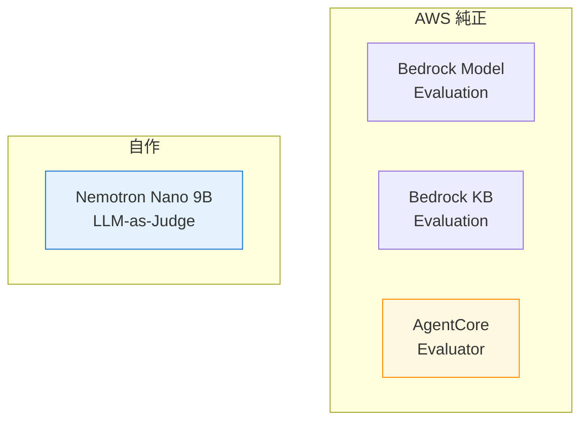
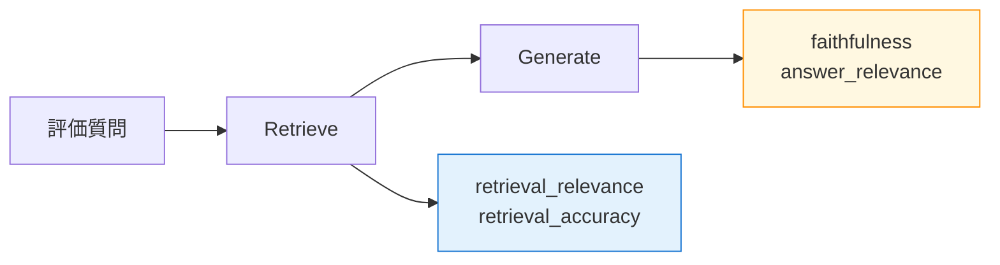
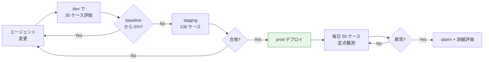

第 13 章では、社内 Q&A エージェントの応答品質を継続的に計測する評価レイヤーを組み立てます。AWS には評価サービスが 3 系統（Bedrock Model Evaluation / Bedrock Knowledge Base Evaluation / AgentCore Evaluator）あり、加えて Nemotron Nano 9B v2 の structured outputs を活かした自作 LLM-as-Judge も組めます。本書では 4 系統を比較しながら、本書のシナリオで現実的な評価サイクルを設計します。

## この章のゴール

- AWS が提供する 3 系統の評価サービスを把握する
- 自作 LLM-as-Judge（Nemotron Nano 9B v2 + structured outputs）を実装する
- 4 系統の使い分けが判断できる
- 評価データセットを S3 + JSONL で管理する設計を理解する
- AgentCore Evaluations の Tier1 Output 課金（$12 / 1M）を踏まえたサンプルサイズ最適化ができる

## 前章からの引き継ぎ

前章で Bedrock Guardrails が日本語で動く状態になりました。本章で評価レイヤーを足すと、エージェントの「品質」を数値で追えるようになります。Production 移行に必須の最後のピースです。

## 評価サービスの 4 系統比較



4 系統の特徴を整理します。

| 系統                         | 用途                                           | コスト                  | 自由度               |
| ---------------------------- | ---------------------------------------------- | ----------------------- | -------------------- |
| **Bedrock Model Evaluation** | LLM 単体の品質評価（事実精度・有害性等）       | 中                      | 中（プリセット指標） |
| **Bedrock KB Evaluation**    | RAG パイプラインの retrieval / generation 評価 | 中                      | 中                   |
| **AgentCore Evaluator**      | エージェントの軌跡（trajectory）評価           | **高（$12 / 1M out）**  | 高                   |
| **自作 LLM-as-Judge**        | 任意の評価軸                                   | **低（$0.07 / 1M in）** | 最大                 |

本書では **「自作 LLM-as-Judge を主軸 + AgentCore Evaluator を要所で併用」**の構成にします。コストを抑えながら、エージェント特有の評価（tool 選択の正しさなど）も補足できる組み合わせです。

## Bedrock Model Evaluation

### 概要

Bedrock Model Evaluation は LLM 単体に対して、事実精度（accuracy）/ 有害性（toxicity）/ 言語の頑健性（robustness）などを評価するサービスです。マネジメントコンソールから「ジョブ起動 → 評価データセット指定 → 結果確認」の流れで使えます。

### 評価ジョブの作成

```bash
aws bedrock create-evaluation-job \
    --job-name qa-nemotron-eval-2026-04 \
    --role-arn arn:aws:iam::...:role/BedrockEvaluationRole \
    --evaluation-config '{
        "automated": {
            "datasetMetricConfigs": [{
                "taskType": "QuestionAndAnswer",
                "dataset": {
                    "name": "internal-qa-eval",
                    "datasetLocation": {"s3Uri": "s3://qa-corpus.../eval-set.jsonl"}
                },
                "metricNames": ["Builtin.Accuracy", "Builtin.Robustness"]
            }]
        }
    }' \
    --inference-config '{
        "models": [{"bedrockModel": {"modelIdentifier": "nvidia.nemotron-nano-3-30b"}}]
    }' \
    --output-data-config '{"s3Uri": "s3://qa-corpus.../eval-results/"}' \
    --region ap-northeast-1
```

評価データセットは JSONL 形式で、各行に `prompt` と `referenceResponse` を入れた構造です。

```json
{"prompt": "DGX Spark のメモリ容量は？", "referenceResponse": "128 GB の統合メモリ"}
{"prompt": "営業部の人数は？", "referenceResponse": "50 名"}
```

数十分から数時間で結果が出て、S3 に集計レポートが書き出されます。

### 向いている用途

- LLM をモデル単位で比較したい（Nemotron Nano 3 30B vs Nano 9B v2 など）
- 標準的な指標で品質を測りたい
- 月次 / 四半期で定点観測したい

エージェント全体ではなく、**LLM 単体の入れ替え判断**に使うのが効果的です。

## Bedrock Knowledge Base Evaluation

### 概要

Bedrock KB Evaluation は RAG パイプラインに特化した評価サービスです。retrieval（検索精度）と generation（生成品質）を分けて評価できます。



主な指標は次の通りです。

| 指標                  | 何を測るか                                          |
| --------------------- | --------------------------------------------------- |
| `retrieval_relevance` | KB が返した文書が質問に関連しているか               |
| `retrieval_accuracy`  | 必要な情報が検索結果に含まれているか                |
| `faithfulness`        | 回答が context に忠実か（hallucinate していないか） |
| `answer_relevance`    | 回答が質問に関連しているか                          |

サンプルリポには本番想定のテンプレートを用意したので、実機実行は読者の手元で試せます。

### 向いている用途

- RAG の retrieval / generation のどちらに問題があるかを切り分けたい
- KB の chunking 戦略やリトリバ設定を比較したい
- Knowledge Bases を使った構成限定で深く評価したい

## AgentCore Evaluator（内蔵）

### 概要

AgentCore Evaluator は、エージェントの **trajectory（実行軌跡）** を評価する built-in 機能です。「ツール選択は正しかったか」「回答に至るまでの推論は妥当か」など、エージェント特有の評価軸が組み込まれています。

```bash
agentcore add evaluator \
    --name qaTrajectoryEval \
    --type trajectory \
    --json
```

`agentcore deploy` で AWS 上に作られ、`run_evaluation` API で実行できます。

### コスト面の注意

AgentCore Evaluations の Tier1 Output 単価は **$12 / 1M tokens** で、Bedrock Nano 3 30B の出力単価（$0.35 / 1M）の **34 倍**です。

```text
Nano 3 30B output: $0.35 / 1M tokens
AgentCore Evaluator output: $12.00 / 1M tokens
比率: 34x
```

評価ジョブを毎日 1,000 ケース回すと、出力 1.5M tokens × $12 = **月 $540**になります。これは prod の運用コスト（$367）を上回るので、**評価サンプルサイズを慎重に設計**する必要があります。

### 推奨サンプルサイズ

| 環境    | サンプル数 | 頻度          | 月額（推定） |
| ------- | ---------- | ------------- | :----------: |
| dev     | 30         | 毎日          |     < $5     |
| staging | 100        | 週次          |    < $10     |
| prod    | 50         | 日次 + 異常時 |    < $30     |

dev で日次 30 ケース、prod で日次 50 + 監視異常時に追加実行、というパターンに収めれば、評価コストを月 $30 以内に抑えられます。

## 自作 LLM-as-Judge（本書の主軸）

### 設計コンセプト

Nemotron Nano 9B v2 の **structured outputs** を活かして、JSON 形式でスコアを返す Judge を自作します。AgentCore Evaluator の 1/30 のコストで、評価軸も自由に設計できます。

### 実装

```python:scripts/llm_judge.py
import json

import boto3
from pydantic import BaseModel, Field

bedrock = boto3.client("bedrock-runtime", region_name="ap-northeast-1")


class JudgeScore(BaseModel):
    accuracy: int = Field(description="事実精度 0-5")
    relevance: int = Field(description="質問への関連性 0-5")
    helpfulness: int = Field(description="ユーザーへの有用性 0-5")
    citation_quality: int = Field(description="出典の妥当性 0-5、citation がない場合 0")
    reasoning: str = Field(description="採点理由")


JUDGE_PROMPT = """あなたは社内 Q&A エージェントの応答を評価する厳格な評価者です。
次の質問に対するエージェントの回答を、4 つの軸で 0-5 点で採点してください。

【質問】
{question}

【期待される回答（参考）】
{expected}

【エージェントの実際の回答】
{actual}

採点軸:
- accuracy: 事実精度（参考回答と同じ事実か）
- relevance: 質問への関連性
- helpfulness: ユーザーが知りたい情報を提供しているか
- citation_quality: 出典の引用が妥当か（citation がない場合は 0）

JSON で次の構造で出力してください:
{{"accuracy": <0-5>, "relevance": <0-5>, "helpfulness": <0-5>, "citation_quality": <0-5>, "reasoning": "<採点理由>"}}
"""


def judge(question: str, expected: str, actual: str) -> JudgeScore:
    prompt = JUDGE_PROMPT.format(
        question=question,
        expected=expected,
        actual=actual,
    )
    response = bedrock.converse(
        modelId="nvidia.nemotron-nano-9b-v2",
        messages=[{"role": "user", "content": [{"text": prompt}]}],
        inferenceConfig={"maxTokens": 512, "temperature": 0.1},
    )
    text = response["output"]["message"]["content"][0]["text"]
    # JSON 抽出（reasoning 前の <think> タグ除去）
    json_str = text.split("</think>")[-1].strip()
    return JudgeScore.model_validate_json(json_str)


# 使用例
score = judge(
    question="DGX Spark のメモリ容量は？",
    expected="128 GB の統合メモリ",
    actual="DGX Spark は 128 GB の UMA メモリを搭載しています。出典: s3://qa-corpus/dgx-spec.md",
)
print(score)
```

`temperature=0.1` で出力を安定させ、Pydantic で JSON parse の安全性を確保します。Nano 9B v2 の reasoning モード（`<think>` タグ）は `split("</think>")[-1]` で除去します。

### コスト

| 項目              | 月使用量                        |       月額        |
| ----------------- | ------------------------------- | :---------------: |
| Nano 9B v2 input  | 100 ケース × 500 tokens × 30 日 |      $0.105       |
| Nano 9B v2 output | 100 ケース × 200 tokens × 30 日 |       $0.21       |
| **合計**          |                                 | **約 $0.32 / 月** |

AgentCore Evaluator の **約 1/100** のコストで、毎日 100 ケースの評価が回せます。

## 評価データセットの管理

評価データセットは S3 に JSONL で置き、Git で履歴管理する運用を推奨します。

```text
data/eval/
├── v1.0.0-internal-qa.jsonl   # 50 ケース、初版
├── v1.1.0-internal-qa.jsonl   # 75 ケース、PII 含むケース追加
└── v2.0.0-internal-qa.jsonl   # 100 ケース、社外質問パターン追加
```

S3 にも同じファイル名でアップロードしておけば、評価ジョブから直接読めます。CI/CD（Ch 15）で評価ジョブを自動化するときも、データセットの version を git commit と紐付けられるのが便利です。

## CI/CD への組み込み

`scripts/run_eval.py` を週次で GitHub Actions から実行する設計です。

```yaml:.github/workflows/eval.yml
name: Weekly Evaluation

on:
  schedule:
    - cron: '0 0 * * 0'  # 毎週日曜 0:00 UTC
  workflow_dispatch:

jobs:
  evaluate:
    runs-on: ubuntu-latest
    permissions:
      id-token: write  # OIDC で IAM ロールを assume
    steps:
      - uses: actions/checkout@v4
      - uses: aws-actions/configure-aws-credentials@v4
        with:
          role-to-assume: ${{ secrets.AWS_ROLE }}
          aws-region: ap-northeast-1
      - name: Run LLM-as-Judge
        run: uv run python scripts/run_eval.py --dataset data/eval/v2.0.0-internal-qa.jsonl
      - name: Compare with baseline
        run: uv run python scripts/compare_baseline.py
```

スコアが baseline から 5% 以上下がったら CI 失敗、というルールを `compare_baseline.py` に組み込めば、回帰検出として機能します。

## 評価サイクルの全体像

実運用での評価サイクルを 1 枚にまとめます。



dev → staging → prod の 3 段階で評価ゲートを設けることで、エージェントの品質を継続的に保てます。

## Phoenix / RAGAS との比較

前作 2 冊目で扱った Phoenix / RAGAS は OSS の評価ツールです。AWS マネージドサービスとの使い分けを整理しておきます。

| ツール                  | OSS / マネージド  | 特徴                                         |
| ----------------------- | ----------------- | -------------------------------------------- |
| **Phoenix**             | OSS               | 観測 + 評価が同じ UI、開発時の探索的評価向き |
| **RAGAS**               | OSS（ライブラリ） | RAG 評価指標が豊富、Python ベース            |
| **Bedrock Model Eval**  | マネージド        | LLM 単体評価のスタンダード                   |
| **Bedrock KB Eval**     | マネージド        | RAG 評価のマネージド版                       |
| **AgentCore Evaluator** | マネージド        | trajectory 評価が built-in                   |
| **自作 LLM-as-Judge**   | カスタム          | 自由度最大、コスト最小                       |

本書は AWS マネージド主軸ですが、Phoenix / RAGAS の概念（faithfulness, answer relevance など）は LLM-as-Judge の評価軸に流用できます。

## トラブルシューティング

### Nano 9B v2 の `<think>` タグが出力に混じる

reasoning モードが入る場合があります。対処は次のいずれかです。

1. プロンプトに「`<think>` タグなしで JSON のみ返す」と明記
2. パース時に `split("</think>")[-1]` で除去
3. `temperature=0.0` に下げる

本書ではパース時の除去で対応しています。

### 評価コストが想定外に膨らむ

AgentCore Evaluator の Tier1 Output が高いことが原因です。Cost Anomaly Detection で検知して、サンプルサイズを下げるか、自作 Judge への切り替えを検討します。

### 評価結果のばらつきが大きい

`temperature=0.1` で結果がブレる場合、複数回（5 回など）実行して平均を取ります。判定の安定性が重要なら、`temperature=0.0` + 複数回平均が定石です。

## 章末まとめ

本章で次の状態が手元に揃いました。

- 評価サービスの 4 系統（Bedrock Model Eval / KB Eval / AgentCore Evaluator / 自作 LLM-as-Judge）を理解
- 自作 LLM-as-Judge を Nemotron Nano 9B v2 + structured outputs で実装
- AgentCore Evaluator は要所のみ、コスト管理（月 $30 以内）
- 評価データセットを S3 + JSONL + Git で履歴管理
- CI/CD で週次評価を自動化
- dev → staging → prod の 3 段階ゲート設計

エージェントの品質が継続的に追える状態になりました。次章では、ここまで Single Agent で組んできた構成を **マルチエージェント**に拡張します。

## 次章では

次章は **マルチエージェント**です。Bedrock Agents Multi-Agent Collaboration と LangGraph の supervisor pattern を比較し、Nemotron Nano 3 30B を Supervisor に、Nano 9B v2 を Worker に据える 2 階層エージェント構成を組みます。
