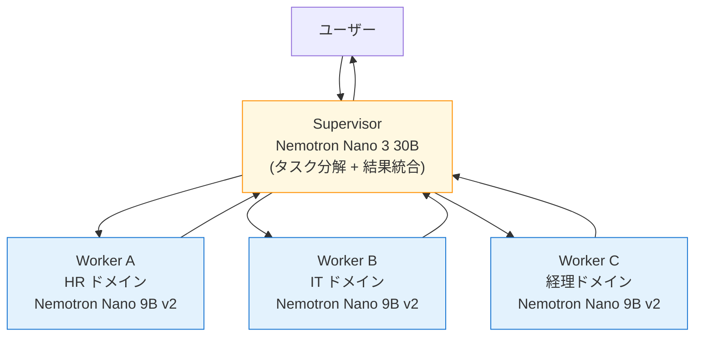
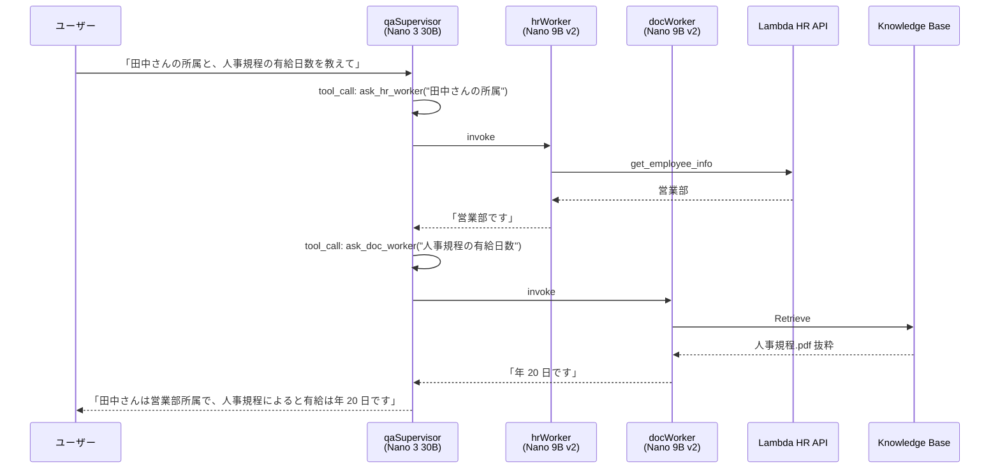
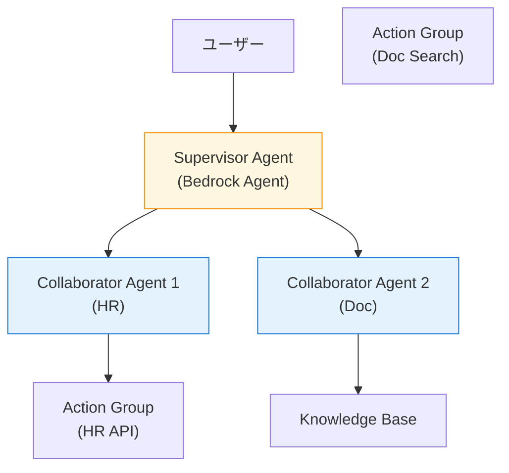

第 14 章では、ここまで Single Agent で組んできた qaSupervisor を **Supervisor + Worker の 2 階層**に拡張します。Bedrock Agents Multi-Agent Collaboration（公式の supervisor-collaborator hierarchical）と、LangGraph の supervisor pattern を比較しながら、本書の主軸である AgentCore + LangGraph で Nemotron Nano 3 30B を Supervisor に、Nano 9B v2 を Worker に据えた構成を組みます。

## この章のゴール

- Single Agent から Multi-Agent に拡張する動機を理解する
- Bedrock Agents Multi-Agent Collaboration（AWS 公式）と LangGraph supervisor pattern の違いを把握する
- Nemotron Nano 3 30B Supervisor + Nano 9B v2 Worker の 2 階層エージェントを実装する
- AgentCore Workload Identity で agent-to-agent の識別 / 認可を扱う入口を踏む
- マルチエージェントのコスト・レイテンシ感を持つ

## 前章からの引き継ぎ

前章までで Single Agent の qaSupervisor が production grade に到達しました。本章では「もう 1 段の複雑さ」を許容できる場面で活きるマルチエージェント構成を扱います。すべてのプロジェクトに必須ではありませんが、社内 Q&A の規模が大きくなる、または応答ドメインが複数分岐する場面で効きます。

## なぜマルチエージェントか

### Single Agent の限界

Single Agent は次のような状況でほつれが出ます。

| 状況                               | Single Agent の課題                                     |
| ---------------------------------- | ------------------------------------------------------- |
| ツール数が 10 を超える             | LLM が tool 選択を誤る確率が上がる                      |
| ドメインが横断的（HR + 経理 + IT） | system prompt が肥大化、応答が散漫                      |
| reasoning と executing が両立する  | 軽量モデルでは reasoning 不足、重量モデルではコスト超過 |
| 並列で複数の subtask を捌きたい    | Single graph では並列実行が組みにくい                   |

これらに対する古典的な解決策が **Supervisor + Worker** の 2 階層です。

### 2 階層エージェントの構造



Supervisor がユーザー質問を受け取り、適切な Worker に分配し、結果を統合してユーザーに返す構造です。役割分担で system prompt が小さく保て、各 Worker のドメイン特化が可能になります。

## 2 通りの実装パス

AWS で Multi-Agent を組む場合、2 通りのパスがあります。

| パス                                         | 概要                                            | 本書の扱い     |
| -------------------------------------------- | ----------------------------------------------- | -------------- |
| **Bedrock Agents Multi-Agent Collaboration** | AWS 公式の supervisor-collaborator hierarchical | 比較対象       |
| **LangGraph supervisor pattern**             | LangGraph の state graph で Supervisor を組む   | **本書の主軸** |

### Bedrock Agents Multi-Agent Collaboration

Bedrock Agents（GUI 駆動）に Multi-Agent Collaboration 機能が乗っています。AWS マネジメントコンソールから Agent を複数作り、`AssociateAgentCollaborator` API で関係を結ぶ流れです。

メリットは「**コーディングなしで組める**」ことで、デメリットは「**LangGraph のような細かい制御フローが書けない**」ことです。GUI 中心のチームには向きますが、本書のようにコード駆動を主軸にする場合、表現力で物足りなさが出ます。

### LangGraph supervisor pattern

LangGraph の `langgraph.prebuilt.create_supervisor` または `StateGraph` の手作りで、Supervisor + Worker の構造が組めます。コードで書ける範囲が圧倒的に広く、AgentCore Runtime にもそのままデプロイできます。

本書では LangGraph supervisor pattern を採用します。

## qaSupervisor を Supervisor 化する

ここまでの qaSupervisor を「Supervisor + 2 つの Worker（HR Worker / Doc Worker）」に分解します。

### Worker の用意

それぞれ独立した AgentCore Runtime としてデプロイします。

```bash
# HR Worker（社員データ専門）
agentcore create --name hrWorker \
    --framework LangChain_LangGraph \
    --protocol HTTP --build CodeZip \
    --model-provider Bedrock --memory none

# Doc Worker（社内文書専門）
agentcore create --name docWorker \
    --framework LangChain_LangGraph \
    --protocol HTTP --build CodeZip \
    --model-provider Bedrock --memory none
```

各 Worker は Nemotron Nano 9B v2 を使い、ドメイン特化した system prompt を持ちます。

```python:agents/hrWorker/app/hrWorker/main.py
SYSTEM_PROMPT = """あなたは社員データ専門のアシスタントです。
HR API（Lambda）から取得した情報をもとに、社員の所属 / 評価 / 連絡先について回答します。
社員データ以外の質問には「専門外です」と答えてください。
"""
```

```python:agents/docWorker/app/docWorker/main.py
SYSTEM_PROMPT = """あなたは社内文書専門のアシスタントです。
Bedrock Knowledge Bases から取得した社内ドキュメントをもとに、規程 / 契約書 / 技術文書について回答します。
文書に書かれていない内容は推測せず「該当する記述が見つかりませんでした」と答えてください。
"""
```

Worker のモデルは `model/load.py` で `nvidia.nemotron-nano-9b-v2` に切り替えます。

```python:agents/hrWorker/app/hrWorker/model/load.py
MODEL_ID = os.environ.get("BEDROCK_MODEL_ID", "nvidia.nemotron-nano-9b-v2")
```

各 Worker は `agentcore deploy` でそれぞれ独立した AgentCore Runtime としてデプロイされます。

### Supervisor から Worker を呼ぶ

Supervisor 側で、Worker を「ツール」として扱う設計にします。

```python:agents/qaSupervisor/app/qaSupervisor/workers.py
import json
import uuid

import boto3
from langchain.tools import tool

bedrock_agentcore = boto3.client("bedrock-agentcore", region_name="ap-northeast-1")

HR_WORKER_ARN = "arn:aws:bedrock-agentcore:ap-northeast-1:...:agent-runtime/hrWorker"
DOC_WORKER_ARN = "arn:aws:bedrock-agentcore:ap-northeast-1:...:agent-runtime/docWorker"


def _invoke_worker(arn: str, query: str) -> str:
    response = bedrock_agentcore.invoke_agent_runtime(
        agentRuntimeArn=arn,
        runtimeSessionId=str(uuid.uuid4()),
        payload=json.dumps({"prompt": query}).encode(),
    )
    chunks = []
    for chunk in response.get("response", []):
        chunks.append(chunk.decode("utf-8"))
    result = json.loads("".join(chunks))
    return result.get("result", "")


@tool
def ask_hr_worker(query: str) -> str:
    """社員データ（所属 / 評価 / 連絡先）に関する質問を HR Worker に委譲する。"""
    return _invoke_worker(HR_WORKER_ARN, query)


@tool
def ask_doc_worker(query: str) -> str:
    """社内文書（規程 / 契約書 / 技術文書）に関する質問を Doc Worker に委譲する。"""
    return _invoke_worker(DOC_WORKER_ARN, query)
```

この 2 つを `tools` リストに追加します。

```python:agents/qaSupervisor/app/qaSupervisor/main.py
from workers import ask_hr_worker, ask_doc_worker

tools = [ask_hr_worker, ask_doc_worker]

SYSTEM_PROMPT = """あなたは社内 Q&A の Supervisor です。
ユーザーの質問を分析し、適切な Worker に委譲します:

- 社員データ（所属 / 評価 / 連絡先）に関する質問 → ask_hr_worker
- 社内文書（規程 / 契約書 / 技術文書）に関する質問 → ask_doc_worker

複数 Worker への委譲が必要な場合は順次呼び出し、結果を統合してユーザーに返してください。
直接回答できる一般的な質問は Worker に投げず、自分で回答してください。
"""
```

### 全体の動き



ユーザーは Supervisor とだけ会話しますが、裏では 2 つの Worker が並行/順次に呼ばれて、結果が統合されています。

## レイテンシとコスト

Multi-Agent はレイテンシが Single Agent より長くなる傾向があります。

| 構成                       | レイテンシ目安 | 月額（1,000 conv） |
| -------------------------- | -------------- | :----------------: |
| Single Agent（前章まで）   | 1.5 秒         |       $0.88        |
| 2 階層 Multi-Agent（本章） | 3 〜 5 秒      |   約 $1.5 〜 $2    |

Worker 呼び出しが追加のラウンドトリップを生むので、レイテンシは 2 〜 3 倍に伸びます。社内 Q&A の体感では許容範囲ですが、UI 側でストリーミング応答を組まないと「待たされている」感が出やすいです。

コストは Worker の追加 Bedrock 呼び出しで増えますが、Nano 9B v2 の単価が安いので、Single Agent の 2 〜 3 倍程度に収まります。

## Workload Identity（agent-to-agent 認証）

AgentCore には **Workload Identity** という機能があり、エージェント間の認証 / 認可を組めます。

```bash
agentcore add workload-identity \
    --name qaSupervisorIdentity \
    --json
```

これで Supervisor が Worker を呼び出すときに、Supervisor 自身の identity が IAM タグや属性として伝播します。Worker 側で「呼び出し元が qaSupervisor かを確認」のような認可判定が組めます。

本書では深掘りせず、Workload Identity の存在と概念だけ押さえる程度にします。マルチエージェントが本格的に複雑になるとき（10+ エージェントなど）に活きる機能です。

## Bedrock Multi-Agent Collaboration との比較

参考までに、Bedrock Agents Multi-Agent Collaboration を使った場合の構成を示します。



Bedrock Agents 経由だと「Action Group」という抽象が入るので、Lambda Tools / Knowledge Bases は Action Group 越しに参照する形になります。GUI で組める利点はありますが、reasoning フローの細かい制御は LangGraph の方が柔軟です。

| 観点                | Bedrock Agents Multi-Agent | **LangGraph supervisor**（本書） |
| ------------------- | -------------------------- | -------------------------------- |
| 実装                | GUI / API                  | Python コード                    |
| Worker 切り替え判定 | LLM 任せ                   | Tool の説明文 + コードで強制も可 |
| 並列実行            | 限定的                     | 自由に組める                     |
| デバッグ            | Bedrock Agent traces       | LangGraph debug + Observability  |
| Cognito 認証        | 標準対応                   | Bearer Token 経由で同等          |

## マルチエージェントの設計指針

社内 Q&A の規模を超えて、本格的なマルチエージェントを組むときの指針を 5 つにまとめます。

1. **役割を 3 〜 5 個に絞る**: Worker が 10 を超えると Supervisor の選択精度が落ちる
2. **system prompt を 1,000 字以内に**: Worker ごとの専門領域を簡潔に書く
3. **Worker は再利用可能に**: 1 つの Worker を複数の Supervisor から呼べる構造にしておく
4. **観測ログを統合**: trace を Supervisor / Worker 間で連結（OpenTelemetry の trace_id 伝播）
5. **コストは Worker 重視で抑える**: Worker は軽量モデル（Nano 9B v2 など）でコストを抑え、Supervisor だけ少し重め

## トラブルシューティング

### Supervisor が tool 選択を誤る

`@tool` のデコレータの description が曖昧な場合に起きます。「どんな質問に対してこの Worker を呼ぶか」を 1 行で具体的に書くと改善します。

### Worker のレスポンスが長すぎる

Worker の `max_tokens` を絞り、Supervisor が処理しやすい長さに制限します。Worker の system prompt にも「100 字以内で要点だけ返す」と書くと効きます。

### Worker 間の状態共有が必要になる

LangGraph の StateGraph で global state に持たせるか、AgentCore Memory（Long-Term）の共有 namespace に書き込みます。本書のシナリオでは登場しませんが、複雑化したらこの方向で。

## 章末まとめ

本章で次の状態が手元に揃いました。

- Single Agent から Multi-Agent への拡張動機を整理
- Bedrock Agents Multi-Agent Collaboration vs LangGraph supervisor pattern の比較
- Nemotron Nano 3 30B Supervisor + Nano 9B v2 Worker の 2 階層構成を実装
- Worker を AgentCore Runtime として独立にデプロイ、Supervisor から `invoke_agent_runtime` で呼び出し
- レイテンシ / コスト / 設計指針の整理

エージェントが「役割分担」できる構成になりました。次章からは、ここまで作った全体を **CDK で IaC 化**して、本番運用に乗せる仕上げに入ります。

## 次章では

次章は **IaC と CI/CD** です。AWS CDK v2（Python）で本書のすべてのスタック（Bedrock KB / AgentCore / Guardrails / Lambda Tools / Identity / Monitoring）を 1 つのプロジェクトに統合し、`cdk deploy --all` で本番環境を 1 コマンドで作れる状態に整えます。GitHub Actions による staging → prod のデプロイフローも組みます。
