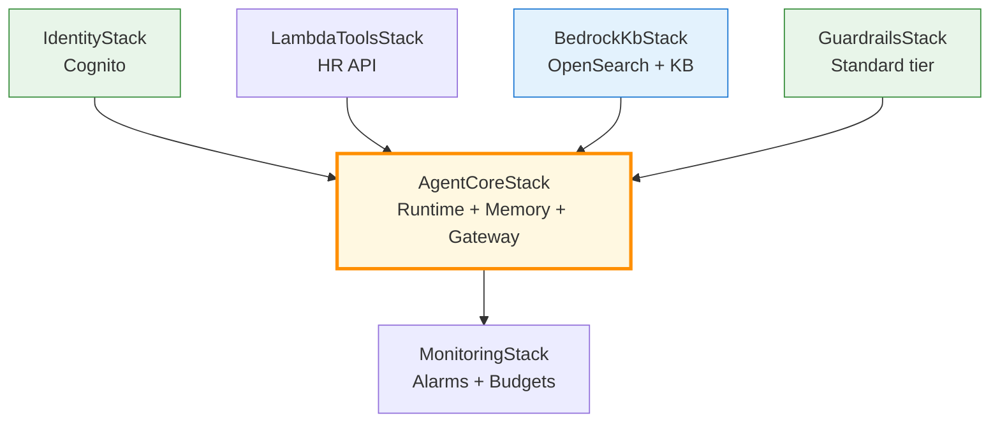
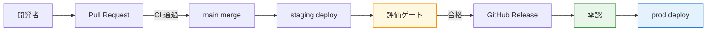

第 15 章では、ここまで章ごとに作ってきたリソース群（Bedrock KB / AgentCore / Guardrails / Lambda Tools / Identity / Monitoring）を **AWS CDK v2（Python）で 1 つのプロジェクトに統合**します。`cdk deploy --all` で本番環境を 1 コマンドで作れる状態に整え、GitHub Actions で staging → prod のデプロイフローを組みます。

## この章のゴール

- CDK のスタック分割設計を理解する
- `cdk deploy --all` で本書のすべてのリソースを 1 コマンドでデプロイできる
- `cdk-context.json` で dev / staging / prod の環境差分を吸収する
- GitHub Actions で OIDC + IAM Role assume の安全なデプロイフローを組む
- staging で評価を回し、合格したら prod にプロモートする CI/CD パイプライン

## 前章からの引き継ぎ

前章までで Single Agent + Multi-Agent の構造、評価レイヤーまで揃いました。本章ではそれらを「コードで完全再現可能な状態」に整えます。CDK で IaC 化することで、新人がプロジェクトに参加した日に `cdk deploy` 1 行で同じ環境を立ち上げられるようになります。

## CDK プロジェクトの全体像

サンプルリポの `cdk/` 配下のスタック構成です。

```text
cdk/
├── app.py                # エントリーポイント
├── cdk.json
├── cdk.context.json      # 環境別パラメータ
├── stacks/
│   ├── identity_stack.py        # Cognito User Pool（Ch 8）
│   ├── lambda_tools_stack.py    # HR API モック等（Ch 7）
│   ├── bedrock_kb_stack.py      # Knowledge Base + OpenSearch Serverless（Ch 11）
│   ├── guardrails_stack.py      # Bedrock Guardrails Standard tier（Ch 12）
│   ├── agentcore_stack.py       # AgentCore Runtime / Memory / Gateway（Ch 5-9）
│   └── monitoring_stack.py      # CloudWatch Alarms / Budgets（Ch 10）
└── tests/
    └── test_stacks.py
```

各スタックは独立しているので、`cdk deploy <StackName>` で個別にデプロイできます。

## スタック間の依存関係



`AgentCoreStack` が中央にあり、Identity / Lambda Tools / KB / Guardrails の出力を消費します。`MonitoringStack` は最後に被せます。

## `app.py` の組み立て

```python:cdk/app.py
import aws_cdk as cdk

from stacks.agentcore_stack import AgentCoreStack
from stacks.bedrock_kb_stack import BedrockKbStack
from stacks.guardrails_stack import GuardrailsStack
from stacks.identity_stack import IdentityStack
from stacks.lambda_tools_stack import LambdaToolsStack
from stacks.monitoring_stack import MonitoringStack

app = cdk.App()

env_name = app.node.try_get_context("env") or "dev"
kb_enabled = app.node.try_get_context("kb-enabled") != "false"
account = app.node.try_get_context(f"{env_name}_account")
region = "ap-northeast-1"

env = cdk.Environment(account=account, region=region)

identity = IdentityStack(app, f"Identity-{env_name}", env=env)
lambda_tools = LambdaToolsStack(app, f"LambdaTools-{env_name}", env=env)
kb = BedrockKbStack(app, f"BedrockKb-{env_name}", env=env, kb_enabled=kb_enabled)
guardrails = GuardrailsStack(app, f"Guardrails-{env_name}", env=env)
agentcore = AgentCoreStack(
    app, f"AgentCore-{env_name}",
    env=env,
    user_pool=identity.user_pool,
    lambda_tools=lambda_tools,
    knowledge_base=kb.knowledge_base if kb_enabled else None,
    guardrail_arn=guardrails.guardrail.attr_guardrail_arn,
)
monitoring = MonitoringStack(
    app, f"Monitoring-{env_name}",
    env=env,
    runtime_name=agentcore.runtime.runtime_name,
)

app.synth()
```

`env_name` で dev / staging / prod を切り替え、`kb_enabled` で Knowledge Base を停止できる構成です。各スタックの interdependency は CDK が自動で解決してくれます。

## `cdk.context.json`

環境別パラメータを 1 ファイルにまとめます。

```json:cdk/cdk.context.json
{
    "dev_account": "111111111111",
    "staging_account": "222222222222",
    "prod_account": "333333333333",
    "service_tier": {
        "dev": "flex",
        "staging": "standard",
        "prod": "standard"
    },
    "alarm_email": "ops@example.com"
}
```

dev は AWS アカウントを分けて事故を防ぐ設計（マルチアカウント）が安全ですが、本書のサンプルでは同一アカウントで env_name 別 stack 名で分離する想定にしています。

## 1 コマンドデプロイ

すべてが整ったら、次の 1 コマンドで本番環境（または staging）が立ち上がります。

```bash
# dev 環境（KB 停止、Flex tier）
cdk deploy --all \
    --context env=dev \
    --context kb-enabled=false

# prod 環境（KB 起動、Standard tier）
cdk deploy --all \
    --context env=prod \
    --context kb-enabled=true
```

初回デプロイは 15 〜 20 分（CloudFormation の各スタック作成時間の合計）、2 回目以降は変更分のみで 2 〜 5 分で完了します。

## CDK と AgentCore CLI の役割分担

ここで一度整理しておきます。AgentCore CLI（`@aws/agentcore`）は内部で CDK を呼び出してデプロイしますが、本書のサンプルリポでは **CDK を直接書く設計**を選んでいます。

| ツール        | 役割                                       | 本書での扱い        |
| ------------- | ------------------------------------------ | ------------------- |
| AgentCore CLI | scaffold / 単一エージェントの dev / deploy | Ch 5-9 のハンズオン |
| CDK 直接      | 複数スタックの統合 / カスタマイズ          | Ch 15 で完成版      |

AgentCore CLI が生成した `agentcore/cdk/` の TypeScript も Python に書き直して、`cdk/` 配下に統合する設計です。これによって、すべてのリソースが 1 つの CDK プロジェクトで管理できます。

## AgentCoreStack の中身

もっとも大きな AgentCoreStack を見てみます。

```python:cdk/stacks/agentcore_stack.py
from aws_cdk import Stack
from aws_cdk import aws_bedrockagentcore as agentcore
from aws_cdk import aws_iam as iam
from constructs import Construct


class AgentCoreStack(Stack):
    def __init__(
        self,
        scope: Construct,
        construct_id: str,
        user_pool,
        lambda_tools,
        knowledge_base,
        guardrail_arn: str,
        **kwargs,
    ):
        super().__init__(scope, construct_id, **kwargs)

        # Memory（Long-Term）
        self.memory = agentcore.CfnMemory(
            self, "QaMemory",
            name="qaShortTermMem",
            event_expiry_duration=7,
            memory_strategies=[{
                "semanticMemoryStrategy": {
                    "name": "facts",
                    "namespaces": ["/users/{actorId}/facts"],
                },
            }],
        )

        # Gateway
        self.gateway = agentcore.CfnGateway(
            self, "QaToolGateway",
            name="qaToolGateway",
            auth_type="COGNITO_JWT",
            user_pool_arn=user_pool.user_pool_arn,
        )

        agentcore.CfnGatewayTarget(
            self, "QaHrApiTarget",
            gateway_id=self.gateway.attr_gateway_id,
            type="LAMBDA",
            lambda_arn=lambda_tools.hr_api_mock.function_arn,
            tool_name="get_employee_info",
            tool_description="社員番号から所属と評価を取得する",
        )

        # Runtime
        self.runtime = agentcore.CfnAgentRuntime(
            self, "QaRuntime",
            name="qaSupervisor",
            entrypoint="main.py",
            code_location="../agents/qaSupervisor/app/qaSupervisor/",
            runtime_version="PYTHON_3_14",
            network_mode="PUBLIC",
            protocol="HTTP",
            associated_resources={
                "memoryArns": [self.memory.attr_memory_arn],
                "gatewayArns": [self.gateway.attr_gateway_arn],
                "guardrailArn": guardrail_arn,
            },
            environment={
                "BEDROCK_MODEL_ID": "nvidia.nemotron-nano-3-30b",
                "AWS_REGION": "ap-northeast-1",
                "MEMORY_NAME": self.memory.name,
                "KB_ID": knowledge_base.attr_knowledge_base_id if knowledge_base else "",
            },
        )
```

CDK Construct（`CfnAgentRuntime` / `CfnMemory` / `CfnGateway` / `CfnGatewayTarget`）が AgentCore のリソースを宣言的に組めます。AgentCore CLI が CDK 内部で生成しているのと同じものを、本書では直接書いています。

## GitHub Actions による CI/CD

サンプルリポには次の 3 ワークフローを用意しました。

```text
.github/workflows/
├── ci.yml          # PR の textlint / pytest
├── deploy-staging.yml  # main マージ時に staging へ自動デプロイ
└── deploy-prod.yml     # GitHub Release 作成時に prod へデプロイ
```

### deploy-staging.yml

```yaml:.github/workflows/deploy-staging.yml
name: Deploy to Staging

on:
  push:
    branches: [main]

permissions:
  id-token: write
  contents: read

jobs:
  deploy:
    runs-on: ubuntu-latest
    steps:
      - uses: actions/checkout@v4

      - uses: aws-actions/configure-aws-credentials@v4
        with:
          role-to-assume: arn:aws:iam::222222222222:role/GitHubActionsDeployRole
          aws-region: ap-northeast-1

      - uses: actions/setup-python@v5
        with:
          python-version: '3.12'

      - name: Install dependencies
        run: |
          curl -LsSf https://astral.sh/uv/install.sh | sh
          uv sync

      - uses: oven-sh/setup-bun@v2

      - name: Install AWS CDK
        run: bun add -g aws-cdk

      - name: CDK deploy staging
        run: |
          cd cdk
          uv run cdk deploy --all \
            --context env=staging \
            --context kb-enabled=true \
            --require-approval never

      - name: Run evaluation gate
        run: uv run python scripts/run_eval.py --env staging --threshold 0.85
```

ポイントは 3 つです。

1. **OIDC で IAM Role を assume**（access key / secret key を GitHub に保存しない）
2. **`--require-approval never`** で CDK の対話プロンプトをスキップ
3. **評価ゲート**（前章の LLM-as-Judge）を最後に走らせて、品質基準を満たさなければデプロイを fail にする

### deploy-prod.yml

prod は GitHub Release 作成時にトリガーします。

```yaml:.github/workflows/deploy-prod.yml
name: Deploy to Prod

on:
  release:
    types: [published]

permissions:
  id-token: write
  contents: read

jobs:
  deploy:
    runs-on: ubuntu-latest
    environment: production  # GitHub Environments で承認者を設定
    steps:
      # ... staging と同様
      - name: CDK deploy prod
        run: |
          cd cdk
          uv run cdk deploy --all \
            --context env=prod \
            --context kb-enabled=true \
            --require-approval never
```

`environment: production` を指定すると、GitHub Environments で「承認者」を設定でき、デプロイ前に Approval が必要になります。本番デプロイで二人目の目を入れる定石です。

## OIDC + IAM Role の設定

GitHub Actions と AWS の OIDC 連携は、CDK でセットアップできます。

```python:cdk/stacks/github_oidc_stack.py
from aws_cdk import Stack
from aws_cdk import aws_iam as iam
from constructs import Construct


class GitHubOidcStack(Stack):
    def __init__(self, scope: Construct, construct_id: str, **kwargs):
        super().__init__(scope, construct_id, **kwargs)

        github_provider = iam.OpenIdConnectProvider(
            self, "GitHubProvider",
            url="https://token.actions.githubusercontent.com",
            client_ids=["sts.amazonaws.com"],
        )

        deploy_role = iam.Role(
            self, "GitHubActionsDeployRole",
            role_name="GitHubActionsDeployRole",
            assumed_by=iam.WebIdentityPrincipal(
                github_provider.open_id_connect_provider_arn,
                conditions={
                    "StringEquals": {
                        "token.actions.githubusercontent.com:aud": "sts.amazonaws.com",
                    },
                    "StringLike": {
                        "token.actions.githubusercontent.com:sub": (
                            "repo:himorishige/aws-bedrock-agentcore-nemotron-handson:*"
                        ),
                    },
                },
            ),
            managed_policies=[
                iam.ManagedPolicy.from_aws_managed_policy_name("PowerUserAccess"),
            ],
        )
```

`StringLike` で「特定 GitHub リポジトリの workflow からのみ assume できる」ように制限しています。これで access key を一切 GitHub に保存せずに済みます。

## 環境間プロモーションフロー

dev → staging → prod のプロモーションフローを 1 枚に整理します。



評価ゲートで品質基準を強制できる仕組みが、Bedrock Guardrails / Knowledge Bases を使ったエージェントの本番運用で効きます。

## CDK ベストプラクティス

社内 Q&A エージェントを CDK で運用する際の指針を 5 つにまとめます。

1. **スタックは機能単位で分ける**: AgentCore / KB / Guardrails / Identity を一緒にしない
2. **環境別パラメータは `cdk.context.json` に**: 本番のシークレット値はコードに書かない
3. **Output で他スタックに値を渡す**: ARN / ID / endpoint は CloudFormation Outputs で連携
4. **`cdk diff` を CI で必ず流す**: 意図しないリソース変更を PR レビューで検知
5. **削除保護**（`removal_policy=RetainOnDestroy`）を本番リソースに設定： 誤って `cdk destroy` しても消えない

## トラブルシューティング

### `cdk deploy --all` が途中で失敗

CloudFormation のスタック依存関係でロールバックが連鎖することがあります。AWS マネジメントコンソールで該当スタックの Events タブを開くと、失敗したリソースが特定できます。

### IAM 権限不足

CDK Bootstrap 後の権限が足りないと、リソース作成時に失敗します。`cdk bootstrap` で作られる `cdk-deploy-role` に必要な permission が付与されているか確認します。

### 評価ゲートで CI が止まる

Nemotron Nano 9B v2 の応答が安定しないことがあります。LLM-as-Judge の `temperature=0.0` を試すか、複数回平均で安定性を上げます。

## コスト

CDK / GitHub Actions 自体の追加コストは次の通りです。

| 項目                           | 単価 / 月額         |
| ------------------------------ | ------------------- |
| GitHub Actions（Public リポ）  | 無料                |
| GitHub Actions（Private リポ） | 月 2,000 分まで無料 |
| CDK Bootstrap S3 / ECR         | 数 cents            |
| CloudFormation                 | 無料                |

実コストは前章までで挙げた Bedrock / AgentCore / OpenSearch のものだけで、IaC / CI/CD のレイヤーは無視できる範囲です。

## 章末まとめ

本章で次の状態が手元に揃いました。

- CDK プロジェクトの全 6 スタックを `cdk deploy --all` で一括デプロイ
- `cdk.context.json` で dev / staging / prod の環境差分を吸収
- GitHub Actions + OIDC で安全な自動デプロイフロー
- staging に評価ゲートを組み込み、品質基準を強制
- prod デプロイは GitHub Environments で承認者必須
- CDK ベストプラクティス 5 原則

これで「コード書いて push したら staging に勝手にデプロイされて評価まで走る」状態が完成しました。次章では、本書全体の総まとめとして本番運用チェックリストを整理します。

## 次章では

次章は **コスト最適化と本番チェックリスト**です。Service Tiers の選択フロー、Cross-Region Inference のコスト影響、CloudWatch Alarms と Budgets の組み合わせ、そして production 移行時に確認すべき 30 項目のチェックリストを整理します。本書のハンズオン部分はここで終わり、最後の付録 A/B/C で前作との差分マップ、SageMaker NIM 撤退記録、東京以外で動かす考慮を扱います。
