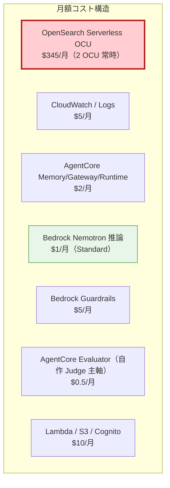
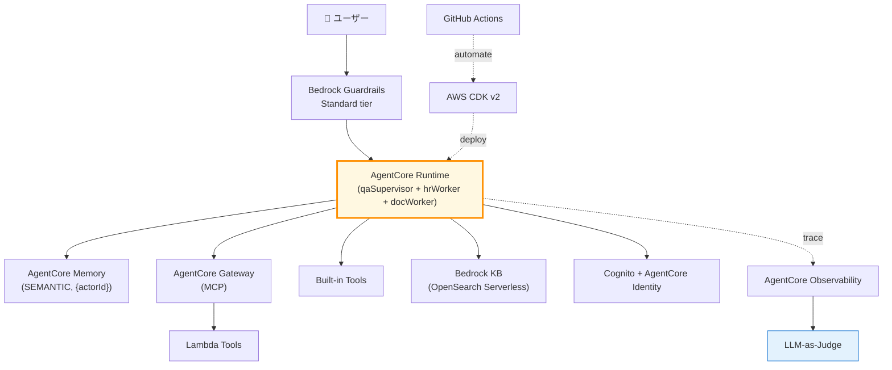

第 16 章では本書の最終章として、ここまで積み上げた構成のコスト最適化戦略と、production 移行時に確認すべき **30 項目のチェックリスト**を整理します。社内 Q&A エージェントを「動くもの」から「運用に耐えるもの」に持っていく最後のフェーズです。

## この章のゴール

- Service Tiers の選択フローを、自分のプロジェクトに当てはめて使える
- 月額試算の感覚を本書の実例ベースで持つ
- 本番移行時の 30 項目チェックリストを通過できる
- 運用 Runbook（trouble シューティング手順書）の骨格を用意できる
- 本書全体の総まとめと今後の発展方向を掴む

## 前章からの引き継ぎ

前章で IaC + CI/CD が整い、デプロイの自動化が完成しました。本章では「**お金の使い方**」と「**本番に出す前の最終確認**」の 2 つを扱います。コストとチェックリストは、エージェントを業務で使い続けられるかどうかを決める最後のピースです。

## コスト最適化の総まとめ

ここまで章ごとに見てきたコスト構造を 1 枚で振り返ります。



赤い OpenSearch Serverless が圧倒的支配要因（94%）です。残り 6% は推論 / 観測 / Guardrails で、無視できる規模です。

### 戦略 1: KB 停止運用（最大効果）

dev / staging では KB を停止し、必要なときだけ起動する運用です。

| 環境    |    KB    |    月額    |
| ------- | :------: | :--------: |
| dev     |   OFF    | **約 $10** |
| staging | 半日起動 |  約 $190   |
| prod    |   24h    |  約 $367   |

dev の月額が **$10** に収まるのが大きいです。検証で 1 〜 2 か月止めても、コストの実害がほぼゼロになります。

### 戦略 2: Service Tier 切り替え

dev は Flex tier、prod は Standard tier、という切り替えで Bedrock 推論コストを 50 〜 60% 削減できます。CDK の `cdk.context.json` で env 別に切り替える設計を Ch 15 で組みました。

### 戦略 3: 自作 LLM-as-Judge

AgentCore Evaluator（Tier1 Output $12 / 1M）の代わりに、Nemotron Nano 9B v2 の structured outputs を使った自作 Judge（$0.07 / 1M）でコストを **1/170** にしました。Ch 13 のパターンです。

### 戦略 4: Cost Budgets + Cost Anomaly Detection

固定閾値の Budgets（月 100 USD）と、機械学習ベースの Anomaly Detection の二重化で、想定外のコストスパイクを早期検知します。Ch 2 で初期設定、Ch 16 で運用化という流れです。

## Service Tiers 選択フロー

Bedrock の 4 tier をどう使い分けるかをフローチャートにまとめます。

```mermaid
flowchart TD
    Q1{リアルタイム性<br/>(< 5 秒)が必要?}
    Q2{月予算が<br/>厳しい?}
    Q3{大量バッチ<br/>処理?}
    Q4{SLA で<br/>速度保証?}

    A1["Standard"]
    A2["Flex"]
    A3["Batch"]
    A4["Priority"]

    Q1 -->|Yes| Q4
    Q1 -->|No| Q3
    Q4 -->|Yes| A4
    Q4 -->|No| Q2
    Q2 -->|Yes| A2
    Q2 -->|No| A1
    Q3 -->|Yes| A3
    Q3 -->|No| A2
    style A1 fill:#fff8e1,stroke:#ff8f00
    style A2 fill:#e8f5e9,stroke:#388e3c
    style A3 fill:#f3e5f5,stroke:#7b1fa2
    style A4 fill:#e3f2fd,stroke:#1976d2
```

社内 Q&A の本番（リアルタイム対話、SLA は厳しすぎない、月予算ふつう）は Standard tier、開発時は Flex tier、月次レポート生成のような用途は Batch、というパターンが定石です。

## 月額試算の実例

複数のシナリオで具体的な月額を比較します。

### シナリオ A: 小規模社内ツール（部署内利用）

| 項目                        | 規模               |    月額     |
| --------------------------- | ------------------ | :---------: |
| ユーザー                    | 10 名              |      —      |
| 月間 conversation           | 500                |      —      |
| Bedrock 推論（Standard）    | 入出力 6.5M tokens |    $0.45    |
| AgentCore                   | 軽量               |     $1      |
| KB（OpenSearch Serverless） | 2 OCU              |    $345     |
| その他                      | —                  |     $10     |
| **合計**                    |                    | **約 $356** |

KB 起動するなら、ユーザー数や conversation 数によらず **月 $356** が下限になります。

### シナリオ B: 中規模社内 SaaS

| 項目                          | 規模               |    月額     |
| ----------------------------- | ------------------ | :---------: |
| ユーザー                      | 500 名             |      —      |
| 月間 conversation             | 10,000             |      —      |
| Bedrock 推論（Standard）      | 入出力 130M tokens |     $9      |
| AgentCore（Memory + Gateway） | 増                 |     $20     |
| KB                            | 同上               |    $345     |
| Guardrails                    | 増                 |     $50     |
| その他                        | —                  |     $30     |
| **合計**                      |                    | **約 $454** |

500 名規模でも月 $500 以下に収まる試算です。OpenSearch Serverless の OCU 固定費の比率は 76% に下がります。

### シナリオ C: 全社利用（5,000 名）

| 項目                     | 規模               |     月額      |
| ------------------------ | ------------------ | :-----------: |
| ユーザー                 | 5,000 名           |       —       |
| 月間 conversation        | 100,000            |       —       |
| Bedrock 推論（Standard） | 入出力 1.3B tokens |      $90      |
| AgentCore                | 大                 |     $100      |
| KB（4 OCU 推奨）         | 4 OCU              |     $690      |
| Guardrails               | 大                 |     $300      |
| その他                   | —                  |     $200      |
| **合計**                 |                    | **約 $1,380** |

全社展開でも月 $1,500 程度。1 ユーザーあたり月 $0.28 です。AWS マネージドの恩恵で、運用エンジニアを 1 人雇うコストの 1/100 で済みます。

## 本番移行 30 項目チェックリスト

エージェントを本番に出す前に、必ず確認すべき 30 項目を整理しました。社内 Q&A 規模ならこのリストを通過できれば production grade です。

### A. 認証 / 認可（5 項目）

- [ ] 1. Cognito User Pool の MFA が有効
- [ ] 2. JWT の有効期限が短く設定（15 〜 60 分）
- [ ] 3. Lambda Tools 側で `claims.sub` の検証を実装
- [ ] 4. RBAC（user / admin）の動作テストが通過
- [ ] 5. ユーザー削除時のデータ削除フローを文書化

### B. データ保護（5 項目）

- [ ] 6. Bedrock Guardrails Standard tier + APAC profile 設定済み
- [ ] 7. PII（メール / 電話）の正規表現補完が入っている
- [ ] 8. CloudWatch Logs に PII が混入していないか確認
- [ ] 9. S3 バケットの暗号化（SSE-S3 / SSE-KMS）有効
- [ ] 10. Cognito user data の保管期間が明確

### C. 観測 / アラート（5 項目）

- [ ] 11. CloudWatch Transaction Search 有効
- [ ] 12. 5 つの KPI（latency / token / error / tool failure / session）の Dashboard 作成
- [ ] 13. Critical アラート（p95 が 5 秒超、error が 5% 超）が Slack / メールに飛ぶ
- [ ] 14. Cost Budgets で月予算アラート設定
- [ ] 15. Cost Anomaly Detection 有効

### D. 評価 / 品質（5 項目）

- [ ] 16. 評価データセット（最低 50 ケース）が S3 に登録
- [ ] 17. CI/CD に評価ゲート組み込み
- [ ] 18. baseline スコア（accuracy ≥ 0.85 等）が定義
- [ ] 19. 評価結果の経時変化を Dashboard 化
- [ ] 20. 異常時の手動評価 Runbook が用意

### E. 信頼性（5 項目）

- [ ] 21. AgentCore Runtime の再起動 / リトライ動作確認
- [ ] 22. Lambda Tools のタイムアウト設定（10 〜 30 秒）
- [ ] 23. Memory が full になったときの fallback 動作
- [ ] 24. KB の sync 失敗時のリトライ
- [ ] 25. Cognito 認証失敗時のエラーメッセージが分かりやすい

### F. 運用 / コスト（5 項目）

- [ ] 26. dev / staging で KB 停止運用が機能している
- [ ] 27. Service Tier の切り替え（Flex / Standard）が動作確認済み
- [ ] 28. CDK で `removal_policy=Retain` が本番リソースに設定
- [ ] 29. GitHub Environments の prod 承認者が 2 名以上
- [ ] 30. Runbook（運用手順書）が GitHub リポに格納

## 運用 Runbook の骨格

GitHub リポの `docs/runbook.md` に置く想定の骨格です。

```markdown:docs/runbook.md
# 社内 Q&A エージェント運用 Runbook

## 1. 通常運用

### 朝の確認
- CloudWatch Dashboard を見る（5 KPI）
- 評価 Dashboard を見る（前日のスコア推移）

### 週次
- 評価データセットに新ケースを追加
- Cost Explorer で支出を確認

## 2. インシデント対応

### Critical アラート発火（p95 > 5 秒）
1. CloudWatch Logs で trace_id を特定
2. agentcore traces view で原因 span を特定
3. Lambda / KB / Bedrock のどこで詰まっているか判定
4. 30 分以内に暫定対処、24 時間以内に恒久対処

### コスト急上昇
1. Cost Explorer で増分の内訳を確認
2. OpenSearch Serverless OCU が増えていないか確認
3. 4 OCU に増えていたら、KB 設定を見直す

### Bedrock model access 失効
1. AWS マネジメントコンソールで再申請
2. agentcore deploy でリソース再起動

## 3. アップグレード手順

### Nemotron モデルバージョン更新
1. dev で BEDROCK_MODEL_ID 切り替え
2. 評価データセットで baseline ±5% 以内を確認
3. staging で 1 週間運用
4. prod に GitHub Release でロールアウト
```

これを継続的にアップデートしていけば、エージェントが long term に運用できる体制が整います。

## 本書全体の総まとめ

ここまで 16 章 + 付録（Sprint 7 で扱う）を通じて積み上げてきた構成をまとめます。

### 達成した状態



### 5 つの差別化ポイント

本書で扱った差別化要素をあらためて整理します。

1. **Bedrock ネイティブ Nemotron Nano 3 30B**（公式モデルカード未掲載、東京で爆速 1 秒未満）を主軸モデルに据えた
2. **Bedrock Guardrails Standard tier + APAC profile + Cross-Region Inference 必須**という日本語サポートの罠を実機ログで明らかにし、解決策を提示
3. **Nemotron は KB に直接組み込めない**という制約を踏まえた **Agent 経由間接 RAG** の設計パターンを提示
4. AgentCore CLI（`@aws/agentcore`）+ AWS CDK の組み合わせで、scaffold から本番運用まで一気通貫
5. 自作 LLM-as-Judge で評価コストを **AgentCore Evaluator の 1/170** に圧縮

### コスト達成

dev $10 / staging $190 / prod $367 の 3 段階で、KB 停止運用や Service Tier 切り替えなどの戦略で月額を最小化できる構成を組みました。

## 今後のロードマップ

本書のスコープを超える方向性をいくつか挙げます。

| 方向                     | 内容                                            | 想定読者           |
| ------------------------ | ----------------------------------------------- | ------------------ |
| マルチモーダル           | Nemotron Nano 12B VL でスクリーンショット解析   | 業務効率化         |
| 音声インタフェース       | Amazon Transcribe + Polly + qaSupervisor        | コールセンター応用 |
| Agent-to-Agent 高度化    | A2A プロトコル / Workload Identity 詳細         | 大規模エージェント |
| Bedrock AgentCore Beyond | Strands Agents / CrewAI / LlamaIndex 切り替え   | フレームワーク比較 |
| 業界別 Vertical          | 医療 / 金融 / 製造の domain-specific guardrails | 業界実装           |

本書の社内 Q&A は技術スタックの理解のための題材で、上記のいずれの方向にも応用できる骨格になっています。

## 章末まとめ

本章で次の状態が手元に揃いました。

- コスト最適化の 4 戦略（KB 停止 / Tier 切替 / 自作 Judge / Budgets+Anomaly）
- Service Tier 選択フロー
- 月額試算 3 シナリオ（部署内 / 中規模 / 全社）
- 本番移行 30 項目チェックリスト
- 運用 Runbook の骨格
- 本書全体の総まとめ + 5 つの差別化ポイント
- 今後のロードマップ

本書のハンズオン部分はここで終わりです。次の付録 A / B / C で、前作読者向けの差分マップ、SageMaker NIM デプロイ撤退記録、東京以外で動かす場合の考慮を整理します。

## 次章では

次の付録 A は **前作 2 冊からの差分マップ**です。前作の OSS スタック（NAT + NIM + Milvus + Langfuse + NeMo Guardrails）が AWS マネージドのどこに対応するかを 4 本柱の表で整理し、移行のコスト感も示します。前作読者向けの「あの構成が AWS でこうなる」というコントラスト体験を提供する付録です。
