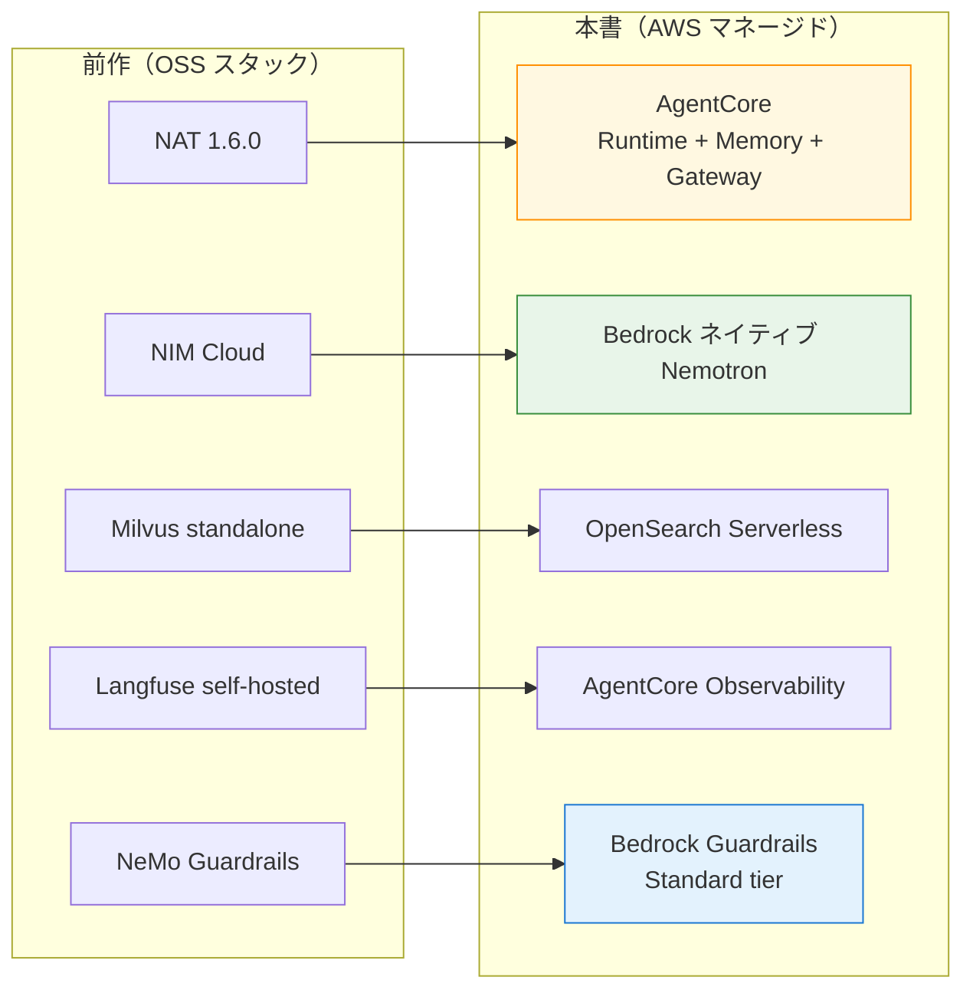
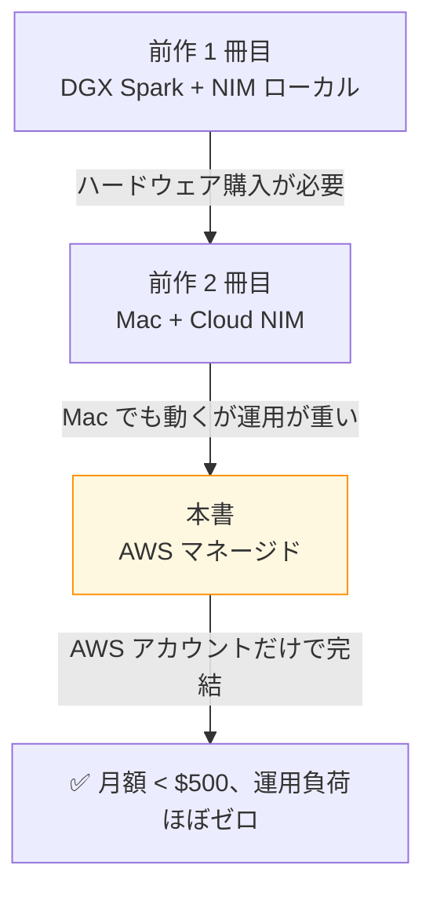

付録 A は、前作 2 冊（[NAT 入門編](https://zenn.dev/himorishige/books/nemo-agent-toolkit-nim-handson) / [NAT 実践運用編](https://zenn.dev/himorishige/books/nemo-agent-toolkit-production-ops)）の OSS スタックが、本書の AWS マネージド構成のどこに対応するかを 4 本柱の表で整理する付録です。前作読了者向けに「あの構成が AWS でこうなる」というコントラスト体験を提供します。

## 全体マップ

5 つの主要コンポーネントが、それぞれ AWS マネージドの対応物に置き換わります。

## 4 本柱の対応表

前作 2 冊目（実践運用編）で扱った **4 本柱（Orchestration / Guardrails / Observability / Eval Dataset）** を軸に、本書での扱いを整理します。

### 1. Orchestration

| 観点                | 前作（OSS）                   | 本書（AWS マネージド）           |
| ------------------- | ----------------------------- | -------------------------------- |
| Agent ランタイム    | NAT 1.6.0                     | **AgentCore Runtime**            |
| Workflow ライブラリ | LangGraph + nat function      | LangGraph 単体                   |
| ホスト              | Colima 6 CPU / 12 GB ローカル | Serverless（管理不要）           |
| デプロイ            | docker compose                | `bedrock-agentcore` SDK          |
| MCP ツール公開      | NAT の MCP serve              | **AgentCore Gateway**            |
| 認証                | なし（dev）                   | **Cognito + AgentCore Identity** |
| スケーラビリティ    | 単一マシン                    | AWS マネージド                   |

NAT の YAML driven な設計を捨て、LangGraph の state graph を直接 AgentCore Runtime にデプロイする構成です。フレームワーク非依存のメリットは保ちつつ、運用負荷を AWS マネージドに移譲しています。

### 2. Guardrails

| 観点             | 前作（OSS）                                      | 本書（AWS マネージド）                                       |
| ---------------- | ------------------------------------------------ | ------------------------------------------------------------ |
| ガードレール基盤 | NeMo Guardrails v0.21 + Colang 1.0               | **Bedrock Guardrails Standard tier**                         |
| 入力検閲         | self-check input + Colang flow                   | PII / topic / harmful / Prompt Attack                        |
| 出力検閲         | self-check output + Multilingual Safety Guard 8B | 同上                                                         |
| 日本語対応       | NemoGuard Safety Guard Multilingual v3（85.32%） | Bedrock Guardrails 日本語サポート（Standard tier、限界あり） |
| 統合パターン     | LLMRails.check_async / RunnableRails             | `Converse` インライン / `ApplyGuardrail` 外付け              |
| カスタマイズ     | Colang DSL                                       | コンソール / CDK 設定                                        |
| 運用             | self-hosted（compose 4 サービス）                | フルマネージド                                               |

ここが本書 Ch 12 の核心領域です。Bedrock Guardrails Standard tier で content filter / Prompt Attack は日本語動作するものの、PII Email / Phone は限界があり、**NemoGuard Safety Guard NIM を補助で残す価値がある**唯一のレイヤーです。

### 3. Observability

| 観点               | 前作（OSS）                       | 本書（AWS マネージド）                        |
| ------------------ | --------------------------------- | --------------------------------------------- |
| 観測基盤           | Langfuse v3.22 self-hosted        | **AgentCore Observability + CloudWatch**      |
| 起動方法           | docker compose（6 サービス）      | フルマネージド                                |
| trace 形式         | OTLP HTTP                         | OpenTelemetry → CloudWatch Transaction Search |
| Agent Graph 可視化 | Langfuse traces                   | AgentCore Observability ダッシュボード        |
| プロンプト管理     | Langfuse Prompts                  | Bedrock Prompt management（別サービス）       |
| コスト追跡         | Langfuse                          | CloudWatch Metrics + Cost Explorer            |
| 月額               | ECS Fargate + RDS で 30 〜 50 USD | CloudWatch 課金のみで数 USD                   |
| 比較・代替         | —                                 | Langfuse on ECS（章末コラム）                 |

観測スタックは AWS マネージド側が大幅に軽量です。Langfuse on ECS の月 30 〜 50 USD が、AgentCore Observability で月数 USD に下がります。

### 4. Eval Dataset

| 観点                  | 前作（OSS）          | 本書（AWS マネージド + 自作 Judge）                |
| --------------------- | -------------------- | -------------------------------------------------- |
| データセット管理      | Langfuse Datasets    | **S3 + Git + Bedrock Evaluations**                 |
| 評価実行              | Langfuse Experiments | Bedrock Model Eval / KB Eval / AgentCore Evaluator |
| Judge モデル          | NIM Cloud（無料枠）  | **Nemotron Nano 9B v2（自作 LLM-as-Judge）**       |
| RAG 評価              | RAGAS like           | Bedrock KB Evaluation                              |
| プロンプト A/B テスト | Langfuse Prompts     | Bedrock Prompt management                          |
| 月額（評価用）        | 無料枠               | 自作 Judge で月 $0.32                              |

評価レイヤーは「**AgentCore Evaluator が高価（$12 / 1M output）**」という前作にない問題があり、自作 LLM-as-Judge で 1/170 のコストに圧縮するパターンを Ch 13 で組みました。

## 拡張領域（前作にない章）

本書には前作にない章があり、それぞれが AWS マネージドの強みを活かしています。

| 章            | テーマ                                            | 前作との関係                            |
| ------------- | ------------------------------------------------- | --------------------------------------- |
| Ch 8          | AgentCore Identity（Cognito + JWT + RBAC）        | 前作にはなし、AWS マネージドの強み      |
| Ch 11（後半） | KB Agent 経由間接組み込み                         | 前作 Milvus 直結とパターンが異なる      |
| Ch 14         | Multi-Agent Collaboration vs LangGraph supervisor | 前作実践運用編 Ch 15 の AWS 版          |
| Ch 15         | CDK v2 で全リソース                               | 前作 docker compose の AWS マネージド版 |
| 付録 B        | SageMaker Endpoint NIM 撤退記録                   | 前作にはなし、本書独自の試行            |
| 付録 C        | 東京以外で動かす考慮                              | 前作にはなし、AWS リージョン戦略        |

## 移行コスト（読者視点）

前作読了後に本書に移る読者の学習コスト感を整理します。

| 領域                       | 学習コスト | 備考                                    |
| -------------------------- | ---------- | --------------------------------------- |
| AWS 基礎（IAM / VPC / S3） | 低-中      | Bedrock 触ったことがあれば低            |
| Bedrock 基礎               | 低         | model access 申請のみ                   |
| AgentCore 6 サービス       | **高**     | 全部新サービス、Sprint 0 PoC で時間確保 |
| LangGraph                  | 低         | 前作で習得済み                          |
| CDK v2                     | 中         | Python ベースで前作読者に親和的         |
| Cognito                    | 中         | RBAC 設計の公式ドキュメントが薄い       |

逆に楽になる領域もあります。

- Colima / Docker compose の運用負荷ゼロ
- NIM のローカルデプロイ不要
- Langfuse / Milvus self-hosted 不要

## 移行ストーリー

3 段階のうち、**自分のチームがどこまで運用負荷を許容できるか**で本に投じる時間配分を決めると効率的です。

## 章 → 前作章 対応マップ

本書の各章が、前作のどの章と対応するかをマッピングしました。

| 本書の章                                | 前作 1 冊目        | 前作 2 冊目                  |
| --------------------------------------- | ------------------ | ---------------------------- |
| Ch 0-2 環境セットアップ                 | Ch 0-3             | Ch 0-2                       |
| Ch 3-4 Bedrock Nemotron + Service Tiers | Ch 4-5（NIM）      | —                            |
| Ch 5 AgentCore Runtime                  | Ch 6（NAT 入門）   | Ch 4（LangGraph 統合）       |
| Ch 6 AgentCore Memory                   | —                  | —                            |
| Ch 7 AgentCore Gateway                  | Ch 7（MCP 連携）   | Ch 9（多言語 Safety Guard）  |
| Ch 8 AgentCore Identity                 | —                  | —                            |
| Ch 9 Built-in Tools                     | Ch 8（ツール拡張） | —                            |
| Ch 10 Observability                     | Ch 9（Phoenix）    | Ch 10-11（Langfuse）         |
| Ch 11 Knowledge Bases                   | Ch 10（Milvus）    | Ch 6（RAG Milvus）           |
| Ch 12 Guardrails                        | —                  | Ch 8-9（NeMo Guardrails）    |
| Ch 13 評価                              | Ch 13（nat eval）  | Ch 13（コスト + 評価データ） |
| Ch 14 マルチエージェント                | Ch 11-12（Router） | Ch 15（Supervisor pattern）  |
| Ch 15-16 IaC + 運用                     | —                  | —                            |

前作 2 冊目の 4 本柱章（Ch 8-13）が、本書の Ch 12-13 にぎゅっと圧縮されているのが見て取れます。AWS マネージドの抽象化レベルの高さが、章数の差にも表れています。

## どちらを選ぶべきか

最終的に、自分のプロジェクトでどちらのスタックを選ぶかの判断軸を 3 つに整理します。

### OSS スタック（前作 2 冊目）を選ぶ場面

- マルチクラウド前提でベンダーロックインを避けたい
- すでに Langfuse / NemoGuard を社内で運用していて、新規構築コストが少ない
- データ越境を一切許容できない（Cross-Region Inference NG）
- カスタマイズ自由度を最大化したい

### 本書（AWS マネージド）を選ぶ場面

- AWS をすでに普段使いしている
- 運用負荷を最小化したい
- 月額予算が限られている
- 短期間で立ち上げたい
- AWS の他サービスとの統合を重視する

## 章末まとめ

付録 A で次の状態が整理できました。

- 前作 2 冊と本書の 4 本柱マッピング
- 拡張領域 / 楽になる領域 / 学習コスト
- 移行ストーリー（DGX → Mac → AWS）
- 章対応マップ
- どちらを選ぶかの判断軸

3 段ロケットを通じて、自社の運用ステージに合った構成を選べる状態になりました。次の付録 B では、本書執筆中に SageMaker Endpoint で NIM コンテナを動かそうとして撤退した記録を整理します。
