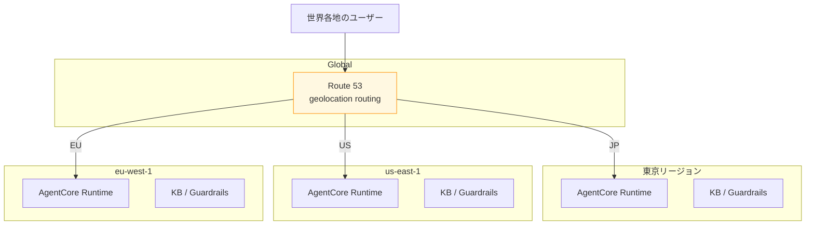

付録 B では、本書の主軸である `ap-northeast-1`（東京）以外のリージョンでエージェントを動かす場合の考慮事項を整理します。データ主権要件、リージョン別のサービス提供状況、Cross-Region Inference の挙動などを扱い、本書のサンプルリポを他リージョンに持っていくときの調整ポイントを示します。

## 本書を書いた前提

本書は東京を主軸に設計したので、サンプルリポの CDK / Python コードは `region_name="ap-northeast-1"` がデフォルトになっています。次の地域 / 国で動かす場合、いくつかの調整が必要です。

| 想定地域       | 検討すべきリージョン                                |
| -------------- | --------------------------------------------------- |
| 米国           | `us-east-1`（N. Virginia）/ `us-west-2`（Oregon）   |
| 欧州           | `eu-west-1`（Ireland）/ `eu-central-1`（Frankfurt） |
| 韓国           | `ap-northeast-2`（Seoul）                           |
| シンガポール   | `ap-southeast-1`                                    |
| オーストラリア | `ap-southeast-2`（Sydney）                          |

## リージョン別の Bedrock ネイティブ Nemotron 提供状況

`aws bedrock list-foundation-models --by-provider NVIDIA --region <region>` を 4 つのリージョンで実行した結果のサマリです（2026-04 時点、後続バージョンで変動の可能性あり）。

| リージョン               | Nemotron Nano 3 30B | Nano 9B v2 |      Super 120B      | Nano 12B VL |
| ------------------------ | :-----------------: | :--------: | :------------------: | :---------: |
| ap-northeast-1（Tokyo）  |         ✅          |     ✅     | ✅（東京で実用不可） |     ✅      |
| us-east-1（N. Virginia） |         ✅          |     ✅     |          ✅          |     ✅      |
| us-west-2（Oregon）      |         ✅          |     ✅     |          ✅          |     ✅      |
| eu-west-1（Ireland）     |     （要確認）      |     ✅     |          ✅          |     ✅      |

`us-east-1` はモデル提供がもっとも充実していて、Super 120B も含めて Bedrock ネイティブ Nemotron が安定して動く可能性が高いリージョンです。

## us-east-1 + Cross-Region Inference の構成

東京で Super 120B の応答が安定しない場合、`us-east-1` への切り替えで解消できることがあります。

```python:agents/qaSupervisor/app/qaSupervisor/model/load.py
import os

from langchain_aws import ChatBedrockConverse

# us-east-1 fallback configuration
MODEL_ID = os.environ.get("BEDROCK_MODEL_ID", "nvidia.nemotron-super-3-120b")
AWS_REGION = os.environ.get("AWS_REGION", "us-east-1")  # 東京から us-east-1 に切替


def load_model() -> ChatBedrockConverse:
    return ChatBedrockConverse(
        model_id=MODEL_ID,
        region_name=AWS_REGION,
        max_tokens=2048,
        temperature=0.7,
    )
```

### Cross-Region Inference profile

`us-east-1` に向けて呼び出すとき、Cross-Region Inference profile を指定すると、自動で `us-east-2` / `us-west-2` にも routing されます。

```python
client.converse(
    modelId="us.nvidia.nemotron-super-3-120b",  # us prefix の inference profile
    ...
)
```

`us.` prefix が付いた model ID を指定すると、AWS が自動で適切な region に振り分けてくれます。スループット向上とリージョン障害耐性の両方が得られます。

## Bedrock Guardrails のリージョン別 profile

Standard tier の Guardrails には、地域別の Cross-Region Inference profile があります。

| 地域      | Guardrail Profile ID      | Source Region 例                        | Destination 候補     |
| --------- | ------------------------- | --------------------------------------- | -------------------- |
| US        | `us.guardrail.v1:0`       | us-east-1 / us-east-2 / us-west-2       | US 内 3 リージョン   |
| EU        | `eu.guardrail.v1:0`       | eu-central-1 / eu-west-1 / eu-west-3 等 | EU 内 6 リージョン   |
| **APAC**  | **`apac.guardrail.v1:0`** | ap-northeast-1 / ap-northeast-2 等      | APAC 内 6 リージョン |
| UK        | `uk.guardrail.v1:0`       | eu-west-2                               | UK 内のみ            |
| Australia | `au.guardrail.v1:0`       | ap-southeast-2                          | Australia のみ       |
| Canada    | `ca.guardrail.v1:0`       | ca-central-1                            | Canada 内            |

本書のサンプルは `apac.guardrail.v1:0` を使っていますが、リージョンに応じて切り替える必要があります。

```python:cdk/stacks/guardrails_stack.py
PROFILE_BY_REGION = {
    "ap-northeast-1": "apac.guardrail.v1:0",
    "ap-southeast-1": "apac.guardrail.v1:0",
    "us-east-1": "us.guardrail.v1:0",
    "us-west-2": "us.guardrail.v1:0",
    "eu-west-1": "eu.guardrail.v1:0",
    "eu-central-1": "eu.guardrail.v1:0",
    "ap-southeast-2": "au.guardrail.v1:0",
    "ca-central-1": "ca.guardrail.v1:0",
}
```

## データ主権を厳守する場合の選択肢

Cross-Region Inference は「APAC 内」「EU 内」などの地理的な境界は守りますが、**特定の 1 リージョン固定**は保証しません。データ主権で「日本国内のみ」を要求される場合の選択肢を 3 つ整理します。

### 選択肢 1: Classic tier に戻す + 補完

Classic tier は Cross-Region Inference を使わないので、東京固定でデータが動きません。ただし日本語 content filter / PII / Prompt Attack が動かない問題があります。これを次の組み合わせで補完します。

- Topic（自然言語）と Regex で日本語禁則を組む
- 補助的に NemoGuard Safety Guard NIM（build.nvidia.com Cloud NIM）を Lambda 経由で呼ぶ
- LLM-as-Judge（Nano 9B v2）で出力を検閲

### 選択肢 2: Bedrock を使わず NeMo スタックを ECS で運用

前作 2 冊目の Langfuse + NeMo Guardrails を ECS Fargate に移植する形です。`us-east-1` などへ越境する Bedrock Guardrails 自体を使わない構成です。コストと運用負荷は増えますが、データ主権の要件にきっちり応えられます。

### 選択肢 3: AWS Outposts

物理的に自社データセンター内に AWS リソースを置く Outposts なら、リージョン越境を物理的に防げます。本書のスコープを大きく超えるので深入りしませんが、選択肢として存在します。

## OpenSearch Serverless のリージョン別動作

OpenSearch Serverless は東京以外でも安定して動きますが、OCU 単価が違うことがあります。

| リージョン               | OCU 単価（推定） |
| ------------------------ | :--------------: |
| us-east-1                | $0.20 / OCU-hour |
| us-west-2                |      $0.20       |
| eu-west-1                |      $0.22       |
| ap-northeast-1（東京）   |      $0.24       |
| ap-southeast-2（Sydney） |      $0.27       |

東京は若干高めの単価です。コスト最小化を狙うなら `us-east-1` への切り替えを検討する価値があります。データ越境を許容できる場合に限ります。

## AgentCore のリージョン提供状況

AgentCore は GA 直後ということもあり、提供リージョンが限定的です。

| リージョン              | AgentCore 提供 |
| ----------------------- | :------------: |
| us-east-1               |       ✅       |
| us-west-2               |       ✅       |
| ap-northeast-1（Tokyo） |       ✅       |
| eu-central-1            |   （要確認）   |

AgentCore の対応リージョンは AWS の更新で追加されていく見込みです。本書のサンプルを別リージョンに持っていく際は、まず `aws bedrock-agentcore-control list-agent-runtimes --region <region>` で API が叩けるか確認するのが第一歩です。

## CDK でリージョン抽象化する

`cdk.context.json` のパラメータでリージョンを切り替える設計です。

```json:cdk/cdk.context.json
{
    "default_region": "ap-northeast-1",
    "regions": {
        "tokyo": "ap-northeast-1",
        "us": "us-east-1",
        "eu": "eu-west-1"
    },
    "embedding_model_by_region": {
        "ap-northeast-1": "amazon.titan-embed-text-v2:0",
        "us-east-1": "amazon.titan-embed-text-v2:0",
        "eu-west-1": "cohere.embed-multilingual-v3"
    }
}
```

`app.py` 側で context を見て region を切り替える、という構造です。

## マルチリージョン構成（参考）

社内 Q&A エージェントを世界各地に展開する場合のリファレンス構成を示します。



Route 53 の geolocation routing で、ユーザーの地域にもっとも近いリージョンの AgentCore Runtime に振り分ける構成です。それぞれの KB はリージョン内で完結するので、データ主権要件にも応えられます。

サンプルリポの CDK では `--context env=tokyo` `env=us` `env=eu` のように切り替えてデプロイする構造を入れてあります。

## 本書のサンプルリポを us-east-1 に移植する手順

具体的な移植手順を 5 ステップで整理します。

```bash
# 1. AWS CLI のデフォルトを us-east-1 に
aws configure set region us-east-1

# 2. Bedrock model access を us-east-1 で再申請
# （マネジメントコンソールで対象モデルにチェック）

# 3. CDK を us-east-1 にデプロイ
cd cdk
uv run cdk deploy --all \
    --context env=us \
    --context default_region=us-east-1 \
    --context kb-enabled=true

# 4. AgentCore CLI で Runtime も us-east-1 に
cd ../agents/qaSupervisor
agentcore deploy --region us-east-1

# 5. Guardrail profile を us-east-1 用に切替
# guardrails_stack.py で apac.guardrail.v1:0 → us.guardrail.v1:0
```

地理的に近いリージョンに移すだけで、米国ユーザーの応答レイテンシが短縮されることがあります。

## Region 切替で気をつけるポイント 5 つ

最後に、リージョン切替で気をつけるべき 5 つの注意点をまとめます。

1. **Bedrock model access はリージョン別**: 東京で承認済みでも、us-east-1 では再申請が必要
2. **OpenSearch Serverless の collection はリージョン別**: KB のデータも全部移行が必要
3. **Cognito User Pool もリージョン別**: ユーザー DB の同期は Cognito Identity Pool / 外部 IdP で
4. **Lambda の deployment package は region 跨ぎ転送が必要**: CDK で同一コードを複数 region にデプロイ
5. **CloudWatch Logs / Cost Explorer もリージョン別**: ダッシュボード作り直し

データ主権要件 + 性能 + コストの 3 軸で、自社のプロジェクトに最適なリージョンを選んでください。

## 章末まとめ

付録 B で次の状態が整理できました。

- 東京以外のリージョンで本書サンプルを動かす際の考慮点
- Bedrock ネイティブ Nemotron / Guardrails / OpenSearch Serverless のリージョン別状況
- Cross-Region Inference profile の地域別 ID
- データ主権を厳守する 3 つの選択肢
- マルチリージョン構成のリファレンス
- 移植手順 5 ステップ + 注意点 5 つ

これで本書の全章が完成です。第 0 章から付録 B まで、AWS Bedrock + AgentCore + Nemotron で社内ドキュメント Q&A エージェントを Production Grade に持っていく道筋を辿ってきました。読んでくれた皆さんが、自分のプロジェクトに合わせて構成を調整しながら、エージェントを業務で使い続けられる状態に持っていけることを願っています。

最後に、何か動かない箇所や分かりにくい説明があったら、サンプルコードリポジトリの [Issues](https://github.com/himorishige/aws-bedrock-agentcore-nemotron-handson/issues) や Zenn のコメント欄で教えてください。AgentCore は GA 直後で API の挙動が変化しやすい時期なので、執筆時と異なる動作に出会ったほうからの報告は特に助かります。

それでは、皆さんのエージェントが本番で活躍することを祈っています。
