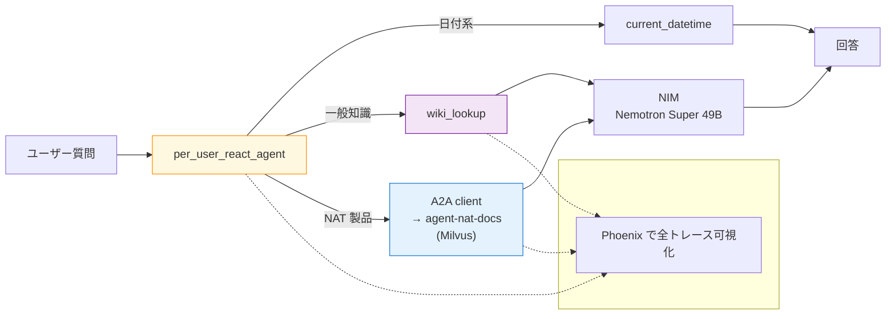
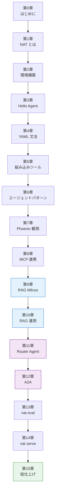

NVIDIA NeMo Agent Toolkit（以下 NAT）は、旧 AIQ Toolkit / Agent Intelligence Toolkit が 2025 年 6 月に現名称にリブランドされた「LLM エージェントを YAML で組み立てる」ためのオープンソースツールキットです。公式のサンプルは NVIDIA Inference Microservice（以下 NIM）クラウド前提で書かれていることが多く、手元で試そうとするとまず環境構築でつまずいてしまうケースが少なくないのではないでしょうか。

本書はそのつまずきを減らすため、**NIM + Docker だけ**で NAT のハンズオンを一気通貫で進めることにこだわりました。Python の venv 作成や GPU セットアップは一切不要で、`docker compose` のコマンドさえ叩ければ、最終章のマルチエージェントアプリまでたどり着けます。

## 本書の立ち位置

NAT の公式ドキュメントは網羅的ですが、初めて触るみなさんにとって「どこから読めばいいのか」が見えにくい構成です。本書では以下の順序で積み上げます。

1. NAT とは何か（第 1 章）
2. 環境を整える（第 2 章）
3. 最小構成のエージェントを動かす（第 3 章）
4. YAML ワークフローの文法（第 4 章）
5. 組み込みツール・エージェントパターン（第 5-6 章）
6. 観測とデバッグ（第 7 章：Phoenix）
7. MCP 連携（第 8 章）
8. RAG アドオン（第 9-10 章：Milvus 投入 → 運用チューニング）
9. マルチエージェント（第 11-12 章：Router → A2A）
10. 評価とデプロイ（第 13-14 章）
11. 完成アプリの総仕上げ（第 15 章）

単発記事ではなく本の形にした理由は、**最終章のマルチエージェントアプリは 14 章分の積み上げがあってはじめて理解しやすくなる**からです。途中の章だけつまみ食いしても、全体像は見えにくいと考えています。

## 本書で作るもの

題材は「NeMo Agent Toolkit 公式ドキュメントと一般知識のハイブリッド Q&A エージェント」です。ナレッジソースは NVIDIA/NeMo-Agent-Toolkit リポジトリの docs（Apache 2.0）から抜粋した 24 ファイル（約 1,034 チャンク）。章を進めるごとに機能が増えていき、最終章では以下のような姿になります。



これを Zenn Book のスコープに収まる範囲で、コピペで動くコードとして提示します。

## 本書の対象読者

次のような読者を想定しています。

- Python の基本文法と `pip install` がわかる
- Docker / `docker compose` のコマンドを 2-3 個は叩いた経験がある
- LLM エージェントという言葉は聞くが、自分で組んだことはない
- LangChain / LangGraph の名前は知っているが、体系立てて学びたいのは別の機会

GPU や DGX Spark は不要です。動作確認は macOS（Apple Silicon Colima）と Ubuntu（native Docker Engine）の 2 環境で行っています。

## 本書で扱わないこと

以下は意図的にスコープ外にしています。

- ローカル LLM（Ollama / vLLM）の運用ノウハウ
- GPU セットアップ、CUDA 関連のトラブルシュート
- LangChain / LangGraph の内部構造の深掘り
- NVIDIA 以外の LLM プロバイダ（OpenAI / Anthropic / Bedrock）への切り替え

NIM は build.nvidia.com の無料クレジット枠で全章を通しで回せる想定です。詳細は付録 B にまとめます。

## 必要な環境

| 項目              | 内容                                                                                             |
| ----------------- | ------------------------------------------------------------------------------------------------ |
| OS                | macOS / Linux / Windows（WSL2）                                                                  |
| Docker ランタイム | Colima 推奨、Docker Desktop / native Docker Engine も可                                          |
| ディスク空き      | 3-5 GB（Docker イメージ + Phoenix / Milvus のローカルデータ）                                    |
| NGC API key       | [build.nvidia.com](https://build.nvidia.com) で無料取得（NVIDIA Developer アカウント登録が必要） |
| エディタ          | 任意（本書のスクショは VS Code + Zenn 拡張で撮影しています）                                     |

第 2 章で Colima のインストールから丁寧にやっていきますので、Docker をこれから始めるみなさんでもついてこられる構成です。

## サンプルコード

全章のサンプルコードは GitHub で配布しています。

https://github.com/himorishige/nemo-agent-toolkit-book

章ごとに `chNN-*/` ディレクトリが切ってあり、各ディレクトリに `docker-compose.yml` と必要な設定ファイルが揃っています。本書を読みながら `git clone` した手元で動作確認できる設計です。

```bash
git clone https://github.com/himorishige/nemo-agent-toolkit-book.git
cd nemo-agent-toolkit-book/ch03-hello-agent
cp .env.example .env  # NGC_API_KEY を記入
docker compose run --rm nat
```

## 本書のバージョン前提

| コンポーネント | バージョン                                    |
| -------------- | --------------------------------------------- |
| nvidia-nat     | 1.6.0                                         |
| Python         | 3.12（Docker イメージ側）                     |
| workflow LLM   | nvidia/llama-3.3-nemotron-super-49b-v1（NIM） |
| judge LLM      | nvidia/llama-3.3-nemotron-super-49b-v1（NIM） |
| Embedding      | nvidia/nv-embedqa-e5-v5（NIM）                |
| Phoenix        | 14.8.0                                        |
| Milvus         | milvusdb/milvus v2.5.4（Docker standalone）   |
| pymilvus       | 2.5 系                                        |

NAT はマイナーバージョンでも `_type` 名称や evaluator のカタログが変わることがあります。1.7 以降で挙動が変わった箇所は、章末にその都度差分メモを追記していく運用です。

## 読み進め方のおすすめ

- **第 1 章 → 第 3 章**は一気に読んで「Hello Agent が動く」状態を作るのがおすすめです。ここまで通せば NAT が自分の手に馴染むかを判断できます
- **第 4 章以降**は、興味のある章から寄り道しても問題ありません。依存関係は次の章依存図で確認できます
- **第 11 章以降は前章の成果物を使い回す**構成なので、まとまった時間を取って取り組む流れが向いています

## 章依存図



青が RAG、紫がマルチエージェント、緑が完成章です。

## フィードバック

本書の内容で動かないコードや、分かりにくい箇所があれば、以下のいずれかで気軽にお知らせください。

- サンプルコードリポジトリの [Issues](https://github.com/himorishige/nemo-agent-toolkit-book/issues)
- Zenn の各章下部のコメント欄

## 次章では

次章では NeMo Agent Toolkit そのものの立ち位置を俯瞰します。LangChain や LangGraph との違い、YAML で組み立てる設計思想、NIM / Guardrails / NemoClaw など周辺の NVIDIA エージェントエコシステムとの関係を整理したうえで、第 2 章以降のハンズオンに備えます。
