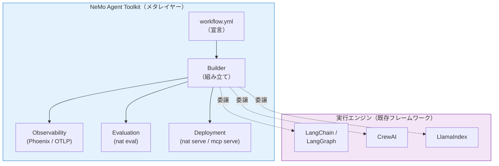
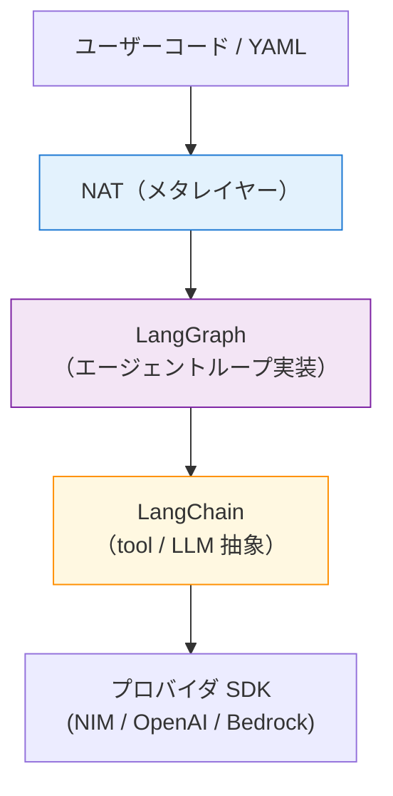

第 1 章では、本書のテーマである NVIDIA NeMo Agent Toolkit（以下 NAT）の立ち位置を俯瞰します。この章にハンズオンは登場しません。第 2 章から手を動かし始める前に、「NAT はそもそも何を狙ったツールキットなのか」「LangChain や LangGraph とはどう違うのか」を押さえておくと、以降の章の YAML の読み解きがぐっとラクになります。

## この章のゴール

- NAT が何をするツールキットなのかを、30 秒で説明できるようになる
- LangChain / LangGraph と NAT の役割分担を図でイメージできる
- NIM / NeMo Guardrails / NemoClaw など周辺ツールとの境界線を把握する
- 本書が NAT の機能のどこまでを扱うのかを再確認する

## NAT のアイデンティティ

NAT は、**LLM エージェントを YAML で組み立て、横串で観測・評価・最適化するためのメタレイヤー型ツールキット**です。パッケージ名は `nvidia-nat`、ライセンスは Apache 2.0。旧名称 AIQ Toolkit / Agent Intelligence Toolkit から 2025 年 6 月に現名称へリブランドされ、後方互換の `aiqtoolkit` / `agentiq` パッケージも残っています。

ポイントはひとつで、「NAT 自身はエージェントの実行エンジンを持たない」という点です。ReAct ループや tool 呼び出しといったコア処理は LangChain や LangGraph、CrewAI、LlamaIndex といった既存のエージェントフレームワークに委ねます。NAT はそれらを YAML で宣言的に束ね、外側から観測・評価・デプロイのレイヤーをかぶせる役割を担っています。

この「自分では実行しない、束ねる」というスタンスが、NAT を理解するうえでいちばん大事な発想です。

## なぜメタレイヤー型なのか

すでに LangChain / LangGraph / CrewAI / LlamaIndex など、エージェントを組める OSS は揃っています。企業内でも「チーム A は LangChain、チーム B は LlamaIndex」のように、プロジェクトごとに別々のフレームワークが使われるケースも少なくありません。

この状況で問題になるのが、**観測・評価・デプロイを横串で統一したい**というニーズです。トレースはチームごとにバラバラ、評価基準もまちまち、MCP 公開も FastAPI 化もそれぞれ独自実装、ではガバナンスが効きません。

NAT はこの「横串レイヤー」に特化しました。以下の観点で既存ツールを束ねます。

| レイヤー   | NAT が提供するもの                                     |
| ---------- | ------------------------------------------------------ |
| 宣言       | `workflow.yml` による DSL、`_type` ベースの差し替え    |
| 観測       | OpenTelemetry / Phoenix / Langfuse 連携（YAML 3 行）   |
| 評価       | `nat eval` + evaluator 6 種（ragas / trajectory ほか） |
| デプロイ   | `nat serve`（FastAPI）/ `nat mcp serve`（MCP 公開）    |
| マルチ連携 | A2A プロトコル、agent-as-tool                          |

チームごとに実装フレームワークが違っても、YAML の `_type` を書き換えるだけで横串のメトリクスを揃えられる、というのが NAT のセールスポイントです。

## LangChain / LangGraph との関係

本書でいちばん混乱しやすいのがここです。結論から言うと、**LangChain / LangGraph と NAT は対立する関係ではなく、「下と上」の関係**です。

本書の ReAct エージェントも、実体は LangGraph の ReAct 実装を NAT が呼び出しています。読者が書くのは YAML だけですが、下では LangGraph のノード遷移が動いています。つまり「LangChain / LangGraph を知っていると NAT の動きが読みやすい」ものの、「知らなくても本書のハンズオンは進められる」ように作られています。

:::message
本書では LangChain / LangGraph の内部構造には踏み込みません。NAT の挙動を理解するうえで必要になったら、該当する LangChain ドキュメントへのリンクだけ示します。
:::

## 主要コンセプト

NAT の YAML を読むうえで覚えておきたいのは、次の 4 つのキーワードです。

| 概念     | 役割                                                                         |
| -------- | ---------------------------------------------------------------------------- |
| Function | 単機能の実装単位。tool も retriever も evaluator もすべて Function の一種    |
| LLM      | プロバイダ別の LLM クライアント（`_type: nim` / `openai` / `bedrock` など）  |
| Workflow | エージェントとしての振る舞い（ReAct / ReWOO / Tool Calling / Router など）   |
| Builder  | YAML を読んで Function と LLM と Workflow を組み立てる実行時オーケストレータ |

YAML の `functions:` / `llms:` / `workflow:` / `general:` という 4 セクションは、このコンセプトにほぼ 1 対 1 で対応します。第 4 章で具体的な YAML を読みながら掘り下げますが、この表を頭の片隅に置いておくと以降の章の見通しがよくなります。

## NVIDIA エージェントエコシステムの中での位置

NVIDIA は 2025 年後半にかけて、エージェント開発向けのツールを立て続けに公開しました。名称が似ているため混乱しやすいので、本書のスコープに関わるものだけ整理しておきます。

| ツール                        | 役割                                                   | 本書での扱い                 |
| ----------------------------- | ------------------------------------------------------ | ---------------------------- |
| NeMo Agent Toolkit            | エージェントの宣言・観測・評価・デプロイのメタレイヤー | **主役**                     |
| NIM（Inference Microservice） | LLM / Embedding / Safety 等の推論エンドポイント        | NIM を全章で使用             |
| NeMo Guardrails               | 入出力の安全レール                                     | 本書では扱わない（別本候補） |
| NemoClaw                      | サンドボックス化したエージェント実行環境               | 本書では扱わない             |
| Cosmos-Reason                 | Vision-Language モデル（VLM）                          | 本書では扱わない             |

NAT は「エージェントの組み立て本体」、NIM は「呼び出す LLM の供給元」と分けて覚えるのが分かりやすい整理です。本書では NAT × NIM クラウドの組み合わせに絞って扱います。

## なぜ YAML なのか

エージェントの設計図を Python で書くか、YAML で書くか。これはしばしば議論になるポイントです。NAT が YAML を選んだ背景にあるのは、「差し替え」「レビュー」「ガバナンス」の 3 点だと筆者は理解しています。

差し替えという観点では、`_type` を 1 行書き換えるだけで、ローカル LLM と NIM クラウドの切り替え、FAISS と Milvus の切り替えが完結します。

レビューの観点では、Python コードは副作用が混じりがちなのに対し、YAML は宣言的なので diff レビューと CI チェックに向いています。セキュリティレビューやコードレビューのプロセスに乗せやすい形と言えます。

そしてガバナンスの観点では、セキュリティレビュー、データリネージ、コスト見積もりのすべてを YAML ファイル単位で回せます。組織でエージェントを運用する際、「このエージェントで使っている LLM は何か」「どの retriever を参照しているか」を 1 ファイルで追えるのは地味に効きます。

その裏返しで、込み入った制御フローや動的なエージェント構築は YAML では書きづらい領域です。NAT は「YAML で表現できる範囲まで」を宣言で握り、そこから先は Python の Function として書く、という割り切りになっています。本書でもこの割り切りに沿って進めます。

## 本書で扱う NAT のスコープ

ここまでの話を踏まえて、本書が NAT のどこを扱うか / 扱わないかを再確認しておきます。

本書で扱うのは次の範囲です。

- YAML による workflow 組み立て（第 3-6 章）
- Phoenix によるトレース可視化（第 7 章）
- MCP クライアント・サーバー（第 8 章）
- LangChain Retriever を介した RAG（第 9-10 章）
- agent-as-tool と A2A プロトコル（第 11-12 章）
- `nat eval` による評価駆動開発（第 13 章）
- `nat serve` で FastAPI 公開（第 14 章）

一方で、以下は意図的にスコープ外にしています。

- ローカル LLM（Ollama / vLLM）を NAT から呼ぶパターン
- LangSmith / Langfuse / CrewAI 統合の深掘り
- `nat optimizer` によるプロンプト自動調整（NAT 1.6 時点ではベータ的で、本書の完走後に別途取り組みたい領域）

NAT は機能がかなり広く、公式ドキュメントを読むだけだと「で、何から触ればいい？」となりがちです。本書は **「NIM でマルチエージェントの RAG アプリを一本組み上げる」という軸**でスコープを切っています。他の領域が気になる場合は、完走後に公式ドキュメントを読み込む足がかりとして使ってください。

## 次章では

次章では手を動かすための環境を整えます。Colima のインストール、Docker と docker compose の動作確認、NGC API key の取得と `.env` への記入までを丁寧に追います。Docker をこれから使い始める場合でも、まっすぐ進めるように書いていきます。
