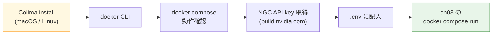

この章では、本書のハンズオン全章で使う実行環境をセットアップします。具体的には、Docker ランタイム（Colima または Docker Desktop）、`docker compose` の動作確認、NGC API key の取得、NAT 実行用のベースイメージのビルドまでを一気に整えます。

次章以降はこの章で作った環境をそのまま流用します。途中で詰まったら迷わず本章に戻ってきてください。

## この章のゴール

- 手元で `docker compose version` が返るようになる
- NVIDIA build.nvidia.com で NGC API key を発行する
- `.env` ファイルに NGC API key を記入し、`docker compose run` で疎通確認する
- NAT 実行用のベースイメージがビルドできる

## 前章からの引き継ぎ

特にありません。NAT の位置付けを押さえたら、まず環境構築から始めましょう。

## 所要時間

- Colima を新規インストールする場合は 30-45 分
- Docker Desktop / native Docker Engine がすでに動いている環境なら 15-20 分

## 全体像



## Docker ランタイムの選択肢

本書では Docker ランタイムとして次の 3 つを想定します。どれでも同じ compose ファイルが動きます。

| ランタイム           | 推奨環境              | メリット                                               |
| -------------------- | --------------------- | ------------------------------------------------------ |
| Colima               | macOS、Linux          | OSS、軽量、Docker Desktop のライセンス問題を回避できる |
| Docker Desktop       | macOS、Windows、Linux | GUI 付き、使い慣れている環境なら学習コストゼロ         |
| native Docker Engine | Linux                 | 一番素直、サーバー運用との相性がよい                   |

本章では **Colima（macOS）** をメインに、Docker Desktop と native Docker Engine は補足で扱います。すでに Docker Desktop か native Docker Engine で `docker compose` が動く環境があれば、「NGC API key の取得」まで読み飛ばして構いません。

:::message
Colima は Lima（Linux Machine）をベースにした軽量な Docker / Kubernetes ランタイムです。macOS 26（Tahoe）で動作確認済みです。Windows ユーザーは WSL2 + Docker Desktop の組み合わせがもっともトラブルが少ないでしょう。
:::

## Colima のインストール（macOS）

Homebrew が入っていれば、Colima のインストールは数コマンドで終わります。

```bash
# Homebrew が未導入なら:
# /bin/bash -c "$(curl -fsSL https://raw.githubusercontent.com/Homebrew/install/HEAD/install.sh)"

brew install colima docker docker-compose
```

`colima` 本体に加えて、Docker CLI（`docker` コマンド）と Docker Compose プラグイン（`docker compose`）をまとめて入れます。Colima は VM を起動してその中で Docker Engine を動かしているだけなので、CLI 側はストックの `docker` コマンドで操作できます。

インストールが終わったら、Colima を起動します。本書の想定リソースは 4 CPU / 8 GB メモリ / 30 GB ディスクです。

```bash
colima start --cpu 4 --memory 8 --disk 30
```

初回起動は VM イメージのダウンロードが走るため、2-3 分かかります。起動後、Docker CLI が Colima の Docker Engine を掴んでいるか確認します。

```bash
docker context ls
```

`colima` という context が `*` 付きで表示されていれば OK です。もし表示されない場合は次のコマンドで切り替えます。

```bash
docker context use colima
```

続いて、コンテナが実際に走るか軽くテストします。

```bash
docker run --rm hello-world
```

「Hello from Docker!」のメッセージが出れば成功です。

```bash
docker compose version
```

`Docker Compose version v2.x.x` のような出力が返れば、compose プラグインも有効です。本書のサンプルは Compose v2 系を前提にしています。

:::message alert
古い記事では `docker-compose`（ハイフン付き）を使う例が残っていますが、本書は **`docker compose`（スペース区切り）** で統一します。Compose v2 系のサブコマンドです。
:::

## Linux で native Docker Engine を使う場合

Ubuntu 22.04 以降であれば、公式の apt リポジトリから Docker Engine + Compose プラグインを入れるのが最短です。

```bash
# Docker 公式リポジトリの追加（Ubuntu）
sudo apt-get update
sudo apt-get install ca-certificates curl
sudo install -m 0755 -d /etc/apt/keyrings
sudo curl -fsSL https://download.docker.com/linux/ubuntu/gpg -o /etc/apt/keyrings/docker.asc
sudo chmod a+r /etc/apt/keyrings/docker.asc
echo "deb [arch=$(dpkg --print-architecture) signed-by=/etc/apt/keyrings/docker.asc] https://download.docker.com/linux/ubuntu $(. /etc/os-release && echo "$VERSION_CODENAME") stable" | \
  sudo tee /etc/apt/sources.list.d/docker.list > /dev/null

sudo apt-get update
sudo apt-get install docker-ce docker-ce-cli containerd.io docker-buildx-plugin docker-compose-plugin

# sudo なしで docker を使えるようにする
sudo usermod -aG docker $USER
newgrp docker

docker compose version
```

最後の `docker compose version` で v2 系が返れば、あとの手順は Colima と共通です。

## Docker Desktop を使う場合

Docker Desktop を [公式サイト](https://www.docker.com/products/docker-desktop/) からダウンロードし、インストール後に起動してください。`docker compose version` が v2 系を返せば準備完了です。Docker Desktop のリソース設定（CPU / Memory / Disk）は Colima と同じく 4 CPU / 8 GB / 30 GB 程度を割り当てておくと、後続の章（特に Phoenix と Milvus が同居する第 7 章以降）で窮屈になりません。

:::details Docker Desktop の商用ライセンスについて

Docker Desktop は一定規模以上の企業では有料ライセンスが必要です。業務環境で使う際は自社のライセンス状況を確認してください。個人開発用途や小規模チームでは無料の Personal プランで問題ありません。Colima はこの制約を受けないため、商用環境でも気軽に使えます。

:::

## サンプルコードリポジトリを取得する

ここから先は、本書のサンプルコードリポジトリを前提に進めます。好きなディレクトリで次のコマンドを実行してください。

```bash
git clone https://github.com/himorishige/nemo-agent-toolkit-book.git
cd nemo-agent-toolkit-book
```

リポジトリのトップには `docker/nat/` ディレクトリが切ってあります。ここに全章で使う NAT 実行コンテナの Dockerfile と requirements.txt が入っています。

```bash
ls docker/nat/
# Dockerfile  requirements.txt
```

Dockerfile の中身はシンプルです。

```dockerfile:docker/nat/Dockerfile
FROM python:3.12-slim

ENV PYTHONUNBUFFERED=1 \
    PIP_NO_CACHE_DIR=1

WORKDIR /app

COPY requirements.txt .
RUN pip install --no-cache-dir -r requirements.txt

ENV NAT_CONFIG=/app/workflows/workflow.yml

ENTRYPOINT ["nat"]
CMD ["run", "--config_file", "/app/workflows/workflow.yml"]
```

`python:3.12-slim` をベースに `nvidia-nat[langchain,mcp,eval,phoenix]==1.6.0` と周辺ライブラリを入れているだけです。後続の章で RAG や MCP を扱う際に同じイメージを使い回すので、章を進めるたびにビルドし直す必要はありません。

## NGC API key を取得する

NAT から NIM のクラウド推論エンドポイント（build.nvidia.com）を叩くには、NGC API key が必要です。次の手順で発行します。

1. ブラウザで [build.nvidia.com](https://build.nvidia.com/) を開く
2. 右上の「Sign In」から、NVIDIA Developer アカウントでサインイン（未登録の場合は無料登録）
3. サインイン後、画面右上のアバターアイコンから「API Keys」または同等のページに遷移
4. 「Generate API Key」をクリックして key を生成（`nvapi-` で始まる文字列）
5. 生成直後の画面でコピーして、安全な場所に保管する（再表示できないので注意）

:::message alert
NGC API key は誤ってパブリックリポジトリにコミットすると、第三者に推論クレジットを使われる可能性があります。必ず `.env` に記入し、`.env` は `.gitignore` に含めてください。本書のサンプルリポはすでに `.env` を除外済みです。
:::

## .env に NGC API key を記入する

第 3 章のディレクトリに `.env.example` が用意されています。これをコピーして `.env` を作り、先ほど発行した key を書き込みます。

```bash
cd ch03-hello-agent
cp .env.example .env
```

エディタで `.env` を開き、`nvapi-...` を貼り付けます。

```env:.env
NGC_API_KEY=nvapi-xxxxxxxxxxxxxxxxxxxxxxxxxxxxxxxxxxxxxxx
```

## ベースイメージをビルドする

NAT 実行コンテナのベースイメージを一度ビルドしておきます。章 3 以降の `docker-compose.yml` はこのイメージを参照します。

```bash
# リポジトリルートに戻る
cd ..

# docker/nat/ を build context にしてイメージをビルド
docker build -t nat-nim-handson:1.6.0 docker/nat/
```

初回ビルドは 2-3 分ほどかかります。`nvidia-nat` とその依存（LangChain、Phoenix、faiss-cpu、pymilvus など）をまとめてインストールするためです。ビルドが終わったら、イメージが存在するか確認します。

```bash
docker images | grep nat-nim-handson
# nat-nim-handson   1.6.0   xxxxxxxxxxxx   1 minute ago   1.2GB
```

## NAT コマンドが動くか疎通確認する

ビルドしたイメージから NAT のヘルプを引いて、コンテナ内で NAT コマンドが動くか確認します。

```bash
docker run --rm nat-nim-handson:1.6.0 --help
```

次のような出力が返れば成功です。

```text
usage: nat [-h] {run,serve,mcp,eval,info,workflow,validate,optimizer} ...

NVIDIA NeMo Agent Toolkit CLI
...
```

`run`、`serve`、`mcp`、`eval`、`optimizer` といったサブコマンドが並んでいれば、NAT はきちんとインストールされています。

:::message
初回起動時に「Unable to find image 'nat-nim-handson:1.6.0' locally」と出た場合、イメージ名のタイポか、直前の `docker build` でタグが違った可能性があります。`docker images | grep nat-nim-handson` で実際のタグを確認してください。
:::

## ここまでで動くもの

この章の終わりで、手元には次の状態ができています。

- Docker ランタイム（Colima / Docker Desktop / native）で `docker compose` が動く
- NGC API key を取得して `ch03-hello-agent/.env` に保存した
- `nat-nim-handson:1.6.0` というイメージがビルド済みで、`nat --help` が引ける

この状態を確認したら、次章に進む準備は万端です。

## トラブルシュート

よくある詰まりどころをいくつか挙げておきます。付録 A にも順次追記していきます。

**`colima start` が「Process exited with non-zero status」で落ちる**

macOS の権限設定（仮想化のエンタイトルメント）が原因のことが多いです。`colima stop && colima delete` で一度リセットしてから、`colima start --vm-type vz --cpu 4 --memory 8` のように `--vm-type vz` を明示して起動してみてください。

**`docker: Cannot connect to the Docker daemon` が出る**

Colima の場合、VM が起動していない / `docker context` が別物を指している可能性があります。

```bash
colima status
docker context use colima
```

native Docker Engine で出る場合は `sudo usermod -aG docker $USER && newgrp docker` を実行済みか確認してください。

**`docker build` が ARM / x86 の不一致で失敗する**

Mac Apple Silicon の Colima はデフォルトで ARM ですが、一部の OSS イメージは x86 しか提供していません。`colima start --arch x86_64` で x86 モードに切り替えるか、`docker build --platform linux/amd64` を指定すると回避できることがあります。本書の Dockerfile（`python:3.12-slim`）は ARM / x86 両対応なので、通常は気にせずビルドできます。

## 次章では

次章では、ここまでで整えた環境を使い、「クラウド NIM に 1 問質問して答えを返すだけ」のもっとも小さな NAT エージェントを動かします。`docker compose run nat` を 1 回叩くと、NAT のワークフローが ReAct ループを回し、ちゃんと応答が返ってくる体験までを追います。
