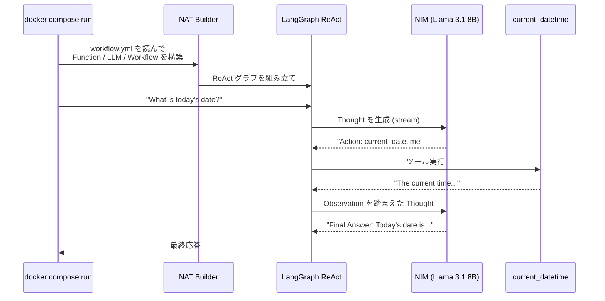

ここから本書のハンズオンが始まります。本章では、NAT のもっとも小さな構成、「クラウド NIM に 1 問質問して答えを返すだけ」の ReAct エージェントを `docker compose run` で動かします。YAML ファイル 1 枚と compose ファイル 1 枚だけで、LLM エージェントがツールを呼んで答えを返す一連の流れを体験するのがゴールです。

## この章のゴール

- `ch03-hello-agent/` ディレクトリで `docker compose run --rm nat` が通る
- ReAct の Thought / Action / Observation ループを自分の目で確認する
- workflow.yml の最小構成（`llms` / `functions` / `workflow`）を頭に入れる
- クラウド NIM 側で推論クレジットが消費される感覚をつかむ

## 前章からの引き継ぎ

- Docker ランタイムが動いている
- `nat-nim-handson:1.6.0` イメージをビルドした
- NGC API key を `ch03-hello-agent/.env` に記入した

前章の「ここまでで動くもの」が揃っていれば準備完了です。

## この章で追加するファイル

サンプルリポの `ch03-hello-agent/` ディレクトリには、本章で使うファイルがすでに入っています。中身はシンプルで、`workflow.yml` と `docker-compose.yml`、そして `.env.example` の 3 つだけです。

```bash
cd nemo-agent-toolkit-book/ch03-hello-agent
ls
# .env.example  README.md  docker-compose.yml  workflow.yml
```

## workflow.yml を読む

最初に NAT の設定ファイルを見ていきます。

```yaml:ch03-hello-agent/workflow.yml
general:
  use_uvloop: true

llms:
  nim_llm:
    _type: nim
    model_name: meta/llama-3.1-8b-instruct
    api_key: ${NGC_API_KEY}
    temperature: 0.0
    max_tokens: 512

functions:
  current_datetime:
    _type: current_datetime

workflow:
  _type: react_agent
  tool_names:
    - current_datetime
  llm_name: nim_llm
  verbose: true
```

20 行ほどですが、第 1 章で紹介した NAT の 4 コンセプトすべてが登場しています。

`general` はランタイム寄りの設定です。`use_uvloop: true` は Python の非同期 I/O ループを uvloop に差し替えるオプションで、NAT のデフォルト推奨値です。迷ったら触らなくて大丈夫です。

`llms` では使う LLM を宣言します。`nim_llm` という名前で、`_type: nim` を指定して NIM クラウドに向けています。`model_name` は `meta/llama-3.1-8b-instruct`、本書の workflow 用の基準モデルです。`api_key: ${NGC_API_KEY}` は環境変数展開で、実際のキーは `.env` 側に置いてコミットから逃がします。

`functions` には使えるツールを並べます。ここでは組み込みの `current_datetime`（現在時刻を返すだけ）を登録しています。第 5 章で web_search や wikipedia_search を追加していく予定ですが、まずは動作を追いやすい最小構成です。

最後の `workflow` がエージェント本体です。`_type: react_agent` で ReAct パターンを選び、使える tool として `current_datetime` を 1 つだけ渡し、思考に使う LLM として上で宣言した `nim_llm` を指定しています。`verbose: true` にしているのは、後段の出力で Thought / Action / Observation を見やすくするためです。

## docker-compose.yml を読む

次に compose ファイルです。

```yaml:ch03-hello-agent/docker-compose.yml
services:
  nat:
    image: nat-nim-handson:1.6.0
    env_file:
      - .env
    volumes:
      - ./workflow.yml:/app/workflows/workflow.yml:ro
    command:
      - 'run'
      - '--config_file'
      - '/app/workflows/workflow.yml'
      - '--input'
      - "What is today's date?"
```

`image: nat-nim-handson:1.6.0` で前章ビルドしたベースイメージを指定、`env_file` で `.env` を読み込み、`workflow.yml` を `/app/workflows/` 配下にマウントします。`command:` には `nat run` の引数を展開しており、「今日の日付を教えて」という入力を渡す形です。

Dockerfile の `ENTRYPOINT ["nat"]` が効いているので、compose の `command:` には `nat` コマンド本体ではなくサブコマンド以降だけを並べている点に注目してください。

## 実行する

準備ができたら、1 コマンドです。

```bash
docker compose run --rm nat
```

初回実行時は 2-3 秒の NAT 立ち上げ時間のあと、ReAct の出力がターミナルに流れます。次のような内容が表示されれば成功です。

```text
[AGENT]
Agent input: What is today's date?
Agent's thoughts:
Thought: I can find the current date and time using the current_datetime tool.
Action: current_datetime
Action Input: None
Observation

[AGENT]
Calling tools: current_datetime
Tool's input: None
Tool's response:
The current time of day is 2026-04-24 05:13:21 +0000

[AGENT]
Agent input: What is today's date?
Agent's thoughts:
Thought: I now know the current date and time.
Final Answer: 2026-04-24

--------------------------------------------------
Workflow Result:
2026-04-24
--------------------------------------------------
```

出力のポイントは 3 つあります。

- `Agent's thoughts:` のブロックで、LLM が「次に何をすべきか」を `Thought:` として言語化している
- `Action: current_datetime` と `Action Input: None` で、LLM がツールを呼び出すよう指示している
- ツール実行結果が `Tool's response:` として返り、続く `Agent's thoughts:` で LLM が読み、最後に `Final Answer:` と `Workflow Result:` が出る

これが ReAct（Reasoning + Acting）ループの基本形です。本書で後から出てくる Router や agent-as-tool、A2A もすべて、この思考→行動→観測の積み重ねの上に乗っています。

:::message
NAT 1.6.0 の ReAct 出力は、厳密には LangChain/LangGraph の Thought / Action / Observation の慣習を踏襲しています。見出しは `[AGENT]` `[TOOL]` ではなく `[AGENT]`（tool 呼び出し時も `[AGENT]` 見出しで `Calling tools:` が続く）形式です。他の記事で見かける綺麗な Thought / Observation の対と少し見た目が違いますが、構造は同じです。
:::

## 裏で起きていること

NAT がこの短いサイクルで何をしているか、ざっくり追ってみます。



YAML を書いたのはユーザーですが、Builder が YAML を解釈して LangGraph ベースの ReAct グラフを作り、各ノード（思考・行動・観測）を回しています。NAT がメタレイヤーとして振る舞っている様子が見えます。

## 違う質問を試す

`.env` と `workflow.yml` を触らずに、コマンドラインで入力だけ差し替えたい場合は、compose の `command:` を上書きできます。

```bash
docker compose run --rm nat \
  run --config_file /app/workflows/workflow.yml \
  --input "Tell me the current date in Japanese."
```

`Final Answer: 今日の日付は 2026 年 4 月 24 日です。` のように日本語で返せば成功です。モデルが Llama 3.1 8B なので、込み入った日本語は苦手なこともあります。次章で YAML の他のパラメータを触っていく中で、温度・max_tokens・system prompt の効き方を確かめていきます。

## よくある詰まりどころ

**`401 Unauthorized` が出る**

`.env` に書いた `NGC_API_KEY` が古い、またはスペースや改行が紛れ込んでいるケースがほとんどです。`cat ch03-hello-agent/.env` で先頭・末尾に余分な文字が入っていないか確認してください。

**`429 Too Many Requests` が出る**

build.nvidia.com の Rate Limit（デフォルト 40 req/min）に抵触しています。続けて走らせすぎないように、1 分ほど待ってから再実行してください。付録 B で Rate Limit の詳細と対処方法をまとめます。

**`Unable to find image 'nat-nim-handson:1.6.0'`**

前章のベースイメージビルドが通っていないか、別名でビルドされています。リポジトリルートで `docker build -t nat-nim-handson:1.6.0 docker/nat/` をやり直してください。

## ここまでで動くもの

- `docker compose run --rm nat` で ReAct ループが 1 周回り、応答が返る
- workflow.yml の最小構成を自分で読めるようになった
- NIM クラウドで実際に推論クレジットが消費される感触をつかんだ

NGC の Developer プランのダッシュボードを開くと、本章の数クエリがすでにカウントされているはずです。

:::message
本章のサンプルコードは [nemo-agent-toolkit-book リポ](https://github.com/himorishige/nemo-agent-toolkit-book) の `ch03-hello-agent/` ディレクトリにまとめています。
:::

## 次章では

次章では本章で流した YAML を解剖します。`general` / `llms` / `functions` / `workflow` の 4 セクションがそれぞれ何を司っているのか、`_type` の差し替えで何が入れ替わるのか、そして本書後半でフル活用する Builder が裏で何を組み立てているのかを見ていきます。
