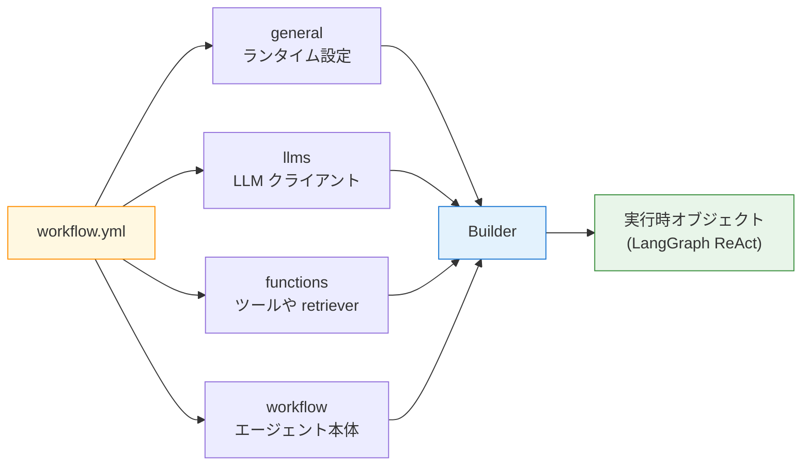
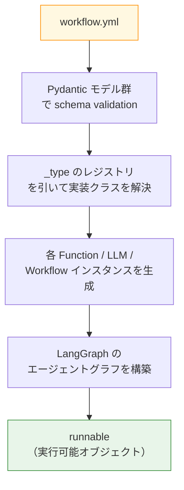

前章ではとにかく動かすことを優先し、`workflow.yml` の中身はざっくりとしか触れませんでした。本章では同じファイルをあらためて解剖し、`general` / `llms` / `functions` / `workflow` の 4 セクションが何を司っているか、`_type` の差し替えで何が入れ替わるのか、そして NAT が YAML を読んでから ReAct ループが回り始めるまでの流れを押さえます。

コード量は少なめですが、ここを押さえておくと以降の章の YAML が「初見でも読める」ようになります。

## この章のゴール

- YAML の 4 セクションが何を表現しているか 30 秒で説明できる
- `_type` という鍵の意味を理解し、差し替えの発想を身につける
- `nat info` と `nat validate` で YAML を自己チェックする方法を覚える
- 温度・トークン上限・verbose の効き方を手元で確認する

## 前章からの引き継ぎ

- `ch03-hello-agent/` で `docker compose run --rm nat` が通った
- NGC API key が `.env` に書かれている
- `nat-nim-handson:1.6.0` イメージがビルド済み

本章はこの `ch03-hello-agent/` をそのまま実験台にします。ファイルを増やす必要はありません。

## この章で追加する compose service

なし。前章の compose をそのまま使います。

## YAML の 4 セクション

前章で登場した `workflow.yml` をあらためて貼っておきます。

```yaml:ch03-hello-agent/workflow.yml
general:
  use_uvloop: true

llms:
  nim_llm:
    _type: nim
    model_name: meta/llama-3.1-8b-instruct
    api_key: ${NGC_API_KEY}
    temperature: 0.0
    max_tokens: 512

functions:
  current_datetime:
    _type: current_datetime

workflow:
  _type: react_agent
  tool_names:
    - current_datetime
  llm_name: nim_llm
  verbose: true
```

NAT の YAML はだいたいこの 4 つのトップレベルキーで構成されます。



Builder（NAT の内部コンポーネント）が YAML を読んで、各セクションを対応する Python オブジェクトに組み立て、最終的に `workflow` セクションで指定された構造が実行できる形になります。第 1 章で登場した「Function / LLM / Workflow / Builder」の 4 コンセプトは、そのまま YAML の構造に対応していると捉えてください。

## `general` セクション

`general` は「どのセクションにも属さないランタイム設定」を置く場所です。NAT 1.6 時点で本書が触るのは `use_uvloop` と、第 7 章で出てくる `telemetry` の 2 つだけです。

| キー         | 役割                                            | 本書での扱い             |
| ------------ | ----------------------------------------------- | ------------------------ |
| `use_uvloop` | 非同期 I/O を uvloop に切り替える               | 常に `true`（推奨値）    |
| `telemetry`  | Phoenix / Langfuse など観測バックエンドの送信先 | 第 7 章で phoenix を追加 |

ログレベルやタイムアウトなど細かい調整キーもありますが、本書の範囲では触る機会はほぼありません。`general` は「動けばそのままでいい」場所だと思っておけば十分です。

## `llms` セクション

`llms` は LLM クライアントを宣言する場所です。複数の LLM を名前付きで並べ、あとで `workflow` や他の Function から `llm_name: nim_llm` のように参照します。

キーの役割を表にまとめます。

| キー          | 役割                                                   |
| ------------- | ------------------------------------------------------ |
| `_type`       | プロバイダ種別（`nim` / `openai` / `aws_bedrock` 等）  |
| `model_name`  | プロバイダ内のモデル識別子                             |
| `api_key`     | 認証情報。環境変数展開で `.env` に逃がすのが定石       |
| `temperature` | サンプリング温度（0.0 で決定的、1.0 に近づくほど発散） |
| `max_tokens`  | 応答の最大トークン数                                   |

本書では `_type: nim` で NIM クラウドに固定しますが、たとえばローカルの vLLM に差し替えたい場合は `_type: openai` + `base_url: http://localhost:8000/v1` + `api_key: EMPTY` のように書き換えるだけで済みます。**この「`_type` を変えるだけで差し替えが効く」というのが NAT の発想の中心**です。

:::details 複数モデルを並べる例

第 13 章で出てくる「LLM-as-Judge」では、workflow と judge を別の LLM で動かします。その場合は `llms` に 2 つ並べる書き方になります。

```yaml
llms:
  workflow_llm:
    _type: nim
    model_name: meta/llama-3.1-8b-instruct
    api_key: ${NGC_API_KEY}

  judge_llm:
    _type: nim
    model_name: nvidia/llama-3.3-nemotron-super-49b-v1
    api_key: ${NGC_API_KEY}
```

:::

## `functions` セクション

`functions` はツール・retriever・evaluator など「単機能の部品」を宣言する場所です。第 1 章で「tool も retriever も evaluator もすべて Function の一種」と書いたとおり、NAT では役割が違う部品も `functions` に並列に並びます。

第 3 章の例では `current_datetime` だけが登録されていました。NAT の組み込み Function は他にもあり、章を進めるごとに増やしていきます。

| `_type`               | 役割                             | 本書での登場章    |
| --------------------- | -------------------------------- | ----------------- |
| `current_datetime`    | 現在時刻を返す                   | 第 3 章（既出）   |
| `wikipedia_search`    | Wikipedia 検索                   | 第 5 章           |
| `web_search`          | Web 検索                         | 第 5 章           |
| `langchain_retriever` | LangChain の retriever をラップ  | 第 9-10 章（RAG） |
| `mcp_tool`            | MCP サーバーのツールを呼ぶ       | 第 8 章           |
| `agent_tool_wrapper`  | 別エージェントを tool として包む | 第 11 章          |

組み込み以外に、Python で書いた独自 Function を登録する方法もあります。本書では第 11 章のマルチエージェント構成で簡単に触れます。

## `workflow` セクション

`workflow` はエージェント本体、つまり「上で並べた Function と LLM をどうやって動かすか」を宣言する場所です。`_type` を変えると、振る舞い（エージェントパターン）がまるごと差し替わります。

NAT が提供する主要な workflow パターンは次のとおりです。第 6 章で一通り触りますが、名前だけ先に眺めておくと見通しが良くなります。

| `_type`              | パターン                  | 特徴                                                         |
| -------------------- | ------------------------- | ------------------------------------------------------------ |
| `react_agent`        | ReAct                     | Thought / Action / Observation を繰り返す王道。本書の基本形  |
| `rewoo_agent`        | ReWOO                     | 先にプランを立ててから動く。tool 呼び出し数を減らせる        |
| `tool_calling_agent` | OpenAI-style Tool Calling | Function Calling 風の JSON ツール呼び出し                    |
| `router_agent`       | Router                    | ユーザーの質問を分類して、別のエージェントや tool に振り分け |

第 3 章の `workflow` は `_type: react_agent` でしたが、この 1 行を `_type: rewoo_agent` に書き換えるだけで別パターンが動き始める、というのが NAT の強みです。

## Builder が YAML から組み立てるもの

YAML を書き換えて動かすだけなら上記の知識で十分ですが、「なぜ `_type` の差し替えだけで動くのか」を少しだけ掘り下げておきます。ここは補足なので、手を動かしたい場合は飛ばしても構いません。



NAT の Builder は、まず YAML を Pydantic モデルで検証して、各 `_type` 文字列を内部レジストリで引いて対応する実装クラスを見つけ、Function / LLM / Workflow のインスタンスを生成します。最後に `workflow` 定義に沿って LangGraph のノードとエッジを組み、`runnable` としてまとめあげます。`nat run` が実際に実行しているのは、この `runnable` の `.invoke()` です。

`_type` は単なる文字列に見えて、中ではレジストリの検索キーとして働いている、というのが押さえておきたい要点です。

## `nat info` と `nat validate` で YAML を点検する

NAT には YAML を直接書き換える前に挙動を確かめるためのサブコマンドが用意されています。`docker compose run --rm` から叩いてみます。

**組み込みコンポーネントの一覧を見る**

```bash
cd ch03-hello-agent
docker compose run --rm nat \
  info components -t function
```

`function` の他に `llm_client` / `llm_provider` / `embedder_client` / `retriever_client` / `evaluator` なども指定できます（`nat info components --help` で全種類を確認できます）。自分の NAT バージョンで使える `_type` がそのまま表形式で一覧表示されるので、「それ実装されてる？」の確認に役立ちます。

特定のコンポーネントだけ調べたい場合は `-q` で絞り込みます。

```bash
docker compose run --rm nat \
  info components -t function -q wiki_search
```

パッケージ名・バージョン・component_type・component_name・description が並ぶ表が返ります。

**YAML が壊れていないか確認する**

```bash
docker compose run --rm nat \
  validate --config_file /app/workflows/workflow.yml
```

問題がなければ `Workflow configuration is valid.` のような短い OK メッセージが返ります。書き間違いがあると、Pydantic のエラーメッセージと一緒に「どの行のどのフィールドが原因か」がわりと親切に教えてくれます。YAML を編集するたびにまず `validate` を通す習慣にすると、余計な実行クレジットを消費せずに済みます。

## 書き換えて動かしてみる

座学ばかりだと退屈なので、3 つだけ `workflow.yml` をいじって挙動の違いを見ておきます。手元のファイルを編集して、そのつど `docker compose run --rm nat` を叩いてみてください。

**実験 1: 温度を上げる**

```diff yaml:ch03-hello-agent/workflow.yml
 llms:
   nim_llm:
     _type: nim
     model_name: meta/llama-3.1-8b-instruct
     api_key: ${NGC_API_KEY}
-    temperature: 0.0
+    temperature: 0.9
     max_tokens: 512
```

Final Answer の文面が走らせるたびに揺れるようになります。0.0 に戻すと再現性重視、0.9 にすると発想重視、という温度の効き方を体で覚えておくと、あとあとの評価章で役に立ちます。

**実験 2: モデルを差し替える**

```diff yaml:ch03-hello-agent/workflow.yml
 llms:
   nim_llm:
     _type: nim
-    model_name: meta/llama-3.1-8b-instruct
+    model_name: nvidia/llama-3.3-nemotron-super-49b-v1
     api_key: ${NGC_API_KEY}
     temperature: 0.0
     max_tokens: 512
```

Nemotron Super 49B は Llama 3.1 8B より 6 倍以上のパラメータ数を持つ高性能モデルです。ReAct の応答がよりきれいにフォーマットされる一方、レスポンスは体感 3-5 秒は遅くなります。評価が目的ではないとき、無駄にクレジットを消費しないよう早めに 8B に戻しておくのがおすすめです。

**実験 3: verbose を落とす**

```diff yaml:ch03-hello-agent/workflow.yml
 workflow:
   _type: react_agent
   tool_names:
     - current_datetime
   llm_name: nim_llm
-  verbose: true
+  verbose: false
```

Thought / Action / Observation の出力が消え、Final Answer だけがターミナルに表示されるようになります。本番運用では `false`、学習・デバッグ中は `true` が定石です。第 7 章の Phoenix で観測する章でまた戻しますので、ここでは両方を試したら `true` に戻しておきましょう。

## ここまでで動くもの

- YAML の 4 セクションがそれぞれ何を司っているかを説明できる
- `_type` の差し替えでプロバイダ / エージェントパターン / Function が入れ替わるという発想が頭に入っている
- `nat info` / `nat validate` で YAML を事前に点検する習慣がついた
- 温度・モデル・verbose の効き方を自分の目で確認した

:::message
本章のサンプルコードは第 3 章と同じ [nemo-agent-toolkit-book リポ](https://github.com/himorishige/nemo-agent-toolkit-book) の `ch03-hello-agent/` を流用します。実験用に書き換えた内容は元に戻しておくと、次章の出発点が綺麗です。
:::

## 次章では

次章では `functions` セクションに組み込みツールを増やして、ReAct エージェントに「今日の日付」以外の仕事をさせていきます。具体的には `wikipedia_search` と `web_search` を足し、複数ツールの中から ReAct ループが自力でどれを選ぶのかを観察します。
