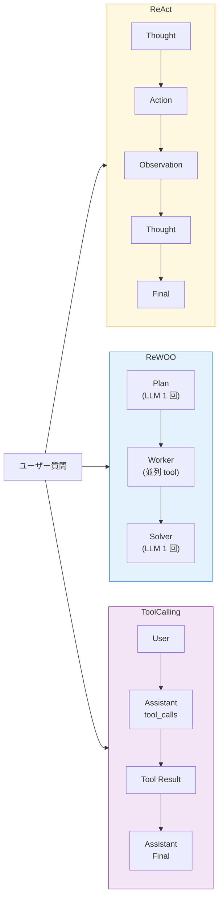

前章で 2 ツール構成の ReAct エージェントを動かしました。本章では同じツール集合のまま、`workflow` セクションの `_type` を差し替えて、**ReAct / ReWOO / Tool Calling** の 3 パターンを動かし比べます。

NAT を触り始めた頃、筆者はなんとなく「ReAct を選んでおけばよい」と思っていました。実際に 3 パターンを並べて走らせてみると、レスポンス時間・tool 呼び出し回数・LLM の思考量・安定性にはっきりと違いが出ます。この章で各パターンの手触りを掴んでおくと、第 11 章のマルチエージェント構成を組む際に、どの役割に何を割り当てるかを迷いなく決められるようになります。

## この章のゴール

- ReAct / ReWOO / Tool Calling の 3 パターンをそれぞれ動かせる
- 出力ログから 3 パターンの設計思想の違いを読み取れる
- 同じ質問でも tool 呼び出し回数とレイテンシが変わる事実を体感する
- 本書の後続章でどのパターンを採用するかの判断軸を得る

## 前章からの引き継ぎ

- 第 5 章で 2 ツール ReAct 構成を動かした
- `nat-nim-handson:1.6.0` イメージはビルド済み
- NGC API key が `.env` にある

## この章で追加する compose service

サンプルリポの `ch06-agent-patterns/` には compose の service を 3 つ並べています。

- `nat-react` — ReAct パターン
- `nat-rewoo` — ReWOO パターン
- `nat-tool-calling` — Tool Calling パターン

どの service も同じベースイメージ・同じ `.env` を共有し、マウントする `workflow.yml` だけが違います。共通設定は YAML アンカー（`x-nat-common: &nat-common`）でまとめているので、差分はわずか数行です。

## 3 つのパターンの立ち位置

具体的な挙動に入る前に、各パターンの設計思想をおさらいしておきます。



- **ReAct** は Reasoning と Acting を交互に織り交ぜる古典的なパターン。1 ステップごとに LLM を呼ぶため、推論コストは線形に増える一方、軌道を逐次確認できる
- **ReWOO** は Reasoning Without Observation。先にプランを立て、必要なツールをまとめて呼び、最後に結果を統合する 3 段階構成。LLM 呼び出しはプランと解答の 2 回で済みやすい
- **Tool Calling** は OpenAI 系 API の Function Calling を使った構成。LLM 自身が JSON で `tool_calls` を指示するため、Thought をテキスト出力せず、プロトコルとして固い

それぞれ得意とする用途や落とし穴があるので、実際に動かして違いを見ていきましょう。

## 準備

サンプルリポ配下のディレクトリに移動し、`.env` を用意します。

```bash
cd nemo-agent-toolkit-book/ch06-agent-patterns
cp ../ch03-hello-agent/.env .env
```

## パターン 1: ReAct

第 5 章と同じ構成です。`workflow-react.yml` を確認しておきます。

```yaml:ch06-agent-patterns/workflow-react.yml
workflow:
  _type: react_agent
  tool_names:
    - current_datetime
    - wikipedia_search
  llm_name: nim_llm
  verbose: true
  max_iterations: 6
```

実行。

```bash
docker compose run --rm nat-react
```

出力は Thought / Action / Observation の繰り返しです。2 ツールを順番に呼ぶ軌跡が見えます。

```text
[AGENT]
Agent input: Who is the current CEO of NVIDIA, and what date is it today?
Agent's thoughts:
Thought: I need to know the current date and time to answer the question about the CEO of NVIDIA.
Action: current_datetime
Action Input: None
Observation

[AGENT]
Calling tools: current_datetime
Tool's input: None
Tool's response:
The current time of day is 2026-04-24 05:13:34 +0000

[AGENT]
Agent's thoughts:
Thought: I now have the current date and time, but I still need to find the current CEO of NVIDIA.
Action: wikipedia_search
Action Input: {"question": "Current CEO of NVIDIA"}

[AGENT]
Calling tools: wikipedia_search
Tool's response: <Document source="..."/>...Jensen Huang...

[AGENT]
Final Answer: The current CEO of NVIDIA is Jensen Huang, and the current date is April 24, 2026.
```

LLM 呼び出しは「最初の Thought」「Observation 後の Thought」「Final Answer」の 3 回前後、ツールは 2 回呼ばれ、体感レイテンシは 8-12 秒くらいです。本書の実測では総 7-14 秒のバラツキがありました。

## パターン 2: ReWOO

次に ReWOO。`_type` の差し替えに加えて、**ツール構成も絞ります**。NAT 1.6.0 時点の ReWOO は `current_datetime` のような引数なしツールと相性が悪く、Pydantic のスキーマ検証で落ちるケースがあるためです（後述のハマりどころを参照）。

```yaml:workflow-rewoo.yml
functions:
  wikipedia_search:
    _type: wiki_search
    max_results: 2

workflow:
  _type: rewoo_agent
  tool_names:
    - wikipedia_search
  llm_name: nim_llm
  verbose: true
```

`max_iterations` は ReWOO では不要です（ループせず 3 段階で終わるため）。実行。

```bash
docker compose run --rm nat-rewoo
```

ReWOO は「Plan を立てる → 各 Plan のツールを順に呼ぶ → Solver が答えを組み立てる」の 3 段構えです。出力にはまず JSON 形式の Plan が出てきます。

```text
[AGENT]
Plan 1: Find out who founded NVIDIA.
#E1 = wikipedia_search[{"question": "Who founded NVIDIA?"}]

Execution levels: [['#E1']]

[AGENT]
Calling tools: wikipedia_search
Tool's response:
<Document source="https://en.wikipedia.org/wiki/Nvidia"/>
Nvidia Corporation ... Founded in 1993 by Jensen Huang, Chris Malachowsky, and Curtis Priem ...

[AGENT]
Agent input: Who founded NVIDIA?
Agent's thoughts:
Jensen Huang, Chris Malachowsky, and Curtis Priem.

Workflow Result:
Jensen Huang, Chris Malachowsky, and Curtis Priem.
```

LLM 呼び出しは Plan 生成と Solver の 2 回で済み、体感レイテンシは 5-7 秒。ReAct より 2-4 秒速いのが実測の傾向です。

ReWOO の強みは、tool 呼び出しの「道筋」が最初に決まる点です。Observation を見てから軌道修正する必要がない簡単な質問では、ReWOO の方が速くて安上がりです。一方、Observation の内容次第で次の行動を変えたいケース（質問が込み入っている、tool の失敗に備えたい）は ReAct 向きです。

:::message
ReWOO の名前は "Reasoning WithOut Observation" の略で、Plan 段階では Observation を見ないのが特徴です。論文は [arXiv 2305.18323](https://arxiv.org/abs/2305.18323) で 2023 年 5 月に公開されました。
:::

:::message alert
**NAT 1.6.0 時点の ReWOO の制限**: 実測で 2 つの問題に遭遇しました。(1) `current_datetime` を tool_names に含めると、ReWOO が空引数 `{}` で呼び出すため Pydantic のスキーマ検証で落ちます。`wikipedia_search` など引数ありのツールに絞るのが安全です。(2) 複雑な質問で Plan が複数レベルの依存を持つと、レベル間の入力型変換で `Unexpected type for tool_input: <class 'list'>` エラーになる場合があります。本書ではシンプルな 1 Plan の質問に絞っています。
:::

## パターン 3: Tool Calling

3 つ目は Tool Calling。こちらも `wikipedia_search` 1 ツール構成にしてあります。

```yaml:workflow-tool-calling.yml
functions:
  wikipedia_search:
    _type: wiki_search
    max_results: 2

workflow:
  _type: tool_calling_agent
  tool_names:
    - wikipedia_search
  llm_name: nim_llm
  verbose: true
```

実行。

```bash
docker compose run --rm nat-tool-calling
```

Tool Calling の出力には LangChain 内部の `content='...'` や `tool_calls=[...]` といったオブジェクト表現が verbose で流れます。読みどころは `tool_calls` のフィールドです。

```text
[AGENT]
Agent input: Who founded NVIDIA?
Agent's thoughts:
content=';' additional_kwargs={'tool_calls': [
  {'type': 'function',
   'function': {'name': 'wikipedia_search',
                'arguments': '{"question": "Who founded NVIDIA?"}'}}]}
tool_calls=[{'name': 'wikipedia_search',
             'args': {'question': 'Who founded NVIDIA?'}}]

[AGENT]
Calling tools: wikipedia_search
Tool's response: <Document source="..."/>...Jensen Huang, Chris Malachowsky, and Curtis Priem...

[AGENT]
Agent's thoughts:
content='The founder of NVIDIA is Jensen Huang, Chris Malachowsky, and Curtis Priem. They founded the company in 1993.'
```

Tool Calling の強みは「LLM 出力の構造が固い」ことです。tool 呼び出しは JSON schema に従うため、パース失敗が起こりにくく、CI 組み込みや本番運用で扱いやすい特性があります。

:::message
**NAT 1.6.0 と NIM モデルの相性**: `tool_calling_agent` は内部で LLM に並列 tool_calls を許可する挙動があり、モデル側が対応していないと `"This model only supports single tool-calls at once!"` のような 500 エラーになります。Meta Llama 3.1 8B では確認済み、本書のデフォルトの Nemotron Super 49B では複数 tool_calls を受け入れるものの、ReAct / ReWOO と違い「tool 呼び出しは 1 回に抑える」チューニング前提で動きます。本書は安全側で `wikipedia_search` 単独構成にしていますが、複数ツールを同時呼び出しさせたい場合は NIM モデルごとに動作確認する必要があります。
:::

## 3 パターンの比較まとめ

実際に動かした結果をざっくり表にまとめます。レイテンシは Nemotron Super 49B + NIM での実測値で、ネットワーク状況により前後します。

| パターン     | 本書の構成 | LLM 呼び出し数 | 体感レイテンシ | 向いている場面                               |
| ------------ | ---------- | -------------- | -------------- | -------------------------------------------- |
| ReAct        | 2 ツール   | 3 回以上       | 8-12 秒        | 質問が複雑で軌道修正が要る、教育・デバッグ   |
| ReWOO        | wiki 単独  | 2 回（固定）   | 5-7 秒         | プランが事前に立てられる簡単な質問、本番運用 |
| Tool Calling | wiki 単独  | 2 回           | 5-8 秒         | tool 呼び出しの構造を厳密に保ちたい場面      |

本書では 3 パターンを同じ条件で並べる意図で、ReWOO と Tool Calling もあえて **ReAct と同一ツール構成にすると NAT 1.6.0 で動かない**という制約にぶつかりました。この実測事実そのものが NAT のバージョンを吟味する判断材料になるので、隠さずそのまま残しています。本書のバージョン更新時には、この表と注意書きをあらためて見直す予定です。

:::details Router パターンはどこに？

`_type: router_agent` は存在しますが、本書では第 11 章のマルチエージェント章で扱います。Router は「複数の専門エージェントに質問を振り分ける」用途が本領なので、Wiki + datetime の 2 ツールしかない章 6 の段階では旨味を出しにくいためです。

:::

## 本書で採用するパターン

本書の後続章は、用途に応じて 2 パターンを使い分けます。

- **ReAct** — 第 7 章以降のハンズオン各章で採用。軌道を Phoenix で観測しやすく、学習に向いている
- **Router** — 第 11 章のマルチエージェントで採用。Wiki Agent と RAG Agent への振り分け役

ReWOO と Tool Calling はここで紹介しましたが、本書の後続章では直接は使いません。実運用では「初期開発は ReAct で軌道を可視化 → 本番投入時に ReWOO か Tool Calling へ切り替え」という流れが多いので、その切り替えが 1 行で済むことだけ覚えておけば十分です。

## ここまでで動くもの

- `ch06-agent-patterns/` で 3 パターンをそれぞれ動かせる
- ReAct / ReWOO / Tool Calling の出力形式の違いを自分の目で見た
- 同じ質問でもパターンによって LLM 呼び出し数とレイテンシが変わると体感した
- 本書後続章が ReAct + Router の組み合わせで進むことを把握した

:::message
本章のサンプルコードは [nemo-agent-toolkit-book リポ](https://github.com/himorishige/nemo-agent-toolkit-book) の `ch06-agent-patterns/` ディレクトリにまとめています。
:::

## 次章では

次章では Arize Phoenix を compose に追加し、本章までに書いた ReAct エージェントのトレースを可視化します。Thought と Action がどの順で走ったか、どこでレイテンシが溜まっているかを、UI の上で読めるようにするのが目標です。エージェントのデバッグがぐっと楽になります。
