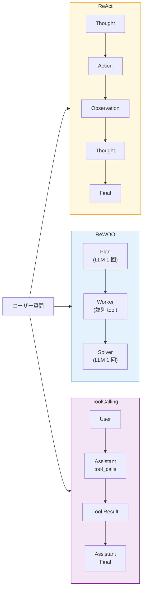

前章で 2 ツール構成の ReAct エージェントを動かしました。本章では同じツール集合のまま、`workflow` セクションの `_type` を差し替えて、**ReAct / ReWOO / Tool Calling** の 3 パターンを動かし比べます。

NAT を触り始めた頃、筆者はなんとなく「ReAct を選んでおけばよい」と思っていました。実際に 3 パターンを並べて走らせてみると、レスポンス時間・tool 呼び出し回数・LLM の思考量・安定性にはっきりと違いが出ます。この章で各パターンの手触りを掴んでおくと、第 11 章のマルチエージェント構成を組む際に、どの役割に何を割り当てるかを迷いなく決められるようになります。

## この章のゴール

- ReAct / ReWOO / Tool Calling の 3 パターンをそれぞれ動かせる
- 出力ログから 3 パターンの設計思想の違いを読み取れる
- 同じ質問でも tool 呼び出し回数とレイテンシが変わる事実を体感する
- 本書の後続章でどのパターンを採用するかの判断軸を得る

## 前章からの引き継ぎ

- 第 5 章で 2 ツール ReAct 構成を動かした
- `nat-nim-handson:1.6.0` イメージはビルド済み
- NGC API key が `.env` にある

## この章で追加する compose service

サンプルリポの `ch06-agent-patterns/` には compose の service を 3 つ並べています。

- `nat-react` — ReAct パターン
- `nat-rewoo` — ReWOO パターン
- `nat-tool-calling` — Tool Calling パターン

どの service も同じベースイメージ・同じ `.env` を共有し、マウントする `workflow.yml` だけが違います。共通設定は YAML アンカー（`x-nat-common: &nat-common`）でまとめているので、差分はわずか数行です。

## 3 つのパターンの立ち位置

具体的な挙動に入る前に、各パターンの設計思想をおさらいしておきます。



- **ReAct** は Reasoning と Acting を交互に織り交ぜる古典的なパターン。1 ステップごとに LLM を呼ぶため、推論コストは線形に増える一方、軌道を逐次確認できる
- **ReWOO** は Reasoning Without Observation。先にプランを立て、必要なツールをまとめて呼び、最後に結果を統合する 3 段階構成。LLM 呼び出しはプランと解答の 2 回で済みやすい
- **Tool Calling** は OpenAI 系 API の Function Calling を使った構成。LLM 自身が JSON で `tool_calls` を指示するため、Thought をテキスト出力せず、プロトコルとして固い

それぞれ得意とする用途や落とし穴があるので、実際に動かして違いを見ていきましょう。

## 準備

サンプルリポ配下のディレクトリに移動し、`.env` を用意します。

```bash
cd nemo-agent-toolkit-book/ch06-agent-patterns
cp ../ch03-hello-agent/.env .env
```

## パターン 1: ReAct

第 5 章と同じ構成です。`workflow-react.yml` を確認しておきます。

```yaml:ch06-agent-patterns/workflow-react.yml
workflow:
  _type: react_agent
  tool_names:
    - current_datetime
    - wikipedia_search
  llm_name: nim_llm
  verbose: true
  max_iterations: 6
```

実行。

```bash
docker compose run --rm nat-react
```

出力はおなじみの Thought / Action / Observation の繰り返しです。2 ツールを呼ぶ質問だと、LLM 呼び出しが合計 3 回（Thought 1、Thought 2、Final で 1 ずつ）発生し、Wikipedia と current_datetime の Observation を挟むため、体感レイテンシは 7-10 秒になります。

## パターン 2: ReWOO

次に ReWOO。差分は `_type` だけです。

```diff yaml:workflow-rewoo.yml
 workflow:
-  _type: react_agent
+  _type: rewoo_agent
   tool_names:
     - current_datetime
     - wikipedia_search
   llm_name: nim_llm
   verbose: true
-  max_iterations: 6
```

ReWOO には `max_iterations` は不要です（ループせず固定 3 段階で終わるため）。実行。

```bash
docker compose run --rm nat-rewoo
```

出力は大きく変わります。Thought / Action / Observation の繰り返しではなく、いきなり「Plan」と「Evidence」が並ぶ形式です。

```text
[AGENT]
Plan 1: Use wikipedia_search to find who is the current CEO of NVIDIA.
#E1 = wikipedia_search["NVIDIA CEO"]

Plan 2: Use current_datetime to find today's date.
#E2 = current_datetime[]

[TOOL]
Evidence 1: Jensen Huang — Co-founder, president and CEO of NVIDIA...
Evidence 2: The current time of day is 2026-04-24 10:15:02 +0000

[AGENT]
Final Answer: NVIDIA's current CEO is Jensen Huang, and today's date is 2026-04-24.
```

LLM 呼び出しはプラン生成と最終解答の 2 回だけで済み、ツール呼び出しは並列ではないものの逐次的に先行実行されます。体感レイテンシは 5-7 秒、**ReAct より 2-3 秒速い**のが一般的です。

ReWOO の強みは、tool 呼び出しの「道筋」が最初に決まる点です。Observation を見てから軌道修正する必要がない簡単な質問では、ReWOO の方が速くて安上がりです。一方、Observation の内容次第で次の行動を変えたいケース（質問が込み入っている、tool の失敗に備えたい）は ReAct 向きです。

:::message
ReWOO の名前は "Reasoning WithOut Observation" の略で、Plan 段階では Observation を見ないのが特徴です。論文は [arXiv 2305.18323](https://arxiv.org/abs/2305.18323) で 2023 年 5 月に公開されました。
:::

## パターン 3: Tool Calling

3 つ目は Tool Calling。これも `_type` 1 行の差分です。

```diff yaml:workflow-tool-calling.yml
 workflow:
-  _type: react_agent
+  _type: tool_calling_agent
   tool_names:
     - current_datetime
     - wikipedia_search
   llm_name: nim_llm
   verbose: true
-  max_iterations: 6
```

実行。

```bash
docker compose run --rm nat-tool-calling
```

出力からは Thought 行が消え、LLM の出力が `tool_calls` という JSON フィールドで扱われているのが見えます。

```text
[AGENT]
Tool calls:
  - wikipedia_search({"query": "NVIDIA CEO"})

[TOOL]
Observation: 1. Jensen Huang — Co-founder, president and CEO of NVIDIA...

[AGENT]
Tool calls:
  - current_datetime({})

[TOOL]
Observation: The current time of day is 2026-04-24 10:17:40 +0000

[AGENT]
Final Answer: NVIDIA's current CEO is Jensen Huang, and today's date is 2026-04-24.
```

Tool Calling の強みは「LLM 出力の構造が固い」ことです。tool 呼び出しは JSON schema に従うため、パース失敗が起こりにくく、CI 組み込みや本番運用で扱いやすい特性があります。

一方で弱点もあります。`tool_calls` を扱える LLM に依存するため、NIM のどのモデルでも動くわけではありません。本書で使う Llama 3.1 8B は Tool Calling に正式対応していますが、同じ NIM でも Nemotron Nano 系では `react_agent` の方が安定することがあります。モデルと workflow パターンの相性は、実際に `nat validate` + 小さな入力で事前検証するのが安全です。

## 3 パターンの比較まとめ

実際に動かした結果をざっくり表にまとめます。レイテンシは Llama 3.1 8B + クラウド NIM での体感値で、ネットワーク状況により前後します。

| パターン     | LLM 呼び出し数 | tool 呼び出し数 | 体感レイテンシ | 向いている場面                               |
| ------------ | -------------- | --------------- | -------------- | -------------------------------------------- |
| ReAct        | 3 回以上       | 2 回（逐次）    | 7-10 秒        | 質問が複雑で軌道修正が要る、教育・デバッグ   |
| ReWOO        | 2 回（固定）   | 2 回（逐次）    | 5-7 秒         | プランが事前に立てられる簡単な質問、本番運用 |
| Tool Calling | 3 回以上       | 2 回（逐次）    | 6-9 秒         | tool 呼び出しの構造を厳密に保ちたい場面      |

:::details Router パターンはどこに？

`_type: router_agent` は存在しますが、本書では第 11 章のマルチエージェント章で扱います。Router は「複数の専門エージェントに質問を振り分ける」用途が本領なので、Wiki + datetime の 2 ツールしかない章 6 の段階では旨味を出しにくいためです。

:::

## 本書で採用するパターン

本書の後続章は、用途に応じて 2 パターンを使い分けます。

- **ReAct** — 第 7 章以降のハンズオン各章で採用。軌道を Phoenix で観測しやすく、学習に向いている
- **Router** — 第 11 章のマルチエージェントで採用。Wiki Agent と RAG Agent への振り分け役

ReWOO と Tool Calling はここで紹介しましたが、本書の後続章では直接は使いません。実運用では「初期開発は ReAct で軌道を可視化 → 本番投入時に ReWOO か Tool Calling へ切り替え」という流れが多いので、その切り替えが 1 行で済むことだけ覚えておけば十分です。

## ここまでで動くもの

- `ch06-agent-patterns/` で 3 パターンをそれぞれ動かせる
- ReAct / ReWOO / Tool Calling の出力形式の違いを自分の目で見た
- 同じ質問でもパターンによって LLM 呼び出し数とレイテンシが変わると体感した
- 本書後続章が ReAct + Router の組み合わせで進むことを把握した

:::message
本章のサンプルコードは [nemo-agent-toolkit-book リポ](https://github.com/himorishige/nemo-agent-toolkit-book) の `ch06-agent-patterns/` ディレクトリにまとめています。
:::

## 次章では

次章では Arize Phoenix を compose に追加し、本章までに書いた ReAct エージェントのトレースを可視化します。Thought と Action がどの順で走ったか、どこでレイテンシが溜まっているかを、UI の上で読めるようにするのが目標です。エージェントのデバッグがぐっと楽になります。
