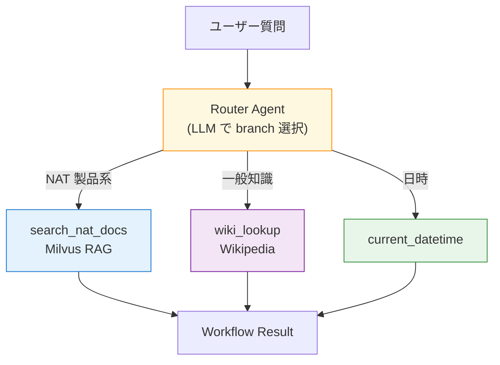

ここまでの章で、単体 ReAct エージェントが 2 ツール（`current_datetime` + `wikipedia_search`）や RAG（`search_nat_docs`）を扱う姿を見てきました。本章では一段階進んで、**複数の専門 tool を Router Agent が質問ごとに振り分ける**構成を組みます。NAT 1.6.0 では `_type: router_agent` を workflow として宣言し、`branches:` に複数の function を並べるだけで、LLM ベースのルーティングが動きます。

実機検証のなかで、「サブ ReAct エージェントをそのまま branch に突っ込むと NAT 1.6.0 の現仕様で動かない」という制約にも遭遇しました。その経緯と、本書がどう落とし前を付けたかも含めて章を進めます。

## この章のゴール

- `_type: router_agent` を workflow に置き、`branches:` の書き方を覚える
- 同じ質問を 3 種類の branch（RAG / Wikipedia / 日時）に対して投げ分けられる
- LLM が branch description を見てどう振り分け先を決めているかを目視する
- NAT 1.6.0 時点で「ReAct サブエージェントを branch に入れると落ちる」制約と回避策を把握する

## 前章からの引き継ぎ

- 第 9-10 章の Milvus 構成（etcd + minio + milvus + nat_docs コレクション）
- `ingest.py` で 1,034 chunks 投入可能
- `nat-nim-handson:1.6.0` イメージ

本章のサンプルは第 10 章と同じ docker-compose の構造を使います。章が独立した project で立ち上がるので、Milvus データも新規に作る形です（本章ディレクトリで再 ingest します）。

## この章で追加する compose service

compose 側は第 9-10 章と同じ 5 service（etcd / minio / milvus / ingest / nat）。変わるのは `workflow.yml` の構造だけです。

所要時間は 30-45 分。

## NAT の router_agent の仕組み

`router_agent` は NAT が用意している「分岐型ワークフロー」です。ReAct とは設計思想が少し違います。

- ReAct は Thought / Action / Observation を何度もループさせて正解に近づく設計
- Router は 1 回のルーティング判定で branch を 1 つ選び、その branch の出力をそのまま返す設計

Router が賢く判断するのは「どの branch を呼ぶか」だけ、という割り切りです。branch 側が tool なら 1 回の関数呼び出し、branch 側が別のエージェントなら内部でループが回る、という具合に責務が分離されています。



## workflow.yml を読む

本章のポイントは `workflow:` セクションを `react_agent` から `router_agent` に切り替えること、そして `branches:` に function 名を並べることです。

```yaml:ch11-multi-agent/workflow.yml
functions:
  search_nat_docs:
    _type: nat_retriever
    retriever: nat_docs_retriever
    topic: >
      Official documentation of NVIDIA NeMo Agent Toolkit (NAT).
      Use this tool for questions about NAT features, YAML configuration,
      MCP / A2A servers, evaluators, retrievers, and other NVIDIA agent components.

  wiki_lookup:
    _type: wiki_search
    max_results: 2

  current_datetime:
    _type: current_datetime

workflow:
  _type: router_agent
  llm_name: nim_llm
  branches: [search_nat_docs, wiki_lookup, current_datetime]
  detailed_logs: true
  max_router_retries: 3
```

見るべきポイントは 3 つです。

1. **`branches` はリスト**で、すでに `functions:` に宣言した名前を並べます。branches 側で重ねて function の定義をする必要はありません
2. **LLM は branch description を頼りに選ぶ**。`search_nat_docs` の `topic:` に書いた説明文が決め手。description が曖昧だと別の branch に流れることがある
3. **`detailed_logs: true`** で Router の判定プロセスがターミナルに流れる。デバッグ時はほぼ必須のフラグ

## サブ ReAct agent を branch に入れようとすると

当初、章 11 の構成は次のように「RAG を ReAct でラップしたサブエージェント」を branch に入れる想定でした。

```yaml
# 動かないパターン（本書の実測で失敗）
functions:
  rag_agent:
    _type: react_agent
    llm_name: nim_llm
    tool_names: [search_nat_docs]
    description: Expert on NVIDIA NeMo Agent Toolkit.

workflow:
  _type: router_agent
  branches: [rag_agent, wiki_agent, current_datetime]
```

実機で動かすと、NAT 1.6.0 の router_agent は branch に文字列をそのまま渡してしまい、`react_agent` が期待する `ChatRequestOrMessage` スキーマ（`messages: list[...]`）との型不一致で `Pydantic validation error` になります。

```text
[AGENT] Tool call attempt 1/3 failed for tool rag_agent: 1 validation error for ChatRequestOrMessage
messages
  Input should be a valid list [type=list_type, input_value='How do I configure an em...', input_type=str]
```

本書のスコープでは独自の str → ChatRequest 変換ラッパーを書くところまでは踏み込まず、**branch は tool / retriever レベルに限定**する方針にしました。章 12 の A2A プロトコルでは、別プロセスのエージェントを呼ぶ構成（これは公式にスキーマ変換が用意されている）を扱います。

:::message alert
**NAT 1.6.0 の router_agent 制約**: `react_agent` / `rewoo_agent` / `tool_calling_agent` を branch にそのまま指定すると ChatRequest スキーマ不一致で動きません。同じワークフロー内で子エージェントを呼びたい場合は、章 12 の A2A で別プロセスに切り出すか、みなさん側で独自 Python Function のラッパーを用意する必要があります。
:::

## 動かす

```bash
cd nemo-agent-toolkit-book/ch11-multi-agent
cp ../ch03-hello-agent/.env .env

# Milvus + 投入
docker compose up -d milvus
docker compose --profile ingest run --rm ingest

# Router 実行（既定は NAT の embedder 設定について質問）
docker compose run --rm nat
```

既定の質問は「How do I configure an embedder in NeMo Agent Toolkit?」。Router は `search_nat_docs` を選び、Milvus から 3 件のチャンクが返ります。

```text
Configuration Summary:
Workflow Type: router_agent
Number of Functions: 3
Number of Retrievers: 1
...

Retrieved 3 records for query How do I configure an embedder in NeMo Agent Toolkit?.

Workflow Result:
{"results": [
  {"page_content": "NeMo Agent Toolkit supports the following embedder providers:\n| Provider | Type | Description |\n...",
   "metadata": {"source": "embedders.md", "category": "components", "distance": 0.848}},
  ...
]}
```

注意したいのは、**Router Agent の Workflow Result は branch の生の出力**だという点です。ReAct のように「Final Answer」としてきれいに整形はされません。retriever の JSON がそのまま流れるので、UI 側で使う場合は別途 LLM で整形する必要があります。

## 別の質問で branch を切り替える

一般知識の質問を投げると Wikipedia branch に流れます。

```bash
docker compose run --rm nat \
  run --config_file /app/workflows/workflow.yml \
  --input 'Who founded NVIDIA?'
```

Router は `wiki_lookup` を選び、Wikipedia の検索結果（GeForce RTX 50 series や創業エピソードを含むドキュメント）が戻ってきます。

日付の質問なら `current_datetime` に分岐します。

```bash
docker compose run --rm nat \
  run --config_file /app/workflows/workflow.yml \
  --input "What is today's date?"
```

```text
Workflow Result:
The current time of day is 2026-04-24 07:13:22 +0000
```

ここで面白いのは、**`current_datetime` の `{"unused": "..."}` 引数問題が Router では発生しない**ことです。第 6 章の ReWOO / Tool Calling では schema エラーが出ましたが、Router は入力文字列をそのまま branch に渡す実装のため、引数なしツールにも素直に流れてくれます。

## Branch description の書き方

Router の精度は branch の説明文にかなり依存します。本書の `search_nat_docs` の `topic:` を短くすると、NAT 関連の質問が Wikipedia branch に流れてしまうケースが増えました。書き方のコツは次の 3 点です。

- 何を扱うかを最初に宣言する（例： "Official documentation of NVIDIA NeMo Agent Toolkit"）
- どんな質問タイプに使うかを列挙する（"YAML configuration, MCP / A2A servers, evaluators, ..."）
- 他 branch との排他関係を匂わせる（"NAT specific", "general open-domain", "current time only" など）

本書の構成は上記のポイントを意識して書いています。みなさんの業務データで RAG を組むときも、「○○ に特化」「一般的な ○○ 以外」のような形で書き分けると精度が上がります。

## Router vs ReAct の使い分け

Router と ReAct は「同時に使うか、状況で使い分けるか」です。目安をまとめます。

| 観点                     | ReAct                                  | Router                                 |
| ------------------------ | -------------------------------------- | -------------------------------------- |
| 1 回の処理で呼ぶ tool 数 | 0 回〜多数回                           | 常に 1 回                              |
| 推論コスト               | tool 数に応じて増える                  | 1 回の LLM 呼び出しで済む              |
| 出力形式                 | Final Answer（LLM が整形した自然言語） | branch の生出力（JSON / text）         |
| 複雑な質問への対応       | 得意（軌道修正できる）                 | 苦手（branch を 1 つ選んで終わり）     |
| 向いている用途           | 質問を分解して複数ツールを組み合わせる | 大枠で「この種類の質問だな」と振り分け |

本書の第 15 章（完成アプリ）では、**Router を外枠に置き、branch の 1 つを ReAct エージェント（A2A 経由）にする**構成を採用します。そこまで来れば、章 6 で紹介した各パターンと本章の Router が 1 つのアプリの中で役割分担する形が見えてきます。

## よくある詰まりどころ

**Router が期待と違う branch を選ぶ**

branch の description（`topic:` または function の description フィールド）が曖昧なときに頻発します。「このツールは XX 専用」と明示する、役割を強く書き分けるのが効きます。

**`ChatRequestOrMessage` のスキーマエラー**

ReAct / ReWOO / Tool Calling などの agent 系 function を branches に入れると発生します。本書では tool / retriever レベルに branches を絞っています。別プロセスに切り出したい場合は章 12 の A2A を参照。

**branch が空応答を返す**

Milvus に ingest されていない質問（NAT と無関係な話題を `search_nat_docs` に流してしまった）か、tool の description ミスです。Router の `detailed_logs: true` で判定プロセスを見ると原因が特定しやすいです。

## ここまでで動くもの

- `ch11-multi-agent/` で Router Agent が NAT 製品質問 / 一般知識 / 日時の 3 種類を振り分ける
- branch description の書き方で精度が変わる実感が得られた
- NAT 1.6.0 の router_agent が sub agent を branch に取れない制約と回避策を把握した
- Workflow Result の形（branch の生出力）が ReAct と違うことを体感した

:::message
本章のサンプルコードは [nemo-agent-toolkit-book リポ](https://github.com/himorishige/nemo-agent-toolkit-book) の `ch11-multi-agent/` ディレクトリにまとめています。
:::

## 次章では

次章では A2A（Agent-to-Agent）プロトコルを使って、**別プロセスのエージェントを branch / tool として呼ぶ**構成に進みます。本章で型不一致になった「サブ ReAct agent」も、A2A 経由なら別コンテナで立ち上げて通信できます。docker compose で agent-a / agent-b の 2 コンテナを立てて、それぞれ独立した ReAct エージェントが協調する姿を見ていきます。
