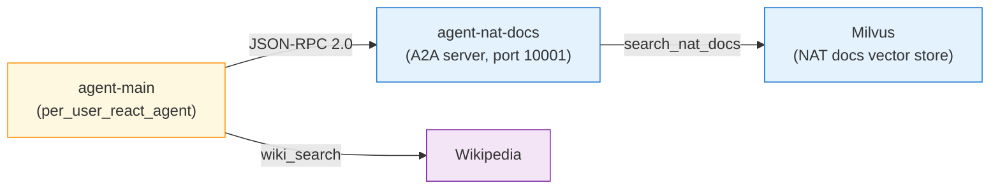

前章の Router Agent では「サブ ReAct エージェントを branches に直接入れると ChatRequest スキーマ不一致で落ちる」という制約にぶつかりました。本章ではその制約を**別プロセスに切り出す**ことで回避します。具体的には、NAT docs RAG エージェントを A2A（Agent-to-Agent）プロトコルで公開し、メインエージェントがそれを A2A クライアントとして tool 化する構成を組みます。

A2A は 2025 年 3 月に Linux Foundation 傘下で公開されたオープン仕様で、「どんなフレームワークで書かれたエージェントでも同じプロトコルで呼べる」ことを狙っています。NAT には公式の A2A サーバー / クライアント実装があり、本書の docker compose を 2 コンテナに分けるだけで「NAT エージェントが別の NAT エージェントを呼ぶ」絵が描けます。

## この章のゴール

- `nat a2a serve` でワークフローを A2A サーバーとして公開する
- Agent Card（`.well-known/agent-card.json`）で expose されたスキルを確認する
- `function_groups.a2a_client` + `per_user_react_agent` で別コンテナを tool 化する
- 前章の「ReAct サブエージェント呼び出し」の制約を A2A 経由で回避する

## 前章からの引き継ぎ

- `nat-nim-handson:1.6.0` イメージに `nvidia-nat[a2a]` を追加してビルド済み
- 第 9 章以降の Milvus 構成（etcd + minio + milvus）
- NGC API key が `.env` にある

## この章で追加する compose service

6 service 構成です。

- `etcd` / `minio` / `milvus` — 第 9 章と同じ Milvus スタック
- `ingest` — NAT docs 投入
- `agent-nat-docs` — **A2A サーバー**、`nat a2a serve` で 10001 番ポート公開、RAG ReAct を中身に持つ
- `agent-main` — **A2A クライアント**、`per_user_react_agent` + `a2a_client` function group で agent-nat-docs を tool 呼び出し

所要時間は 45-60 分。

## A2A プロトコルの 3 行まとめ

A2A の性格を 3 点だけ押さえておきます。

- 標準化されたエージェント間通信で、HTTP + JSON-RPC 2.0 がベース。2025 年に Linux Foundation で仕様化
- Agent Card で自己申告する仕組み。`http://host:port/.well-known/agent-card.json` にスキル一覧と能力を公開
- フレームワーク中立。LangGraph / CrewAI / NAT など中身が違っても同じ仕様で呼べる

ざっくり「MCP がツール単位の仕様なら、A2A はエージェント単位の仕様」と捉えると役割分担が見えます。



## A2A サーバー側：rag-agent.yml

`general.front_end._type: a2a` を付けるだけで、既存のワークフローが A2A サーバーになります。

```yaml:ch12-a2a/rag-agent.yml
general:
  front_end:
    _type: a2a
    name: NAT Docs Agent
    description: >
      NVIDIA NeMo Agent Toolkit のドキュメントを検索して回答する専門エージェント.
    host: 0.0.0.0
    port: 10001

retrievers:
  nat_docs_retriever:
    _type: milvus_retriever
    # ... 章 9 と同じ

functions:
  search_nat_docs:
    _type: nat_retriever
    retriever: nat_docs_retriever
    topic: 'NeMo Agent Toolkit 公式ドキュメント'

workflow:
  _type: react_agent
  llm_name: nim_llm
  tool_names: [search_nat_docs]
  verbose: true
  max_iterations: 5
  parse_agent_response_max_retries: 5
```

押さえどころは次のとおりです。

- **`general.front_end` セクション**が A2A の入口。`_type: a2a` / `name` / `description` / `host` / `port` の 5 行で公開できる
- ワークフロー本体（`workflow.react_agent`）は第 9 章の RAG とほぼ同じ
- `host: 0.0.0.0` は「他のコンテナから叩かれる」ためで、同じ compose network 内の agent-main がサービス名 `agent-nat-docs` で解決してアクセスする
- `docker compose` で起動コマンドを `["a2a", "serve", "--config_file", "/app/workflows/rag-agent.yml"]` にする

## A2A サーバーを起動して Agent Card を確認する

```bash
cd nemo-agent-toolkit-book/ch12-a2a
cp ../ch03-hello-agent/.env .env

# Milvus を起動 → NAT docs を投入
docker compose up -d milvus
docker compose --profile ingest run --rm ingest

# A2A サーバー起動
docker compose up -d agent-nat-docs
docker compose logs agent-nat-docs | tail -15
```

起動ログには次のような行が出ます。

```text
Auto-generated 1 skills from workflow functions
Created AgentCard for: NAT Docs Agent v1.0.0
Agent URL: http://0.0.0.0:10001/
Skills: 1
Starting A2A server 'NAT Docs Agent' at http://0.0.0.0:10001
Agent card available at: http://0.0.0.0:10001/.well-known/agent-card.json
```

NAT が workflow の functions から 1 つのスキル（`search_nat_docs`）を自動で取り出し、A2A の Agent Card として公開しています。curl で直接取得できます。

```bash
curl -s http://localhost:10001/.well-known/agent-card.json | jq .
```

```json
{
  "capabilities": { "pushNotifications": false, "streaming": true },
  "defaultInputModes": ["text", "text/plain"],
  "defaultOutputModes": ["text", "text/plain"],
  "description": "NVIDIA NeMo Agent Toolkit のドキュメントを検索して回答する専門エージェント ...",
  "name": "NAT Docs Agent",
  "preferredTransport": "JSONRPC",
  "protocolVersion": "0.3.0",
  "skills": [
    {
      "id": "search_nat_docs",
      "name": "Search Nat Docs",
      "description": "Retrieve document chunks related to NeMo Agent Toolkit 公式ドキュメント ..."
    }
  ],
  "url": "http://0.0.0.0:10001/",
  "version": "1.0.0"
}
```

このカードを読めば、別プロセスの A2A クライアントは「このエージェントは何者で、どんなスキルがあるのか」を起動時に自動検出できます。MCP と同様、**読むだけで使えるようになる**設計です。

## A2A クライアント側：main-agent.yml

メインエージェントは A2A 経由で agent-nat-docs を呼びたいので、`function_groups` セクションに `a2a_client` を宣言します。

```yaml:ch12-a2a/main-agent.yml
llms:
  nim_llm:
    _type: nim
    model_name: nvidia/llama-3.3-nemotron-super-49b-v1
    api_key: ${NGC_API_KEY}
    temperature: 0.0
    max_tokens: 512

function_groups:
  nat_docs_a2a:
    _type: a2a_client
    url: http://agent-nat-docs:10001
    task_timeout: 60

functions:
  wiki_lookup:
    _type: wiki_search
    max_results: 2

workflow:
  _type: per_user_react_agent
  llm_name: nim_llm
  tool_names: [nat_docs_a2a, wiki_lookup]
  verbose: true
  max_iterations: 6
  parse_agent_response_max_retries: 5
```

押さえるべき 3 点です。

1. **`function_groups`（複数形）は `functions` と別セクション**。A2A client は tool 単品ではなく、Agent Card 経由で複数スキルをまとめて取り込む構造なので、こちら側に定義する
2. **`_type: per_user_react_agent`**。NAT 1.6.0 では `a2a_client` が per-user 限定の function group なので、通常の `react_agent` とは組み合わせられない
3. **`tool_names: [nat_docs_a2a, wiki_lookup]`** で、function_group と通常 function を混ぜて並べられる。`nat_docs_a2a` は Agent Card から取り込んだスキル（`nat_docs_a2a__search_nat_docs` のような命名）に自動展開される

:::message
**per-user の意味**: NAT の per-user workflow は、A2A セッションや認証状態をユーザーごとに分離する仕組みです。本書の CLI 実行では user_id は既定値のまま 1 つのセッションで動きますが、`nat serve` で FastAPI 化した場合はリクエストごとに user_id を渡すことで並列実行できます（第 14 章で触れます）。
:::

## 実機で 2 コンテナ通信を動かす

```bash
docker compose run --rm agent-main
```

main-agent が agent-nat-docs を呼んだ瞬間、サーバー側のログに Agent Card 取得と skill 呼び出しが流れます。

**agent-nat-docs（サーバー）側のログ**:

```text
INFO:     172.28.0.6:57350 - "GET /.well-known/agent-card.json HTTP/1.1" 200 OK
```

**agent-main（クライアント）側のログ**:

```text
[AGENT]
Agent input: How do I configure an evaluator in NeMo Agent Toolkit?
Agent's thoughts:
Thought: I can use the information from the previous answer ...
Action: nat_docs_a2a__call
Action Input: {'query': 'How to specify the model in nemo train ...'}
Observation

NeMo Agent Toolkit のドキュメントを検索しました。 ...
```

Observation のところに、agent-nat-docs が Milvus で検索した内容に基づく回答がそのまま流れています。**別プロセスのエージェントを tool として呼ぶという目的は確認**できました。

## A2A 経由で parse が不安定になるケース

本書のデフォルトモデル Nemotron Super 49B は単発 ReAct では安定していますが、**A2A 経由で長尺の Observation が返ってくる**と、main-agent の最終 Final Answer フェーズで ReAct の parse がまれに失敗して `ReActAgentParsingFailedError` になるケースがあります。A2A 経由の Observation はラップされた別エージェントの Final Answer 相当で、数百〜数千トークンの自然言語になるためです。

対処方法は 3 つあります。

- `parse_agent_response_max_retries` を 5 以上に上げる（本書採用、ほぼ救える）
- A2A サーバー側の `description` で応答スタイル（たとえば短い JSON で返す）を指定する
- サブエージェント側の max_tokens を抑えて Observation を短くする

本書のスコープでは 1 つ目の保険を入れるのみにしています。**A2A 通信自体は Observation が返る時点で成功している**ので、parse 失敗が出ても「通信は通った」証拠にはなります。

## Router Agent と A2A の組み合わせ

前章の Router Agent では「サブ ReAct エージェント」が branches に入れられませんでした。本章の A2A を組み合わせると、次のような構成が可能になります。

```yaml
# 擬似コード（本書の第 15 章で扱う方向性）
function_groups:
  nat_docs_a2a:
    _type: a2a_client
    url: http://agent-nat-docs:10001

functions:
  wiki_lookup:
    _type: wiki_search
  current_datetime:
    _type: current_datetime

workflow:
  _type: router_agent
  branches: [nat_docs_a2a, wiki_lookup, current_datetime]
```

A2A 経由なら Router の branch に入れても ChatRequest スキーマ不一致を避けられます（A2A プロトコルが型変換を担当）。第 15 章の完成アプリではこの発想で各サブエージェントを組み上げます。

## よくある詰まりどころ

**`nat a2a --help` が `No such command 'a2a'` になる**

ベースイメージに `nvidia-nat[a2a]` extras が入っていません。`docker/nat/requirements.txt` の extras に `a2a` を追加して再ビルドします（本書では対応済み）。

**`Shared workflows (such as react_agent) cannot use A2A client function groups directly`**

`workflow._type` が `react_agent` のままになっています。A2A client を tool に入れるには `per_user_react_agent` に変える必要があります。

**client 側から `GET .well-known/agent-card.json` が 404 / タイムアウト**

サーバー側の `host` が `localhost` になっていると、他コンテナからアクセスできません。`0.0.0.0` に直します。compose 内なら `host: 0.0.0.0` + クライアントから `http://agent-nat-docs:10001` で叩きます。

**ReAct の parse retry を使い切る**

長尺 Observation をサブエージェントが返したときに稀に発生します。`parse_agent_response_max_retries: 5` 以上にするか、A2A サーバー側の `description` に「短く JSON で返して」などの指示を入れて応答を抑える運用が有効です。

## ここまでで動くもの

- `nat a2a serve` で RAG ワークフローを A2A サーバーとして公開できる
- Agent Card（`/.well-known/agent-card.json`）で expose されたスキルを自動検出
- `per_user_react_agent` + `a2a_client` function group で別コンテナのエージェントを tool 呼び出し
- 前章の「Router に ReAct サブエージェントを入れられない」制約を、A2A 経由の別プロセス化で回避できると把握した

:::message
本章のサンプルコードは [nemo-agent-toolkit-book リポ](https://github.com/himorishige/nemo-agent-toolkit-book) の `ch12-a2a/` ディレクトリにまとめています。
:::

## 次章では

次章では `nat eval` サブコマンドを使い、ここまでに作ったエージェントを**評価駆動**で検証します。20 問のデータセットを用意して、NAT evaluator 6 種のうち 3 種（ragas / trajectory / langsmith exact_match）で採点する流れを、Gemma 4 NVFP4 と NIM Nemotron-Super-49B の 2 種類の judge で比較するところまで進めます。
