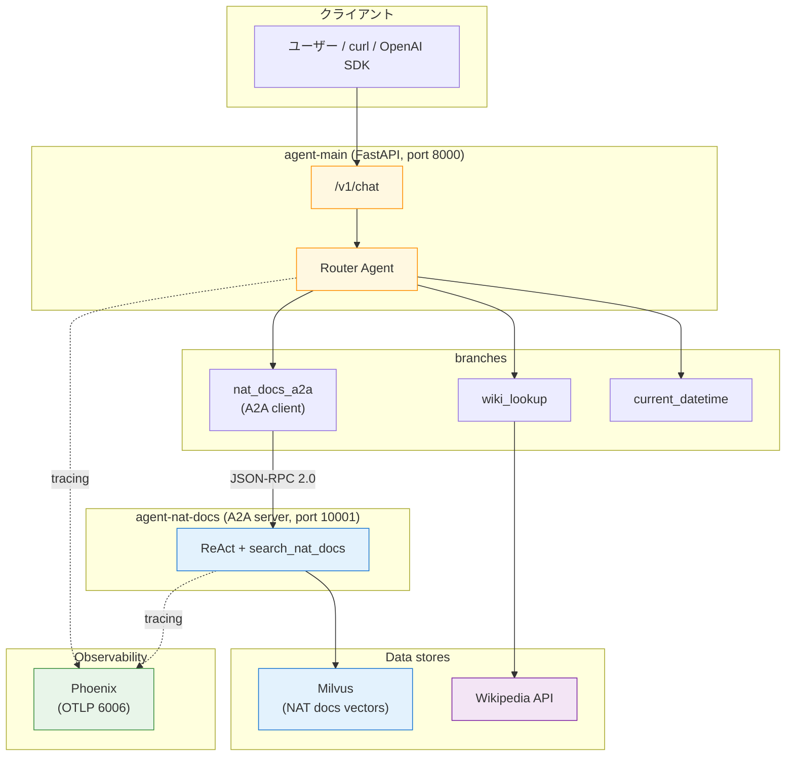

本書の最終章です。ここまでに組み上げてきた NAT の要素を 1 つの docker compose に統合し、**「NVIDIA NAT docs & 一般知識ハイブリッド Q&A エージェント」**を完成させます。読者は `/v1/chat` を curl で叩くだけで、内部では Router → A2A → RAG ReAct → Milvus までが連鎖し、同時に Phoenix にトレースが流れます。

本書で登場した道具の集大成、という位置付けです。

## この章のゴール

- 第 7 章（Phoenix）+ 第 9-10 章（Milvus RAG）+ 第 11 章（Router）+ 第 12 章（A2A）+ 第 14 章（FastAPI）の 5 要素を 1 つの compose に統合する
- Router の branches に A2A 経由のサブエージェントが乗る構成を実装する（第 11 章の制約を A2A で回避）
- `/v1/chat` を curl で叩いて「質問内容に応じて NAT docs / Wikipedia / datetime が自動で選ばれる」を体感する
- Phoenix 側でエージェント連鎖のトレースを目視する

## 前章からの引き継ぎ

- 本書で登場したサンプルと同じベースイメージ（`nat-nim-handson:1.6.0`）
- NAT 公式 docs データセット（`../datasets/nat-docs/`）
- NGC API key

## 全体アーキテクチャ



compose の service は 8 つ。それぞれの役割は以下です。

| service          | 役割                                            | 対応章           |
| ---------------- | ----------------------------------------------- | ---------------- |
| `etcd`           | Milvus メタデータストア                         | 第 9 章          |
| `minio`          | Milvus オブジェクトストレージ                   | 第 9 章          |
| `milvus`         | ベクトル検索本体                                | 第 9 章          |
| `ingest`         | NAT docs を Milvus に投入（初回のみ）           | 第 10 章         |
| `phoenix`        | OTLP トレース収集・可視化                       | 第 7 章          |
| `agent-nat-docs` | A2A サーバー、RAG ReAct                         | 第 9 + 第 12 章  |
| `agent-main`     | FastAPI フロント、Router で 3 branch に振り分け | 第 11 + 第 14 章 |

## 第 11 章の制約を A2A で回避する

第 11 章で「Router の branches にサブ ReAct エージェントを直接入れると `ChatRequest` スキーマ不一致で落ちる」という制約にぶつかりました。本章はこれを **A2A 経由の function_group 化**で解決します。

```yaml:main-agent.yml（核となる部分）
function_groups:
  nat_docs_a2a:
    _type: a2a_client
    url: http://agent-nat-docs:10001
    task_timeout: 90

functions:
  wiki_lookup:
    _type: wiki_search
    max_results: 2

  current_datetime:
    _type: current_datetime

workflow:
  _type: router_agent
  llm_name: nim_llm
  branches:
    - nat_docs_a2a
    - wiki_lookup
    - current_datetime
```

違いは 1 点、`nat_docs_a2a` が **`functions:` ではなく `function_groups:`** に宣言されていることです。A2A client はスキル一覧を Agent Card から取得して複数 tool を一括展開するので、NAT ではこれを function_group として扱います。`branches:` に function_group 名をそのまま入れると、Router はその function_group 配下のツール群をひとまとめの「振り分け先」として扱えます。

`per_user_react_agent` を使った第 12 章とは異なり、本章は **Router が外枠**なので通常の `router_agent` で OK。A2A の型変換レイヤーが `/v1/chat` 相当のメッセージ形式を吸収してくれるため、Router → A2A client → Sub ReAct と 3 レイヤー深くなってもスキーマエラーは発生しません。

## rag-agent.yml は第 9 章のほぼ再掲

```yaml:rag-agent.yml（抜粋、変わるのは front_end だけ）
general:
  front_end:
    _type: a2a
    name: NAT Docs Agent
    description: >
      NVIDIA NeMo Agent Toolkit の公式ドキュメントを検索して答える専門エージェント.
    host: 0.0.0.0
    port: 10001

# llms / embedders / retrievers / functions / workflow は第 9 章と同じ
```

`general.front_end._type: a2a` を 5 行足すだけで、第 9 章の RAG ReAct がそのまま A2A サーバーになります。第 12 章で見たように、Agent Card は `/.well-known/agent-card.json` に自動出力され、main-agent 側の `a2a_client` が起動時にこれを読んでスキルを展開します。

## 動かす

```bash
cd nemo-agent-toolkit-book/ch15-final
cp ../ch03-hello-agent/.env .env

# Milvus を起動して NAT docs を投入（初回のみ、2-3 分）
docker compose up -d milvus
docker compose --profile ingest run --rm ingest

# Phoenix + A2A サーバー + FastAPI フロントを起動
docker compose up -d phoenix agent-nat-docs agent-main

# Uvicorn が 0.0.0.0:8000 で listen するのを待つ
docker compose logs -f agent-main | tail -15
```

各サービスの健康状態を一発で確認できます。

```bash
curl -s http://localhost:8000/health         # agent-main
curl -s http://localhost:6006/                # phoenix UI
curl -s http://localhost:10001/.well-known/agent-card.json | jq .name
```

## `/v1/chat` で完成アプリを叩く

NAT 製品の質問：

```bash
curl -s -X POST http://localhost:8000/v1/chat \
  -H "Content-Type: application/json" \
  -d '{"messages":[{"role":"user","content":"How do I configure a Milvus retriever in NAT?"}]}' | jq '.choices[0].message.content'
```

Router は `nat_docs_a2a` に振り分け、A2A 経由で agent-nat-docs が呼ばれ、Milvus から `retrievers.md` / `workflow-configuration.md` のチャンクを取得して ReAct で組み立てた応答が `/v1/chat` 形式で返ります。

一般知識の質問：

```bash
curl -s -X POST http://localhost:8000/v1/chat \
  -H "Content-Type: application/json" \
  -d '{"messages":[{"role":"user","content":"Who founded NVIDIA?"}]}' | jq '.choices[0].message.content'
```

Router は `wiki_lookup` に振り分け、Wikipedia 検索結果をそのまま返します。

時刻の質問：

```bash
curl -s -X POST http://localhost:8000/v1/chat \
  -H "Content-Type: application/json" \
  -d '{"messages":[{"role":"user","content":"What is the current time?"}]}' | jq '.choices[0].message.content'
```

Router は `current_datetime` に振り分けます。ここはほぼ即答。

## Phoenix でトレースを追う

`http://localhost:6006/` を開いて `nat-handson-ch15` プロジェクトを選ぶと、Router → branch 選択 → A2A 呼び出し → RAG → Final Answer までの span がツリーで見えます。

3 つの質問タイプそれぞれで、どの branch が選ばれたか、どれだけ時間がかかったか、Observation に何が返ったかが一目で分かります。エージェントの品質チューニングでは、ここのトレースを眺めるのが最短経路です。

## 本書で積み上げた要素の棚卸し

完成アプリの中で、本書の各章が果たした役割を並べておきます。

| 章       | このアプリで効いている機能                                            |
| -------- | --------------------------------------------------------------------- |
| 第 3 章  | `docker compose run --rm nat` の実行形態（基盤）                      |
| 第 4 章  | YAML の 4 セクション（general / llms / functions / workflow）の書き方 |
| 第 5 章  | `current_datetime` / `wikipedia_search` の組み込み tool               |
| 第 6 章  | `react_agent` / `router_agent` の `_type` 差し替え                    |
| 第 7 章  | `general.telemetry.tracing.phoenix` で Phoenix に送信                 |
| 第 8 章  | MCP は今回の完成アプリでは不使用（将来の拡張枠）                      |
| 第 9 章  | `embedders` / `retrievers` / `milvus_retriever` / `nat_retriever`     |
| 第 10 章 | `search_params.filter` / `top_k` のチューニング知識                   |
| 第 11 章 | `workflow._type: router_agent` + `branches:`                          |
| 第 12 章 | `function_groups._type: a2a_client` + `general.front_end._type: a2a`  |
| 第 13 章 | `nat eval` による定量評価（改善サイクルの回し方）                     |
| 第 14 章 | `nat serve` + FastAPI / `/v1/chat` OpenAI 互換                        |

本章はそれぞれ 1 行や 1 セクションずつ「混ぜる」だけでした。**NAT の設計思想である「YAML で宣言的に組み立てる」**という考え方が、完成アプリの規模になっても破綻していないのがポイントです。

## よくある詰まりどころ

**`/v1/chat` に POST して 404**

`workflow.yml` の `_type: router_agent` で `branches:` に空リストを渡すと、NAT は `/v1/chat` を expose しません。最低 1 つ function または function_group を指定してください。

**`a2a_client` が Agent Card 404**

`agent-nat-docs` の起動順が `agent-main` より遅い可能性があります。本章の compose では `depends_on: [agent-nat-docs, phoenix]` で順序を付けていますが、`agent-nat-docs` の `Uvicorn running` が出るまで待ってから `agent-main` を再起動すると確実です。

**Milvus のデータが空で RAG が外す**

`docker compose --profile ingest run --rm ingest` を忘れているケース。`curl -s http://localhost:19530/` だけではデータの有無はわからないので、軽く `docker compose run --rm agent-nat-docs info components -t retriever_client` でも叩いて、`milvus_retriever` の設定が読めているかまでは確認する習慣がオススメです。

**Phoenix に trace が出てこない**

`agent-main` と `agent-nat-docs` の両方の `general.telemetry.tracing.phoenix.endpoint` が `http://phoenix:6006/v1/traces` になっているか確認してください。本章では main 側だけに設定していますが、サブエージェントにも入れれば A2A の両側のトレースが繋がります。

## ここまでで動くもの

- docker compose up 一発で、8 service の完成アプリが立ち上がる
- `/v1/chat` に POST するだけで、Router が 3 種類の branch を自動で振り分け
- A2A 経由でサブ ReAct が呼ばれ、Milvus RAG の応答が帰ってくる
- Phoenix でエージェント連鎖を span ツリーとして眺められる
- 本書 14 章の要素がすべて 1 つの compose に集約された

:::message
本章のサンプルコードは [nemo-agent-toolkit-book リポ](https://github.com/himorishige/nemo-agent-toolkit-book) の `ch15-final/` ディレクトリにまとめています。
:::

## おわりに（本編の終わりに）

本書の目標は「クラウド NIM + Docker だけで NAT のマルチエージェント + RAG アプリを組み上げる」ことでした。ここまでお付き合いいただきありがとうございます。

ここから先は、読者それぞれが自分の業務データで本書の構成を置き換えていく番です。nat-docs を社内 Wiki に、`wiki_lookup` を社内検索 API に、`current_datetime` を業務ツール（Slack / JIRA / Salesforce）の MCP ツールに差し替えれば、同じアーキテクチャで「社内ハイブリッド Q&A エージェント」が組めます。

付録 A に本書で踏んだハマりポイントを集約しています。付録 B に NIM 無料枠での実測コストをまとめています。本編と併せて読んでいただくと、読者のアプリに組み込むときのイメージが掴みやすくなるはずです。

NAT 1.7 以降で挙動が変わった箇所や、筆者の検証不足で誤っていた箇所があれば、GitHub Issues / Zenn コメントで遠慮なくフィードバックをお願いします。本書と NAT が、読者のエージェント開発の次の一歩になれば幸いです。
