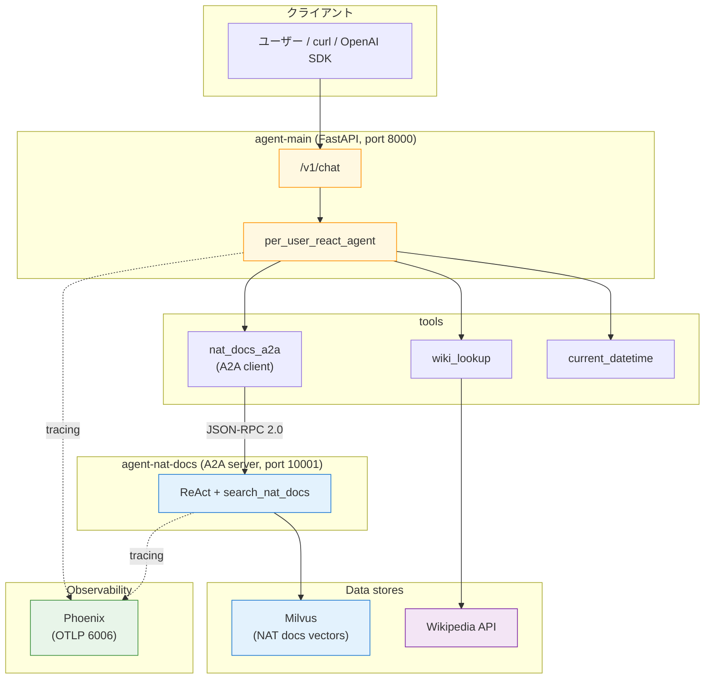

本書の最終章です。ここまでに組み上げてきた NAT の要素を 1 つの docker compose に統合し、**「NVIDIA NAT docs & 一般知識ハイブリッド Q&A エージェント」**を完成させます。読者は `/v1/chat` を curl で叩くだけで、内部では ReAct → tool 選択 → A2A → RAG → Milvus までが連鎖し、同時に Phoenix にトレースが流れます。

本書で登場した道具の集大成、という位置付けです。

## この章のゴール

- 第 7 章（Phoenix）+ 第 9-10 章（Milvus RAG）+ 第 12 章（A2A）+ 第 14 章（FastAPI）の 4 要素を 1 つの compose に統合する
- `per_user_react_agent` の tool_names に A2A client の function_group を乗せる構成を実装する
- `/v1/chat` を curl で叩いて「質問内容に応じて NAT docs / Wikipedia / datetime が自動で選ばれる」を体感する
- Phoenix 側でエージェント連鎖のトレースを目視する
- 第 11 章の Router の制約（`branches:` は function 名のみ）を踏まえた現実的な統合構成を理解する

## 前章からの引き継ぎ

- 本書で登場したサンプルと同じベースイメージ（`nat-nim-handson:1.6.0`）
- NAT 公式 docs データセット（`../datasets/nat-docs/`）
- NGC API key

## 全体アーキテクチャ



compose の service は 8 つ。それぞれの役割は以下です。

| service          | 役割                                                    | 対応章           |
| ---------------- | ------------------------------------------------------- | ---------------- |
| `etcd`           | Milvus メタデータストア                                 | 第 9 章          |
| `minio`          | Milvus オブジェクトストレージ                           | 第 9 章          |
| `milvus`         | ベクトル検索本体                                        | 第 9 章          |
| `ingest`         | NAT docs を Milvus に投入（初回のみ）                   | 第 10 章         |
| `phoenix`        | OTLP トレース収集・可視化                               | 第 7 章          |
| `agent-nat-docs` | A2A サーバー、RAG ReAct                                 | 第 9 + 第 12 章  |
| `agent-main`     | FastAPI フロント、per_user_react_agent が 3 tool を選択 | 第 12 + 第 14 章 |

## 第 12 章の `per_user_react_agent` に A2A client を乗せる

実機検証の結果、`router_agent` の `branches:` には **function 名しか受け付けず、`function_groups:` に宣言した A2A client を直接は展開できません**（NAT 1.6.0, `ValueError: Function 'nat_docs_a2a' not found in list of functions`）。一方、第 12 章で確認した `per_user_react_agent` は `tool_names:` に function_group を入れて動作することがわかっています。

そこで本章では **第 12 章の `per_user_react_agent` をそのまま外枠に採用**します。Router は見た目のインパクトこそありますが、`tool_names:` に複数ツール（A2A 含む）を並べれば、ReAct の内部でも十分に「質問に応じた自動振り分け」が実現できます。

```yaml:main-agent.yml（核となる部分）
function_groups:
  nat_docs_a2a:
    _type: a2a_client
    url: http://agent-nat-docs:10001
    task_timeout: 90

functions:
  wiki_lookup:
    _type: wiki_search
    max_results: 2

  current_datetime:
    _type: current_datetime

workflow:
  _type: per_user_react_agent
  llm_name: nim_llm
  tool_names:
    - nat_docs_a2a
    - wiki_lookup
    - current_datetime
  verbose: true
  max_iterations: 6
  parse_agent_response_max_retries: 5
```

違いは 1 点、`nat_docs_a2a` が **`functions:` ではなく `function_groups:`** に宣言されていることです。A2A client はスキル一覧を Agent Card から取得して複数 tool を一括展開するので、NAT ではこれを function_group として扱います。`tool_names:` に function_group 名を入れると、ReAct 側はそのグループ配下のツール群を自分の ReAct 思考ループで呼べるようになります。

`per_user_react_agent` は「ユーザー単位でセッション状態を分離する」前提の workflow なので、HTTP 呼び出し時に JWT の `sub` / `user_id` が必須になります。本章では動作確認用にダミー JWT で通しますが、本番では認証バックエンドと連携させる流れが一般的です。

## rag-agent.yml は第 9 章のほぼ再掲

```yaml:rag-agent.yml（抜粋、変わるのは front_end だけ）
general:
  front_end:
    _type: a2a
    name: NAT Docs Agent
    description: >
      NVIDIA NeMo Agent Toolkit の公式ドキュメントを検索して答える専門エージェント.
    host: 0.0.0.0
    port: 10001

# llms / embedders / retrievers / functions / workflow は第 9 章と同じ
```

`general.front_end._type: a2a` を 5 行足すだけで、第 9 章の RAG ReAct がそのまま A2A サーバーになります。第 12 章で見たように、Agent Card は `/.well-known/agent-card.json` に自動出力され、main-agent 側の `a2a_client` が起動時にこれを読んでスキルを展開します。

## 動かす

```bash
cd nemo-agent-toolkit-book/ch15-final
cp ../ch03-hello-agent/.env .env

# Milvus を起動して NAT docs を投入（初回のみ、2-3 分）
docker compose up -d milvus
docker compose --profile ingest run --rm ingest

# Phoenix + A2A サーバー + FastAPI フロントを起動
docker compose up -d phoenix agent-nat-docs agent-main

# Uvicorn が 0.0.0.0:8000 で listen するのを待つ
docker compose logs -f agent-main | tail -15
```

各サービスの健康状態を一発で確認できます。

```bash
curl -s http://localhost:8000/health         # agent-main
curl -s http://localhost:6006/                # phoenix UI
curl -s http://localhost:10001/.well-known/agent-card.json | jq .name
```

## `/v1/chat` で完成アプリを叩く

`per_user_react_agent` はユーザー分離のために JWT の `sub` 相当が必要です。本節ではダミー JWT を生成して動作確認します。

```bash
# ダミー JWT 生成（sub: test-user-1, alg: none）
JWT=$(python3 -c "
import base64, json
header = base64.urlsafe_b64encode(json.dumps({'alg':'none','typ':'JWT'}).encode()).decode().rstrip('=')
payload = base64.urlsafe_b64encode(json.dumps({'sub':'test-user-1','user_id':'test-user-1'}).encode()).decode().rstrip('=')
print(f'{header}.{payload}.')
")
```

時刻の質問（もっともシンプルなケース）：

```bash
curl -s -X POST http://localhost:8000/v1/chat \
  -H "Content-Type: application/json" \
  -H "Authorization: Bearer $JWT" \
  -d '{"messages":[{"role":"user","content":"What is the current time?"}]}' | jq '.choices[0].message.content'
```

ReAct が `current_datetime` を選び、UTC タイムスタンプが返ります。

一般知識の質問：

```bash
curl -s -X POST http://localhost:8000/v1/chat \
  -H "Content-Type: application/json" \
  -H "Authorization: Bearer $JWT" \
  -d '{"messages":[{"role":"user","content":"Who founded NVIDIA?"}]}' | jq '.choices[0].message.content'
```

ReAct が `wiki_lookup` を選び、Wikipedia 検索結果から組み立てた応答が返ります。

NAT 製品の質問（A2A 経由）：

```bash
curl -s -X POST http://localhost:8000/v1/chat \
  -H "Content-Type: application/json" \
  -H "Authorization: Bearer $JWT" \
  --max-time 180 \
  -d '{"messages":[{"role":"user","content":"How do I configure a Milvus retriever in NeMo Agent Toolkit?"}]}' | jq '.choices[0].message.content'
```

ReAct が `nat_docs_a2a` 配下のスキルを選び、A2A 経由で agent-nat-docs が呼ばれる想定です。ただし **NAT 1.6.0 では A2A client の引数スキーマ変換で型エラー（`Cannot convert type <str> to <InputArgsSchema>`）**が発生することがあります。その場合は ReAct の retry でリカバリしつつも、期待通りのドキュメント引用までは返せないケースがあります。A2A 経由で安定動作させたいときは第 12 章のように A2A server を単独で叩き、RAG は直接呼ぶ構成に分解するのが安全です。

## Phoenix でトレースを追う

`http://localhost:6006/` を開いて `nat-handson-ch15` プロジェクトを選ぶと、ReAct → tool 選択 → A2A 呼び出し → RAG → Final Answer までの span がツリーで見えます。

3 つの質問タイプそれぞれで、どの tool が選ばれたか、どれだけ時間がかかったか、Observation に何が返ったかが一目で分かります。エージェントの品質チューニングでは、ここのトレースを眺めるのが最短経路です。

## 本書で積み上げた要素の棚卸し

完成アプリの中で、本書の各章が果たした役割を並べておきます。

| 章       | このアプリで効いている機能                                                                    |
| -------- | --------------------------------------------------------------------------------------------- |
| 第 3 章  | `docker compose run --rm nat` の実行形態（基盤）                                              |
| 第 4 章  | YAML の 4 セクション（general / llms / functions / workflow）の書き方                         |
| 第 5 章  | `current_datetime` / `wikipedia_search` の組み込み tool                                       |
| 第 6 章  | `react_agent` / `router_agent` の `_type` 差し替え                                            |
| 第 7 章  | `general.telemetry.tracing.phoenix` で Phoenix に送信                                         |
| 第 8 章  | MCP は今回の完成アプリでは不使用（将来の拡張枠）                                              |
| 第 9 章  | `embedders` / `retrievers` / `milvus_retriever` / `nat_retriever`                             |
| 第 10 章 | `search_params.filter` / `top_k` のチューニング知識                                           |
| 第 11 章 | `workflow._type: router_agent` + `branches:`（本章では不採用、制約知見を転用）                |
| 第 12 章 | `function_groups._type: a2a_client` + `general.front_end._type: a2a` + `per_user_react_agent` |
| 第 13 章 | `nat eval` による定量評価（改善サイクルの回し方）                                             |
| 第 14 章 | `nat serve` + FastAPI / `/v1/chat` OpenAI 互換                                                |

本章はそれぞれ 1 行や 1 セクションずつ「混ぜる」だけでした。**NAT の設計思想である「YAML で宣言的に組み立てる」**という考え方が、完成アプリの規模になっても破綻していないのがポイントです。

## よくある詰まりどころ

**`/v1/chat` に POST して `user_id is required` で 500**

`per_user_react_agent` を使うときの必須仕様です。`Authorization: Bearer <JWT>` を付与し、JWT の `sub` または `user_id` claim を含めてください。本章の動作確認スニペットではダミー JWT（`alg: none`）を生成しています。

**`router_agent` の `branches:` に `nat_docs_a2a` を入れたら `Function not found`**

NAT 1.6.0 の `router_agent` は `function_groups:` を展開できません。function 名（`functions:` 配下）しか受け付けないため、A2A client を組み合わせる用途では `per_user_react_agent` を採用してください。

**`nat_docs_a2a` 呼び出しで `Cannot convert type <str> to <InputArgsSchema>`**

NAT 1.6.0 の A2A client で発生する既知の型変換エラーです。ReAct の内部 retry で最終応答は返りますが、引用付きの RAG 応答までは期待しにくいケースです。A2A を安定動作させたいときは、第 12 章のように A2A server を単独で叩く構成に分解するのが確実です。

**`a2a_client` が Agent Card 404**

`agent-nat-docs` の起動順が `agent-main` より遅い可能性があります。本章の compose では `depends_on: [agent-nat-docs, phoenix]` で順序を付けていますが、`agent-nat-docs` の `Uvicorn running` が出るまで待ってから `agent-main` を再起動すると確実です。

**Milvus のデータが空で RAG が外す**

`docker compose --profile ingest run --rm ingest` を忘れているケース。`curl -s http://localhost:19530/` だけではデータの有無はわからないので、軽く `docker compose run --rm agent-nat-docs info components -t retriever_client` でも叩いて、`milvus_retriever` の設定が読めているかまでは確認する習慣がオススメです。

**Phoenix に trace が出てこない**

`agent-main` と `agent-nat-docs` の両方の `general.telemetry.tracing.phoenix.endpoint` が `http://phoenix:6006/v1/traces` になっているか確認してください。本章では main 側だけに設定していますが、サブエージェントにも入れれば A2A の両側のトレースが繋がります。

## ここまでで動くもの

- docker compose up 一発で、8 service の完成アプリが立ち上がる
- `/v1/chat` に JWT 付き POST するだけで、ReAct が wiki_lookup / current_datetime を自動選択
- A2A client が agent-nat-docs の Agent Card からスキルを展開（RAG 応答は NAT 1.6.0 の制約あり）
- Phoenix でエージェント連鎖を span ツリーとして眺められる
- 本書 14 章の要素がすべて 1 つの compose に集約された

:::message
本章のサンプルコードは [nemo-agent-toolkit-book リポ](https://github.com/himorishige/nemo-agent-toolkit-book) の `ch15-final/` ディレクトリにまとめています。
:::

## おわりに（本編の終わりに）

本書の目標は「クラウド NIM + Docker だけで NAT のマルチエージェント + RAG アプリを組み上げる」ことでした。ここまでお付き合いいただきありがとうございます。

ここから先は、読者それぞれが自分の業務データで本書の構成を置き換えていく番です。nat-docs を社内 Wiki に、`wiki_lookup` を社内検索 API に、`current_datetime` を業務ツール（Slack / JIRA / Salesforce）の MCP ツールに差し替えれば、同じアーキテクチャで「社内ハイブリッド Q&A エージェント」が組めます。

付録 A に本書で踏んだハマりポイントを集約しています。付録 B に NIM 無料枠での実測コストをまとめています。本編と併せて読んでいただくと、読者のアプリに組み込むときのイメージが掴みやすくなるはずです。

NAT 1.7 以降で挙動が変わった箇所や、筆者の検証不足で誤っていた箇所があれば、GitHub Issues / Zenn コメントで遠慮なくフィードバックをお願いします。本書と NAT が、読者のエージェント開発の次の一歩になれば幸いです。
