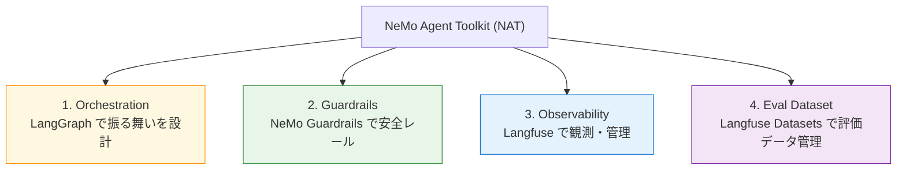
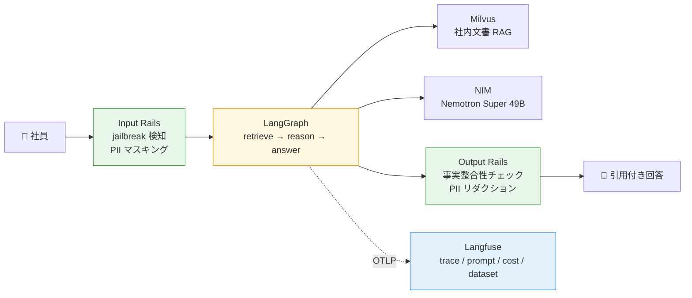
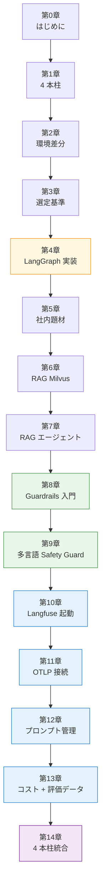

NVIDIA NeMo Agent Toolkit（以下 NAT）でエージェントが動くようになると、次に気になるのは「**このまま現場に出して大丈夫だろうか**」という問いです。意図しない応答が混じらないか、トレースが追えるか、コストはどれくらい載るか、評価データセットをどう管理するか。前作 [NIM + Docker ではじめる NeMo Agent Toolkit ハンズオン](https://zenn.dev/himorishige/books/nemo-agent-toolkit-nim-handson) では「動くエージェントを組み立てる」ところまでを扱いましたが、そこから先の運用品質に踏み込もうとすると、扱う技術スタックが一気に増えます。

本書は、その**運用品質を 4 本柱**で言語化し、それぞれを最小構成のハンズオンとして積み上げる続編です。題材は前作とは違うドメイン、社内ドキュメント Q&A エージェントです。社外秘や PII を含みうる文脈にすることで、ガードレールや観測のありがたみが体感しやすくなる構成にしました。

## 前作との関係

前作で扱ったのは次のような層でした。

- 環境構築（Colima + Docker + NGC）
- ReAct / ReWOO / Tool Calling の使い分け
- MCP 連携、Milvus による RAG
- Router Agent と A2A プロトコル
- `nat eval` での採点、`nat serve` での Web API 化

ここまでで「**エージェントを動かす**」ための材料は揃います。一方で、運用に乗せようとすると次の問いが残ります。

- LangGraph / CrewAI / AutoGen のような既存の **オーケストレーションフレームワーク** とどう付き合うか
- 入出力に **ガードレール** を被せて、危険な入力や PII を弾けるか
- Phoenix のトレース可視化を超えて、**プロンプト管理・A/B テスト・コスト追跡・評価データセット管理** までを1つのバックエンドで扱えるか

本書はこの 3 つの問いに答える形で構成しています。前作を読んでいなくても本書だけで完結する作りにしていますが、前作を一通り眺めてから戻ってくると、4 本柱がどこに刺さるのかが立体的に見えてくるはずです。

## 本書の到達点 — 運用品質の 4 本柱

最初に全体像を示します。本書では、NAT を本番投入する際に必要になる 4 つの柱を以下のように整理しました。



1 つ目の **Orchestration** は、エージェントの振る舞いを宣言的に設計する層です。NAT は LangChain / LangGraph / CrewAI / AutoGen など複数のフレームワークを橋渡しできる設計になっていて、「どのフレームワークを選ぶか」自体が運用品質に効いてきます。本書では LangGraph を実装の主軸にしながら、CrewAI / AutoGen との比較・選定基準を整理します。

2 つ目の **Guardrails** は、入出力の検閲層です。NeMo Guardrails と Colang を使って、jailbreak（脱獄）や PII の漏洩を入口で防ぎ、出力の事実整合性チェックを出口に置きます。日本語環境で実用的に動かすためのプロンプト設計や、NIM 経由の多言語 Safety Guard の使い方も扱います。

3 つ目の **Observability** は、実行を後から振り返るための観測層です。前作では Phoenix を使っていましたが、本書では **Langfuse self-hosted** に置き換えます。理由は次の 4 本柱目に直結します。

4 つ目の **Eval Dataset** は、エージェントの評価データセットを継続的に管理する層です。Langfuse は OTLP のトレース可視化に加えて、プロンプトのバージョン管理・A/B テスト、トークンとコストの追跡、評価用 Q&A データセットの管理までを1つのバックエンドでまかなえます。Phoenix とのもっとも大きな違いがここです。

## 本書で作るもの

題材は「**社内ドキュメント Q&A エージェント**」です。サンプルとして配布するデータセットには、社員名・電話番号・社内システムの URL といった PII / 機密度メタデータが意図的に含まれます。これらを Guardrails でどう扱うか、Langfuse でどう監査するかを章を進めながら積み上げます。

最終章では次のような姿になります。



すべて `docker compose up` で立ち上がる構成にしてあります。前作と同じく、Python の venv 作成や GPU セットアップは不要です。

## 本書の対象読者

次のようなほうを想定しています。

- 前作を読んだ、もしくは NAT で「Hello Agent」を動かした経験がある
- LangGraph / CrewAI / AutoGen の名前は知っているが、どう選べばよいか迷っている
- 「動く LLM」と「現場に出せる LLM」の間にある装備に踏み込みたい
- Phoenix のトレース可視化はやってみたが、プロンプト管理・コスト追跡まで広げたい
- 評価データセットを Excel や JSONL で管理しているけれど、もう少し体系的に運ぶ方法を探している

DGX Spark のような専用ハードウェアは不要です。動作確認は macOS（Apple Silicon Colima）と Linux（DGX Spark / native Docker）で行っています。Apple Silicon と DGX Spark のような ARM64 環境にも気をつけながら書きました。

## 本書で扱わないこと

以下は意図的にスコープ外にしています。

- CrewAI / AutoGen の本格実装は対象外です。第 3 章の選定比較に絞り、実装は LangGraph 一本に揃えました
- Router Agent / A2A プロトコルは前作の第 11-12 章で扱った題材なので踏み込みません。本書では LangGraph 単体の state graph で multi-step を表現します
- Phoenix の使い方も前作の第 7 章でカバー済みです。本書は Langfuse 一本に絞り、Phoenix からの移行手順は付録 A にまとめます
- `nat eval` の使い方も前作の第 13 章で扱ったため、本書では Langfuse Datasets を評価バックエンドとして使う流れに切り替えます
- GPU / CUDA / vLLM のセットアップは扱いません。NIM の無料枠で全章が回せる想定です

## 必要な環境

| 項目              | 内容                                                                                       |
| ----------------- | ------------------------------------------------------------------------------------------ |
| OS                | macOS / Linux / Windows（WSL2）                                                            |
| Docker ランタイム | Colima 推奨、Docker Desktop / native Docker Engine も可                                    |
| ディスク空き      | 約 8-12 GB（NAT イメージ + Milvus + Langfuse v3 の Postgres / ClickHouse / Redis / MinIO） |
| メモリ            | 12 GB 以上を推奨（前作の 8 GB から増量、Langfuse の ClickHouse が常時 1.5-2 GB 使う想定）  |
| NGC API key       | [build.nvidia.com](https://build.nvidia.com) で無料取得                                    |
| エディタ          | 任意                                                                                       |

第 2 章で Colima のリソース割当ての見直しから順に進めます。前作と同じ環境を引き継ぐ場合でも、Langfuse のスタックが乗るぶんメモリを増やすところから始めます。

## サンプルコード

全章のサンプルコードは GitHub で配布します。

https://github.com/himorishige/nemo-agent-toolkit-production-ops

章ごとに `chNN-*/` ディレクトリが切ってあり、各ディレクトリに `docker-compose.yml` と必要な設定ファイルが揃います。本書を読みながら `git clone` した手元で動作確認できる設計です。

```bash
git clone https://github.com/himorishige/nemo-agent-toolkit-production-ops.git
cd nemo-agent-toolkit-production-ops/ch04-langgraph
cp .env.example .env  # NGC_API_KEY を記入
docker compose run --rm nat
```

## 本書のバージョン前提

| コンポーネント  | バージョン                                         |
| --------------- | -------------------------------------------------- |
| nvidia-nat      | 1.6.0（`langchain,mcp,eval,opentelemetry` extras） |
| Python          | 3.12（Docker イメージ側）                          |
| workflow LLM    | nvidia/llama-3.3-nemotron-super-49b-v1（NIM）      |
| Embedding       | nvidia/nv-embedqa-e5-v5（NIM）                     |
| Guardrail LLM   | nvidia/llama-3.1-nemotron-safety-guard-8b-v3（NIM）|
| NeMo Guardrails | v0.21.0（Colang 1.0）                              |
| Langfuse        | v3.22 以上（self-hosted、OTLP `/api/public/otel`） |
| Milvus          | milvusdb/milvus v2.5.4（Docker standalone）        |

NAT 1.7 以降や NeMo Guardrails 0.22 以降で挙動が変わった箇所は、章末の差分メモに追記する運用です。

## 読み進め方のおすすめ

- **第 0-2 章**は全体像と環境差分を押さえる導入です。前作と同じ Colima 構成を継続するみなさんは斜め読みでも構いません
- **第 3-4 章**で LangGraph + NAT の組み合わせ方を理解します。ここを通せば「LangGraph を NAT の一部品として呼ぶ」感覚が掴めます
- **第 5-7 章**で社内ドキュメント Q&A の最小実装を作ります。Part 4 / Part 5 の Guardrails と Langfuse の効果を体感する下敷きになります
- **第 8-9 章**で Guardrails、**第 10-13 章**で Langfuse をそれぞれ集中して扱います。興味の濃い章から先に読んでもストーリーを追いかけられる構成にしました
- **第 14 章**で 4 本柱を一気に組み合わせます。各部の整合性を疑う最後の砦として動かしてみてください

## 章依存図



オレンジが Orchestration、緑が Guardrails、青が Observability、紫が統合章です。

## フィードバック

本書の内容で動かないコードや、分かりにくい箇所があれば、以下のいずれかで気軽にお知らせください。

- サンプルコードリポジトリの [Issues](https://github.com/himorishige/nemo-agent-toolkit-production-ops/issues)
- Zenn の各章下部のコメント欄

## 次章では

次章では「運用品質の 4 本柱」をもう一段深掘りします。LangGraph / NeMo Guardrails / Langfuse それぞれが NAT のどこに刺さり、互いに何を補完するのか。最終章で組み上げる構成図の輪郭を、もう少し具体的なコンポーネント名でなぞっていきます。
