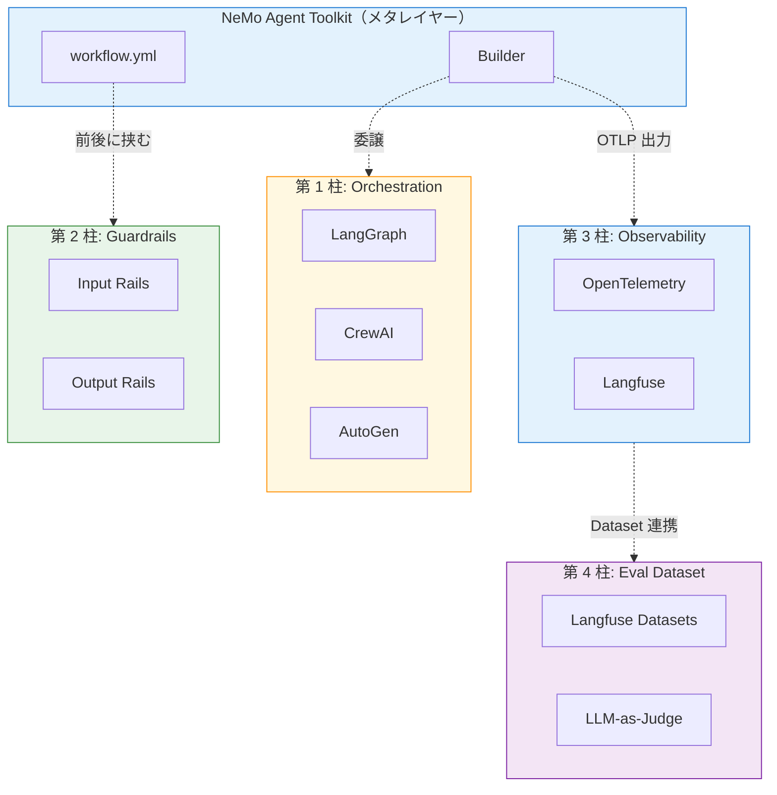
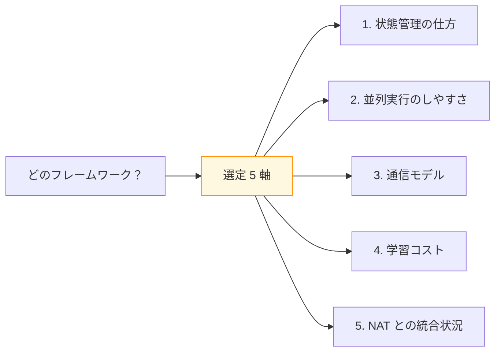
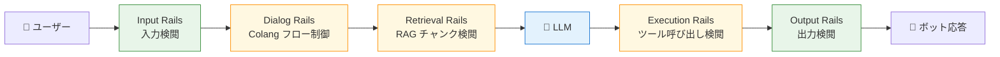
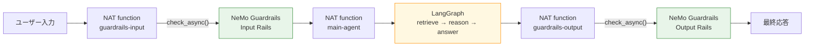
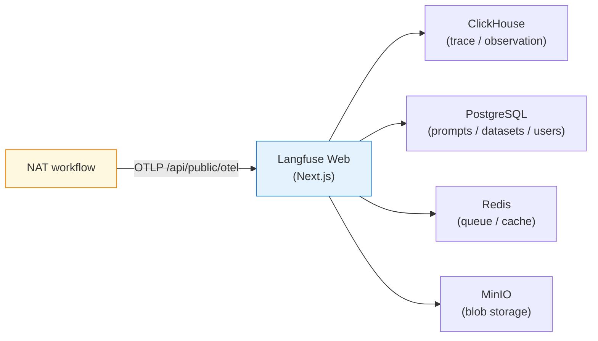
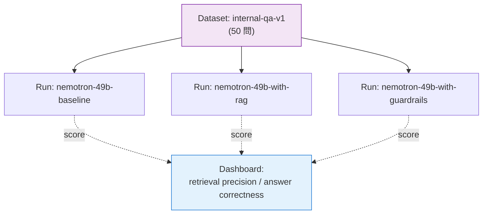
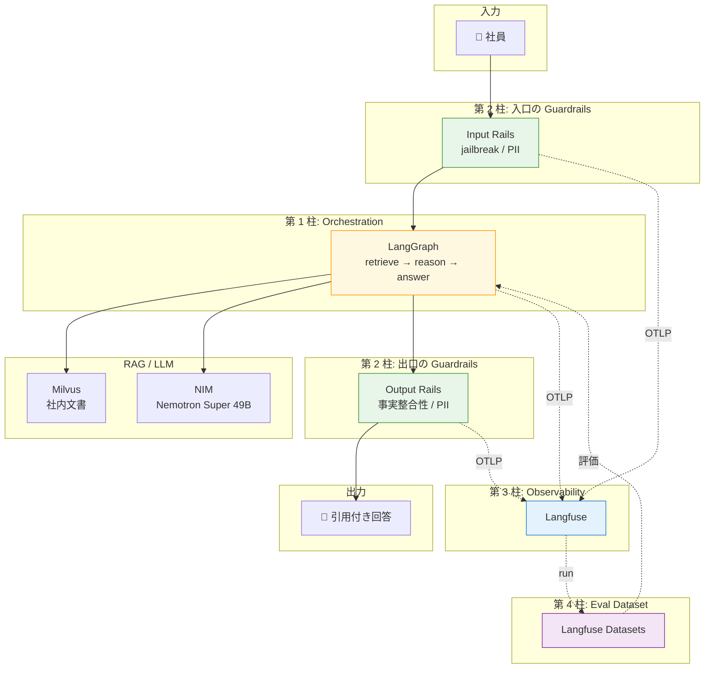

第 1 章では、序章で紹介した「運用品質の 4 本柱」をもう一段深掘りします。本章にハンズオンは登場しません。第 2 章から compose ファイルを書き始める前に、「LangGraph・NeMo Guardrails・Langfuse がそれぞれ NAT のどこに刺さるのか」「4 本柱が互いに何を補完するのか」を押さえておくと、以降の章で出てくる YAML や `docker-compose.yml` の読み解きが格段にラクになります。

## この章のゴール

- NAT を本番投入する際に必要になる 4 本柱を、それぞれ 30 秒で説明できるようになる
- LangGraph / CrewAI / AutoGen の選定軸を 5 つに整理して、自社プロジェクトに当てはめられる
- NeMo Guardrails が NAT のどこに挟まるのかを、入出力レールの粒度で図解できる
- Phoenix を Langfuse に置き換える理由を、4 つの差分で説明できる
- 4 本柱の関係を 1 枚の図にまとめて、最終章の構成を予習する

## NAT の立ち位置（前作からの再確認）

前作を読んでいないみなさんに向けて、NAT の立ち位置を 1 段落だけ復習します。

NAT は **LLM エージェントを YAML で組み立て、横串で観測・評価・最適化するためのメタレイヤー型ツールキット**です。パッケージ名は `nvidia-nat`、ライセンスは Apache 2.0。NAT 自身はエージェントの実行エンジンを持たず、ReAct ループや tool 呼び出しといったコア処理は LangChain / LangGraph / CrewAI / LlamaIndex などに委ねます。NAT はそれらを YAML で宣言的に束ね、外側から観測・評価・デプロイのレイヤーをかぶせる役割を担います。

この「自分では実行しない、束ねる」スタンスが、本書の 4 本柱を俯瞰するうえでも大事な発想です。柱はいずれも、NAT が「束ねる」だけでなく「監視する」「守る」「評価する」役割を担う層を、外部の OSS と組み合わせて補強する方向で組まれています。

ここから 4 本柱を 1 つずつ見ていきます。

## 第 1 柱: Orchestration — LangGraph / CrewAI / AutoGen の選定軸

NAT は Framework Agnostic を謳いますが、実際には「どのフレームワークを選ぶか」がエージェントの振る舞いの設計しやすさを左右します。本書では実装の主軸を **LangGraph** に置く構成にしましたが、その判断に至った 5 つの軸を先に整理しておきます。

1 つ目の **状態管理** は、エージェントが「いまどこまで進んだか」をどう保持するかという軸です。LangGraph はステートマシンとして状態を明示的に管理し、CrewAI はエージェント間の役割と引き継ぎで状態を表現し、AutoGen はマルチエージェント会話の履歴で状態を保ちます。「retrieve → reason → answer」のような直列のステップを書きやすいのは LangGraph、「ライターと編集者で書き直す」のような役割分担の比喩がはまるのは CrewAI です。

2 つ目の **並列実行** は、複数の subgraph や agent を同時に走らせる構造の有無です。LangGraph は branch を並列に評価して合流させる graph 構造を備えており、retrieval と再ランクを並走させたり、複数 RAG ソースを同時に叩いたりするのに向きます。CrewAI も async 実行で並走できますが、graph として可視化される LangGraph のほうがデバッグしやすいと感じています。

3 つ目の **通信モデル** は、エージェント同士がどうやり取りするかという軸です。LangGraph はノード間で state を渡し合うシンプルなモデルで、CrewAI は role-based のメッセージ受け渡し、AutoGen は LLM ベースの自由会話に近い構造です。本書のように「内部状態を厳密に追いかけたい」用途では LangGraph が素直で、「ChatGPT 風の自由対話」用途では AutoGen が向きます。

4 つ目の **学習コスト** は、ドキュメント・サンプル・コミュニティの厚みを総合した軸です。LangGraph は LangChain のエコシステムに乗っていて、StackOverflow やブログ記事の蓄積が厚いです。CrewAI は role / task / process という独自概念を覚えるところで一段ハードルがあります。AutoGen は研究系のサンプルが豊富ですが、Production 構成のリファレンス実装は薄い印象です。

5 つ目の **NAT との統合状況** は、本書の主題に直結する軸です。NAT は `nvidia-nat-langchain` extra で LangGraph 連携を公式サポートしており、LangGraph state graph を NAT の function として登録するパターンが docs に整備されています。CrewAI も `nvidia-nat-crewai` extra で profiler の callback まで実装が進んでいます。AutoGen / AG2 は公式統合がまだ発展途上で、ユーザー実装の余地が大きい状態です。

5 軸を踏まえると、「LangGraph をメインに、CrewAI を比較対象として 1 章分扱う」方針が、現時点でいちばんバランスがよいと考えました。詳細な選定表は第 3 章で示します。

## 第 2 柱: Guardrails — NeMo Guardrails の rails 体系

2 本目の柱は、入出力に「装備」を被せる層です。NVIDIA NeMo Guardrails は、ユーザーと LLM の間に **5 種類のレール** をはさむフレームワークで、jailbreak（脱獄）検出、PII マスキング、コンテンツ安全判定、トピック制限、ハルシネーション検知などを宣言的に組み合わせられます。

Input Rails はユーザー入力の検閲を担うレールで、jailbreak 検出、PII マスキング、カテゴリ別のコンテンツ安全判定が並びます。Dialog Rails は Colang という DSL で書く会話フロー制御層で、「この話題には踏み込まない」「こう聞かれたらこう返す」を形式的に定義します。Retrieval Rails は RAG で取得したチャンクに PII やセンシティブな内容が混ざっていないかを確認する層、Execution Rails はツール呼び出しの前後に介入する層、Output Rails は LLM 出力を検閲する層です。

本書では、初手として **Input Rails と Output Rails** に集中します。社内ドキュメント Q&A という題材では、入口で「答えるべきでない問いを弾く」役と、出口で「機密度の高い情報を漏らさない」役が、運用上もっとも効きやすいからです。Retrieval / Dialog / Execution Rails は応用編として章末にコラムを挟みます。

### NAT と NeMo Guardrails の結合点

ここで 1 つ大事な前置きがあります。NAT と NeMo Guardrails の **公式 middleware は、現時点では存在しません**。LangChain には `RunnableRails` や `GuardrailsMiddleware` という Guardrails 統合の仕組みがありますが、NAT のワークフロー層に直接被せる decorator は用意されていない状況です。

そこで本書では、NAT の workflow ステップとして Guardrails の `LLMRails.check_async()` を明示的に呼び出す「**手動 middleware パターン**」を採用します。NAT の function として Guardrails を 1 段挟み、入力と出力それぞれに対して `check_async()` を流す構成です。実装の詳細は第 8 章で見ますが、概念図としてはこんな形になります。

NAT が「束ねる」役に徹しているからこそ、こうしたパターンを YAML で宣言的に組めるのが面白いところです。

### 日本語環境で動かすための主役

Guardrails のレール本体は、判定する LLM に何を選ぶかでガラリと性格が変わります。本書の主役には **NemoGuard Safety Guard Multilingual v3**（`nvidia/llama-3.1-nemotron-safety-guard-8b-v3`）を据えました。CultureGuard と呼ばれる多言語適応学習で日本語を含む 9 言語に文化適応されており、精度 85.32% と公式に記載されています。NIM 経由なら無料枠（RPM 40）で利用できて、NeMo Guardrails の `config.yml` に `engine: nim` と model 名を 2 行書くだけで統合できます。

Llama Guard 3 / 4 のような英語ベースのモデルではなく、日本語公式対応のモデルを最初から採用するのが、本書の「日本語環境で実用的に動かす」スタンスです。詳細は第 9 章で扱います。

## 第 3 柱: Observability — Phoenix と Langfuse の差分

3 本目の柱は観測です。前作の第 7 章では Phoenix を使って NAT の workflow を OTLP でトレース可視化しました。Phoenix はトレースの俯瞰には強く、span ツリーを眺めながらデバッグするには十分な道具です。

ただ運用フェーズに入ると、トレース可視化の先に欲しくなる機能が増えてきます。プロンプトのバージョン管理、A/B テスト、トークンとコストの追跡、評価データセット管理。Phoenix は span / trace の可視化と annotation までは扱えますが、これら 4 つの領域に踏み込むには別ツールを併用するか、自前で組む必要が出てきます。

そこで本書は **Langfuse self-hosted** に置き換えます。Phoenix と Langfuse の差分を、本書が踏み込みたい 4 領域で並べるとこうなります。

| 領域                 | Phoenix                         | Langfuse                                                 |
| -------------------- | ------------------------------- | -------------------------------------------------------- |
| トレース可視化       | ◎ span ツリー、annotation       | ◎ trace tree、agent graph view                           |
| プロンプト管理       | △ 構造化なし、annotation で代用 | ◎ 名前 + version で管理、参照キー経由で SDK から呼べる   |
| A/B テスト           | △ 集計クエリで自前実装          | ◎ Prompt の version 比較ダッシュボードが組み込み         |
| コスト・トークン追跡 | △ 自前 mapping が必要           | ◎ model 単位で単価を登録、prompt × completion を自動集計 |
| 評価データセット管理 | △ trace の export を CSV で保存 | ◎ Datasets として Q&A を保存し、run と紐付けて評価       |

Langfuse は OTLP の trace 受信エンドポイントを公式に提供していて、NAT の `general.telemetry.tracing` に `_type: langfuse` を指定するだけで送信が始まります。Phoenix と同じ感覚で組めるのに、上の 4 領域がそのまま 1 つの UI に揃う、というのが置き換えの理由です。

Langfuse v3 は Postgres / ClickHouse / Redis / MinIO の 4 サービス構成です。前作の Phoenix（単体コンテナ）と比べるとサービスが増えますが、本書ではこれを 1 つの compose ファイルで一発起動できる形にまとめます。第 10 章で扱います。

## 第 4 柱: Eval Dataset — Langfuse Datasets で評価データを管理する

4 本目の柱は、エージェントの評価データセットを継続的に管理する層です。前作の第 13 章では `nat eval` を使って 20 問の JSONL を採点しました。これは「評価を回す」という意味では十分でしたが、運用に入ると次のような不満が出てきます。

データセット自体のバージョニングをどう管理するか。新しい質問を追加したら、過去のスコアと比較できる形で残せるか。retrieval の precision / recall を別軸で測りたいときに、メタデータを足したくなる。複数モデルの A/B 比較を、評価データセット単位で並べたい。

Langfuse Datasets は、これらをひとつのバックエンドで扱える仕組みです。各データセットは Q&A のペア（あるいは入力だけ、出力期待値だけ）を集めたコレクションとして名前付きで管理され、プロンプトと同じく version が振られます。run（評価実行）はデータセットに紐づき、各 item に対する trace と評価スコアが横並びで表示されます。

本書では、第 13 章で社内 Q&A 用の評価データセットを Langfuse 上に作り、本書を通じて 3 段階（RAG なし → あり → Guardrails 込み）で改善した workflow を同じデータセットで採点します。`nat eval` が「ローカルの JSONL を 1 回流す」道具だとすれば、Langfuse Datasets は「データセットと評価結果を継続的に蓄積する」道具と言えます。

## 4 本柱の相互依存

ここまで 4 本柱を 1 つずつ見てきました。最後に、これらが互いにどう絡み合うかを 1 枚の図にまとめます。

第 1 柱の Orchestration が中心にあり、第 2 柱の Guardrails が入口と出口を守ります。第 3 柱の Observability は workflow 全体を OTLP で観測し、第 4 柱の Eval Dataset が評価結果を蓄積して次回の改善に役立てます。最終章ではこの構成図を 1 つの compose で立ち上げ、社員役のユーザー入力を投げて全部の柱が同時に効いている様子を確認します。

## 章ごとの担当領域

各柱がどの章で扱われるかを最後に並べておきます。「Guardrails が気になるから先に第 8-9 章を読みたい」のような寄り道がしやすい目印になればうれしいです。

| 章                     | 主に扱う柱                   | 補助で扱う柱                          |
| ---------------------- | ---------------------------- | ------------------------------------- |
| 第 2 章 環境差分       | （前提整備）                 | Observability（Langfuse 起動準備）    |
| 第 3 章 選定基準       | Orchestration                | —                                     |
| 第 4 章 LangGraph      | Orchestration                | —                                     |
| 第 5-7 章 RAG 構築     | Orchestration                | Eval Dataset の素材作り               |
| 第 8 章 Guardrails     | Guardrails                   | Orchestration（NAT 連結）             |
| 第 9 章 多言語         | Guardrails                   | Observability（trace に rail を残す） |
| 第 10 章 Langfuse      | Observability                | —                                     |
| 第 11 章 OTLP          | Observability                | Orchestration                         |
| 第 12 章 プロンプト    | Observability                | Orchestration                         |
| 第 13 章 コスト + Eval | Observability + Eval Dataset | Orchestration                         |
| 第 14 章 統合          | 4 本柱すべて                 | —                                     |

## 次章では

次章では、本書のハンズオンを進める前提となる **環境差分** を整理します。前作のセットアップから何が増え、何が変わるか。Colima のリソース割当てを増やすところから始めて、Langfuse v3 の 4 サービスを `docker-compose.yml` に乗せられる準備までを一気に済ませます。前作の環境を引き継いでいるみなさんも、メモリと disk の見直しは必要なので、軽く付き合ってください。
