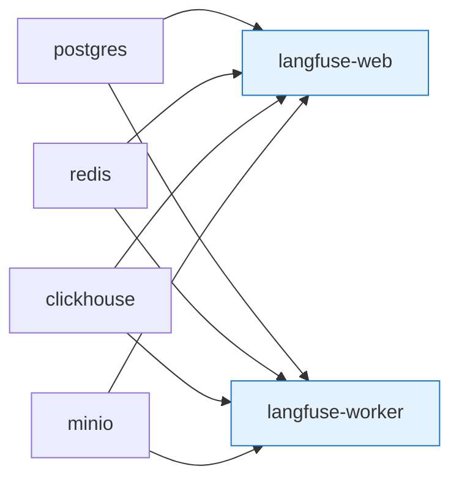

第 2 章では、本書のハンズオンを始めるための環境を整えます。前作の環境構築から増える / 変わる部分にフォーカスし、すでに前作の Colima + Docker が動いているみなさんは差分の確認だけで済む構成にしました。前作を読んでいないみなさんも、本章だけで Hello Agent + 観測まで動く土台をそろえられます。

本章でいちばん大きいのは **Langfuse v3 self-hosted の起動** です。Phoenix を 1 コンテナで済ませていた前作と違い、Langfuse v3 は 6 サービスのスタックになります。とはいえ公式 compose を 1 ファイル取得して `docker compose up -d` を叩くだけなので、初回だけ少し時間をいただきたい、という温度感です。

## この章のゴール

- 前作の環境からの差分を、リソース・サービス・シークレットの 3 軸で把握する
- Colima のリソース割当てを 6 CPU / 12 GB / 40 GB に引き上げる
- Langfuse v3 self-hosted を `docker compose up -d` で立ち上げ、Web UI と OTLP エンドポイントの疎通を確認する
- MinIO root password と Langfuse の S3 シークレットを揃える「ハマりポイント」を避ける
- NAT 実行用のベースイメージを前作から流用する手順を整える

## 前作環境からの差分

最初に、前作（[NIM + Docker ではじめる NeMo Agent Toolkit ハンズオン](https://zenn.dev/himorishige/books/nemo-agent-toolkit-nim-handson)）からの差分を 3 軸で並べます。

### リソースの差分

| 項目                | 前作（推奨）            | 本書（推奨）             |
| ------------------- | ----------------------- | ------------------------ |
| Colima CPU          | 4                       | 6                        |
| Colima メモリ       | 8 GB                    | 12 GB                    |
| Colima ディスク     | 30 GB                   | 40 GB                    |
| Docker イメージ容量 | 3-5 GB                  | 8-12 GB                  |
| 同時起動コンテナ数  | 最大 8（前作 第 15 章） | 最大 13（本書 第 14 章） |

増えたぶんは主に Langfuse v3 の 4 サービス（postgres / clickhouse / redis / minio）と、Guardrails 関連のテストコンテナです。ClickHouse が常時 1.5-2 GB のメモリを取るので、メモリ 8 GB のままだと Hello Agent と同時に Langfuse を立ち上げたときに OOM が起きやすいです。

### サービスの差分

新たに登場するサービスを並べると、こうなります。

| サービス            | 用途                                                   | 章           |
| ------------------- | ------------------------------------------------------ | ------------ |
| `langfuse-web`      | Langfuse の Next.js 製 Web UI、OTLP 受信エンドポイント | 第 10 章以降 |
| `langfuse-worker`   | trace の非同期処理（バックグラウンド ingest）          | 第 10 章以降 |
| `clickhouse`        | trace / observation の長期保存（Langfuse v3 必須）     | 第 10 章以降 |
| `postgres`          | prompt / dataset / user 情報の保存                     | 第 10 章以降 |
| `redis`             | キュー / キャッシュ                                    | 第 10 章以降 |
| `minio`             | trace の生 JSON / メディア blob 保存                   | 第 10 章以降 |
| `guardrails-server` | NeMo Guardrails の REST サーバー（任意）               | 第 8-9 章    |

逆に消えるサービスは Phoenix（前作第 7 章）です。本書では Langfuse に一本化します。

### シークレット・環境変数の差分

`.env` に追加するキーが増えます。詳細は本章後半で扱いますが、まずは全体像を：

```
# 既存（前作から継続）
NGC_API_KEY=nvapi-...

# 追加 1: Langfuse 自体の動作に必要なシークレット
ENCRYPTION_KEY=...                           # 64 hex chars
SALT=...                                     # 32 hex chars
NEXTAUTH_SECRET=...                          # 64 hex chars
REDIS_AUTH=...
CLICKHOUSE_PASSWORD=...
MINIO_ROOT_PASSWORD=...

# 追加 2: Langfuse の S3 連携シークレット（MINIO_ROOT_PASSWORD と同値にする）
LANGFUSE_S3_EVENT_UPLOAD_SECRET_ACCESS_KEY=...

# 追加 3: NAT から Langfuse へ trace を送るための鍵
LANGFUSE_PUBLIC_KEY=pk-lf-...
LANGFUSE_SECRET_KEY=sk-lf-...
LANGFUSE_OTLP_ENDPOINT=http://langfuse-langfuse-web-1:3000/api/public/otel/v1/traces
```

ここでひとつ大事な注意があって、本書のハマりポイントの 1 つは **`MINIO_ROOT_PASSWORD` と `LANGFUSE_S3_EVENT_UPLOAD_SECRET_ACCESS_KEY` を同じ値にする**ことです。理由は後ろの「Langfuse 立ち上げ」節で詳しく扱います。

## Colima のリソース割当てを引き上げる

ここからは macOS（Apple Silicon）と Linux で手順が少し違います。Linux で native Docker Engine を使っているみなさんは、本節は読み飛ばして次の「NAT のベースイメージを準備する」に進んでください。

Colima を使っているみなさんは、すでに動いているプロファイルを停止してリソースを上げ直します。

```bash
# 既存の Colima プロファイルを停止
colima stop

# 6 CPU / 12 GB / 40 GB で起動
colima start --cpu 6 --memory 12 --disk 40
```

すでに前作のディスクイメージに思い入れがあるみなさんは、`colima delete` で消す前にデータが生きているサービス（前作の Phoenix DB や Milvus のボリューム）をエクスポートしておくと安心です。本書では新しい題材で進めるので、思い切って削除しても支障ありません。

リソース増を渋る選択肢もあります。例えば 4 CPU / 8 GB のままでも、Langfuse 単体の起動は通ります。ただし NAT + Milvus + Langfuse + Guardrails を同時に立ち上げる第 14 章で、ClickHouse が swap し始めて UI のレスポンスが体感できるレベルで重くなります。「腰を据えて取り組む 1 週間」を見越して、いまのうちに上げておくのがおすすめです。

## NAT のベースイメージを準備する

NAT を実行するためのコンテナイメージは、前作と同じ `python:3.12-slim` ベースの構成を流用します。前作の `docker/nat/Dockerfile` をそのままコピーしても動きますが、本書では opentelemetry の extras を念のため追加した版を使います。

```dockerfile
# docker/nat/Dockerfile
FROM python:3.12-slim

RUN apt-get update && apt-get install -y --no-install-recommends \
    curl ca-certificates \
    && rm -rf /var/lib/apt/lists/*

RUN pip install --no-cache-dir \
    "nvidia-nat[langchain,mcp,eval,opentelemetry]==1.6.0"

WORKDIR /app
ENTRYPOINT ["nat"]
```

`opentelemetry` extra は前作の `[langchain,mcp,eval,phoenix,a2a]` でも実は引かれているのですが、明示的に書いておくほうが意図が分かりやすいです。Langfuse 連携は NAT 1.6.0 のコアに同梱されているので、追加プラグインのインストールは不要です。

ビルドはリポジトリのルートで一発です。

```bash
cd ~/works/nemo-agent-toolkit-production-ops
docker build -t nat-prod-ops:1.6.0 docker/nat/
```

イメージタグは前作の `nat-nim-handson:1.6.0` と分けてあります。両者は `pip install` の extras が違うだけなので、前作のイメージをそのまま流用したいみなさんは、本書の章ごとの `docker-compose.yml` で `image: nat-nim-handson:1.6.0` に書き換えても支障ありません（実際、本書の検証はその構成で動かしています）。

### Langfuse の OTLP exporter が含まれているか確認する

NAT のベースイメージが準備できたら、Langfuse 用の OTLP exporter が含まれているかを 1 度だけ確認しておきます。

```bash
docker run --rm --entrypoint bash nat-prod-ops:1.6.0 \
  -c "nat info components -t tracing" 2>&1 | \
  grep -oE '(file|console|otelcollector|phoenix|langfuse|raga|langsmith|patronus|weave|galileo|catalyst)' | sort -u
```

`langfuse` を含む 7 種類が表示されれば OK です。本書の主役の名前が見えていれば、第 11 章で `_type: langfuse` を指定するだけで trace が送れる、ということが事前に確認できます。

## Langfuse v3 self-hosted を立ち上げる

ここからが本章のメインです。Langfuse v3 の公式 compose を取得して `docker compose up -d` で起動します。

### 公式 compose を取得する

Langfuse は GitHub に最新の compose を置いていて、リポジトリのルートにある `docker-compose.yml` をそのまま使うのが推奨です。

```bash
mkdir -p ~/works/nemo-agent-toolkit-production-ops/langfuse
cd ~/works/nemo-agent-toolkit-production-ops/langfuse

curl -fsSL -o docker-compose.yml \
  https://raw.githubusercontent.com/langfuse/langfuse/main/docker-compose.yml
```

`docker-compose.yml` の冒頭を眺めると、合計 6 サービスが定義されているのが分かります。

| サービス          | image                                    | 役割                                   |
| ----------------- | ---------------------------------------- | -------------------------------------- |
| `postgres`        | `docker.io/postgres:17`                  | prompt / dataset / user / API key 保存 |
| `redis`           | `docker.io/redis:7`                      | キュー、キャッシュ                     |
| `clickhouse`      | `docker.io/clickhouse/clickhouse-server` | trace / observation の高速 OLAP 保存   |
| `minio`           | `cgr.dev/chainguard/minio`               | trace 生 JSON / メディア blob          |
| `langfuse-web`    | `docker.io/langfuse/langfuse:3`          | Next.js 製 Web UI、OTLP 受信           |
| `langfuse-worker` | `docker.io/langfuse/langfuse-worker:3`   | 非同期 trace ingest、queue consumer    |

DGX Spark（ARM64）と Apple Silicon Mac の両方で、すべてのイメージが multi-arch で公開されているので、追加のビルドや回避策は要りません。前作の Phoenix では「Apple Silicon でだけ動かない」「DGX Spark でだけ動かない」のような相性問題がたまに残っていましたが、Langfuse v3 はその点でだいぶ素直です。

### 必須シークレットを `.env` に書く

`.env` には 6 サービスを跨ぐシークレットを 7 種類書きます。安全な乱数を `openssl rand` で都度生成するのが定石です。

```bash
cd ~/works/nemo-agent-toolkit-production-ops/langfuse

cat > .env <<EOF
# Langfuse v3 self-hosted シークレット
ENCRYPTION_KEY=$(openssl rand -hex 32)
SALT=$(openssl rand -hex 16)
NEXTAUTH_SECRET=$(openssl rand -hex 32)
REDIS_AUTH=$(openssl rand -hex 16)
CLICKHOUSE_PASSWORD=$(openssl rand -hex 16)

# ★ MinIO root と Langfuse の S3 secret は同じ値で揃える
MINIO_ROOT_PASSWORD=$(openssl rand -hex 16)
LANGFUSE_S3_EVENT_UPLOAD_SECRET_ACCESS_KEY=\${MINIO_ROOT_PASSWORD}
LANGFUSE_S3_MEDIA_UPLOAD_SECRET_ACCESS_KEY=\${MINIO_ROOT_PASSWORD}
LANGFUSE_S3_BATCH_EXPORT_SECRET_ACCESS_KEY=\${MINIO_ROOT_PASSWORD}
EOF

chmod 600 .env
```

`ENCRYPTION_KEY` は 64 文字の hex（256 bit）が必須で、これを満たさないと langfuse-web が起動時にエラーで落ちます。`openssl rand -hex 32` は 32 byte = 64 hex char なので、コピペで条件を満たせます。

### 起動と疎通確認

シークレットを書き終わったら、起動です。

```bash
docker compose up -d
```

初回はイメージ pull で 5-10 分ほどかかります。pull が終わると、ヘルスチェック付きで以下の順番に立ち上がります。



postgres / redis / clickhouse / minio が healthy になってから langfuse-web と langfuse-worker が起動する、という依存関係です。`docker compose ps` で全サービスが Up になっていることを確認します。

```bash
docker compose ps
```

```
NAME                         IMAGE                                    STATUS
langfuse-clickhouse-1        clickhouse/clickhouse-server             Up (healthy)
langfuse-langfuse-web-1      langfuse/langfuse:3                      Up
langfuse-langfuse-worker-1   langfuse/langfuse-worker:3               Up
langfuse-minio-1             cgr.dev/chainguard/minio                 Up (healthy)
langfuse-postgres-1          postgres:17                              Up (healthy)
langfuse-redis-1             redis:7                                  Up (healthy)
```

ヘルスエンドポイントを叩いて、Langfuse 自体の起動を確認します。

```bash
curl -sf http://localhost:3000/api/public/health && echo " OK"
```

`{"status":"OK"}` が返れば成功です。ブラウザで `http://localhost:3000` を開くと、初回登録画面が表示されます。

### project と API key を作る

Web UI からのフローは次のとおりです。

1. `http://localhost:3000` にアクセス
2. **Sign up** で適当なメールアドレス（PoC 用）とパスワードを登録
3. ログイン後、**New Organization** で組織を作成
4. 組織内で **New Project** を作成（本書では `nat-prod-ops` を推奨）
5. 左ペインから **Settings → API Keys → Create new API keys** で公開鍵 / 秘密鍵を発行

発行された `pk-lf-...` と `sk-lf-...` を、第 11 章以降で `LANGFUSE_PUBLIC_KEY` / `LANGFUSE_SECRET_KEY` として使います。

```
.env （第 11 章で使うほうの NAT 側）
LANGFUSE_PUBLIC_KEY=pk-lf-3a2b1c...
LANGFUSE_SECRET_KEY=sk-lf-9e8d7c...
LANGFUSE_OTLP_ENDPOINT=http://langfuse-langfuse-web-1:3000/api/public/otel/v1/traces
```

OTLP エンドポイントは Web と同じ port 3000 上の `/api/public/otel/v1/traces` です。port は HTTP で gRPC 未対応の点だけ注意してください。

## ハマりポイント: MinIO root password の同期

ここで、本章でいちばん大事な「ハマりポイント」を扱います。Sprint 0 の検証中に最初に当たった壁で、書籍として明示しておきたかった項目です。

### 症状

NAT から Langfuse に OTLP を送ると、langfuse-web のログに次のようなエラーが連続します。

```
error  Failed to upload JSON to S3 events/otel/<project>/2026/04/25/...
The request signature we calculated does not match the signature you provided.
Check your key and signing method.
```

NAT 側にも `Internal Server Error` で再送が繰り返され、最終的に span のドロップで終わります。

```
WARNING  opentelemetry.exporter.otlp.proto.http.trace_exporter:215 -
  Transient error Internal Server Error encountered while exporting span batch, retrying in 0.98s.
ERROR    opentelemetry.exporter.otlp.proto.http.trace_exporter:210 -
  Failed to export span batch due to timeout, max retries or shutdown.
```

### 原因

Langfuse v3 は trace の生 JSON を MinIO（S3 互換）にアップロードしてから ClickHouse に取り込む 2 段構えの設計です。Langfuse-web が MinIO に署名付き PUT を投げる際、`LANGFUSE_S3_EVENT_UPLOAD_SECRET_ACCESS_KEY` で署名を計算します。

一方の MinIO サービスは、起動時に `MINIO_ROOT_PASSWORD` で root 認証情報を初期化します。Langfuse 側に渡している S3 の secret と、MinIO 側の root password が違うと、当然 signature が合わず PUT が拒否されます。

### 対処

`.env` の冒頭で 1 つだけ乱数を作り、両方に同じ値を割り当てるのが確実です。

```bash
# OK: MinIO root と S3 secret を 1 つの乱数で揃える
MINIO_ROOT_PASSWORD=fba6755995259d6d3517c8d8b7d7ea2f
LANGFUSE_S3_EVENT_UPLOAD_SECRET_ACCESS_KEY=fba6755995259d6d3517c8d8b7d7ea2f
LANGFUSE_S3_MEDIA_UPLOAD_SECRET_ACCESS_KEY=fba6755995259d6d3517c8d8b7d7ea2f
LANGFUSE_S3_BATCH_EXPORT_SECRET_ACCESS_KEY=fba6755995259d6d3517c8d8b7d7ea2f
```

すでに `MINIO_ROOT_PASSWORD` を変えてしまった状態で起動して、これから直すみなさんは `docker compose down -v` でボリュームを消すのが確実です。MinIO は初回起動時に root password でユーザーデータを作るため、ボリュームを残して password だけ変えても、すでに作られた認証情報とは合わなくなります。

公式の compose は default で `MINIO_ROOT_PASSWORD=miniosecret` / `LANGFUSE_S3_EVENT_UPLOAD_SECRET_ACCESS_KEY=miniosecret` で揃っているため、デフォルト値のままなら何も起きません。本書のように production を見据えて両方を強い乱数に置き換えるときに、片方だけ変えると詰む、というのがこのハマりポイントの正体です。

## 自動ブートストラップ（オプション）

Web UI からの登録 → project 作成 → API key 発行は、本書のハンズオンを進める分には十分手早く済みます。一方で、CI 上で再現性のある PoC を回したいときや、複数人で同じ project を共有したいときには、Langfuse の `LANGFUSE_INIT_*` 環境変数による自動ブートストラップが便利です。

```bash
# .env に追記すると、初回起動時にユーザー / 組織 / プロジェクト / API key が自動作成される
LANGFUSE_INIT_ORG_ID=nat-prod-ops-org
LANGFUSE_INIT_ORG_NAME="NAT Prod Ops Org"
LANGFUSE_INIT_PROJECT_ID=nat-prod-ops-project
LANGFUSE_INIT_PROJECT_NAME="NAT Production Ops"
LANGFUSE_INIT_PROJECT_PUBLIC_KEY=pk-lf-poc-public-XXXX
LANGFUSE_INIT_PROJECT_SECRET_KEY=sk-lf-poc-secret-YYYY
LANGFUSE_INIT_USER_EMAIL=admin@example.local
LANGFUSE_INIT_USER_NAME="Admin User"
LANGFUSE_INIT_USER_PASSWORD=<安全なパスワード>
```

これらは **postgres ボリュームが空のときだけ反映** されます。一度ブートストラップが走ったあとは無視されるので、運用中に組織名を変えたいときは Web UI から行う運用です。本書のハンズオンでは、UI から作る手順をメインに据えて、CI 化したいみなさん向けの選択肢として頭の片隅に置いてもらう位置づけにしました。

## NIM 関連の追加準備

第 9 章で扱う多言語 Safety Guard NIM の API 呼び出しに使う `NGC_API_KEY` は、前作と同じものを流用できます。すでに前作で `nvapi-...` を発行しているみなさんは、その鍵を本書の `.env` にもコピーしてください。

`NGC_API_KEY` だけで以下の NIM が呼べる状態になります。

| モデル                                         | 用途                       | 章          |
| ---------------------------------------------- | -------------------------- | ----------- |
| `nvidia/llama-3.3-nemotron-super-49b-v1`       | workflow LLM               | 全章        |
| `nvidia/nv-embedqa-e5-v5`                      | RAG Embedding              | 第 6 章以降 |
| `nvidia/llama-3.1-nemotron-safety-guard-8b-v3` | 多言語 Guardrail（日本語） | 第 9 章     |

無料枠は RPM 40（モデルあたり）で、ハンズオンを通しで動かす分には十分です。第 13 章でコスト追跡を扱うときに、現在のレート上限と消費量をあらためて見直します。

## 動作確認チェックリスト

ここまでの作業が終わったら、本書の以降の章に進めるかをチェックリストで確認します。

```bash
# 1. Colima のリソースが期待値か
colima list
# CPUS が 6、MEMORY が 12GiB、DISK が 40GiB であること

# 2. NAT イメージが pull / build 済みか
docker images | grep nat-prod-ops

# 3. Langfuse の 6 サービスが healthy か
cd ~/works/nemo-agent-toolkit-production-ops/langfuse
docker compose ps

# 4. Langfuse 自体の health endpoint が応答するか
curl -sf http://localhost:3000/api/public/health && echo " OK"

# 5. NIM の鍵で API が通るか
curl -sf https://integrate.api.nvidia.com/v1/models \
  -H "Authorization: Bearer $NGC_API_KEY" | head -3
```

5 項目すべて通れば、第 4 章で LangGraph を NAT に組み込む準備が整っています。第 3 章はハンズオンのない比較章なので、環境がそろっていなくても読み進められます。

## 次章では

次章では、本書の Orchestration 戦略の根拠を整理します。LangGraph / CrewAI / AutoGen の 3 つを 5 つの軸で比較し、本書の主軸として LangGraph を選んだ理由をあらためて言語化します。表だけ眺めて第 4 章のハンズオンに進んでいただいても構いませんが、社内で「なぜこのフレームワークなのか」を説明する場面があるみなさんには、いちど目を通しておくと話が早くなる章になっています。
