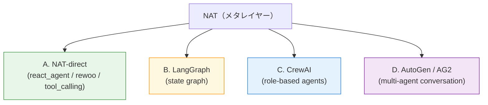
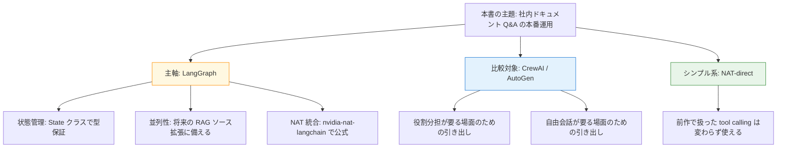

第 3 章では、本書の Orchestration 戦略を支える「LangGraph をなぜ主軸にしたか」をあらためて言語化します。本章にハンズオンは登場しません。次章以降の LangGraph + NAT のサンプルにすぐ飛びたいみなさんは、最後の「本書での結論」節だけ読んでもらえれば十分です。

社内で「なぜ CrewAI ではないのか」「AutoGen の選択肢はないのか」を問われたときに、自分の言葉で 3 分で答えられるようになる、というのが本章のゴールです。

## この章のゴール

- LangGraph / CrewAI / AutoGen / NAT-direct の 4 択を、それぞれ 30 秒で説明できるようになる
- 第 1 章で示した 5 つの選定軸を、4 択の表で対比させて頭に入れる
- ユースケースから逆引きで「どのフレームワークが向くか」を判断できる
- 本書が LangGraph を主軸に置いた理由と、CrewAI / AutoGen を比較に留めた理由を明示できる

## 4 つの選択肢を 30 秒で

NAT のメタレイヤーから見ると、エージェントの実行フレームワークは大きく 4 つに分かれます。本章ではこの 4 択を比較対象にします。

**A. NAT-direct** は、前作で扱ったやり方です。NAT の `_type: react_agent` / `_type: rewoo` / `_type: tool_calling` を使い、外部フレームワークに頼らず NAT が提供するエージェントパターンだけで組みます。シンプルなエージェントには、これがいちばん見通しが良いです。

**B. LangGraph** は、LangChain チームが提供する state graph 型のフレームワークです。ノード（処理単位）とエッジ（遷移条件）を定義して、状態を明示的に渡しながら多段の推論を組みます。NAT は `nvidia-nat-langchain` extra で公式統合を持っています。

**C. CrewAI** は、「Researcher / Writer / Editor」のような役割（role）を持つエージェントを並べて、タスクを順次あるいは階層的に処理させるフレームワークです。役割分担の比喩がそのままコードに落ちる読みやすさが特長です。NAT は `nvidia-nat-crewai` extra で統合しています。

**D. AutoGen / AG2** は、Microsoft Research 発の multi-agent conversation フレームワークです。エージェント同士が自由会話に近い形で話し合い、合意形成や検討を進めるパターンが得意です。NAT との公式統合は発展途上で、コミュニティ実装に頼る部分が残ります。

## 5 つの選定軸で対比する

第 1 章で示した 5 つの軸を、4 択で対比させます。それぞれの軸で「どれが向くか」がはっきり違うので、機能比較というよりは性格判断の表として読んでもらうのが近いです。

### 軸 1: 状態管理

エージェントが「いまどこまで進んだか」「retrieve した結果はどこに保持するか」「どの分岐に進んだか」を、どう表現するかという軸です。

| フレームワーク | 状態管理の仕方                                                                             |
| -------------- | ------------------------------------------------------------------------------------------ |
| NAT-direct     | ReAct ループの内部で履歴として持つ。外側から検査しにくい                                   |
| LangGraph      | `State` クラスを宣言して、ノード間で明示的に渡す。ノード単位で型保証された状態を扱える     |
| CrewAI         | 各エージェントの memory + task の context として持つ。役割の引き継ぎが状態の伝搬と結びつく |
| AutoGen        | エージェント同士の会話履歴で表現する。state を会話の中身そのものに溶かし込むスタイル       |

LangGraph は「retrieve した結果を `State.docs` に入れて、次のノードでそれを使う」という書き方ができます。社内ドキュメント Q&A のように「retrieve → reason → answer」の 3 段を明示的に書きたい本書の題材には、LangGraph の状態管理が素直にはまります。

CrewAI も `Researcher が探した結果を Writer に渡す` と書けますが、状態が agent と task の組み合わせに分散するので、後で trace を読み解くときに「どのエージェントの memory に何が入っていたか」を追いかける手間が増える印象です。

AutoGen は会話履歴として扱う設計なので、デバッグ時にいちばん「何が起きたか」を追いやすい一方で、構造化された state を別途持つには工夫がいります。

### 軸 2: 並列実行のしやすさ

retrieval と再ランクを同時に走らせたり、複数 RAG ソースに同時に問い合わせたり、並列性を活かしたい場面の書きやすさです。

| フレームワーク | 並列実行                                                                                         |
| -------------- | ------------------------------------------------------------------------------------------------ |
| NAT-direct     | tool 単位で並列呼び出しができる LLM を選べば可能（Llama 3.1 8B は不可、Nemotron Super 49B は可） |
| LangGraph      | branch を並列に評価して合流させる graph 構造をネイティブで持つ。subgraph も非同期実行可能        |
| CrewAI         | task の `async_execution=True` で並走できる。crew 単位の並列は階層 process（hierarchical）で表現 |
| AutoGen        | conversation 単位なので並列は工夫が要る。`GroupChat` でラウンド単位の同時発言として扱える        |

社内文書 Q&A の文脈では、複数のチャンクソース（製品マニュアル / FAQ / 過去問い合わせ）に同時問い合わせをかける構成を将来的に拡張したい場面があります。LangGraph の subgraph + 並列ノードの仕組みが、そういう拡張を見据えたときに直感的に組めるという理由でも、本書は LangGraph 寄りです。

### 軸 3: 通信モデル

エージェント同士、あるいはノード同士がどうやり取りするかという軸です。

| フレームワーク | 通信モデル                                                                        |
| -------------- | --------------------------------------------------------------------------------- |
| NAT-direct     | tool 呼び出しと LLM 応答の連鎖。エージェント間通信という概念は基本的にない        |
| LangGraph      | ノード間で `State` を渡し合う。明示的なメッセージング、return 値ベース            |
| CrewAI         | role-based のメッセージ受け渡し。`Task.context` 経由で前段の出力を後段が参照      |
| AutoGen        | LLM ベースの自由会話。`UserProxyAgent` と `AssistantAgent` がチャットを続ける構造 |

「内部状態を厳密に追いかけたい」用途では、LangGraph の return 値ベース通信が素直です。一方で、「ChatGPT 風の自由対話を 2 つの persona で再現したい」みたいな用途では AutoGen のほうが自然な書き方になります。CrewAI は両者の中間で、役割の比喩が強い分、組織図のように描ける親しみやすさがあります。

本書の社内 Q&A は LLM が自由に会話する題材ではないので、明示的な状態渡しの LangGraph がはまる、という判断です。

### 軸 4: 学習コスト

ドキュメント・サンプル・コミュニティの厚みを総合した「最初の 1 本を動かすまでの早さ」の軸です。

| フレームワーク | 学習コスト                                                                                 |
| -------------- | ------------------------------------------------------------------------------------------ |
| NAT-direct     | YAML 数行で動く。前作のみなさんは前作 第 3 章で経験済み                                    |
| LangGraph      | LangChain のエコシステムに乗っているので素材豊富。`State` クラス + node decorator で書ける |
| CrewAI         | role / task / process の独自概念を覚える必要があるが、サンプルが豊富で習得は早い           |
| AutoGen / AG2  | 研究系のサンプルは豊富だが、production 構成のリファレンス実装が薄い                        |

LangGraph は `State` クラスの定義 → ノード関数 → グラフへの追加 → エッジ宣言、という決まったパターンで書けます。前作で `react_agent` の YAML を書いていたみなさんなら、LangGraph のサンプルを読みながらそのまま雛形に流し込めるくらいの素直さです。

CrewAI は「Researcher が調査して、Writer が文章を書いて、Editor がレビューする」のような比喩でコードを書けるのが魅力で、初手の楽しさは正直 LangGraph より上です。一方で、本書のように RAG → 推論 → 出力検閲のような直列フローでは、role 抽象がオーバースペックに感じます。

AutoGen は研究プロジェクトとしての勢いと、production 移行時のリファレンスの薄さがちょうど反転しています。エージェント同士の会話を組みたいユースケースでは強い候補ですが、本書の題材には少し遠い、という距離感です。

### 軸 5: NAT との統合状況

本書の主題に直結する軸です。NAT がどれくらい「公式に」面倒を見てくれているか、で並べます。

| フレームワーク | NAT との統合                                                                                        |
| -------------- | --------------------------------------------------------------------------------------------------- |
| NAT-direct     | コアそのもの。何も追加せずに使える                                                                  |
| LangGraph      | `nvidia-nat[langchain]` で公式サポート。`tool_names` に NAT function を渡して LangGraph 側で呼べる  |
| CrewAI         | `nvidia-nat[crewai]` で profiler の callback 統合あり。token / 時間追跡が公式機能として動く         |
| AutoGen / AG2  | 公式 extra なし。`nvidia-nat[adk]`（Google ADK 連携）経由のパターンがあるが、AG2 の直接統合は限定的 |

NAT との統合は、トレースの観測（第 11 章）やプロンプト管理（第 12 章）で効いてきます。OTLP に乗せた trace の attribute が、NAT 側の trace exporter で自然に Langfuse まで届くか、という観点でも、公式統合のあるフレームワークを選ぶのは安全策になります。

LangGraph と CrewAI は、この点ではほぼ同等です。AutoGen は本書のスコープでは少し置いていくことになります。

## ユースケース別の逆引き

5 軸の比較を逆引きで使えるよう、ユースケース別の推奨を整理します。

| ユースケース                                 | 推奨                          | 理由                                                               |
| -------------------------------------------- | ----------------------------- | ------------------------------------------------------------------ |
| シンプルな ReAct（tool 1-2 個）              | NAT-direct                    | YAML 数行で済む。前作の構成がそのまま動く                          |
| RAG → reason → answer の直列フロー           | LangGraph                     | State クラスで型保証された情報受け渡し、trace が読みやすい         |
| 並列 retrieval や subgraph を組みたい        | LangGraph                     | 並列ノードと subgraph 抽象が宣言的                                 |
| Researcher + Writer + Editor の役割分担      | CrewAI                        | role / task / process の比喩がそのままコードに落ちる               |
| LLM 同士の自由会話で合意形成                 | AutoGen / AG2                 | conversation ベースの設計が最適                                    |
| マルチターンのワークフロー（自前で組みたい） | LangGraph                     | branch / loop / human-in-the-loop の表現力                         |
| プロトタイプを 30 分で動かしたい             | NAT-direct → LangGraph に拡張 | YAML から徐々に Python へ降りる構成が取りやすい                    |
| 社内ドキュメント Q&A（本書の題材）           | LangGraph                     | retrieve → reason → answer の state 管理が素直、並列拡張の余地あり |

「シンプルにしたい」と「拡張に備えたい」のバランスをどこで取るかが、フレームワーク選定の本質です。本書の社内 Q&A は将来的な拡張（複数チャンクソース、Guardrails の前後挟み込み、評価データセット連携）を見越しているので、LangGraph の State 抽象に乗せておくのが据わりが良い、という判断になります。

## 本書での結論

5 軸 + 8 ユースケースの比較を踏まえて、本書では次のような方針を取ります。

主軸は LangGraph です。第 4 章で実際に NAT に組み込み、第 7 章で社内 Q&A の主役として再登場します。CrewAI と AutoGen は、本書のスコープでは比較対象として留めます。社内で「うちは役割分担の比喩が要る」「合意形成型の対話が必要」のような声が上がったときの引き出しとして、5 軸の比較を頭に入れておいてもらえると、判断材料が増えるはずです。

## NAT-direct（前作の構成）の位置づけ

最後に、前作で扱った NAT-direct（`_type: react_agent` などの組み込みエージェント）の位置づけを補足します。

LangGraph を主軸に置く本書でも、NAT-direct は十分有力な選択肢です。前作のように tool が 1-2 個で、retrieve も観測も付けない最小エージェントなら、LangGraph に乗り換える理由はありません。むしろ「YAML 数行で済む」というシンプルさはそれ自体が運用上の利点です。

本書では LangGraph を「機能拡張に備えた標準形」、NAT-direct を「最小限で済むときの省力解」として、どちらも捨てない構成で進めます。第 4 章の最初に、NAT-direct → LangGraph の段差を 1 ファイル分の diff で示すので、両者の境界線を体感的に掴んでみてください。

## 次章では

次章ではここまでの理屈を実装に落とします。NAT-direct で書いた最小エージェントを LangGraph に移植して、`nvidia-nat-langchain` 経由で NAT の function として登録するまでの手順を、最小の compose で動かします。LangGraph の State クラスとノード関数、エッジ宣言の 3 点セットだけで、第 4 章のサンプルが組み上がる予定です。
