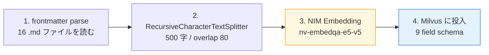

第 6 章では、第 5 章で整えた合成データセット（16 ファイル / 約 15,500 字）を Milvus standalone に投入します。前作の第 9 章で扱った Milvus 構成をベースに、本書の題材ならではの「メタデータを Milvus のフィールドとして保持する」拡張を加えます。

ハンズオンの主役は Python の ingest スクリプトです。frontmatter を読み取って `category` / `department` / `confidentiality` / `has_pii` などを Milvus collection の field に書き込み、第 7 章の LangGraph + RAG エージェントから「経営機密だけ除外して検索する」のようなフィルタが効くようにします。

## この章のゴール

- Milvus standalone v2.5.4 を `docker compose up -d` で起動する
- frontmatter から取り出したメタデータを Milvus のフィールドとして保持できる
- 社内文書 16 ファイルを `nv-embedqa-e5-v5` で embed して collection に投入する
- `confidentiality != 'confidential'` のような **メタデータフィルタ** が retrieval に効くことを確認する
- 第 7 章で LangGraph の retrieve ノードから引く下準備が整った状態にする

## 前作 Ch 9 からの差分

前作の第 9 章（NAT docs を Milvus に入れる）と並べると、本章の差分は次の 3 点に集約されます。

| 観点               | 前作 第 9 章                       | 本書 第 6 章                                                                          |
| ------------------ | ---------------------------------- | ------------------------------------------------------------------------------------- |
| データソース       | NAT docs 24 ファイル（Apache 2.0） | 合成データ 16 ファイル（架空・本書独自）                                              |
| chunk 数           | 約 1,034                           | 約 35（題材が小ぶり、運用品質の挙動確認に振り切った量）                               |
| メタデータ field   | `source`（ファイル名）             | 8 field（title / category / department / 機密度 / PII 系 / updated_at / source_path） |
| ingest スクリプト  | NAT docs 専用                      | frontmatter parser + メタデータ保持                                                   |
| retrieval フィルタ | top_k のみ                         | top_k + Milvus boolean expression                                                     |

前作の compose ファイルはほぼそのまま流用できます。違うのは **ingest スクリプト** と **collection schema** だけ、という見え方です。

## Milvus standalone を起動する

ディレクトリ構成は次の形にします。

```
ch06-rag-milvus/
├── docker-compose.yml      # etcd + minio + milvus + ingest + query
├── scripts/
│   ├── ingest_internal_docs.py
│   └── query_smoke.py
└── .env                    # NGC_API_KEY
```

`docker-compose.yml` は前作の第 9 章をベースに、ingest と query の 2 つのワンショット実行 service を追加した構成です。

```yaml:docker-compose.yml
x-nat-common: &nat-common
  image: nat-nim-handson:1.6.0
  env_file:
    - .env

services:
  etcd:
    image: quay.io/coreos/etcd:v3.5.16
    # （前作と同じ healthcheck / volumes）

  minio:
    image: minio/minio:RELEASE.2024-11-07T00-52-20Z
    # （前作と同じ）

  milvus:
    image: milvusdb/milvus:v2.5.4
    command: ["milvus", "run", "standalone"]
    environment:
      ETCD_ENDPOINTS: etcd:2379
      MINIO_ADDRESS: minio:9000
    volumes:
      - milvus-data:/var/lib/milvus
    ports:
      - "19530:19530"
      # 注: 9091 は Langfuse の MinIO Console と被るので 9191 に逃がす
      - "9191:9091"
    depends_on:
      etcd:
        condition: service_healthy
      minio:
        condition: service_healthy

  ingest:
    <<: *nat-common
    profiles: ["ingest"]
    entrypoint: ["python", "/app/scripts/ingest_internal_docs.py"]
    volumes:
      - ./scripts:/app/scripts:ro
      - ../datasets:/app/datasets:ro

  query:
    <<: *nat-common
    profiles: ["query"]
    entrypoint: ["python", "/app/scripts/query_smoke.py"]
    volumes:
      - ./scripts:/app/scripts:ro

volumes:
  etcd-data:
  minio-data:
  milvus-data:
```

`profiles: ["ingest"]` と `profiles: ["query"]` を使っているのは、`docker compose up` を素朴に叩いたときに ingest と query が無条件で走るのを避けるためです。実行は `docker compose --profile ingest run --rm ingest` のように明示します。

`9091:9091` を `9191:9091` に書き換えているのが本書の小さな注意ポイントです。第 2 章で立ち上げた Langfuse スタックは `127.0.0.1:9091` で MinIO Console を expose していて、Milvus の metrics 用 9091 と衝突します。Langfuse PoC スタックを停止せずに Milvus を起動するには、Milvus 側のポートを別番に逃がしておくのが手早い解です。

起動はこれだけです。

```bash
cd ch06-rag-milvus
cp .env.example .env  # NGC_API_KEY を記入
docker compose up -d milvus
```

`milvus` を指定すると、依存関係で `etcd` / `minio` も連れて起動します。`docker compose ps` で 3 サービスがすべて Up になっていれば次に進めます。

## ingest スクリプトを書く

ingest の処理は 4 段階です。



スクリプト本体は `scripts/ingest_internal_docs.py` に置きます。frontmatter のパースを自前で書いている以外は、langchain と pymilvus に乗っかった素直な構成です。

```python:scripts/ingest_internal_docs.py
"""Ingest the synthetic internal-docs corpus into Milvus standalone."""

from __future__ import annotations

import os
import sys
from pathlib import Path
from typing import Any

import yaml
from langchain_core.documents import Document
from langchain_nvidia_ai_endpoints import NVIDIAEmbeddings
from langchain_text_splitters import RecursiveCharacterTextSplitter
from pymilvus import DataType, MilvusClient

DOCS_DIR = Path("/app/datasets/internal-docs")
MILVUS_URI = os.environ.get("MILVUS_URI", "http://milvus:19530")
COLLECTION = "internal_docs"
EMBED_MODEL = "nvidia/nv-embedqa-e5-v5"
EMBED_DIM = 1024
CHUNK_SIZE = 500
CHUNK_OVERLAP = 80


def parse_frontmatter(raw: str) -> tuple[dict[str, Any], str]:
    if not raw.startswith("---\n"):
        return {}, raw
    end = raw.find("\n---\n", 4)
    if end == -1:
        return {}, raw
    meta = yaml.safe_load(raw[4:end]) or {}
    body = raw[end + 5 :]
    return meta, body


def load_documents() -> list[Document]:
    md_files = sorted(p for p in DOCS_DIR.rglob("*.md") if p.name != "README.md")
    print(f"Loading {len(md_files)} markdown files from {DOCS_DIR}")

    documents: list[Document] = []
    for md in md_files:
        text = md.read_text(encoding="utf-8")
        meta, body = parse_frontmatter(text)
        documents.append(
            Document(
                page_content=body.strip(),
                metadata={
                    "source_path": str(md.relative_to(DOCS_DIR)),
                    "title": meta.get("title", md.stem),
                    "category": meta.get("category", "unknown"),
                    "department": meta.get("department", "all"),
                    "confidentiality": meta.get("confidentiality", "internal"),
                    "has_pii": bool(meta.get("has_pii", False)),
                    "pii_types": ",".join(meta.get("pii_types", []) or []),
                    "updated_at": meta.get("updated_at", ""),
                },
            )
        )
    return documents
```

`parse_frontmatter` は YAML frontmatter を自前で切り出しています。`python-frontmatter` パッケージを足す手もありますが、依存を増やしたくないので 10 行ほどで済ませました。`load_documents` は `internal-docs/` 配下を再帰的に walk して、frontmatter を `metadata` に詰めた `Document` のリストを返します。

chunk 分割は LangChain の `RecursiveCharacterTextSplitter` にそのまま任せます。chunk_size 500・overlap 80 は本書の合成データの長さ感（1 ファイル 1,000 字弱）に合わせたバランスです。

```python:scripts/ingest_internal_docs.py（続き）
def split_documents(documents: list[Document]) -> list[Document]:
    splitter = RecursiveCharacterTextSplitter(
        chunk_size=CHUNK_SIZE,
        chunk_overlap=CHUNK_OVERLAP,
        separators=["\n## ", "\n### ", "\n\n", "\n", " "],
    )
    chunks = splitter.split_documents(documents)
    print(f"Split into {len(chunks)} chunks (size={CHUNK_SIZE}, overlap={CHUNK_OVERLAP})")
    return chunks


def embed_chunks(chunks: list[Document]) -> list[list[float]]:
    api_key = os.environ.get("NGC_API_KEY")
    if not api_key:
        sys.exit("NGC_API_KEY is not set")
    embedder = NVIDIAEmbeddings(model=EMBED_MODEL, api_key=api_key)
    texts = [chunk.page_content for chunk in chunks]
    vectors = embedder.embed_documents(texts)
    print(f"Embedded {len(vectors)} chunks with {EMBED_MODEL}")
    return vectors
```

embed の部分は前作と同じです。`NVIDIAEmbeddings` が NIM の `/v1/embeddings` を叩き、`nv-embedqa-e5-v5` で 1,024 次元のベクトルを返してくれます。

そして本章の主役、Milvus への書き込みです。schema にメタデータの全フィールドを並べておく必要があります。

```python:scripts/ingest_internal_docs.py（続き）
def write_to_milvus(chunks: list[Document], vectors: list[list[float]]) -> None:
    client = MilvusClient(uri=MILVUS_URI)
    if client.has_collection(COLLECTION):
        client.drop_collection(COLLECTION)

    schema = client.create_schema(auto_id=False, enable_dynamic_field=False)
    schema.add_field("id", DataType.INT64, is_primary=True)
    schema.add_field("vector", DataType.FLOAT_VECTOR, dim=EMBED_DIM)
    schema.add_field("text", DataType.VARCHAR, max_length=4096)
    schema.add_field("source_path", DataType.VARCHAR, max_length=256)
    schema.add_field("title", DataType.VARCHAR, max_length=256)
    schema.add_field("category", DataType.VARCHAR, max_length=64)
    schema.add_field("department", DataType.VARCHAR, max_length=64)
    schema.add_field("confidentiality", DataType.VARCHAR, max_length=32)
    schema.add_field("has_pii", DataType.BOOL)
    schema.add_field("pii_types", DataType.VARCHAR, max_length=256)
    schema.add_field("updated_at", DataType.VARCHAR, max_length=32)

    index_params = client.prepare_index_params()
    index_params.add_index(
        field_name="vector",
        index_type="AUTOINDEX",
        metric_type="L2",  # NAT 1.6.0 milvus_retriever 既定の L2 と揃える
    )

    client.create_collection(collection_name=COLLECTION, schema=schema, index_params=index_params)

    payload = [
        {"id": i, "vector": v, "text": c.page_content[:4000], **c.metadata}
        for i, (v, c) in enumerate(zip(vectors, chunks, strict=True))
    ]
    result = client.insert(collection_name=COLLECTION, data=payload)
    print(f"Inserted {result.get('insert_count')} records into '{COLLECTION}'")
```

スキーマで意識した点が 2 つあります。

1 つ目は **`enable_dynamic_field=False`** を明示していることです。Milvus は dynamic field（schema にない field を JSON で受け取る）も使えますが、メタデータの形を厳密にしておきたいので静的 schema にしました。frontmatter の typo を schema mismatch で気づける副作用も嬉しいです。

2 つ目は **`metric_type: L2`** で前作と揃えていることです。NAT 1.6.0 の `milvus_retriever` は default が L2 で、ingest 側を Cosine にすると `metric type not match` エラーが出ます。前作のハマりポイントが本書でもそのまま当てはまる、という流れです。

### 実行と統計

`docker compose --profile ingest run --rm ingest` で動かすと、次のような出力が出ます。

```
Loading 16 markdown files from /app/datasets/internal-docs
Split into 35 chunks (size=500, overlap=80)
Embedded 35 chunks with nvidia/nv-embedqa-e5-v5
Inserted 35 records into 'internal_docs' at http://milvus:19530
chunks by category: {'department-notes': 12, 'faq': 6, 'handbook': 5, 'it-security': 7, 'product': 5}
chunks by confidentiality: {'restricted': 14, 'confidential': 2, 'internal': 9, 'public': 10}
Done.
```

35 chunk のうち、12 chunk が `department-notes`（PII 含む）、14 chunk が `restricted` です。第 9 章の Guardrails で「PII 含む chunk が引かれたら出力を要約 / マスクする」テストの素材として、ちょうど十分な量になっています。

## retrieval スモークテスト

ingest が通ったら、retrieval の動きを検証します。本書のサンプルでは `query_smoke.py` で 3 種類のクエリを投げます。

```python:scripts/query_smoke.py
QUERIES = [
    {"label": "FAQ にヒットする想定", "text": "経費精算の月次締切日はいつですか？", "filter": ""},
    {"label": "department-notes（PII あり）にヒットする想定", "text": "情シス部の担当者の連絡先を教えてください", "filter": ""},
    {"label": "confidential を除外して検索", "text": "今期の経営戦略について",
     "filter": "confidentiality != 'confidential'"},
]

for q in QUERIES:
    vec = embedder.embed_query(q["text"])
    results = client.search(
        collection_name=COLLECTION,
        data=[vec],
        limit=TOP_K,
        output_fields=["title", "category", "department", "confidentiality", "has_pii", "source_path"],
        filter=q["filter"] or None,
    )
    # ... print results
```

`docker compose --profile query run --rm query` で 3 クエリの結果を出すと、こんな具合になります。

### Q1: 経費精算の月次締切日

```json
{"rank": 1, "title": "休暇取得に関する FAQ", "category": "faq", "confidentiality": "public"}
{"rank": 2, "title": "経費精算に関する FAQ", "category": "faq", "confidentiality": "internal"}
{"rank": 3, "title": "取締役会議事メモ（2026 年 第 1 四半期）", "category": "department-notes", "confidentiality": "confidential", "has_pii": true}
```

意図したファイル（`faq/01-expense-faq.md`）が rank 2 でヒットしています。rank 1 に「休暇取得 FAQ」が来たのは、両ファイルとも「申請」「締切」のような共通語彙が多くて、ベクトル空間で近接した結果です。

注目すべきは rank 3 に `confidential` の取締役会議事メモが入ってきたことです。ユーザーの質問は経費精算なのに、機密情報が候補に上がってしまう。Milvus 側のメタデータフィルタを使わずに LLM に丸ごと渡すと、機密情報を漏らすリスクがあるわけです。ここが本書の Guardrails と機密度フィルタの出番、というつながり方になります。

### Q2: 情シス部の担当者の連絡先

```json
{"rank": 1, "title": "セキュリティインシデント対応手順", "category": "it-security"}
{"rank": 2, "title": "業務デバイス管理ポリシー", "category": "it-security"}
{"rank": 3, "title": "営業部 顧客対応マニュアル", "category": "department-notes", "has_pii": true}
```

本来ヒットしてほしい `department-notes/03-it-staff-directory.md` がトップ 3 に入っていません。「情シス部」という単語が `it-security/` 系のチャンクに頻出しているので、ベクトルとしてはそちらに寄ってしまっています。

これも retrieval だけでは絞り込みきれない、という現実そのものです。第 7 章では LangGraph の中で「`category=='department-notes'` を優先的に絞ってから類似度検索する」重み付けを入れて、PII 含む chunk を意図的に取りに行く構成を試します。本書のコアアイデアは次章で詳しく扱うので、本章では「メタデータフィルタの基盤を作った」段階まで進みます。

### Q3: confidential を除外して検索

```json
filter: confidentiality != 'confidential'

{"rank": 1, "title": "セキュリティインシデント対応手順", "category": "it-security", "confidentiality": "restricted"}
{"rank": 2, "title": "IT サポート FAQ", "category": "faq", "confidentiality": "public"}
{"rank": 3, "title": "営業部 顧客対応マニュアル", "category": "department-notes", "confidentiality": "restricted"}
```

`confidentiality != 'confidential'` のフィルタが効いて、Q1 で 3 位に入っていた取締役会議事メモが結果に現れていません。Milvus の boolean expression は `==` `!=` `in` `not in` `like` などが使えるので、`confidentiality in ['public','internal']` のようにポジティブリストでも書けます。

第 9 章の Guardrails では、ユーザーの権限レベルに応じてこのフィルタを動的に組み立てる構成を扱います。本章では「フィルタが構文として通る」ことだけ確認できれば十分です。

## ハマりポイント

ハンズオン中に踏みやすい落とし穴を 3 点。

1 つ目は **ポート 9091 の衝突** です。第 2 章で立ち上げた Langfuse スタックがすでに 9091 を使っているので、Milvus の metrics 9091 を 9191 に逃がしておかないと `docker compose up` が失敗します。前述の compose ファイルではすでに対応済みですが、両 stack を別 compose で動かすときは似たような衝突が起きやすいので、`docker compose ps -a` で先に確認するのが安全です。

2 つ目は **metric type の不一致** です。NAT 1.6.0 の `milvus_retriever` は default が L2 で、ingest 側を Cosine にすると検索時に `metric type not match: expected=L2, actual=COSINE` で落ちます。前作の付録 A にも同じ罠が書いてあって、第 7 章の retrieval 統合であらためて踏まないように、本章のスクリプトでは L2 に固定しています。

3 つ目は **frontmatter の YAML 構文** です。`pii_types: ["name", "phone"]` のような配列は YAML で書けますが、`pii_types:` 直後にスペースがないと YAML parser が値を `null` と解釈します。`python-frontmatter` を使わずに自前 parser を通している都合、frontmatter の typo は読み込み時に静かに `null` になってしまいます。本書のサンプルではファイル数が少ないので目視で確認できますが、量が増えたら `pre-commit` で frontmatter の YAML schema 検査を入れるのが定石です。

## 次章では

次章では、本章で投入した Milvus collection を **LangGraph の retrieve ノード** から引きます。第 4 章で書いた 2 ノード graph（classify + respond）に retrieve ノードを足して、3 ノードの社内 Q&A エージェントに育てます。retrieval の絞り込みに `category` / `confidentiality` のメタデータフィルタを組み込み、第 9 章の Guardrails 統合のための土台を完成させます。
