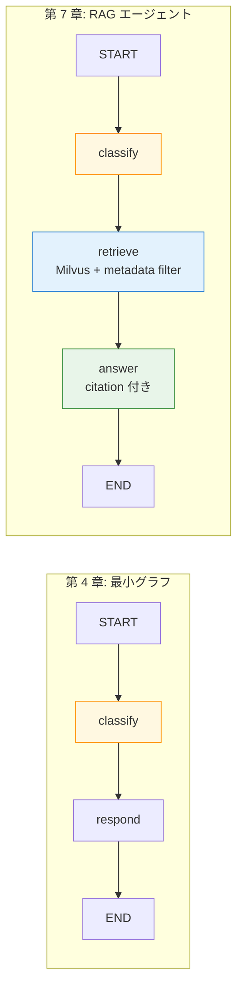

第 7 章では、第 4 章で書いた 2 ノードグラフ（classify + respond）に **retrieve ノード** を 1 つ足して、3 ノードの社内 Q&A エージェントに育てます。第 6 章で投入した Milvus collection（35 chunks、9 メタデータフィールド）を、LangGraph の retrieve ノードから引きます。

本章の見どころは 2 つあります。1 つは **bucket（質問種別）に応じて Milvus のメタデータフィルタを切り替える**こと。第 6 章で課題として残した「ベクトル検索だけでは意図したファイルが上位に来ない」問題が、bucket × メタデータフィルタの組み合わせで一気に解消するさまを観察します。もう 1 つは **citation 付き応答** で、引用元の `title` と `source_path` を回答末尾に並べる構成を作ります。

## この章のゴール

- 3 ノード state graph（classify / retrieve / answer）の役割分担を設計できる
- bucket → Milvus boolean expression のマッピングで retrieval を「絞ってから類似度」に変える
- citation 付きの日本語応答を組み立てる system prompt を書ける
- Langfuse trace で 3 ノードのうち LLM を呼ぶノード（embed と chat）が span として立つことを確認できる
- 第 6 章で課題として残した検索ばらつきが、本章の構成でどう変わるかを実機で観察する

## Ch 4 からの差分

第 4 章の 2 ノード graph と並べると、本章で増えるのは **retrieve ノード** と State の 2 フィールドだけです。



State の追加フィールドは次の 2 つです。

| フィールド  | 型                             | 用途                                                        |
| ----------- | ------------------------------ | ----------------------------------------------------------- |
| `bucket`    | `str \| None`                  | classify ノードが書き込む「質問種別」                       |
| `retrieved` | `list[dict[str, Any]] \| None` | retrieve ノードが書き込む「上位 chunk のメタデータ + 本文」 |

`bucket` は 5 種類（`faq` / `handbook` / `it-security` / `department-notes` / `general`）を取ります。第 5 章のメタデータ設計で `category` の値がそのまま 5 種類だったのは、この対応を狙った仕込みでした。

## State クラスとノード関数

ファイルを上から書いていきます。第 4 章の `echo_graph.py` を `rag_graph.py` に拡張する形です。

```python:graphs/rag_graph.py
"""3-node LangGraph for internal-doc Q&A.

classify -> retrieve -> answer.
"""

from __future__ import annotations

import os
from typing import Annotated, Any

from langchain_core.messages import AIMessage, BaseMessage, SystemMessage
from langchain_core.runnables import RunnableConfig
from langchain_nvidia_ai_endpoints import ChatNVIDIA, NVIDIAEmbeddings
from langgraph.graph import END, START, StateGraph
from langgraph.graph.message import add_messages
from pymilvus import MilvusClient
from typing_extensions import TypedDict

MILVUS_URI = os.environ.get("MILVUS_URI", "http://milvus:19530")
COLLECTION = os.environ.get("MILVUS_COLLECTION", "internal_docs")
EMBED_MODEL = "nvidia/nv-embedqa-e5-v5"
TOP_K = 3


class State(TypedDict):
    messages: Annotated[list[BaseMessage], add_messages]
    bucket: str | None
    retrieved: list[dict[str, Any]] | None
```

`MILVUS_URI` のデフォルトを `http://milvus:19530` にしているのは、本書のサンプルが Milvus と同じ Docker network 内で動く前提だからです。ホスト側から呼ぶ場合は `localhost:19530`、別 compose stack に attach する場合は service 名を含む URL に切り替えます。

## classify ノード

質問のテキストから 5 種類の bucket を判定します。本章ではキーワードマッチで素朴に書きます。第 12 章で Langfuse の Prompt 管理を扱うときに、ここを LLM ベースに置き換える流れを見せます。

```python:graphs/rag_graph.py（続き）
CATEGORY_KEYWORDS: dict[str, tuple[str, ...]] = {
    "faq": ("faq", "経費", "申請", "休暇", "問い合わせ", "FAQ"),
    "handbook": ("オンボーディング", "入社", "ハンドブック", "オフィス", "福利厚生"),
    "it-security": ("セキュリティ", "アカウント", "パスワード", "VPN", "デバイス", "インシデント"),
    "department-notes": ("連絡先", "担当者", "部長", "電話", "顧客"),
}


def classify_node(state: State) -> dict:
    last = state["messages"][-1]
    text = last.content if isinstance(last.content, str) else ""
    for bucket, keywords in CATEGORY_KEYWORDS.items():
        if any(kw in text for kw in keywords):
            return {"bucket": bucket}
    return {"bucket": "general"}
```

キーワード辞書を辞書順で評価しているので、最初に当たったバケットが採用されます。本書のような小規模な題材なら、これで十分実用的です。LLM 分類器に置き換えると精度は上がりますが、レイテンシが伸びるトレードオフが発生します。第 12 章で「キーワード分類 vs LLM 分類」の A/B テストを Langfuse 上で測る予定です。

## retrieve ノード

本章の主役です。bucket をもとに **Milvus boolean expression を組み立て** て、`category == 'faq'` のような絞り込みをかけてから類似度検索します。

```python:graphs/rag_graph.py（続き）
def _milvus_filter(bucket: str) -> str | None:
    """Map the classified bucket to a Milvus boolean expression."""
    if bucket in {"faq", "handbook", "it-security", "department-notes"}:
        return f"category == '{bucket}' && confidentiality != 'confidential'"
    return "confidentiality != 'confidential'"


def retrieve_node(state: State) -> dict:
    last = state["messages"][-1]
    query = last.content if isinstance(last.content, str) else ""

    embedder = NVIDIAEmbeddings(
        model=EMBED_MODEL,
        api_key=os.environ["NGC_API_KEY"],
    )
    vec = embedder.embed_query(query)

    client = MilvusClient(uri=MILVUS_URI)
    bucket = state.get("bucket") or "general"
    expr = _milvus_filter(bucket)
    results = client.search(
        collection_name=COLLECTION,
        data=[vec],
        limit=TOP_K,
        output_fields=["title", "category", "confidentiality", "has_pii", "source_path", "text"],
        filter=expr,
    )

    retrieved: list[dict[str, Any]] = []
    for hit in results[0]:
        entity = hit.get("entity", {}) or {}
        retrieved.append(
            {
                "title": entity.get("title"),
                "category": entity.get("category"),
                "confidentiality": entity.get("confidentiality"),
                "has_pii": entity.get("has_pii"),
                "source": entity.get("source_path"),
                "text": entity.get("text", ""),
                "distance": float(hit.get("distance", 0.0)),
            }
        )
    return {"retrieved": retrieved}
```

`_milvus_filter` がこの章のキモです。bucket が 4 つの category 値のいずれかに当たるなら、その category だけに絞ったうえで `confidentiality != 'confidential'` を掛けます。`general` 以外でも常に confidential を除外しておくのは、機密度フィルタの「最低限の防壁」として、後続の Guardrails より先に効かせるためです。

`general`（キーワードがどの bucket にも当たらない場合）は category を絞らず、confidential 除外だけ掛けます。質問の意図がはっきりしないときに広めに引いて、answer ノードに判断を委ねる構図です。

## answer ノード

検索結果を context として整形し、citation 付きで応答するよう Nemotron に依頼します。

```python:graphs/rag_graph.py（続き）
def _format_context(docs: list[dict[str, Any]]) -> str:
    if not docs:
        return "（参考情報は見つかりませんでした）"
    blocks = []
    for i, d in enumerate(docs, start=1):
        head = f"[{i}] {d['title']}（{d['source']}）"
        blocks.append(f"{head}\n{d['text']}")
    return "\n\n".join(blocks)


def answer_node(state: State) -> dict:
    bucket = state.get("bucket", "general")
    docs = state.get("retrieved") or []
    context = _format_context(docs)

    system_text = (
        "あなたは Example 株式会社の社内文書 Q&A アシスタントです。"
        f"質問種別は {bucket} です。"
        "以下の参考情報のみに基づいて、日本語で 1〜3 文で簡潔に答えてください。"
        "回答末尾に [1] や [2] の引用番号を付け、『参考』として参考情報の見出しを列挙してください。"
        "情報が不足している場合は『参考情報からは判断できません』と答えてください。"
        "\n\n# 参考情報\n"
        f"{context}"
    )

    llm = ChatNVIDIA(
        model="nvidia/llama-3.3-nemotron-super-49b-v1",
        api_key=os.environ["NGC_API_KEY"],
        base_url="https://integrate.api.nvidia.com/v1",
        temperature=0.0,
        max_tokens=512,
    )
    history = [SystemMessage(content=system_text), *state["messages"]]
    reply = llm.invoke(history)
    if not isinstance(reply, AIMessage):
        reply = AIMessage(content=str(reply.content))
    return {"messages": [reply]}
```

`_format_context` で chunk の見出しと本文を `[1] タイトル（パス）` の形に並べ、system prompt の末尾に貼り付けます。Nemotron Super 49B は instruction follow がしっかりしているモデルなので、「`[1]` `[2]` の引用番号を付ける」「『参考』として見出しを列挙する」という指示にきちんと従ってくれます。

## グラフの組み立て

3 ノードを線形につなぐだけです。

```python:graphs/rag_graph.py（続き）
def make_graph(_config: RunnableConfig):
    builder = StateGraph(State)
    builder.add_node("classify", classify_node)
    builder.add_node("retrieve", retrieve_node)
    builder.add_node("answer", answer_node)
    builder.add_edge(START, "classify")
    builder.add_edge("classify", "retrieve")
    builder.add_edge("retrieve", "answer")
    builder.add_edge("answer", END)
    return builder.compile()
```

第 4 章では 2 ノードでしたが、本章では 3 ノードに増えました。社内 Q&A の最終形（第 14 章）はここから 5 ノードに拡張します。第 8-9 章で挿す Guardrails（input rail / output rail）の 2 つで前後を挟む形です。

## NAT YAML と docker-compose

NAT 側の YAML は第 4 章とほぼ同じで、`graph` の指す先だけが変わります。

```yaml:workflow.yml
general:
  use_uvloop: true
  telemetry:
    tracing:
      langfuse:
        _type: langfuse
        endpoint: ${LANGFUSE_OTLP_ENDPOINT}
        public_key: ${LANGFUSE_PUBLIC_KEY}
        secret_key: ${LANGFUSE_SECRET_KEY}
        batch_size: 1
        flush_interval: 1.0
        resource_attributes:
          service.name: nat-rag-langgraph-poc
          deployment.environment: poc

llms:
  nim_llm:
    _type: nim
    model_name: nvidia/llama-3.3-nemotron-super-49b-v1
    api_key: ${NGC_API_KEY}

workflow:
  _type: langgraph_wrapper
  description: "Internal Q&A — classify -> retrieve -> answer"
  graph: /app/graphs/rag_graph.py:make_graph
  dependencies:
    - /app/graphs
```

compose 側で気をつけるのは **2 つの Docker network に attach する** ことです。本章のサンプルは、第 2 章で立ち上げた Langfuse stack（OTLP 送信先）と、第 6 章で立ち上げた Milvus stack（retrieve 先）の両方に届く必要があります。

```yaml:docker-compose.yml
services:
  nat:
    image: nat-nim-handson:1.6.0
    env_file:
      - .env
    networks:
      - langfuse_default # OTLP 送信先
      - milvus_default # retrieve 先（service 名 milvus を解決）
    volumes:
      - ./workflow.yml:/app/workflows/workflow.yml:ro
      - ./graphs:/app/graphs:ro
    command:
      - "run"
      - "--config_file"
      - "/app/workflows/workflow.yml"
      - "--input"
      - "経費精算の月次締切はいつですか？"

networks:
  langfuse_default:
    external: true
  milvus_default:
    external: true
    name: ch06-rag-milvus_default
```

`milvus_default` は別名で参照しています。第 6 章の compose のディレクトリ名が `ch06-rag-milvus` なので、Docker が自動命名する network 名が `ch06-rag-milvus_default` になっているのが理由です。`name:` で明示的に元の名前を指定して、この compose 内では `milvus_default` という短い別名で扱えるようにしています。

## 実行例 1: 経費精算（FAQ）

最初のクエリは第 6 章でも使った経費精算です。

```bash
docker compose run --rm nat
```

```
Workflow Result:
毎月末日 18:00 までに申請を完了してください。ただし、月末日が土日祝の場合は翌営業日 18:00 までとなります。 [2]

参考
[2] 経費精算に関する FAQ
```

classify が「経費」「申請」のキーワードで bucket を `faq` に設定し、retrieve が `category == 'faq' && confidentiality != 'confidential'` のフィルタで FAQ カテゴリの 3 件だけを引いてきました。Nemotron が `経費精算に関する FAQ` をきちんと拾い上げて、citation 付きで返しています。

第 6 章でフィルタなしのスモークテストをしたとき、「休暇取得 FAQ」が 1 位、「経費精算 FAQ」が 2 位、「取締役会議事メモ（confidential）」が 3 位という並びになりました。本章の構成では機密情報が混ざるリスクが原理的になくなります（`confidentiality != 'confidential'` で除外しているため）。

## 実行例 2: 情シス部の連絡先（department-notes）

第 6 章で課題として残した質問を投げます。

```bash
# docker-compose.yml の input を書き換えて再実行
docker compose run --rm nat
```

入力：「情シス部の担当者の連絡先を教えてください」

```
Workflow Result:
情シス部の担当者の連絡先は、[2] 情シス部 担当者連絡先一覧（department-notes/03-it-staff-directory.md）を参照ください。
ただし、社内向け資料なので、社外からのアクセスは不可です。

参考:
[2] 情シス部 担当者連絡先一覧
```

第 6 章のフィルタなし retrieval では、この質問に対して `department-notes/03-it-staff-directory.md` がトップ 3 に入りませんでした。`it-security/` 系のチャンクが「情シス」というキーワードで類似度を稼いでしまっていたためです。

本章では、classify が「連絡先」「担当者」のキーワードで bucket を `department-notes` に設定し、retrieve が `category == 'department-notes'` のフィルタを掛けます。すると `department-notes/` の 4 ファイル分の chunk だけがベクトル検索の候補になり、その中で類似度がもっとも高い `03-it-staff-directory.md` が上位に来る、という挙動の変化が観察できます。

bucket × メタデータフィルタの組み合わせは、ベクトル類似度の限界を補う実用的な工夫として、本書のコアアイデアの 1 つです。

応答末尾の「社内向け資料なので、社外からのアクセスは不可です」は、Nemotron が文脈から推測した補足です。`confidentiality: restricted` のメタデータを引用情報として渡しているわけではないので、これは LLM の解釈で出てきた文章です。第 9 章の Guardrails では、こうした「LLM が暗黙に判断した機密度」を頼りにせず、明示的な制御を入れる構成を扱います。

## Langfuse trace の見え方

ブラウザで `http://localhost:3000` を開いて、`Tracing → Traces` で本章の 2 つの実行を確認します。

```
trace: langgraph_wrapper
  service: nat-rag-langgraph-poc
  observations: 2 件
  latency: 約 3.0 秒
```

ここで「3 ノード走らせたのに observations が 2 件しかない」と感じるはずです。理由は、**LLM を呼ぶノードだけが span として立つ** からです。

| ノード     | LLM 呼び出し                 | span が立つか |
| ---------- | ---------------------------- | ------------- |
| `classify` | なし（キーワードマッチ）     | × 立たない    |
| `retrieve` | NIM Embedding（embed_query） | ◯ 立つ        |
| `answer`   | NIM ChatCompletion           | ◯ 立つ        |

LangGraph のノードそのものを span として残したい場合は、第 11 章で `OpenInference` の span_kind 設定や、自前の trace decorator を扱います。本章のサンプルでは「LLM 呼び出しの 2 つだけが見える」ことが、むしろ retrieve と answer のレイテンシを切り分けやすくする副作用にもなっています。

## 第 6 章で残した課題は解消したか

第 6 章の retrieval スモークテスト（フィルタなし）と、本章の bucket フィルタ付き retrieval を、3 つの観点で並べてみます。

| 観点                            | 第 6 章（フィルタなし）     | 第 7 章（bucket フィルタ）              |
| ------------------------------- | --------------------------- | --------------------------------------- |
| 経費精算 → FAQ                  | rank 2 で正しい FAQ ヒット  | category 絞り込みで FAQ のみが候補      |
| 情シス連絡先 → department-notes | トップ 3 に意図ファイルなし | category 絞り込みで意図ファイルが top 3 |
| 機密情報の混入                  | rank 3 に取締役会議事メモ   | confidential フィルタで除外             |
| Nemotron が幻覚で答える可能性   | あり（候補に確信度がない）  | 候補が絞られ、citation で根拠が示される |

第 6 章で示した課題（ベクトル類似度の限界 / 機密情報の混入リスク）が、本章の構成で実用レベルに改善するのが見えます。

## ハマりポイント

本章で踏みやすい落とし穴を 3 点。

1 つ目は **2 つの Docker network への attach** です。Langfuse network だけだと Milvus に届かず、Milvus network だけだと Langfuse に trace を送れません。`docker compose ps` で attach 状況を確認しても気づきにくいので、最初に動かないときはまず compose の `networks` ブロックを疑います。本章のサンプルでは `external: true` + `name:` でカスタム名を割り当てて両方に attach しています。

2 つ目は **Milvus boolean expression の文字列クォート** です。`category == 'faq'` のシングルクォートを Python の f-string でそのまま埋め込むので、bucket 名の中にシングルクォートが入っているとクエリが壊れます。本章のサンプルでは bucket は固定 5 種類のホワイトリストなので問題になりませんが、ユーザー入力をそのまま filter 文字列に組み込む構成にすると SQL injection に近い穴を作ります。実装する場合はホワイトリスト経由で組み立てるのが定石です。

3 つ目は **system prompt の長さ** です。本章では context の chunk 3 件をそのまま埋め込んでいて、合計で 1,500 〜 2,000 字くらいの system prompt になります。Nemotron Super 49B の context window（数 k token）には十分収まりますが、chunk 数を 5、10 と増やすとリミットに近づきます。第 13 章の評価データセットで chunk 数とコストの関係を測るときに、ここの設計判断をあらためて見直します。

## 次章では

3 ノードの社内 Q&A エージェントが動いたところで、次章からは **NeMo Guardrails** を被せる Part 4 に入ります。第 8 章では Guardrails の rails 体系（input / output / dialog / retrieval / execution）を整理して、本章のグラフに `LLMRails.check_async()` を 1 ステップ挟むパターンを Colang 1.0 で書きます。第 9 章で多言語 Safety Guard NIM をレールに組み込み、入口と出口の検閲を実機で確認する流れです。
