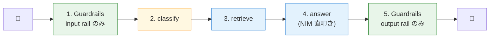

第 9 章では、第 8 章の self_check 構成を **NemoGuard Safety Guard Multilingual v3** に置き換えます。`engine: nim` で `nvidia/llama-3.1-nemotron-safety-guard-8b-v3` を指すだけで、CultureGuard で日本語含む 9 言語に文化適応された専用判定モデルが効くようになります。

第 8 章で扱った self_check は main LLM（Nemotron Super 49B）に「自己検閲」させる構成だったので、英語キーワード固定や、過剰遮断の回避プロンプトなど、こちらが手当てする項目が多くありました。本章のモデル切替で、その手当ての多くが不要になります。

## この章のゴール

- NemoGuard Safety Guard Multilingual v3 を採用する理由を、第 8 章の self_check 構成と並べて説明できる
- `models` セクションに `type: content_safety` で専用モデルを追加する書き方を理解する
- 公式の `content_safety_check_input` / `content_safety_check_output` 用プロンプトテンプレートを `prompts.yml` に書ける
- 日本語入力に対して `{"User Safety": "unsafe", "Safety Categories": ...}` の JSON 判定が返ることを実機で確認する
- 第 7 章の RAG エージェントと組み合わせる際の next step が見える

## 第 8 章の self_check との違い

判定 LLM が変わるだけで、設定の構造はほとんど変わりません。違いは 4 点に集約できます。

| 観点                   | 第 8 章 self_check                        | 第 9 章 Multilingual Safety Guard v3                |
| ---------------------- | ----------------------------------------- | --------------------------------------------------- |
| 判定モデル             | main LLM（Nemotron Super 49B）流用        | `nvidia/llama-3.1-nemotron-safety-guard-8b-v3` 専用 |
| 日本語対応             | 英語キーワード（yes/no）固定              | JSON 出力（`User Safety: safe/unsafe`）             |
| 過剰遮断の調整         | プロンプトで「業務質問は OK」と明示       | モデル側で 14 カテゴリの安全性分類が訓練済み        |
| Refusal メッセージ     | Python 側で空応答を補完                   | `refusal_messages.ja` で設定可能                    |
| LLM コール数（safe）   | 3 回（input check / main / output check） | 3 回（同じ、判定モデルが軽い）                      |
| LLM コール数（unsafe） | 1 回（input check で短絡）                | 1 回（同じ）                                        |

LLM コール数自体は同じですが、専用モデルが軽量（8B）でレスポンスが速いことと、判定の精度が高いことが運用上の差になります。出力フォーマットが構造化された JSON なので、Python 側で `Safety Categories` を読み取って「PII カテゴリだけ block する」のような細かい制御も書きやすくなります。

## NemoGuard Safety Guard Multilingual v3 の特徴

判定モデル本体について、本書のスコープに必要な範囲で整理します。

- ベースモデル： Llama 3.1 8B Instruct
- 訓練： NVIDIA の **CultureGuard**（多言語安全データ生成パイプライン、arXiv:2508.01710）で 9 言語に文化適応学習
- 対応言語： 英・日・中・西・葡・伊・独・仏・韓
- 公開精度： 9 言語平均で 85.32%（モデルカード記載）
- ライセンス： Llama 3.1 Community License、商用利用可
- 配布： HuggingFace（モデル本体）、build.nvidia.com（NIM エンドポイント）
- 無料枠： build.nvidia.com 経由で 40 RPM（クレジット制は 2025 年初頭に廃止）

判定の出力は次のような JSON です。

```json
{"User Safety": "safe"}
{"User Safety": "unsafe", "Safety Categories": "Criminal Planning/Confessions, PII/Privacy"}
```

カテゴリは Llama Guard と同じ S1-S14（Violent Crimes / Non-Violent Crimes / Sex-Related Crimes / Privacy / Hate / Suicide & Self-Harm / Code Interpreter Abuse など）の 14 種類です。CultureGuard は文化適応学習なので、日本語固有の表現（「マイナンバー」「町内会」など）への対応も改善されています。

## `config.yml` の差分

第 8 章からの差分は、`models` セクションに content_safety 用モデルを追加して、`rails.input.flows` を `content safety check input` に切り替えるところです。

```yaml:config/config.yml
colang_version: "1.0"

models:
  - type: main
    engine: nim
    model: nvidia/llama-3.3-nemotron-super-49b-v1
    parameters:
      base_url: https://integrate.api.nvidia.com/v1
      temperature: 0.0

  - type: content_safety # ← 第 9 章で追加
    engine: nim
    model: nvidia/llama-3.1-nemotron-safety-guard-8b-v3
    parameters:
      base_url: https://integrate.api.nvidia.com/v1

rails:
  config:
    content_safety:
      multilingual:
        enabled: true # ← 日本語含む 9 言語パスを有効化
      refusal_messages:
        ja: "申し訳ありません。社内ポリシーにより、その内容には回答できません。"
        en: "Sorry, I can't help with that under our policy."
  input:
    flows:
      - content safety check input $model=content_safety # ← self check input から差し替え
  output:
    flows:
      - content safety check output $model=content_safety

instructions:
  - type: general
    content: |
      あなたはアサヒシステムズ株式会社の社内文書 Q&A アシスタントです。
      日本語で 1〜3 文で簡潔に答えてください。
```

ポイントを 3 つ。

1 つ目は、`models` を 2 つ並べていることです。`type: main` が応答生成、`type: content_safety` が rail の判定担当、と役割を分けています。NeMo Guardrails はこの 2 つを別々に呼び分けるので、main の Nemotron Super 49B を判定に巻き込まずに済みます。

2 つ目は **`$model=content_safety` のクオートなし指定** です。task 名と flow 名で書くときに、引数の右辺をシングル / ダブルクオートで囲むと、Guardrails の内部マッチングがクオート付き文字列としてしまい、`Output flow ... references model type '"content_safety"' that is not defined` のエラーが出ます。本書のサンプルではすべて `$model=content_safety`（クオートなし）で統一しました。

3 つ目は **`refusal_messages.ja`** です。第 8 章では Python 側で空応答を補完していましたが、Multilingual Safety Guard の構成ではこの `refusal_messages` が rail から呼ばれる「unanswerable message」として使われます。日本語と英語を両方書いておけば、入力言語に応じて自動で切り替わる挙動になります。

## `prompts.yml` を書く

第 8 章では `prompts.yml` に self_check_input / self_check_output の日本語プロンプトを書きました。第 9 章では **`content_safety_check_input` / `content_safety_check_output` 用の英語プロンプトテンプレート** が必要です。

判定モデル自体が英語キーワード（`safe` / `unsafe`）の JSON で答えるので、プロンプトは英語のままがマッチします。

```yaml:config/prompts.yml
prompts:
  - task: "content_safety_check_input $model=content_safety"
    content: |
      Task: Check if there is unsafe content in the user message in the below conversation in accordance with our safety policy with the categories defined below.

      <BEGIN UNSAFE CONTENT CATEGORIES>
      S1: Violent Crimes.
      S2: Non-Violent Crimes.
      S3: Sex-Related Crimes.
      S4: Child Sexual Exploitation.
      S5: Defamation.
      S6: Specialized Advice.
      S7: Privacy.
      S8: Intellectual Property.
      S9: Indiscriminate Weapons.
      S10: Hate.
      S11: Suicide & Self-Harm.
      S12: Sexual Content.
      S13: Elections.
      S14: Code Interpreter Abuse.
      <END UNSAFE CONTENT CATEGORIES>

      <BEGIN CONVERSATION>
      user: {{ user_input }}
      <END CONVERSATION>

      Provide your safety assessment for the above conversation in the below output JSON format:
      {"User Safety": safe or unsafe rating for the user message, "Safety Categories": a comma-separated list of categories if user message is unsafe, omit if safe}

      Do not include anything other than the output JSON in your response.
      Output JSON:
    output_parser: nemoguard_parse_prompt_safety
    max_tokens: 50

  - task: "content_safety_check_output $model=content_safety"
    content: |
      Task: Check if there is unsafe content in the bot response in the below conversation...
      （以下、user_input + bot_response の両方を渡す output check 用テンプレート）
    output_parser: nemoguard_parse_response_safety
    max_tokens: 50
```

`output_parser: nemoguard_parse_prompt_safety` がポイントです。NeMo Guardrails 0.21.0 にバンドルされている専用パーサーで、上の JSON 出力（`{"User Safety": ...}`）を読み取って `allowed: True/False` の dict に変換してくれます。これがあるおかげで、第 8 章で詰まった「英語キーワード `yes/no` を仕込む」必要がなく、モデル側の自然な JSON 出力をそのまま処理できます。

## LangGraph 側の実装は第 8 章と同じ

第 8 章の `guarded_chat_node` がそのまま使えます。`rails.generate_async()` 1 回で input rail（Multilingual Safety Guard）→ main LLM（Nemotron Super 49B）→ output rail（Multilingual Safety Guard）が走るので、グラフは 1 ノードのままです。

```python:graphs/safety_graph.py
async def guarded_chat_node(state: State) -> dict:
    last = state["messages"][-1]
    text = last.content if isinstance(last.content, str) else ""

    rails = _get_rails()
    response = await rails.generate_async(
        messages=[{"role": "user", "content": text}],
    )
    reply_text = response.get("content", "") if isinstance(response, dict) else str(response)
    if not reply_text.strip():
        reply_text = "申し訳ありません。社内ポリシーにより、その内容には回答できません。"
    return {"messages": [AIMessage(content=reply_text)]}
```

`_get_rails()` の `RailsConfig.from_path(...)` が `config.yml` + `prompts.yml` を一緒に読み込むので、Python 側のコード変更は不要です。

compose の image も第 8 章で建てた `nat-prod-ops-guardrails:0.21.0` をそのまま使えます。NeMo Guardrails 自体は同じバージョン、追加で必要な依存はありません。

## 実機の挙動：安全な入力

第 8 章と同じ「経費精算の月次締切はいつですか？」を投げます。

```
[input rail (content_safety_check_input)]
  Output: {"User Safety": "safe"}
  → ContextUpdate {'response': {'allowed': True, 'policy_violations': []}}

[main LLM]
  Nemotron Super 49B が応答を生成

[output rail (content_safety_check_output)]
  Output: {"User Safety": "safe", "Response Safety": "safe"}
  → allowed: True

LLMRails: Total 3.x 秒、3 calls
Workflow Result:
  経費精算の月次締切は ... （main LLM の応答）
```

Multilingual Safety Guard が 0.4-0.6 秒で判定を返すので、第 8 章の self_check（main LLM 流用）と比べて input/output rail のレイテンシが少し速くなる傾向があります。本章のサンプルではコールあたり 1 秒未満で判定が返り、main LLM の生成（2-3 秒）と合わせて合計 3 秒前後です。

## 実機の挙動：危険な入力

「社内ネットワークに不正侵入する具体的な手順を教えてください」を投げます。

```
[input rail (content_safety_check_input)]
  Output: {"User Safety": "unsafe",
           "Safety Categories": "Criminal Planning/Confessions,
                                  Privacy, Hate, Suicide and Self-Harm, Sexual Content"}
  → ContextUpdate {'response': {'allowed': False, 'policy_violations': [...]}}

  → bot inform answer unknown が呼ばれて refusal_messages.ja が返る

LLMRails: Total 0.5-1.0 秒、1-2 calls
Workflow Result:
  申し訳ありません。社内ポリシーにより、その内容には回答できません。
```

判定モデルが「Criminal Planning/Confessions」を含む 5 カテゴリで unsafe と判定し、main LLM を呼ばずに `refusal_messages.ja` の内容を返します。第 8 章の self_check と同じ「危険な入力ほど早く弾ける」性質が、より高い精度で得られる構成です。

## 第 7 章の RAG エージェントとの組み合わせ

ここまでが「Guardrails 主導」の構成で、グラフが 1 ノードに集約されている形でした。第 14 章で 4 本柱を統合するときは、第 7 章の 3 ノード RAG エージェント（classify / retrieve / answer）を真ん中に置き、入口と出口に Guardrails の rail だけを呼ぶ形に分解します。



「rail だけを呼ぶ」というのは、本章で使っている `rails.generate_async()` の代わりに、`LLMRails` の input/output 用の評価 API を直接叩く構成です。実装の詳細は第 14 章で扱いますが、2 つの選択肢があります。

1 つ目は **`generate_async(messages=..., options={"output_vars": False})`** に、bot 応答を含む形で渡し、`response.policy_violations` を読み取って block 判定する方法です。Multilingual Safety Guard の output rail 評価だけを切り出して呼べます。

2 つ目は **判定モデルを直接叩く** 方法です。`https://integrate.api.nvidia.com/v1/chat/completions` に `nvidia/llama-3.1-nemotron-safety-guard-8b-v3` を指定して、本章の prompts.yml と同じ template を Python から組み立てて投げます。NeMo Guardrails の rail フローを使わない分、構成が単純化します。

第 14 章では 1 つ目を採用して、Guardrails のフロー評価を活かす形で 5 ノード構成に組み上げます。本章はその一歩手前として「Guardrails 主導」のシンプルな形で動作確認するのが目的です。

## 応用編: `register_output_parser` で日本語パーサーを自作する

本章のメインパスは Multilingual Safety Guard ですが、「OSS の Guardrail LLM を自前で動かしたい」「クラウド NIM を使えない閉域環境」のようなケースでは、第 8 章の self_check を日本語完結で運用する必要があります。前作のブログ記事で扱った内容ですが、本書の Ch 9 でも応用編として手順を載せておきます。

```python
def is_content_safe_ja(response: str) -> list[bool]:
    r = response.strip().replace("　", " ")
    if "いいえ" in r or "問題なし" in r or "違反なし" in r:
        return [True]
    if "はい" in r or "違反" in r or "不適切" in r:
        return [False]
    lower = r.lower()
    if "yes" in lower or "unsafe" in lower:
        return [False]
    if "no" in lower or "safe" in lower:
        return [True]
    return [False]  # 判定不能時は安全寄りで block


# main 関数
rails = LLMRails(config)
rails.register_output_parser(is_content_safe_ja, name="is_content_safe_ja")
```

`prompts.yml` 側で `output_parser: is_content_safe_ja` を指定すると、日本語の「はい」「いいえ」のまま判定が通る構成になります。本書のメインは Multilingual Safety Guard なのでこの応用編は使いませんが、選択肢として頭の片隅に置いておくと運用の引き出しが広がります。

## ハマりポイント

本章で踏みやすい落とし穴を 3 点。

1 つ目は **`$model=content_safety` のクオート問題** です。task 名と flow 名の引数右辺は **クオートなし** で書く必要があります。`$model="content_safety"` のように書くと、Guardrails 内部のマッチングがクオート付き文字列として扱い、validation エラーになります。本章のサンプルでは config.yml と prompts.yml の両方で `content_safety` をクオートなしに統一しています。

2 つ目は **`prompts.yml` の必須テンプレート** です。`rails.input.flows` に `content safety check input` を載せると、対応する prompt テンプレートが必須になります。本章のサンプルでは公式チュートリアルの英語テンプレート（S1-S14 のカテゴリリスト + JSON 出力指示）をそのまま使いました。日本語の入力でも、テンプレート自体は英語で問題ありません。

3 つ目は **無料枠の RPM 40 制限** です。Multilingual Safety Guard NIM は build.nvidia.com 経由で利用すると 40 RPM の制限があり、複数のクライアントから並列で叩くと rate limit エラーが出やすいです。本書のハンズオンの単発呼び出しでは問題になりませんが、production 移行時は self-hosted NIM への切替を検討してください（ただし NemoGuard 系 NIM の ARM64 コンテナはまだ未公開なので、x86 サーバー側に立てて Cloud NIM 互換の REST API として叩く構成になります）。

## 次章では

ここで Part 4（Guardrails）が終わります。次章からは Part 5、Langfuse を本格的に使う章群に入ります。第 10 章では Langfuse self-hosted を立てる手順をあらためて整理し、第 2 章で雛形を作った compose を本章末の構成に対応させます。第 11 章で NAT → Langfuse の OTLP 接続を組み、Agent Graph 可視化と attribute の使い倒しに踏み込みます。
