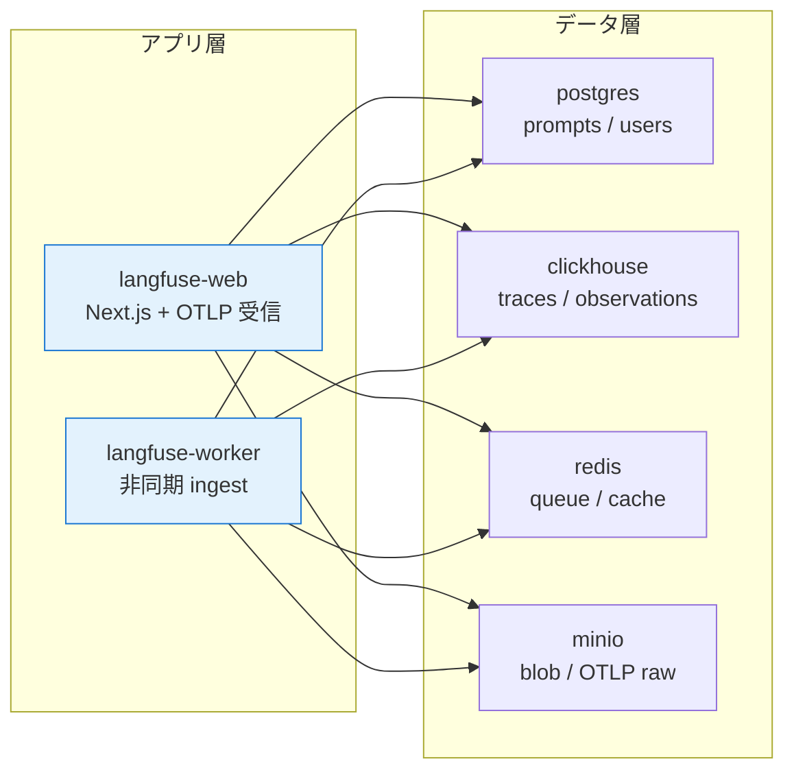
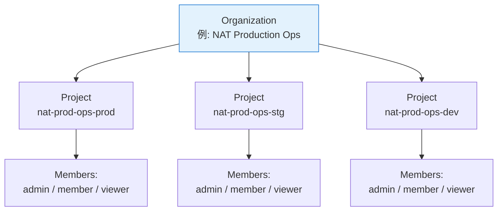

第 10 章では、第 2 章で建てた Langfuse v3 のスタックを **運用視点で見直す** 章です。立ち上げ手順そのものは第 2 章でほぼ済ませているので、本章では「動く構成を、どう運用に乗せるか」に重点を置きます。バックアップ・認証・シークレット強化・サイジングといった、production 移行で確実に問われる項目を整理します。

第 11 章以降の OTLP 接続 / プロンプト管理 / コスト追跡 / 評価データセットは、本章で固めた basis のうえに乗ります。本章は「Langfuse をプラットフォームとしてどう扱うか」を一段深掘りする位置づけです。

## この章のゴール

- 第 2 章で建てた Langfuse v3 stack の 6 サービスの責務を再整理する
- 永続化したいデータがどこに置かれるかを把握し、バックアップ戦略を立てる
- `CHANGEME` のままになっているシークレットをすべて潰したかチェックする
- 認証・SSO・組織管理の選択肢を、本書のスコープ内で見渡す
- Langfuse Cloud との使い分けを、コスト試算込みで言語化する（詳細は付録 B）

## 第 2 章のおさらい

第 2 章で立ち上げた Langfuse v3 の構成は、6 サービスからなります。



それぞれの担当を 1 行で言うと、こうなります。

| サービス          | 担当                                                                   |
| ----------------- | ---------------------------------------------------------------------- |
| `langfuse-web`    | Next.js 製 UI、`/api/public/otel/v1/traces` の OTLP 受信エンドポイント |
| `langfuse-worker` | 非同期 ingest、queue consumer、ClickHouse への書き込み                 |
| `postgres`        | prompts / datasets / users / API key などのトランザクションデータ      |
| `clickhouse`      | trace / observation / score の OLAP ストア                             |
| `redis`           | queue（worker への job 渡し）、認証 session、レート制限カウンタ        |
| `minio`           | OTLP の raw JSON / dataset の blob / メディア添付                      |

`langfuse-web` がフロントの全部、`langfuse-worker` が裏方の全部、と役割が綺麗に分かれているのが v3 の設計です。

## v2 から v3 への大きな変化

前作で Phoenix を使っていたみなさんが Langfuse v2 を触ったことがある場合、本書 v3 でいちばん戸惑うのは **ClickHouse の追加** です。v2 までは postgres 1 つで trace も保存していましたが、v3 で trace 系を ClickHouse に切り出した結果、サービス数が 4 → 6 になりました。

その代わりに得られたのは、

- 高 cardinality な属性検索（`metadata` の任意 field でフィルタ）が高速化
- trace の retention（保存期間）を ClickHouse の TTL で粗く制御できる
- 月数百万 trace 規模の集計が、postgres を介さずに完結する

の 3 つです。本書のような数千 trace のスケールでは ClickHouse の恩恵は薄いですが、production 移行を意識して v3 を選んでおくのが筋が通ります。

## 永続化したいデータと配置場所

事故が起きたときに守りたいデータが、どのサービスのボリュームにあるかを把握しておきます。

| データ                                   | 配置場所                  | 失ったときの影響                |
| ---------------------------------------- | ------------------------- | ------------------------------- |
| Trace / Observation / Score              | `clickhouse` のボリューム | 過去の実行履歴がすべて消える    |
| Prompt / Dataset / User / API key        | `postgres` のボリューム   | 認証情報と評価データが消える    |
| OTLP の raw JSON、Dataset の添付ファイル | `minio` のボリューム      | trace の大きな payload が消える |
| Queue 状態 / 認証 session                | `redis` のボリューム      | 進行中の ingest が壊れる程度    |

postgres + clickhouse + minio が「中長期で守りたい」3 点セットです。redis のボリュームは短期キャッシュなので、再起動で消えても致命的ではありません。

第 2 章の compose では、これら 4 つのボリュームを Docker named volume として定義しています。

```yaml
volumes:
  langfuse_postgres_data:
  langfuse_redis_data:
  langfuse_clickhouse_data:
  langfuse_clickhouse_logs:
  langfuse_minio_data:
```

named volume なので `docker compose down` ではボリュームは消えませんが、`docker compose down -v` を打つと **すべて消えます**。本書の Sprint 0 検証では、 MinIO root password を変えるたびに `down -v` を叩いて全消去していましたが、運用環境では絶対に叩いてはいけないコマンドです。

## バックアップ戦略

postgres / clickhouse / minio の 3 つを、それぞれの推奨ツールでスナップショットします。

### postgres

毎日 1 回、`pg_dump` で論理バックアップを取るのが定石です。Langfuse の postgres の中身は数十 MB から数百 MB 程度なので、論理 dump で十分です。

```bash
docker exec langfuse-postgres-1 pg_dump -U postgres postgres > postgres_$(date +%F).sql
```

cron に乗せるか、Kubernetes 上の CronJob に置き換えると安心です。

### clickhouse

trace 量が増えると、論理 backup ではなく物理 backup（`BACKUP TABLE ... TO DISK`）が現実的になります。Langfuse v3 のドキュメントでは ClickHouse の `BACKUP` コマンドを使ったスナップショット手順が紹介されているので、production 移行時にはそちらを参考にしてください。

開発・PoC レベルでは、`docker volume` のスナップショットを取るだけでも十分です。

```bash
docker run --rm \
  -v langfuse_langfuse_clickhouse_data:/source:ro \
  -v $(pwd)/backups:/backup \
  alpine tar czf /backup/clickhouse_$(date +%F).tar.gz -C /source .
```

ボリューム単位でアーカイブを取って、必要時に展開して別環境に移す、という素朴な運用です。

### minio

MinIO は S3 互換の API を持つので、`mc mirror` で別 S3 / 別 MinIO に同期するのが定石です。AWS S3 Glacier に流すケースもよく見ます。

```bash
mc alias set local http://localhost:9090 minio <secret>
mc mirror --remove local/langfuse s3/<your-backup-bucket>/langfuse-backup
```

PoC 段階では、`docker volume` をボリュームスナップショットで取るだけで済ませる選択肢もあります。

## シークレットを潰す

第 2 章の `.env` で `openssl rand` で生成したシークレットは、最低限の対応です。production 移行ではさらに次の項目をチェックします。

```bash
.env のチェックリスト:
✓ ENCRYPTION_KEY                   # 64 hex chars、ローテーション計画あり
✓ NEXTAUTH_SECRET                  # 64 hex chars
✓ SALT                             # 32 hex chars
✓ REDIS_AUTH                       # 32 hex chars
✓ CLICKHOUSE_PASSWORD              # 32 hex chars
✓ MINIO_ROOT_PASSWORD              # 32 hex chars
✓ LANGFUSE_S3_*_SECRET_ACCESS_KEY  # MINIO_ROOT_PASSWORD と同一
✗ ENCRYPTION_KEY のローテーション    # 別途設計が必要
✗ シークレット管理ツール（Vault / AWS SSM Parameter Store 等）への移行
✗ Docker secrets / Kubernetes Secret への移行
```

公式 compose の `# CHANGEME` コメントが付いているフィールドが、ぜんぶ書き換わっているかが check の出発点です。grep で `CHANGEME` を検索して 1 件も hit しない状態が、第 2 章のスタートラインでした。本章では、それを「production grade」に持ち上げる差分を考えます。

`ENCRYPTION_KEY` のローテーションは、勝手に変えると **DB 上の暗号化済みデータが復号できなくなる** ので、Langfuse のドキュメントに従って計画的に行う必要があります。本書ではローテーション手順は扱いませんが、production 移行時には必ず読んでおくべき項目です。

## 認証と組織管理

Langfuse は v3 でユーザー / 組織 / プロジェクトの 3 階層モデルを採用しています。



第 2 章では `LANGFUSE_INIT_*` の環境変数で組織 / プロジェクト / 管理ユーザーを 1 セット作りました。本書のハンズオンを進めるには十分ですが、運用に乗せるなら次の選択肢を頭に入れておきます。

メール / パスワード認証はデフォルトで、SMTP を設定すれば「パスワード忘れ」のメールフローも動きます。SSO（OIDC / SAML）は Enterprise 機能で、Auth0 / Okta / Microsoft Entra ID などと統合できます。API key はプロジェクト単位で発行する CI・アプリ向けのトークンで、本書の `LANGFUSE_PUBLIC_KEY` / `LANGFUSE_SECRET_KEY` がこれにあたります。Service Account は自動化用の永続トークンで、SSO ありの環境で「人間ではない」呼び出しに使うのが定石です。

PoC では admin 1 ユーザーで進めて構いませんが、Production では「個人ユーザーが API key を発行」するのではなく、Service Account 経由で発行する運用が定石です。退職者が出たときにユーザーごと無効化しても、Service Account に紐づくキーは残せるためです。

## サイジングとリソース

Langfuse v3 を本書の規模で動かす場合のリソース目安です。

| サービス          | CPU 推奨  | メモリ推奨 | ディスク使用量（trace 1 万件目安） |
| ----------------- | --------- | ---------- | ---------------------------------- |
| `langfuse-web`    | 0.5 core  | 512 MB     | -                                  |
| `langfuse-worker` | 0.5 core  | 512 MB     | -                                  |
| `postgres`        | 0.5 core  | 1 GB       | 約 100 MB                          |
| `clickhouse`      | 1 core    | 2 GB       | 約 500 MB（圧縮後）                |
| `redis`           | 0.25 core | 256 MB     | 約 50 MB（メモリ）                 |
| `minio`           | 0.25 core | 256 MB     | trace の生 JSON、約 1 GB           |

合計で 3 core / 4-5 GB / 数 GB ディスク、というのが本書のハンズオン規模での感覚値です。第 2 章で Colima を 6 CPU / 12 GB に設定したので、NAT + Milvus + Guardrails と同居しても余裕があります。

trace 数が増えると、ClickHouse のメモリ占有がいちばん早く伸びます。月数十万 trace を扱う規模になったら 4 GB → 8 GB のメモリ増強と、ClickHouse の TTL（古い trace の自動削除）の見直しが必要です。

## ARM64 と x86 の両方で動く

第 2 章で確認したとおり、Langfuse v3 の 6 サービスはすべて multi-arch image が公開されています。DGX Spark（ARM64）と Apple Silicon Mac で同じ compose が動くので、開発と検証の環境を揃えやすいのが運用上の利点です。

ARM64 で気をつける点を 2 つ。

1 つ目は **ClickHouse の ARMv8.2-A 要件** です。古い ARM64 サーバー（ARMv8.0-A など）では ClickHouse のバイナリが起動しません。DGX Spark（Grace ARMv9.0-A）と Apple Silicon（M1 以降は ARMv8.5-A 相当）はクリアします。Raspberry Pi のような小型 ARM64 ボードに乗せたい場合は、CPU 世代を要確認です。

2 つ目は **メモリ要求の現実** です。ARM64 のクラウド VM（AWS Graviton 等）でいちばん安いのが 2 vCPU / 4 GB のクラスですが、Langfuse v3 + α を動かすには手狭です。本番運用なら 4 vCPU / 8 GB クラスを目安にしてください。

## Cloud との使い分け

self-hosted を選ぶ理由がない限り、Langfuse Cloud のほうが運用負担は軽くなります。本書 self-hosted を選んだ理由は次の 4 つでした。

1. データ主権（trace に PII が含まれる可能性、社内文書 Q&A の文脈）
2. ネットワーク隔離（VPN / プライベートネットワーク内に閉じたい）
3. コスト予測（trace 量が膨らんでも料金が変わらない）
4. ハンズオンとしての学び（v3 の構成を実際に見たい）

逆に Cloud を選ぶ理由は、

1. 運用工数を取りたくない
2. trace 量が小さく、Cloud の無料枠で十分
3. SLA / バックアップを Langfuse 側に任せたい

の 3 つです。詳細な比較とコスト試算は **付録 B** に回しますが、本書の主題（社内 Q&A の本番運用）の文脈では self-hosted が筋に合うと判断しています。

## 動作確認のチェックリスト（再掲）

第 2 章末で挙げたチェックリストを、運用視点で 1 つ追加してまとめておきます。

```bash
# 1. 6 サービスがすべて Up
docker compose ps

# 2. Web UI 疎通
curl -sf http://localhost:3000/api/public/health && echo " OK"

# 3. OTLP 受信疎通（API key 必須）
curl -X POST http://localhost:3000/api/public/otel/v1/traces \
  -H "Authorization: Basic $(echo -n "${LANGFUSE_PUBLIC_KEY}:${LANGFUSE_SECRET_KEY}" | base64 -w0)" \
  -H "Content-Type: application/x-protobuf" --data ""
# → 200（空 body でも受信成功）

# 4. ClickHouse の trace テーブルに行がある
docker exec langfuse-clickhouse-1 clickhouse-client --query \
  "SELECT count() FROM langfuse.traces"

# 5. postgres の prompts テーブルにアクセスできる
docker exec langfuse-postgres-1 psql -U postgres -c "\dt prompts"
```

第 11 章以降で trace を流すと、4 と 5 のクエリで実数が増えていくのを観察できます。Web UI から `Dashboards` を開くと、立ち上げ直後はまだダッシュボードが定義されていないので空ですが、第 13 章のコスト追跡を有効化すると次のような画面に育ちます。


## 次章では

次章では、本章で動かしている Langfuse スタックに **NAT 1.6.0 から OTLP で trace を送り込みます**。Sprint 0 の調査で確認したとおり、NAT のネイティブ `_type: langfuse` exporter を使うだけで、collector を介さずに直送できます。本書のすべての PoC（hello agent / LangGraph / RAG / Guardrails）の実行 trace が、Langfuse の trace tree でどう見えるかを並べて確認していきます。
