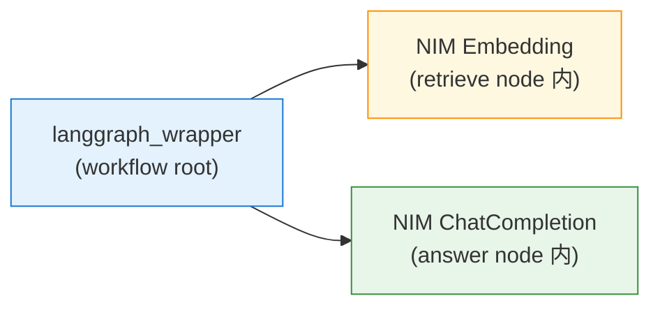
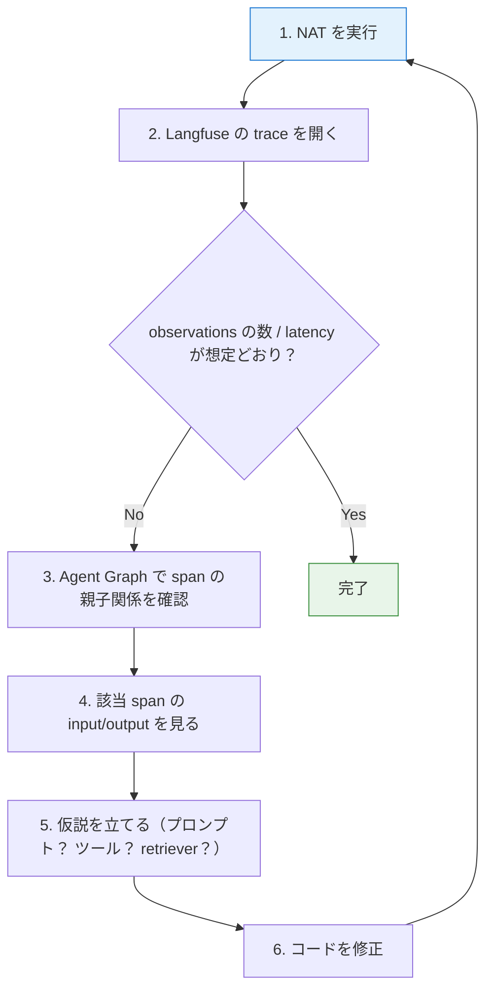

第 11 章では、第 10 章で立てた Langfuse スタックに **NAT 1.6.0 から OTLP で trace を送り込みます**。Sprint 0 の調査どおり、NAT のネイティブ `_type: langfuse` exporter を使うだけで、OpenTelemetry Collector を介さずに直送できます。本書の第 4 章以降のすべての実行（hello agent / LangGraph / RAG / Guardrails / Multilingual Safety Guard）は、すでにこのパスを通って Langfuse に届いています。

本章は「すでに動いている経路を、もう一段使い倒す」位置づけです。trace を眺めるだけで終わらせず、`resource_attributes` の使い分け、Agent Graph 可視化、`nat.*` 属性の使いどころ、デバッグワークフローまで踏み込みます。

## この章のゴール

- NAT の `_type: langfuse` exporter の最小設定（5 行）を再確認する
- `resource_attributes` の `service.name` / `deployment.environment` を活用してプロジェクトを切り分ける
- Langfuse Trace UI の Agent Graph ビューで、LangGraph のフロー構造を読み取る
- NAT が span に付ける `nat.*` 属性の意味と、検索 / フィルタでの使い方を把握する
- trace ベースのデバッグワークフロー（観察 → 仮説 → 修正 → 再実行）を回せる

## NAT 1.6.0 のネイティブ langfuse exporter

おさらいすると、NAT 1.6.0 の `nvidia-nat[opentelemetry]` extras には `_type: langfuse` の telemetry tracer が組み込まれています。コアパッケージ同梱なので、追加 install は不要です。

```yaml:workflow.yml の最小設定
general:
  use_uvloop: true
  telemetry:
    tracing:
      langfuse:
        _type: langfuse
        endpoint: ${LANGFUSE_OTLP_ENDPOINT}
        public_key: ${LANGFUSE_PUBLIC_KEY}
        secret_key: ${LANGFUSE_SECRET_KEY}
```

これだけで NAT の workflow / function / LLM 呼び出し / tool 呼び出しが、自動的に span として Langfuse に届きます。本書の第 4 章で導入してから、すべての PoC で同じ 5 行を使い回しています。

裏では NAT が OTLP HTTP/protobuf に変換して `/api/public/otel/v1/traces` に POST しています。`Authorization: Basic <base64(pk:sk)>` ヘッダも自動でつきます。OpenTelemetry Collector を別途立てる必要はありません。

## 開発時に欲しい追加パラメータ

最小設定だけだと、開発中に「投げたのに UI に出てこない」ように見える時間があります。理由は OTLP の **batch 送信** で、デフォルトでは 100 span または 5 秒のどちらかが満たされるまで送らない設計だからです。

開発中は次のパラメータを追加しておくと、Langfuse UI に即時反映されます。

```yaml
general:
  telemetry:
    tracing:
      langfuse:
        _type: langfuse
        endpoint: ${LANGFUSE_OTLP_ENDPOINT}
        public_key: ${LANGFUSE_PUBLIC_KEY}
        secret_key: ${LANGFUSE_SECRET_KEY}
        batch_size: 1 # 1 span ごとに送る
        flush_interval: 1.0 # 1 秒以内に flush
        resource_attributes:
          service.name: my-agent
          deployment.environment: dev
```

`batch_size: 1` と `flush_interval: 1.0` は production では非効率なので、ステージング以降は default 値に戻します。本書の PoC ではすべて `batch_size: 1` で動かしています。

## `resource_attributes` で trace を切り分ける

`service.name` と `deployment.environment` の 2 つを使い分けると、同じプロジェクトに複数のワークロードが流れ込んでも、Langfuse の UI で簡単にフィルタできます。

```yaml
resource_attributes:
  service.name: nat-rag-langgraph-poc # workflow ごとに固有名を付ける
  deployment.environment: poc # poc / dev / stg / prod を識別
  team: platform # 組織が複数チームで使うなら追加
  region: tokyo # 物理拠点（マルチリージョン運用時）
```

本書のサンプルでは、PoC ごとに `service.name` を変えました。

| PoC              | service.name                  | 内容                                   |
| ---------------- | ----------------------------- | -------------------------------------- |
| 第 4 章（PoC-2） | `nat-langfuse-poc`            | hello agent + langfuse 直送            |
| 第 4 章（PoC-4） | `nat-langgraph-poc`           | LangGraph 2 ノード（classify+respond） |
| 第 7 章（PoC-7） | `nat-rag-langgraph-poc`       | LangGraph 3 ノード（RAG 統合）         |
| 第 8 章（PoC-8） | `nat-guardrails-poc`          | Guardrails self_check                  |
| 第 9 章（PoC-9） | `nat-multilingual-safety-poc` | Multilingual Safety Guard              |

UI 側は **Tracing → Traces → フィルタ → metadata.attributes.service.name = ...** で絞り込めます。production では同じプロジェクトに dev / stg / prod の trace が混ざるはずなので、`deployment.environment` でも切り分けるのが定石です。


## NAT が付ける `nat.*` 属性

NAT が span ごとに自動で付ける属性が、`nat.*` の prefix で並びます。第 4 章で確認した hello agent の trace を再掲します。

```json
{
  "id": "2045210a48194434bdb9ffe57903c0db",
  "name": "<workflow>",
  "metadata": {
    "attributes": {
      "nat.event_type": "WORKFLOW_START",
      "nat.function.id": "root",
      "nat.function.name": "root",
      "nat.subspan.name": "react_agent",
      "nat.framework": "unknown",
      "nat.workflow.run_id": "5230c687-529c-4879-a708-109cd21e6ceb",
      "nat.workflow.trace_id": "2045210a48194434bdb9ffe57903c0db",
      "nat.span.kind": "WORKFLOW"
    }
  }
}
```

意味のある属性を 4 つ取り上げます。

| 属性                  | 意味                                                                |
| --------------------- | ------------------------------------------------------------------- |
| `nat.event_type`      | `WORKFLOW_START` / `FUNCTION_START` / `LLM_CALL` などのイベント種別 |
| `nat.subspan.name`    | NAT の workflow 種別（`react_agent` / `langgraph_wrapper` など）    |
| `nat.workflow.run_id` | 同一実行内の span をひもづける UUID。トラブル時の追跡に必須         |
| `nat.span.kind`       | `WORKFLOW` / `FUNCTION` / `LLM` / `TOOL` などのカテゴリ             |

Langfuse UI では、検索バーで `metadata.attributes."nat.subspan.name" = "langgraph_wrapper"` のような書式で絞り込めます。本書のように LangGraph 経由の workflow が多いと、これで「LangGraph の trace だけ」「ReAct の trace だけ」を分けて眺めるのが楽になります。

## Agent Graph ビュー

Langfuse v3 の trace 詳細画面には **Agent Graph** ビューがあります。trace tree を、ノードとエッジの有向グラフとして可視化するモードで、LangGraph のような state graph 系の workflow とは特に相性がよいです。

第 7 章の RAG エージェント（classify → retrieve → answer の 3 ノード）の trace を Agent Graph で見ると、span の親子関係をフローチャートとして読み取れます。LLM を呼ぶノードだけが span として立つので、本書のサンプルでは Agent Graph 上の頂点は次の構造に見えます。



第 4 章の最小グラフ（observations 2 件）と、第 8-9 章の Guardrails 構成（input rail / main / output rail で observations 3 件）の違いも、Agent Graph で並べて見ると差分が明確です。


LangGraph の **ノードそのもの** を span として残したい場合は、`OpenInference` の span_kind 設定や、自前の `@trace` decorator を関数に被せる手があります。本書ではそこまで踏み込みませんが、運用に応じて Langfuse の SDK で span を細かく刻むカスタマイズが可能です。

## 蓄積された trace の振り返り

本書のここまでの PoC で、`poc-project` には合計 16 件前後の trace が蓄積されています。

```
trace 一覧（PoC ごとの代表例）:
- langgraph_wrapper / nat-rag-langgraph-poc       / 3.0s / observations 2  (RAG)
- langgraph_wrapper / nat-multilingual-safety-poc / 2.8s / observations 2  (Multilingual Safety)
- langgraph_wrapper / nat-guardrails-poc          / 0.5s / observations 2  (Guardrails block)
- langgraph_wrapper / nat-guardrails-poc          / 3.9s / observations 2  (Guardrails pass)
- langgraph_wrapper / nat-langgraph-poc           / 2.4s / observations 2  (LangGraph 2-node)
- <workflow>        / nat-langfuse-poc            / 3.8s / observations 3  (hello agent)
```

trace name が `langgraph_wrapper` か `<workflow>` で分かれているのは、NAT の workflow type の違いです。第 4 章以降は `_type: langgraph_wrapper` を使っているので、trace name が `langgraph_wrapper` で揃います。第 4 章の hello agent（PoC-2）は前作流用の `react_agent` 系だったので `<workflow>` という別の名前になりました。

observations 数で見ると、

- 1 件： 何かエラーで途中で停止した、または rail で短絡した極小ケース
- 2 件： LangGraph 系（embed + chat の 2 LLM 呼び出し）
- 3 件： hello agent（react_agent の 3 段の LLM 呼び出し）

という対応です。trace を見るときは、まず observations 数で workflow の規模感を把握してから、Agent Graph で span の流れを確認する、という見方が早いです。

## デバッグワークフロー

trace を使った典型的なデバッグループです。



本書の Sprint 0-3 でも、何度かこのループを回しました。たとえば第 7 章で Q2（情シス連絡先）の retrieval が想定外の挙動をしたときは、Langfuse の Agent Graph で「retrieve span が呼ばれているのに、Milvus からの top 3 が `it-security/` のチャンクで埋まっている」ことが span の output で見えました。第 8 章の Guardrails で danger 入力をテストしたときは、`Total processing took 0.41 seconds, Stats: 1 total calls` が trace 側でも latency 0.5s / observations 1 として確認できる、という整合の取れ方です。

「ログだけでは追いきれない LLM の挙動を、trace の input / output で見る」というのが、Langfuse のような trace 観測ツールの本質的な価値です。

## ハマりポイント

本章で踏みやすい落とし穴を 3 点。

1 つ目は **OTLP endpoint のパス間違い** です。Langfuse v3 の OTLP 受信パスは `/api/public/otel/v1/traces` で、`/v1/traces` だけだと 404 です。NAT 側の `endpoint` 設定にパス全体を書き入れる必要があります。

2 つ目は **HTTP / gRPC の取り違い** です。Langfuse v3 は OTLP の HTTP（protobuf / JSON）受信のみをサポートします。`endpoint: grpc://...` のような形式は通りません。NAT の `_type: langfuse` exporter は HTTP/protobuf で送るので、デフォルト設定で問題は起きませんが、自前で OTLP を組み立てる場合は注意が必要です。

3 つ目は **`batch_size` のデフォルト値** です。default の 100 のままで、本書の規模（1 リクエスト = 1-3 span）の単発実行をすると、5 秒の `flush_interval` まで送信されません。「コードを直して試したのに、UI に出てこない」と思ったら `batch_size: 1` を効かせて挙動を確認する、というのが開発中の定石です。

## 次章では

trace の眺め方が掴めたので、次章は **プロンプト管理** に踏み込みます。第 7 章の `answer_node` の system prompt を、Python ファイルに書き込むのではなく **Langfuse の Prompts** に登録して取得する形にリファクタします。version 管理がついた状態でプロンプトを入れ替えられるので、A/B テストや「production はこの version、開発はこの version」のような運用が回るようになります。
