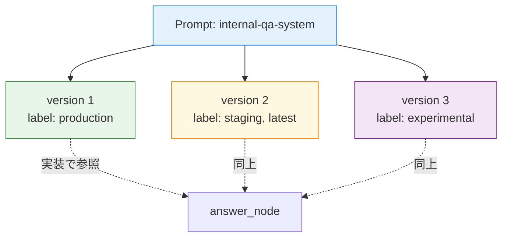
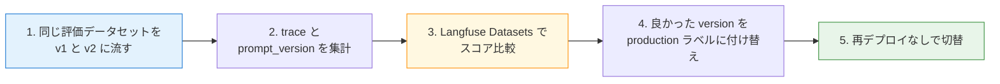

第 12 章では、Langfuse の **Prompts** 機能を使って system prompt を Python ファイルから外に出します。第 7 章の `answer_node` のシステム指示文を Langfuse に登録し、ラベル（`production` / `staging`）でバージョンを切り替えながら A/B 比較する構成を実機で動かします。

「プロンプトを Python ファイルにべた書き」から「外部の管理面でバージョン管理」に移すと、3 つの恩恵があります。1 つ目は **再デプロイなしでプロンプトを差し替えられる** ことで、運用中の文言修正がアプリリリースから切り離せます。2 つ目は **バージョン履歴と A/B 結果が同じ UI に並ぶ** ので、改善のループが回しやすいことです。3 つ目は **複数アプリで共有しやすい** ことで、社内 Q&A と別エージェントで同じシステムプロンプトを使い回す際の唯一の真実が Langfuse 側に集まります。

## この章のゴール

- Langfuse Prompts に system prompt を登録する API の使い方を覚える
- ラベル（`production` / `staging`）でバージョンを切り替える運用パターンを理解する
- LangGraph の answer_node から `langfuse.get_prompt(name, label=...)` で取得する実装を書ける
- v1 と v2 を併走させて応答スタイルを実機で比較する
- Langfuse Trace と Prompt のひもづけ（trace に `prompt_version` を残す）の意味を理解する

## Langfuse Prompts の基本

Langfuse Prompts は次のような階層モデルです。



prompt 1 つに対して複数の version が紐づき、各 version に任意の **ラベル**（`production` / `staging` / `experimental` など）を付けられます。実装側は `version=N` で固定取得もできますが、ラベルで取得する運用がいちばん柔軟です。


ラベルベースの運用例：

- `production`: 本番で確実に動く version。差し替えはレビュー後
- `staging`: 検証中の version。一部リクエストだけここから取得して比較
- `latest`: 最新作成 version の自動エイリアス（Langfuse が自動付与）

## v1 と v2 を登録する

REST API で 2 つの version を登録します。本書のサンプルでは、第 7 章の system prompt を 2 通り書いて比べます。

### v1（自然文プロンプト、`production` ラベル）

```bash
curl -X POST http://localhost:3000/api/public/v2/prompts \
  -H "Authorization: Basic $(echo -n "${LANGFUSE_PUBLIC_KEY}:${LANGFUSE_SECRET_KEY}" | base64 -w0)" \
  -H "Content-Type: application/json" \
  -d '{
    "name": "internal-qa-system",
    "type": "text",
    "prompt": "あなたは Example 株式会社の社内文書 Q&A アシスタントです。質問種別は {{bucket}} です。以下の参考情報のみに基づいて、日本語で 1〜3 文で簡潔に答えてください。回答末尾に [1] や [2] の引用番号を付け、『参考』として参考情報の見出しを列挙してください。情報が不足している場合は『参考情報からは判断できません』と答えてください。\n\n# 参考情報\n{{context}}",
    "labels": ["production"],
    "config": {"model": "nvidia/llama-3.3-nemotron-super-49b-v1", "temperature": 0.0}
  }'
```

`{{bucket}}` と `{{context}}` がプレースホルダで、Python 側の `prompt.compile(bucket=..., context=...)` で埋め込まれます。

### v2（マークダウン構造プロンプト、`staging` ラベル）

```bash
# prompt 部分だけ抜粋
"prompt": "# 役割\nあなたは社内 Q&A アシスタントです。Example 株式会社の社員からの質問に答えます。\n# 質問種別\n{{bucket}}\n# 出力ルール\n1. 日本語のみ、丁寧体、1〜3 文\n2. 参考情報に書かれている事実だけを引用する。推測で補わない\n3. 引用には [1] [2] の番号を付け、末尾に『参考』として見出しを並べる\n4. 参考情報に答えがない場合は『参考情報からは判断できません』とのみ回答\n# 参考情報\n{{context}}",
"labels": ["staging"]
```

v2 は **マークダウンで役割 / 質問種別 / 出力ルールを構造化** したパターンです。同じ内容を伝えていますが、Nemotron Super 49B のような instruction follow が強いモデルでは、構造化された指示のほうが指示遵守率が上がる傾向があります。


## LangGraph 側の改修

第 7 章の `rag_graph.py` の `answer_node` を、Langfuse Prompts から取得する形に書き換えます。

```python:graphs/prompt_managed_graph.py（差分箇所のみ）
from langfuse import Langfuse

PROMPT_NAME = "internal-qa-system"
PROMPT_LABEL = os.environ.get("LANGFUSE_PROMPT_LABEL", "production")


_langfuse: Langfuse | None = None


def _lf() -> Langfuse:
    global _langfuse
    if _langfuse is None:
        _langfuse = Langfuse(
            public_key=os.environ["LANGFUSE_PUBLIC_KEY"],
            secret_key=os.environ["LANGFUSE_SECRET_KEY"],
            host=os.environ["LANGFUSE_HOST"],
        )
    return _langfuse


def answer_node(state: State) -> dict:
    bucket = state.get("bucket", "general")
    docs = state.get("retrieved") or []
    context = _format_context(docs)

    # Langfuse Prompts から system prompt を取得
    lf = _lf()
    prompt_obj = lf.get_prompt(PROMPT_NAME, label=PROMPT_LABEL)
    system_text = prompt_obj.compile(bucket=bucket, context=context)

    llm = ChatNVIDIA(...)
    history = [SystemMessage(content=system_text), *state["messages"]]
    reply = llm.invoke(history)
    return {
        "messages": [reply],
        "prompt_version": prompt_obj.version,  # trace に残す
    }
```

ポイントを 3 つ。

1 つ目は **`Langfuse(public_key, secret_key, host)` を 1 度だけ初期化** していることです。第 8 章の `LLMRails` と同じく、リクエストごとに作り直すのは無駄です。

2 つ目は **`get_prompt(name, label=...)` の取得方法** です。`label="production"` で取ると、その時点で `production` ラベルが付いている version が返ります。Langfuse の UI で別 version に `production` を付け替えれば、コード変更なしで動作が切り替わります。

3 つ目は **`prompt_obj.compile(...)` で `{{bucket}}` / `{{context}}` を埋め込む** ことです。Langfuse SDK が provided な機能で、シンプルな mustache 風置換です。Python の f-string と比べると、プロンプト側のテンプレートを Langfuse UI 上で編集できる点が違います。

## NAT YAML と compose の差分

第 7 章からの差分は、image を `nat-prod-ops-prompts:1.6.0`（langfuse SDK を含む派生イメージ）に切り替え、`LANGFUSE_HOST` と `LANGFUSE_PROMPT_LABEL` 環境変数を渡すだけです。

```yaml:Dockerfile（langfuse SDK 派生イメージ）
FROM nat-nim-handson:1.6.0
RUN pip install --no-cache-dir "langfuse>=2.60.0,<3.0.0"
```

```yaml:docker-compose.yml（差分）
services:
  nat:
    image: nat-prod-ops-prompts:1.6.0 # ← langfuse SDK 含む派生
    environment:
      - LANGFUSE_HOST=http://langfuse-langfuse-web-1:3000
      - LANGFUSE_PROMPT_LABEL=${LANGFUSE_PROMPT_LABEL:-production}
```

実行時に環境変数で label を切り替えられるようにしています。

## 実機で A/B 比較

同じ質問「経費精算の月次締切はいつですか？」を v1 と v2 で投げ比べます。

### v1（production）の応答

```
LANGFUSE_PROMPT_LABEL=production docker compose run --rm nat
```

```
Workflow Result:
毎月末日 18:00 までに申請を完了してください。
ただし、月末日が土日祝の場合は翌営業日 18:00 までとなります。 [2]

参考:
[2] 経費精算に関する FAQ
```

### v2（staging）の応答

```
LANGFUSE_PROMPT_LABEL=staging docker compose run --rm nat
```

```
Workflow Result:
月次の経費精算の締め切りは、毎月末日 18:00 までです。
ただし、月末日が土日祝の場合は、翌営業日 18:00 までとなります。 [2]

参考
[2] 経費精算に関する FAQ (faq/01-expense-faq.md)
```

両方とも経費精算 FAQ をまさしく引いていますが、応答スタイルに差があります。

| 観点         | v1（自然文）               | v2（マークダウン構造）                             |
| ------------ | -------------------------- | -------------------------------------------------- |
| 文末の丁寧さ | 「ください」               | 「までです」                                       |
| 引用形式     | `[2] 経費精算に関する FAQ` | `[2] 経費精算に関する FAQ (faq/01-expense-faq.md)` |
| 文体         | 命令形寄り（質問者主体）   | 説明形（事実主体）                                 |

v2 のほうがファイルパスまで含めて引用しているのは、プロンプトの「参考」セクションで `{{context}}` に渡している `[N] タイトル（パス）` の形式を、より素直に拾っているからです。同じ context を渡しているのに、プロンプトの構造化のしかたで「どこまで反復するか」の挙動が変わるのが、A/B テストの面白いところです。

## trace と prompt のひもづけ

Langfuse の trace 詳細画面では、`metadata.prompt_version` のようなフィールドを見れば、どの version で生成された応答かが追えます。本書のサンプルでは `answer_node` の return に `prompt_version: prompt_obj.version` を追加しているので、Langfuse の trace UI で「どの version が呼ばれたか」を確認できます。

A/B テストを本格的に回すときは、



このループになります。第 13 章では、Langfuse Datasets を使って評価データセット側を整える話に進み、本章の 2 と 3 の自動化を扱います。

## production への切替

A/B 結果を見て v2 を採用したくなったら、Langfuse UI の Prompts 画面で「v2 に `production` ラベルを付け替える」だけです。

1. Prompts → `internal-qa-system` を開く
2. v2 の行で **`production`** ラベルにチェック
3. v1 から自動的に `production` ラベルが外れる（同じラベルは 1 version にしか付けられない）

アプリ側のコードは何も変更不要で、次のリクエストから v2 が呼ばれるようになります。**運用画面でラベルを動かすだけで挙動を切り替えられる** のが、外部プロンプト管理の本質的な価値です。

緊急ロールバックも同じ要領で、`production` を v1 に戻すだけで、動作中のアプリが即座に v1 を読み込み始めます。Langfuse SDK 側はキャッシュ（デフォルト 1 分）を持っているので、最大 1 分のラグはあります。

## ハマりポイント

本章で踏みやすい落とし穴を 3 点。

1 つ目は **`langfuse` SDK のバージョン制約** です。本書では `langfuse>=2.60.0,<3.0.0` をインストールしました。SDK v3 系は v3 サーバー向けに API が一部変わっているので、`get_prompt(label=...)` の挙動が異なる可能性があります。サーバーが v3 系で稼働している場合でも、SDK は v2 系で安定しているのが本書執筆時点の判断です。

2 つ目は **キャッシュ TTL** です。`Langfuse()` 初期化時に `prompt_cache_ttl_seconds=...`（デフォルト 60 秒）が効いていて、UI でラベルを付け替えてもアプリ側に反映されるまで最大 1 分かかります。本書のように開発で頻繁に切り替えるときは `prompt_cache_ttl_seconds=0` を渡してキャッシュを無効化すると即時反映されます。

3 つ目は **テンプレート変数の typo** です。`prompt_obj.compile(bucket=..., context=...)` で渡す key が、プロンプト内の `{{bucket}}` `{{context}}` と一致していないと、テンプレートに残った `{{xxx}}` がそのまま LLM に渡ります。Langfuse の Prompt UI 上で「Variables」を確認できる項目があるので、登録時に意図した変数だけが認識されているか目視で確認する習慣をつけると安全です。

## 次章では

次章で Sprint 4 / Part 5 を締めくくります。Langfuse の **コスト・トークン追跡** と **Datasets による評価** の 2 本柱を扱い、本章の A/B 比較を「データセットに対して両 version を流して、retrieval / answer の正確性をスコア化する」プロセスにつなぎます。Sprint 5 で 4 本柱を統合する第 14 章への最後の準備です。
