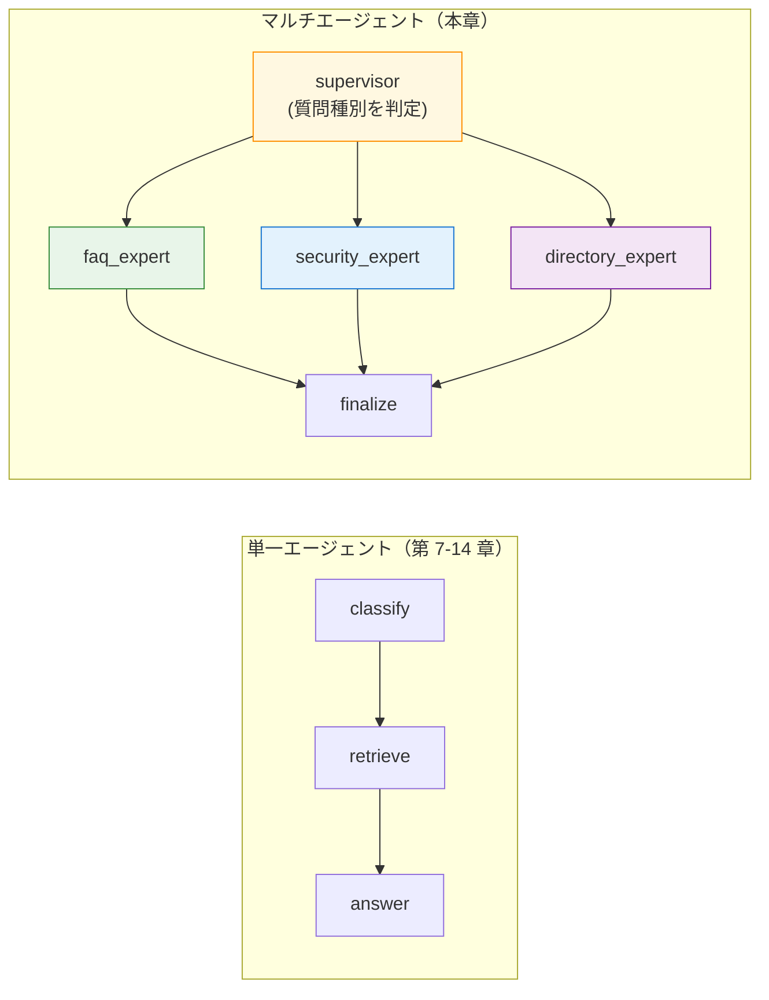
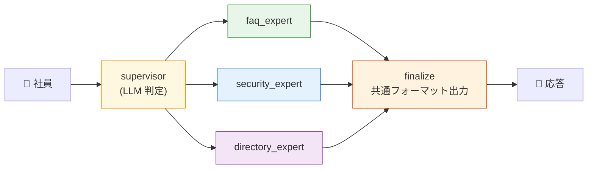
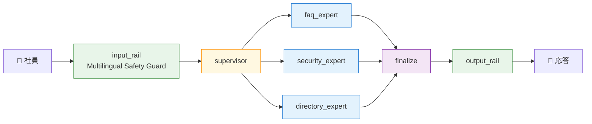

第 15 章は、第 14 章で組んだ 5 ノード統合構成を、もう一段拡張する章です。第 7 章から第 14 章まで、本書のエージェントは「**1 つの retrieve ノードがすべての文書を引く**」前提で組んできました。本章ではこの retrieve を **複数の専門エージェントに分解** して、supervisor が質問種別に応じてルーティングする構成にします。

LangGraph の **Supervisor pattern** は、production 環境でエージェントを育てる過程で自然と登場するパターンで、本書の 4 本柱の上にちょうど乗せやすい拡張です。第 1 章で「LangGraph 単体で multi-step を表現する」と宣言したスコープから少し踏み出しますが、フレームワークの面では LangGraph の中で完結するので、引き続き本書の枠組みは保たれます。

## この章のゴール

- Supervisor pattern と「単一エージェント + tool」「マルチエージェント並列」の違いを説明できる
- LangGraph の `add_conditional_edges` で supervisor → 専門エージェントの routing を書ける
- 第 7 章の 1 つの retrieve ノードを、3 つの専門エージェント（FAQ / IT セキュリティ / 部署ディレクトリ）に分解できる
- Supervisor の判定ロジック（キーワード or LLM）の使い分けを理解する
- 4 本柱（Orchestration / Guardrails / Observability / Eval Dataset）が multi-agent 構成でも変わらず効くことを観察する

## 単一エージェントとマルチエージェントの違い

第 7-14 章で扱った構成は、形式上は **「単一エージェントが複数の tool（retrieve / answer）を順に呼ぶ」** スタイルでした。LangGraph のノード単位で見れば複数ですが、論理的には「1 つのエージェントが順番に処理を進める」線形のフローです。



マルチエージェントの肝は、**専門エージェントごとに retrieval / プロンプト / メタデータフィルタが独立** することです。これにより次のメリットが得られます。

| 観点       | 単一エージェント                    | マルチエージェント (Supervisor)                                |
| ---------- | ----------------------------------- | -------------------------------------------------------------- |
| Retrieval  | 1 種類のフィルタ＋プロンプト        | 専門ごとに独立したフィルタ（FAQ は public、PII は restricted） |
| プロンプト | 1 つの system prompt が全質問に対応 | 専門ごとに最適化された system prompt                           |
| 拡張性     | 新カテゴリ追加で全プロンプトに影響  | 専門エージェントを追加するだけ                                 |
| デバッグ性 | trace は 1 本道                     | trace tree で「どの expert が呼ばれたか」が一目でわかる        |
| LLM コスト | 1 質問 = 2-3 LLM 呼び出し           | 1 質問 = supervisor 1 + expert 2-3 = 3-4 LLM 呼び出し          |

LLM コストが少し増えるのが代償ですが、運用フェーズでは「FAQ プロンプトを修正したら IT セキュリティの応答品質が落ちた」のような副作用を防げる点が、長期的には大きな利点になります。

## 本章で組む構成

社内 Q&A の題材で、3 つの専門エージェントに分解します。

| 専門エージェント   | 担当バケット              | Milvus フィルタ                                                        |
| ------------------ | ------------------------- | ---------------------------------------------------------------------- |
| `faq_expert`       | `faq` / `handbook`        | `category in ['faq', 'handbook'] && confidentiality != 'confidential'` |
| `security_expert`  | `it-security`             | `category == 'it-security' && confidentiality != 'confidential'`       |
| `directory_expert` | `department-notes`（PII） | `category == 'department-notes' && confidentiality != 'confidential'`  |

第 7 章で `bucket` というキー 1 つで分岐していたものを、**ノード自体を分ける** 構成です。各 expert が retrieve とドラフト生成までを完結させ、最後に `finalize` ノードが共通フォーマット（`参考（{expert_name}）: ...`）で出力します。



## Supervisor ノードの実装

Supervisor は **LLM に「どの expert に渡すか」を 1 単語で答えさせる** スタイルで書きます。第 7 章の classify ノードがキーワードマッチだったのに対し、本章では LLM に判断させて柔軟性を上げます。

```python:graphs/supervisor_graph.py
EXPERT_TO_FILTER: dict[str, str] = {
    "faq_expert": "category in ['faq', 'handbook'] && confidentiality != 'confidential'",
    "security_expert": "category == 'it-security' && confidentiality != 'confidential'",
    "directory_expert": "category == 'department-notes' && confidentiality != 'confidential'",
}


def supervisor_node(state: State) -> dict:
    last = state["messages"][-1]
    text = last.content if isinstance(last.content, str) else ""

    instruction = (
        "あなたは社内 Q&A の supervisor です。ユーザーの質問を読み、"
        "次のいずれか 1 つの専門エージェント名だけを答えてください。\n\n"
        "- faq_expert: 経費精算 / 休暇 / オンボーディング / 福利厚生 / オフィス利用\n"
        "- security_expert: パスワード / VPN / アカウント / インシデント / デバイス\n"
        "- directory_expert: 連絡先 / 担当者 / 部署 / 社員\n\n"
        "応答は専門エージェント名 1 語だけで、説明は不要です。"
    )
    response = _llm().invoke(
        [SystemMessage(content=instruction), HumanMessage(content=text)],
    )
    raw = response.content.strip().lower() if isinstance(response.content, str) else ""
    for name in EXPERT_TO_FILTER:
        if name in raw:
            return {"expert": name}
    return {"expert": "faq_expert"}  # 判定不能時のデフォルト
```

ポイントを 2 つ。

1 つ目は **判定の堅牢化** です。LLM が「faq_expert と思われます」「`faq_expert`」のような余計な単語を付けることがあるので、`raw` を小文字化したうえで `in` で部分一致を取る形にしました。完全一致を取ろうとすると、書式の揺れですぐ default に落ちます。

2 つ目は **default を `faq_expert` に固定** していることです。判定不能の場合に「もっとも無難なエージェント」に流すという発想です。本書の題材では FAQ がいちばん安全（PII / confidential を含まない）なので、ここを default にしています。

## 専門エージェントノードの共通実装

3 つの expert は内部処理がほとんど同じです。違うのは **Milvus のフィルタ条件と system prompt の文脈** だけ。共通化した `_expert_run` を呼び分ける形にします。

```python:graphs/supervisor_graph.py（続き）
def _expert_run(state: State, expert_name: str) -> dict:
    last = state["messages"][-1]
    query = last.content if isinstance(last.content, str) else ""

    embedder = NVIDIAEmbeddings(model=EMBED_MODEL, api_key=os.environ["NGC_API_KEY"])
    vec = embedder.embed_query(query)

    client = MilvusClient(uri=MILVUS_URI)
    results = client.search(
        collection_name=COLLECTION,
        data=[vec],
        limit=TOP_K,
        output_fields=["title", "category", "confidentiality", "has_pii", "source_path", "text"],
        filter=EXPERT_TO_FILTER[expert_name],
    )

    sources, blocks = [], []
    for i, hit in enumerate(results[0], start=1):
        e = hit.get("entity", {}) or {}
        sources.append({"title": e.get("title"), "source": e.get("source_path"), "has_pii": e.get("has_pii")})
        blocks.append(f"[{i}] {e.get('title')}（{e.get('source_path')}）\n{e.get('text', '')}")
    context = "\n\n".join(blocks) if blocks else "（参考情報なし）"

    system_text = (
        f"あなたは Example 株式会社の {expert_name} です。"
        "以下の参考情報のみに基づいて、日本語で 1〜2 文で簡潔に答えてください。"
        "回答末尾に [1] [2] の引用番号を付けてください。"
        "情報が不足している場合は『参考情報からは判断できません』と返してください。"
        f"\n\n# 参考情報\n{context}"
    )
    reply = _llm().invoke([SystemMessage(content=system_text), HumanMessage(content=query)])
    draft = reply.content if isinstance(reply.content, str) else str(reply.content)
    return {"draft": draft, "sources": sources}


def faq_expert_node(state: State) -> dict:
    return _expert_run(state, "faq_expert")


def security_expert_node(state: State) -> dict:
    return _expert_run(state, "security_expert")


def directory_expert_node(state: State) -> dict:
    return _expert_run(state, "directory_expert")
```

`_expert_run` の system prompt にエージェント名を埋め込んでいるのがミソです。`f"あなたは Example 株式会社の {expert_name} です。"` の形で、Nemotron Super 49B が「自分は何を専門に答えるエージェントなのか」を意識して回答するようにしています。実用的には、専門ごとに別の prompt template を用意するほうが品質は上がりますが、本書のスコープではこの最小実装で十分動作します。

## グラフの組み立てと条件分岐

LangGraph で supervisor → expert → finalize の routing は、`add_conditional_edges` で書きます。

```python:graphs/supervisor_graph.py（続き）
def _route(state: State) -> str:
    return state.get("expert") or "faq_expert"


def make_graph(_config: RunnableConfig):
    builder = StateGraph(State)
    builder.add_node("supervisor", supervisor_node)
    builder.add_node("faq_expert", faq_expert_node)
    builder.add_node("security_expert", security_expert_node)
    builder.add_node("directory_expert", directory_expert_node)
    builder.add_node("finalize", finalize_node)

    builder.add_edge(START, "supervisor")
    builder.add_conditional_edges(
        "supervisor",
        _route,
        {
            "faq_expert": "faq_expert",
            "security_expert": "security_expert",
            "directory_expert": "directory_expert",
        },
    )
    builder.add_edge("faq_expert", "finalize")
    builder.add_edge("security_expert", "finalize")
    builder.add_edge("directory_expert", "finalize")
    builder.add_edge("finalize", END)
    return builder.compile()
```

`add_conditional_edges` の第 2 引数 `_route` が、State を見て次のノード名を文字列で返す関数です。本書では `state["expert"]` をそのまま返していますが、ここを LLM 出力 + 後処理にすれば「supervisor が複数選んだら parallel 実行」のような拡張も書けます。

`finalize_node` は 3 つの expert からの合流地点で、共通フォーマットで応答を整えます。

```python
def finalize_node(state: State) -> dict:
    expert = state.get("expert", "faq_expert")
    draft = state.get("draft") or "（応答が生成されませんでした）"
    sources = state.get("sources") or []
    refs = "\n".join(f"[{i}] {s['title']}" for i, s in enumerate(sources, start=1))
    final = f"{draft}\n\n参考（{expert}）:\n{refs}" if refs else draft
    return {"messages": [AIMessage(content=final)]}
```

応答末尾に `参考（faq_expert）: [1] 経費精算に関する FAQ` のように **どの expert が答えたかを明示** しています。production では「なぜこの回答になったか」を読み返せる材料として、地味に効きます。

## 実機の挙動

3 つの質問を投げて、それぞれが期待通りの expert にルーティングされるか確認します。

### Q1: 経費精算（→ faq_expert）

```
docker compose run --rm nat
# input: "経費精算の月次締切はいつですか？"
```

```
Workflow Result:
毎月末日 18:00 までに申請を完了してください。月末日が土日祝の場合は翌営業日 18:00 までです。 [2]

参考（faq_expert）:
[1] 休暇取得に関する FAQ
[2] 経費精算に関する FAQ
[3] オフィス利用ルール
```

supervisor が `faq_expert` を選び、faq + handbook フィルタで 3 件取得。経費精算 FAQ から正解を引いている。

### Q2: VPN（→ security_expert）

```
# input: "VPN の利用ガイドラインは？"
```

```
Workflow Result:
VPN の利用ガイドラインは以下のとおりです。
- 社内システムへのアクセスは VPN（Cloudflare WARP）経由必須
- 公共 Wi-Fi での業務時は必ず VPN を有効化
- VPN 設定の更新は社内ポータルから入手

参考（security_expert）:
[1] 在宅勤務時の通信ガイドライン
[2] アカウント管理ポリシー
[3] 業務デバイス管理ポリシー
```

supervisor が `security_expert` を選び、it-security フィルタで in 在宅勤務時の通信ガイドラインから VPN ルールを引いた。

### Q3: 情シス連絡先（→ directory_expert）

```
# input: "情シス部の連絡先を教えてください"
```

```
Workflow Result:
情シス部の連絡先一覧は、社内向けドキュメント「情シス部 担当者連絡先一覧」(department-notes/03-it-staff-directory.md)に記載されています。

参考（directory_expert）:
[1] 情シス部 担当者連絡先一覧
[2] 営業部 顧客対応マニュアル
[3] 情シス部 担当者連絡先一覧
```

supervisor が `directory_expert` を選び、department-notes フィルタで PII 含むファイルを retrieve。回答は具体的 PII を漏らさず「ドキュメントを参照」スタイルに留まっている（system prompt の効き）。

## 第 14 章との位置関係

第 14 章で組んだ 5 ノード統合構成（input rail → classify → retrieve → answer → output rail）と本章の supervisor 構成は、**互いに排他ではなく組み合わせられます**。

最終的な production 構成は、こんな形になります。



入口の Guardrails、supervisor の判定、各 expert の retrieve + draft、finalize の整形、出口の Guardrails、という 7-9 ノードの構成になります。本書のサンプルリポジトリでは、第 14 章の `ch14-final/` を本構成に拡張する形で `ch15-supervisor/` を追加しています。第 14 章で組んだコードからの差分は次の 3 点だけです。

1. `classify` ノードを `supervisor` に置き換え（LLM 判定に格上げ）
2. `retrieve` 単体を 3 つの `expert` に分解（独立フィルタ + 専門 prompt）
3. `finalize` ノードを追加（共通フォーマット）

input rail / answer LLM / output rail / Langfuse trace / Prompts / Datasets の取り扱いは、第 14 章のままで動きます。

## 4 本柱との整合

本書の 4 本柱が、本章の構成でも変わらず効くことを確認しておきます。

| 柱               | 本章での効き方                                                                  |
| ---------------- | ------------------------------------------------------------------------------- |
| 1. Orchestration | LangGraph の `add_conditional_edges` で表現。`add_node` を 3 つ増やすだけで拡張 |
| 2. Guardrails    | 第 14 章と同じ。supervisor の前後に rail を置く                                 |
| 3. Observability | Langfuse trace に 4-5 ノード分の span が並び、Agent Graph で構造が見える        |
| 4. Eval Dataset  | Datasets Run で「どの expert が呼ばれたか」を score として記録できる            |

特に **Observability** の効き方が変わります。trace を開くと「supervisor → faq_expert → finalize」のような分岐が Agent Graph として描画され、「どのリクエストがどの専門に流れたか」の集計が UI 側でできるようになります。supervisor の判定精度を Langfuse Datasets でスコア化する、というのが production 移行の自然な次のステップです。

## CrewAI / AutoGen との比較を再訪

第 3 章で「CrewAI / AutoGen は本書のスコープでは比較対象に留める」と言いましたが、Supervisor pattern の文脈であらためて触れておきます。

CrewAI の特徴は **Process（順次 / 階層 / 並列）が一級市民** で、本章の Supervisor pattern を `Process.hierarchical` でほぼ同じ意味で書けます。違いは「役割」の比喩が前面に出るか、「graph のノード」として書くか、という設計思想の差です。社内 Q&A のように expert の責務がはっきりしている題材では、CrewAI のほうがコードが読みやすくなる傾向があります。

AutoGen は `GroupChat` で「複数エージェントが LLM ベースで会話して合意形成」する世界観で、Supervisor pattern とは少し方向が違います。「ライターと編集者が原稿を磨く」「複数 LLM がディベートして結論を出す」のようなユースケースは AutoGen が向きます。

本書の題材では LangGraph の Supervisor pattern が素直で、retrieve に対する重み付けやメタデータフィルタの自由度が高いため、本書のスコープでは LangGraph で進めるのがいちばん効率的でした。

## ハマりポイント

本章で踏みやすい落とし穴を 3 点。

1 つ目は **`add_conditional_edges` の 3 番目の引数（path map）** です。`{"faq_expert": "faq_expert", ...}` のように **router の戻り値とノード名のマッピング** を渡す必要があります。これを省略しても動くケースはあるものの、明示的に書くほうが LangGraph の挙動を読みやすくなります。

2 つ目は **supervisor の LLM 判定の堅牢化** です。Nemotron Super 49B のような大きなモデルでも、たまに「以下が私の判断結果です：faq_expert です」のような長い文を返すことがあります。本章の実装では `raw` を小文字化 + `in` で部分一致を取るパターンで吸収していますが、production ではより厳密な enum 出力（OpenAI の `response_format={"type": "json_schema"}` 等）に切り替えるのが定石です。

3 つ目は **expert の system prompt の管理** です。本章ではエージェント名を `f"あなたは Example 株式会社の {expert_name} です。"` で埋め込んでいますが、production では第 12 章の Langfuse Prompts に **expert ごとのプロンプトを別 name で登録** する運用が筋になります。`internal-qa-faq-expert` / `internal-qa-security-expert` のようなプロンプト名で、それぞれ A/B テストできるようにしておくと、専門ごとに独立して改善できます。

## 次章では

ここで本書の本編が終わります。次は付録 A で、前作 Phoenix から本書 Langfuse への移行手順を整理します。前作読者のみなさんが本書からスムーズに入れるよう、対応表と最小切替手順をまとめました。
