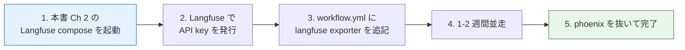

付録 A は、前作 [NIM + Docker ではじめる NeMo Agent Toolkit ハンズオン](https://zenn.dev/himorishige/books/nemo-agent-toolkit-nim-handson) の第 7 章で扱った Phoenix から、本書の Langfuse へ切り替えるための差分ガイドです。前作の構成をすでに動かしているみなさんが、最小工数で本書の構成に揃えるための章です。

「全部やり直す」ことなく、Phoenix を `docker compose down` してから Langfuse を立てる、という二択ではなく、両者を並走させて段階的に移行できる構成も合わせて紹介します。

## 移行の 3 通りの選択肢

| 選択肢                              | やり方                                                                         | 向いている場面                                |
| ----------------------------------- | ------------------------------------------------------------------------------ | --------------------------------------------- |
| A. Phoenix を停止して Langfuse のみ | 既存 Phoenix の compose を down して、本書 Ch 2 / Ch 10 の Langfuse を新規起動 | 過去の trace は捨てて構わない、シンプルさ重視 |
| B. 並走（OTel fan-out）             | NAT の `tracing` に Phoenix と Langfuse を **両方** 設定し、しばらく両方に送信 | 過去 1 ヶ月くらいは Phoenix も残しておきたい  |
| C. 履歴を引き継ぐ                   | Phoenix の trace export → Langfuse の bulk import（手動）                      | trace 履歴を消したくない、運用継続性重視      |

本書の推奨は **B（並走）** です。新しいスタックの動作確認を Langfuse で行いつつ、既存の運用画面（Phoenix）も並行して残せるので、移行リスクが下がります。

## 並走パターン: NAT に exporter を 2 つ書く

NAT 1.6.0 の `general.telemetry.tracing` は、複数の exporter を並列に登録できます。

```yaml:workflow.yml（並走版）
general:
  use_uvloop: true
  telemetry:
    tracing:
      phoenix: # 前作 Ch 7 の構成
        _type: phoenix
        endpoint: http://phoenix:6006/v1/traces
        project: nat-handson-migration

      langfuse: # 本書 Ch 11 の構成
        _type: langfuse
        endpoint: ${LANGFUSE_OTLP_ENDPOINT}
        public_key: ${LANGFUSE_PUBLIC_KEY}
        secret_key: ${LANGFUSE_SECRET_KEY}
        batch_size: 1
        flush_interval: 1.0
        resource_attributes:
          service.name: migration-test
          deployment.environment: dev
```

NAT が両方の exporter に同じ trace を送るので、Phoenix と Langfuse のどちらにも同じ実行が残ります。並走は計算コストが多少増えますが（OTLP 送信が 2 倍になる）、開発・移行期には許容できる範囲です。

ステージング期間を 2-4 週間ほど取り、Langfuse のメトリクスが安定して出ること、ダッシュボードが期待通りに使えることを確認してから、Phoenix の exporter を外します。

## 機能の対応表

前作で慣れた Phoenix の機能が、本書の Langfuse のどこに対応するかを並べます。

| Phoenix（前作 Ch 7）           | Langfuse（本書 Ch 10-13）               |
| ------------------------------ | --------------------------------------- |
| Trace タブ（span ツリー）      | Tracing → Traces                        |
| Span 詳細の input / output     | Trace 詳細の Observation 一覧           |
| Project（`project` 設定）      | Project（同名）or `service.name` で切替 |
| Annotation（手動でメモを追加） | Score（手動 / プログラム両対応）        |
| Datasets（β機能）              | Datasets（v3 で正式機能）               |
| Evals（LLM 採点）              | LLM-as-Judge（SDK 経由でスコア記録）    |

| Phoenix にない機能            | Langfuse で扱える                         |
| ----------------------------- | ----------------------------------------- |
| Prompt のバージョン管理       | Prompts（第 12 章）                       |
| ラベルでバージョン切替        | Prompts ラベル（第 12 章）                |
| トークン → コスト換算（自動） | Models 単価マッピング（第 13 章）         |
| Run 単位のスコア集計          | Datasets Run（第 13 章）                  |
| プロジェクト跨ぎの権限管理    | Organization → Project の階層（第 10 章） |

## 最小切替手順

並走パターンを使った最小切替手順を 5 ステップで整理します。



それぞれの段階の所要時間は次のとおりです。

| ステップ         | 所要時間 | やること                                           |
| ---------------- | -------- | -------------------------------------------------- |
| 1. Langfuse 起動 | 10 分    | 本書 Ch 2 / Ch 10 の compose を取得して up         |
| 2. API key 発行  | 5 分     | UI から Project 作成 + API key 発行                |
| 3. NAT 設定追記  | 5 分     | 既存 workflow.yml に `langfuse` ブロックを 5 行    |
| 4. 並走運用      | 1-4 週間 | Phoenix と Langfuse のメトリクスを横並びで確認     |
| 5. Phoenix 撤去  | 5 分     | `phoenix:` ブロックを削除、Phoenix compose を down |

Phoenix の trace 履歴が長期保存されている場合、本格的な移行ではエクスポートしてから移したくなる場面もありますが、Phoenix の trace を Langfuse に取り込む正規ルートはまだ整備されていません。本書のように「過去 1-2 か月のデータは諦めて新規スタートを切る」割り切りが、いちばん現実的な選択肢です。

## ハマりポイント

移行時に踏みやすい落とし穴を 3 点。

1 つ目は **Phoenix と Langfuse の trace 名の差** です。Phoenix では trace の root name に NAT の workflow type（`<workflow>` / `langgraph_wrapper` 等）が出ていましたが、Langfuse でも基本は同じ動きをします。ただし Langfuse v3 は trace name の解釈に若干の揺れがあるので、移行直後に「同じ workflow なのに片方は名前が違う」と感じることがあります。`resource_attributes.service.name` を必ず付ける運用にすれば、根本的な区別は service.name で行えます。

2 つ目は **Phoenix の `project` と Langfuse の `service.name` の概念差** です。Phoenix の `project: ...` は trace の論理グルーピングですが、Langfuse の Project は組織 / 認証 / API key の単位です。Phoenix で 1 project だったものを Langfuse の `service.name` で表現する、という発想の組み替えが必要です。

3 つ目は **OTLP エンドポイントの port 衝突** です。Phoenix が `6006` を使うのに対して、Langfuse の web UI は `3000` です。Phoenix と Langfuse を同じホストで並走させる際、両者がそれぞれ独立してポートを取るので衝突は起きませんが、`9091` が MinIO の Console（Langfuse 側）で使われるので、Milvus を併設する場合は本書 Ch 6 の対処（`9191:9091`）を流用します。

## 並走をやめるタイミング

並走運用を続ける期間は、現場の運用ニーズで決めますが、目安として次の条件が満たされたら Phoenix を抜きます。

- Langfuse 上で 2 週間以上、毎日の trace が継続的に届いていて欠損がない
- 主要な KPI（latency、エラー率、コスト、評価スコア）が両者で同等に取れている
- チーム全員が Langfuse の UI に慣れて、Phoenix を見なくなっている
- 既存ダッシュボードや Slack 通知の宛先が Langfuse に切り替わっている

撤去時は workflow.yml から `phoenix:` ブロックを削除し、Phoenix の compose を `docker compose down`（`-v` を付けるかは過去履歴の扱い次第）するだけです。NAT の挙動は何も変わりません。

## 第 11 章への接続

本付録で Phoenix から Langfuse に移ったあと、本書の第 11 章以降の内容（OTLP attribute 解析、プロンプト管理、コスト追跡、Datasets）はそのまま順に試せる状態になります。前作の Ch 7 を読み終えたみなさんが、本付録を経て本書の Ch 11 に飛ぶのが、いちばん効率のよい移行ルートです。
