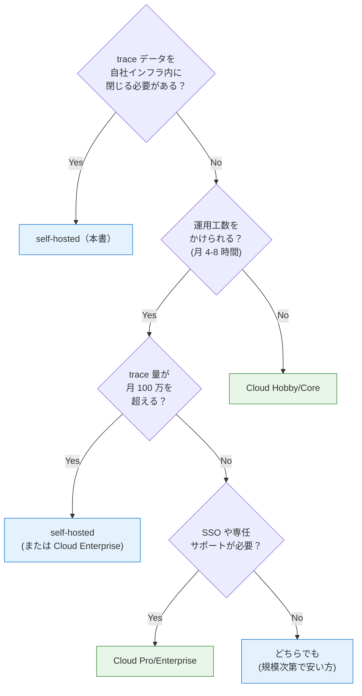

付録 B は、本書で採用した Langfuse self-hosted と、SaaS 提供の Langfuse Cloud をどう使い分けるかを整理する付録です。本書は「社内ドキュメント Q&A」という題材の都合で self-hosted を選びましたが、現場の規模やコンプライアンス要件によっては Cloud のほうが筋がいい場面も多いはずです。

選定の助けになる比較表と、コスト試算、推奨選択フローをまとめました。

## 5 軸の比較表

| 軸               | self-hosted（本書）                        | Langfuse Cloud                            |
| ---------------- | ------------------------------------------ | ----------------------------------------- |
| 立ち上げ工数     | 数時間（compose 起動 + シークレット）      | 5 分（サインアップ + プロジェクト作成）   |
| 月次運用工数     | 数時間（バックアップ、監視、アップデート） | ほぼゼロ（Langfuse 側で運用）             |
| データ主権       | ◎ 自社インフラ内に閉じる                   | △ Langfuse 社の AWS / EU リージョンに保存 |
| コスト予測       | ◎ 固定（インフラコストのみ）               | × trace 量 / シート数で従量               |
| サポート体制     | △ コミュニティ + 自己解決                  | ◎ 有償プランで SLA / 専任サポート         |
| 機能差           | OSS 版（一部 Enterprise 機能なし）         | 全機能 + Enterprise 機能                  |
| アップデート負担 | × 月次のバージョン上げが自分の責任         | ◎ 透過的に最新化                          |
| ネットワーク要件 | ◎ オンプレ・隔離環境でも動く               | × インターネット必須                      |

「立ち上げ」だけ取れば Cloud が圧倒的に楽ですが、「データ主権」「ネットワーク要件」「コスト予測」が self-hosted の強みです。本書で self-hosted を選んだ理由はこの 3 つでした。

## コスト試算

実数の感覚を持つために、本書のサンプル規模（trace 数、ユーザー数、データ容量）で両者のコストを並べてみます。

### 想定するワークロード

| 指標                       | 値                                    |
| -------------------------- | ------------------------------------- |
| 月次 trace 数              | 50,000                                |
| 1 trace あたり observation | 平均 3 件                             |
| アクティブユーザー数       | 10 名（チーム）                       |
| 評価データセット件数       | 100 件 × 月次 5 Run = 500 dataset run |
| Prompt 数                  | 20 個（version 込みで合計 100）       |

### self-hosted のコスト

```
インフラ（クラウド or オンプレ）:
  3 vCPU / 5 GB メモリ / 30 GB disk
  AWS の t4g.large 相当 → 約 60 USD/月
  Apple Silicon Mac mini で動かすなら 0 USD/月

運用工数:
  バックアップ + 監視 + アップデートで月 4-8 時間
  人件費換算で 50,000-100,000 円/月

ライセンス:
  OSS 版: 0 USD/月
  Enterprise 機能（SSO、SLA 等）が要るなら別途見積もり
```

合計で月 **6 万円〜10 万円** 程度（インフラ + 人件費）が目安です。trace 量が 5 倍に増えても、リソース増強で対応するだけなのでコストはあまり跳ねません。

### Langfuse Cloud のコスト

公式サイトの料金体系（執筆時点）を参考にすると、

| プラン     | 価格         | 含まれる trace                   |
| ---------- | ------------ | -------------------------------- |
| Hobby      | 無料         | 月 50,000 traces まで            |
| Core       | 月 29 USD〜  | 月 100,000 traces + 機能制限解除 |
| Pro        | 月 199 USD〜 | 月 500,000 traces、SSO、SLA 等   |
| Enterprise | カスタム     | 無制限、専任サポート             |

本書のサンプル規模（月 50,000 trace）であれば、**Hobby プラン（無料）** で収まる計算です。月 10 万 trace を超えると Core（月 29 USD〜）、月 50 万 trace を超えると Pro（月 199 USD〜）が必要になります。

```
trace 量 50,000/月    → Hobby（無料）
trace 量 200,000/月   → Core 月 29 USD〜（trace overage 別）
trace 量 1,000,000/月 → Pro 月 199 USD〜
```

trace 量がスケールしても、Cloud 側の従量課金が思ったよりかからない、というのが現代の SaaS 価格設計です。

### コストの逆転点

self-hosted と Cloud の月額が近づく境界は、おおむね次の条件で決まります。

- trace 量が **月 50 万 trace 以下** なら、Cloud のほうがインフラ + 人件費より安い場合が多い
- trace 量が **月 100 万 trace 以上** で、データ主権が要件にない場合は、Pro プランでも安いまま
- データ主権が要件にあれば、trace 量に関係なく self-hosted

「人件費 vs インフラ + ライセンス」という計算式で考えると、よほど大規模なワークロードか、コンプライアンス要件が強い現場でなければ、Cloud のほうがコスト効率が良くなる構造です。

## 推奨選択フロー

判断の助けになる質問フローを、3 段の問いとしてまとめました。



第 1 問が **Yes** で済む現場（金融、医療、政府、社外秘の高い社内データ）は、迷わず self-hosted です。本書の社内 Q&A もこちらに当てはまります。

第 1 問が **No** なら、第 2 問の運用工数を見ます。「Langfuse の compose を月 1 回パッチ当て、postgres / clickhouse のバックアップ確認、ストレージの監視」を月 4-8 時間こなせるかどうか。これが厳しいなら、思い切って Cloud に振ったほうが幸せです。

第 3 問・第 4 問は、Cloud の中でどのプランを選ぶかの最後の振り分けです。

## ハイブリッドという選択肢

本書では触れませんでしたが、運用が成熟してくると「dev / stg は Cloud、prod は self-hosted」というハイブリッド構成も選択肢に入ります。Cloud の便利さを開発フェーズで享受しつつ、production の trace だけは社内インフラに閉じる、という割り切りです。

NAT 1.6.0 の `tracing` は複数 exporter を並列に登録できるので、

```yaml
general:
  telemetry:
    tracing:
      langfuse-cloud:
        _type: langfuse
        endpoint: https://cloud.langfuse.com/api/public/otel/v1/traces
        public_key: ${LF_CLOUD_PUBLIC_KEY}
        secret_key: ${LF_CLOUD_SECRET_KEY}

      langfuse-onprem:
        _type: langfuse
        endpoint: ${LF_ONPREM_OTLP_ENDPOINT}
        public_key: ${LF_ONPREM_PUBLIC_KEY}
        secret_key: ${LF_ONPREM_SECRET_KEY}
```

のように両方に同時送信もできます。プロンプト管理だけ Cloud で行い、trace は self-hosted に貯める、のような分業も可能です。

## 移行・後戻りの可能性

最後に、self-hosted ↔ Cloud の **後戻り** について。

self-hosted から Cloud への移行は、Langfuse のデータエクスポート機能を使えば、prompt / dataset / trace の主要データを移せます。trace の長期履歴は ClickHouse の export を別途扱う必要がありますが、prompt と dataset は API 経由で簡単に移行可能です。

逆方向（Cloud から self-hosted）は、Cloud 側の export 機能で prompt / dataset を取り出して self-hosted の API に投入する流れになります。trace 履歴は同じく長期履歴の移行が課題になります。

「最初は Cloud で試して、運用に乗ったら self-hosted に移す」という段階的な選択も、移行コストの観点から十分現実的です。

## 本書の選択（self-hosted）の正当化

最後に、本書が self-hosted を選んだ理由をあらためて言語化しておきます。

1. **題材との整合性**: 社内ドキュメント Q&A という題材は、`confidential` レベルのドキュメントを扱うので、trace データを社内に閉じる構成のほうが安心
2. **学びの深さ**: v3 の 6 サービス構成を実際に立ち上げて触ることで、Langfuse のアーキテクチャを腹落ちさせられる
3. **再現性**: 読者が同じ compose を `git clone` して立ち上げれば、本書とまったく同じ構成が手元に再現できる
4. **ARM64 / Apple Silicon 対応**: v3 の image がすべて multi-arch 対応で、DGX Spark / Mac の両方で動く

実務では、迷ったら **まず Cloud で試して、必要なときに self-hosted に切り替える** のが現実的なルートだと感じています。本書の構成は、そのまま self-hosted の参考実装として使ってもらえる形にしました。

## 本書の終わりと、ここから先

これで本書のすべての章が終わりました。前作と本書を通じて、NeMo Agent Toolkit を「動くおもちゃ」から「現場で使える装備」に育てるための材料を、ひととおり揃えられたはずです。第 4 章で書いた最小の 2 ノードグラフが、第 14 章で 5 ノードに育ち、Guardrails と Langfuse の支えのもとで「動く LLM」と「現場に出せる LLM」のあいだの距離を埋める形になりました。

ここから先の方向性は、みなさんの現場の文脈次第です。

より複雑な workflow を組みたい現場では、subgraph や人間の承認ノード、リトライ機構を本書の構成に上乗せできます。Guardrails の表現力を詰めたいときは Llama Guard / Aegis の組み合わせや、Colang フローを活かして PII マスキングを細分化していきます。評価軸を広げたいなら、ragas / Patronus / TruLens のような専門評価ツールを Langfuse Datasets と並走させる形が現実的です。第 3 章で比較対象として扱った CrewAI / AutoGen を別題材で実装してみるのも、本書の枠組みの応用先として面白いはずです。最後に、compose の構成を Helm chart 化して Kubernetes に乗せれば、Cloud / オンプレ問わず本格運用に耐えるところまで持ち上げられます。

それぞれの方向に進んでも、本書の 4 本柱（Orchestration / Guardrails / Observability / Eval Dataset）の枠組みは変わらず効きます。むしろ、構成が複雑になるほどこの枠組みが指針として役立ちます。

本書のサンプルリポジトリは Apache License 2.0 で配布しているので、自社の題材に合わせて自由に改変・再配布してください。本書のフィードバック・改善提案は、サンプルリポジトリの Issues か、Zenn の各章下部のコメント欄で受け付けています。

最後まで本書にお付き合いいただき、ありがとうございました。「動く LLM」を「現場で使える LLM」に育てるための装備が、みなさんの実務にも素直にはまる形で届けば嬉しいです。
